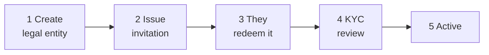

# Onboarding eines Kunden

Ein neuer Kunde existiert im Register, wenn **Sie** ihn anlegen. Es gibt keine Self-Service-Anmeldung: Jemand muss entscheiden, dass diese Organisation hier sein soll.

---

## Der Ablauf

Sie führen die Schritte 1, 2 und 4 aus. Der Kunde führt Schritt 3 aus. Schritt 5 folgt aus Schritt 4.

---

## 1. Die juristische Person anlegen

*Onboarding → Create entity.*

| Feld | |
|---|---|
| **Rechtlicher Name** | Der eingetragene Name, exakt. |
| **Entitätstyp** | `ISSUER`, `INVESTOR` oder `AUDITOR`. |
| **Kontakt-E-Mail** | Wohin die Einladung geht. |
| **Registrierungsnummer und Land** | |
| **LEI** | Sofern vorhanden. |
| **Gründungsdatum** | |

Die Entität wird mit dem Status **`PENDING_ONBOARDING`** und einer automatisch vergebenen Entitätsnummer angelegt.

!!! tip "Den rechtlichen Namen jetzt genau richtig erfassen"
    Er muss bei der KYC-Prüfung mit den Registrierungsunterlagen übereinstimmen. Eine Abweichung bedeutet eine Ablehnung und eine erneute Einreichung, und der Kunde wird das zu Recht als Ihren Fehler ansehen.

    Namensänderungen werden unterstützt und in einem Namensverlauf nachverfolgt, sodass der Datensatz erhalten bleibt – aber es ist einfacher, ihn gar nicht zu brauchen.

!!! warning "Der Entitätstyp schränkt alles Nachgelagerte ein"
    Ein als `INVESTOR` registrierter Kunde kann keine Emittenten-Nutzer haben, egal wie hochrangig. Den Typ nachträglich zu ändern ist eine Betreiberkorrektur, keine Einstellungsänderung.

    Wird die Entität sowohl emittieren als auch investieren, entscheiden Sie jetzt, wie Sie das abbilden.

---

## 2. Die Einladung ausstellen

Das Erzeugen einer Einladung erzeugt ein **einmaliges Token**, standardmäßig **48 Stunden** gültig (`registerwerk.onboarding.token-ttl-hours`).

Wie es aufgebaut ist, ist wichtig:

- 32 zufällige Bytes, URL-sicheres Base64.
- **Nur sein SHA-256-Hash wird gespeichert.** Der Klartext wird einmalig bei der Erzeugung zurückgegeben und danach nie wieder – die Datenbank kann ihn nicht offenlegen, und Sie auch nicht.
- Das Erzeugen eines neuen Tokens **entwertet jedes ausstehende, ungenutzte Token**, sodass ein erneuter Versand nicht zwei gültige Einladungen hinterlässt.
- Für eine geschlossene oder aufgelöste Entität können keine Token ausgestellt werden.

!!! danger "Das Token authentifiziert, wer immer es besitzt"
    Das Einlösen erzeugt das erste Administratorkonto des Kunden. Jeder, der das Token besitzt, kann dieser Administrator werden.

    Senden Sie es an die hinterlegte Kontaktadresse, nicht an denjenigen, der danach gefragt hat. Ruft jemand an und bittet darum, es erneut an eine andere Adresse zu senden, behandeln Sie das als den möglichen Versuch einer Kontoübernahme, der es sein könnte.

Läuft es ab, erzeugen Sie ein neues – das entwertet das alte.

---

## 3. Der Kunde löst sie ein

Er öffnet den Link, und:

1. Das Token wird geprüft, ohne verbraucht zu werden.
2. Er legt Administratorname, E-Mail-Adresse und Passwort fest.
3. Sein erstes `COMPANY_ADMIN`-Konto wird angelegt und das Token als benutzt markiert.
4. Er kann optional seinen Identitätsanbieter konfigurieren.

Von hier an verwaltet er seine eigenen Nutzer. [Unternehmensadministrator](../../customer/workspaces/company-admin.md) beschreibt seine Seite davon.

---

## 4. KYC-Prüfung

Emittenten und Anleger reichen KYC-Dokumente ein. **Prüfer benötigen kein KYC** – sie halten keine Wertpapiere und nehmen keine Positionen ein.

[:octicons-arrow-right-24: KYC prüfen](kyc-process.md)

!!! warning "Nicht vor der Genehmigung beginnen lassen"
    Die Versuchung, einen großen Kunden schon Emissionen einrichten zu lassen, während KYC noch aussteht, ist groß.

    Eine nicht verifizierte Entität, die bereits Emissionen angelegt und Anleger zugelassen hat, ist weit schwerer rückabzuwickeln als eine, die gewartet hat. Das Tor existiert genau deshalb, damit die teuren Dinge nach der billigen Prüfung geschehen.

---

## 5. Aktiv

`PENDING_ONBOARDING` → `ACTIVE`. Der Kunde kann arbeiten.

---

## Entitätsstatus

Der vollständige Satz – es gibt nur vier:

| Status | |
|---|---|
| `PENDING_ONBOARDING` | Angelegt, noch nicht durch Onboarding und KYC. |
| `ACTIVE` | Arbeitet normal. |
| `SUSPENDED` | Vorübergehend gestoppt. Reversibel. |
| `DISSOLVED` | Beendet. |

!!! note "Es gibt keinen Status `PENDING_KYC`"
    Ältere Dokumentation führte einen auf, zusammen mit einem Endpunkt `PATCH /api/v1/admin/entities/{id}/status`. Beides existiert nicht.

    Statusänderungen sind explizite, benannte Operationen – `suspend`, `dissolve`, `reactivate`, `terminate` – unter `/api/v1/entities/{id}/`, kein generisches Statusschreiben. Das ist Absicht: Jeder Übergang hat seine eigenen Voraussetzungen und sein eigenes Audit-Ereignis, was ein Freiform-Statusfeld nicht erzwingen könnte.

---

## Entitäten anschließend verwalten

**Suspendieren** sperrt die Nutzer der Entität. Reversibel über `reactivate`. Verwenden Sie es für eine ungelöste Compliance-Angelegenheit oder eine abgelaufene Verifizierung, die Sie behoben erwarten.

**Auflösen** beendet die Beziehung – siehe [Offboarding](offboarding.md), und beachten Sie, dass das Auflösen eines Emittenten mit einem laufenden Wertpapier Inhaber mit Ansprüchen zurücklässt, die niemand mehr verwaltet.

**Zusammenführen** behandelt echte Duplikate: dieselbe Organisation, zweimal onboardet. Es verknüpft Emissionen, Inhaber und Verlauf neu mit der fortbestehenden Entität, deaktiviert das Duplikat und zeichnet die Zusammenführung in `entity_merge_record` auf, sodass die Verknüpfung nachvollziehbar bleibt.

!!! danger "Zusammenführen ist nicht für zwei Entitäten, die nur ähnlich aussehen"
    Zwei Tochtergesellschaften mit nahezu identischen Namen sind zwei juristische Personen mit getrennten Pflichten. Eine Zusammenführung verschmilzt ihre Registereinträge.

    Bestätigen Sie, dass es sich um eine Organisation handelt, die zweimal onboardet wurde – nicht um zwei Organisationen –, bevor Sie zusammenführen. Es lässt sich nicht ohne Weiteres rückgängig machen.

---

## Wo weiter

- [KYC prüfen](kyc-process.md)
- [Rollen und Berechtigungen](roles.md)
- [Offboarding](offboarding.md)
