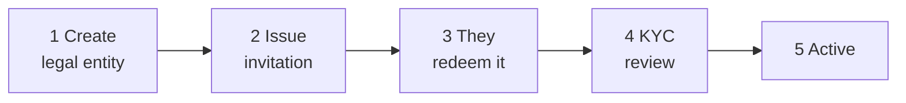

# Incorporación de un cliente { #onboarding-a-customer }

Un nuevo cliente existe en el registro cuando **usted** lo crea. No hay alta por autoservicio: alguien tiene que decidir que esta organización debería estar aquí.

---

## El proceso en resumen { #the-shape-of-it }

Usted realiza los pasos 1, 2 y 4. El cliente realiza el 3. El paso 5 sigue al 4.

---

## 1. Cree la entidad jurídica { #1-create-the-legal-entity }

*Incorporación → Crear entidad.*

| Campo | |
|---|---|
| **Nombre legal** | El nombre registrado, exactamente. |
| **Tipo de entidad** | `ISSUER`, `INVESTOR` o `AUDITOR`. |
| **Correo electrónico de contacto** | A dónde va la invitación. |
| **Número de registro y país** | |
| **LEI** | Donde tienen uno. |
| **Fecha de constitución** | |

La entidad se crea con el estado **`PENDING_ONBOARDING`** y un número de entidad asignado automáticamente.

!!! tip "Obtenga el nombre legal exactamente correcto, ahora"
    Tiene que coincidir con sus documentos de registro en el KYC. Una discrepancia significa un rechazo y un nuevo envío, y el cliente lo considerará razonablemente como un error suyo.

    Los cambios de nombre se admiten y se rastrean en un historial de nombres, por lo que el registro sobrevive, pero es más fácil no necesitarlo.

!!! warning "El tipo de entidad condiciona todo lo que viene después"
    Un cliente registrado como `INVESTOR` no puede tener usuarios emisores, por muy senior que sean. Cambiar el tipo posteriormente es una corrección del operador, no una edición de configuración.

    Si van a emitir e invertir a la vez, decida ahora cómo representará eso.

---

## 2. Emita la invitación { #2-issue-the-invitation }

La generación de una invitación produce un **token de un solo uso**, válido por **48 horas** de forma predeterminada (`registerwerk.onboarding.token-ttl-hours`).

La forma en que se construye importa:

- 32 bytes aleatorios, en base64 segura para URL.
- **Solo se almacena su hash SHA-256.** El texto en claro se devuelve una vez, en el momento de la generación, y nunca más: ni la base de datos puede revelarlo, ni usted tampoco.
- Generar un nuevo token **invalida cualquier otro token pendiente de usar**, de modo que un reenvío no puede dejar dos invitaciones activas.
- Los tokens no se pueden emitir para una entidad cerrada o disuelta.

!!! danger "El token autentica a quien lo posee"
    Canjearlo crea la primera cuenta de administrador del cliente. Cualquiera que tenga el token puede convertirse en ese administrador.

    Envíelo a la dirección de contacto registrada, no a quien lo solicitó. Si alguien llama por teléfono pidiendo que se reenvíe a una dirección distinta, trátelo como el posible intento de apropiación de cuenta que es.

Si caduca, genere uno nuevo, lo que invalida el anterior.

---

## 3. El cliente lo canjea { #3-the-customer-redeems-it }

Abre el enlace, y:

1. El token se valida sin consumirse.
2. Establecen su nombre de administrador, correo electrónico y contraseña.
3. Se crea su primera cuenta `COMPANY_ADMIN` y el token se marca como usado.
4. Opcionalmente pueden configurar su proveedor de identidad.

Desde aquí gestionan sus propios usuarios. [El administrador de la empresa](../../customer/workspaces/company-admin.md) es su lado.

---

## 4. Revisión de KYC { #4-kyc-review }

Los emisores e inversores envían documentos KYC. **Los auditores no requieren KYC**: no poseen valores ni toman posiciones.

[:octicons-arrow-right-24: Revisión de KYC](kyc-process.md)

!!! warning "No deje que empiecen antes de la aprobación"
    La tentación de dejar que un gran cliente configure emisiones mientras el KYC está pendiente es fuerte.

    Una entidad no verificada que ya ha creado emisiones y admitido inversores es mucho más difícil de deshacer que una que esperó. Esta puerta existe para que lo costoso ocurra después de la comprobación barata.

---

## 5. Active { #5-active }

`PENDING_ONBOARDING` → `ACTIVE`. Pueden funcionar.

---

## Estados de entidad { #entity-statuses }

El conjunto completo: solo hay cuatro:

| Estado | |
|---|---|
| `PENDING_ONBOARDING` | Creada, todavía no ha pasado por la incorporación ni por el KYC. |
| `ACTIVE` | Operando normalmente. |
| `SUSPENDED` | Detenido temporalmente. Reversible. |
| `DISSOLVED` | Terminó. |

!!! note "No hay estado `PENDING_KYC`"
    La documentación anterior incluía uno, junto con un endpoint `PATCH /api/v1/admin/entities/{id}/status`. Ninguno de los dos existe.

    Los cambios de estado son operaciones explícitas con nombre propio (`suspend`, `dissolve`, `reactivate`, `terminate`) bajo `/api/v1/entities/{id}/`, no una escritura de estado genérica. Esto es deliberado: cada transición tiene sus propias condiciones previas y su propio evento de auditoría, algo que un campo de estado de formato libre no podría garantizar.

---

## Administrar entidades después { #managing-entities-afterwards }

**Suspender** bloquea a los usuarios de la entidad. Reversible mediante `reactivate`. Úselo para un asunto de cumplimiento no resuelto o una verificación caducada que espera que se solucione.

**La disolución** finaliza la relación; consulte [Baja](offboarding.md), y tenga en cuenta que disolver un emisor con un valor activo deja a los titulares con reclamaciones y sin nadie que los administre.

**Fusión** maneja duplicados genuinos: la misma organización se incorporó dos veces. Vuelve a vincular las emisiones, los titulares y el historial con la entidad superviviente, desactiva el duplicado y registra la fusión en `entity_merge_record` para que la unión siga siendo auditable.

!!! danger "La fusión no es para dos entidades que simplemente se parecen"
    Dos filiales con nombres casi idénticos son dos entidades jurídicas con obligaciones separadas. Fusionarlas fusiona sus inscripciones registrales.

    Confirme que está ante una única organización dada de alta dos veces —no dos organizaciones— antes de fusionarlas. No es fácil de deshacer.

---

## Adónde ir ahora { #where-next }

- [Revisión de KYC](kyc-process.md)
- [Roles y permisos](roles.md)
- [Baja](offboarding.md)
