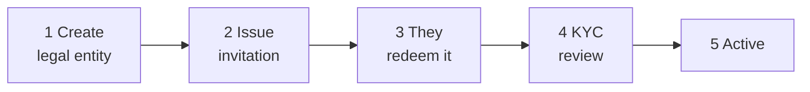

# Intégration d'un client

Un nouveau client existe dans le registre lorsque **vous** le créez. Il n'y a pas d'inscription en libre-service : quelqu'un doit décider que cette organisation doit être ici.

---

## Sa forme

Vous effectuez les étapes 1, 2 et 4. Le client effectue l'étape 3. L'étape 5 découle de l'étape 4.

---

## 1. Créer l'entité juridique

*Onboarding → Create entity.*

| Champ | |
|---|---|
| **Nom légal** | Le nom enregistré, exactement. |
| **Type d'entité** | `ISSUER`, `INVESTOR` ou `AUDITOR`. |
| **E-mail de contact** | Où va l'invitation. |
| **Numéro d'enregistrement et pays** | |
| **LEI** | Où ils en ont un. |
| **Date de constitution** | |

L'entité est créée avec le statut **`PENDING_ONBOARDING`** et un numéro d'entité attribué automatiquement.

!!! tip "Obtenez le nom légal exact, dès maintenant"
    Il doit correspondre à leurs documents d'immatriculation lors du KYC. Une incompatibilité entraîne un rejet et une nouvelle soumission, et le client considérera raisonnablement cela comme votre erreur.

    Les changements de nom sont pris en charge et suivis dans un historique de nom, de sorte que l'enregistrement survive — mais il est plus simple de ne pas en avoir besoin.

!!! warning "Le type d'entité contraint tout ce qui suit"
    Un client enregistré sous le type `INVESTOR` ne peut pas avoir d'utilisateurs émetteurs, quel que soit leur niveau hiérarchique. Changer de type par la suite est une correction de l'opérateur, pas une modification de paramètre.

    S'ils comptent à la fois émettre et investir, décidez dès maintenant comment vous allez représenter cela.

---

## 2. Émettre l'invitation

La génération d'une invitation produit un **jeton à usage unique**, valable **48 heures** par défaut (`registerwerk.onboarding.token-ttl-hours`).

La façon dont il est construit importe :

- 32 octets aléatoires, en base64 compatible URL.
- **Seul son hachage SHA-256 est stocké.** Le texte en clair est renvoyé une seule fois, au moment de la génération, et plus jamais — la base de données ne peut pas le révéler, et vous non plus.
- La génération d'un nouveau jeton **invalide tout jeton inutilisé en circulation**, de sorte qu'un renvoi ne peut pas laisser deux invitations actives.
- Aucun jeton ne peut être émis pour une entité fermée ou dissoute.

!!! danger "Le jeton authentifie quiconque le détient"
    L'utiliser crée le premier compte administrateur du client. Quiconque détient le jeton peut devenir cet administrateur.

    Envoyez-le à l'adresse de contact enregistrée, pas à celui qui vous l'a demandé. Si quelqu'un téléphone pour demander qu'il soit renvoyé à une adresse différente, traitez cela comme la tentative de prise de contrôle de compte qu'elle est peut-être.

S'il expire, générez-en un nouveau — ce qui invalide l'ancien.

---

## 3. Le client l'utilise

Il ouvre le lien, et :

1. Le jeton est validé sans être consommé.
2. Il définit son nom d'administrateur, son e-mail et son mot de passe.
3. Son premier compte `COMPANY_ADMIN` est créé et le jeton est marqué comme utilisé.
4. Il peut éventuellement configurer son fournisseur d'identité.

À partir de là, il gère ses propres utilisateurs. [Administrateur d'entreprise](../../customer/workspaces/company-admin.md) décrit ce même processus de son point de vue.

---

## 4. Examen du KYC

Les émetteurs et les investisseurs soumettent des documents KYC. **Les auditeurs n'ont pas besoin de KYC** — ils ne détiennent aucun titre et ne prennent aucune position.

[:octicons-arrow-right-24: Examen du KYC](kyc-process.md)

!!! warning "Ne les laissez pas commencer avant l'approbation"
    La tentation de laisser un gros client mettre en place des émissions pendant que le KYC est en attente est forte.

    Une entité non vérifiée qui a déjà créé des émissions et admis des investisseurs est bien plus difficile à défaire qu'une entité qui a patienté. La porte existe précisément pour que les choses coûteuses arrivent après le contrôle bon marché.

---

## 5. Actif

`PENDING_ONBOARDING` → `ACTIVE`. Il peut travailler.

---

## Statuts d'entité

L'ensemble complet — il n'y en a que quatre :

| Statut | |
|---|---|
| `PENDING_ONBOARDING` | Créée, pas encore passée par l'intégration et le KYC. |
| `ACTIVE` | Fonctionne normalement. |
| `SUSPENDED` | Temporairement arrêtée. Réversible. |
| `DISSOLVED` | Terminée. |

!!! note "Il n'y a pas de statut `PENDING_KYC`"
    Une documentation plus ancienne en mentionnait un, ainsi qu'un point de terminaison `PATCH /api/v1/admin/entities/{id}/status`. Ni l'un ni l'autre n'existe.

    Les changements de statut sont des opérations explicites et nommées — `suspend`, `dissolve`, `reactivate`, `terminate` — sous `/api/v1/entities/{id}/`, et non une écriture de statut générique. C'est délibéré : chaque transition a ses propres conditions préalables et son propre événement d'audit, ce qu'un champ de statut en texte libre ne pourrait pas garantir.

---

## Gérer les entités par la suite

**La suspension** bloque les utilisateurs de l'entité. Réversible via `reactivate`. À utiliser pour un problème de conformité non résolu ou une vérification expirée que vous comptez corriger.

**La dissolution** met fin à la relation — voir [Offboarding](offboarding.md), et notez que dissoudre un émetteur ayant un titre actif laisse des détenteurs porteurs de créances sans que personne ne les administre.

**La fusion** traite les véritables doublons : la même organisation intégrée deux fois. Elle relie à nouveau les émissions, les détenteurs et l'historique à l'entité survivante, désactive le doublon et enregistre la fusion dans `entity_merge_record` afin que ce rapprochement reste vérifiable.

!!! danger "La fusion n'est pas faite pour deux entités qui se ressemblent simplement"
    Deux filiales aux noms presque identiques sont deux entités juridiques avec des obligations distinctes. Les fusionner fusionne leurs entrées de registre.

    Confirmez qu'il s'agit bien d'une organisation intégrée deux fois — et non de deux organisations — avant de fusionner. Cela ne s'annule pas facilement.

---

## Où suivant

- [Examen du KYC](kyc-process.md)
- [Rôles et permissions](roles.md)
- [Offboarding](offboarding.md)
