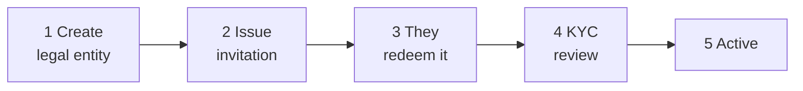

# Onboarding di un cliente { #onboarding-a-customer }

Un nuovo cliente esiste nel registro quando **lo** crei tu. Non è prevista alcuna registrazione self-service: qualcuno deve decidere che questa organizzazione debba essere qui.

---

## La sua forma { #the-shape-of-it }

Tu esegui i passaggi 1, 2 e 4. Il cliente esegue il passaggio 3. Il passaggio 5 segue da 4.

---

## 1. Crea il soggetto giuridico { #1-create-the-legal-entity }

*Onboarding → Crea entità.*

| Campo | |
|---|---|
| **Nome legale** | Il nome registrato, esattamente. |
| **Tipo di entità** | `ISSUER`, `INVESTOR` o `AUDITOR`. |
| **E-mail di contatto** | Dove va l'invito. |
| **Numero di registrazione e paese** | |
| **LEI** | Dove ne hanno uno. |
| **Data di costituzione** | |

L'entità viene creata con lo stato **`PENDING_ONBOARDING`** e un numero di entità assegnato automaticamente.

!!! tip "Ottieni il nome legale esatto, adesso"
    Deve corrispondere ai documenti di registrazione in sede di KYC. Una mancata corrispondenza significa un rifiuto e un nuovo invio, e il cliente lo considererà ragionevolmente un tuo errore.

    Le modifiche al nome sono supportate e tracciate in una cronologia dei nomi, quindi il record sopravvive — ma è più semplice non doverne aver bisogno.

!!! warning "Il tipo di entità vincola tutto ciò che segue"
    Un cliente registrato come `INVESTOR` non può avere utenti emittente, per quanto senior. Cambiare il tipo in seguito è una correzione dell'operatore, non una modifica delle impostazioni.

    Se emetteranno e investiranno entrambi, decidi ora come rappresentarlo.

---

## 2. Emetti l'invito { #2-issue-the-invitation }

La generazione di un invito produce un **token monouso**, valido per **48 ore** per impostazione predefinita (`registerwerk.onboarding.token-ttl-hours`).

Il modo in cui è costruito è importante:

- 32 byte casuali, URL-safe base64.
- **Viene memorizzato solo l'hash SHA-256.** Il testo in chiaro viene restituito una volta, alla generazione, e mai più: il database non può rivelarlo e nemmeno tu puoi.
- La generazione di un nuovo token **invalida qualsiasi token in sospeso non utilizzato**, quindi un nuovo invio non può lasciare due inviti attivi.
- I token non possono essere emessi per un'entità chiusa o sciolta.

!!! danger "Il token autentica chiunque lo possieda"
    Riscattarlo crea il primo account amministratore del cliente. Chiunque detenga il token può diventare quell'amministratore.

    Invialo all'indirizzo di contatto registrato, non a chi lo ha richiesto. Se qualcuno telefona chiedendo che venga inviato nuovamente a un indirizzo diverso, trattalo come il possibile tentativo di appropriazione dell'account che potrebbe essere.

Se scade, generane uno nuovo, che invalida quello vecchio.

---

## 3. Il cliente lo riscatta { #3-the-customer-redeems-it }

Apre il collegamento, e:

1. Il token viene convalidato senza essere consumato.
2. Impostano il nome amministratore, l'e-mail e la password.
3. Viene creato il primo account `COMPANY_ADMIN` e il token viene contrassegnato come utilizzato.
4. Facoltativamente possono configurare il proprio provider di identità.

Da qui gestiscono i propri utenti. [L'amministratore dell'azienda](../../customer/workspaces/company-admin.md) è il loro lato della questione.

---

## 4. Verifica KYC { #4-kyc-review }

Emittenti e investitori inviano documenti KYC. **I revisori non richiedono il KYC**: non detengono titoli e non assumono posizioni.

[:octicons-arrow-right-24: Esaminare il KYC](kyc-process.md)

!!! warning "Non lasciarli iniziare prima dell'approvazione"
    La tentazione di lasciare che un grande cliente avvii le emissioni mentre il KYC è in corso è forte.

    Un'entità non verificata che ha già creato emissioni e ammesso investitori è molto più difficile da smontare di una che ha aspettato. Questo passaggio obbligato esiste proprio perché le cose costose accadano dopo il controllo economico.

---

## 5. Attivo { #5-active }

`PENDING_ONBOARDING` → `ACTIVE`. Possono funzionare.

---

## Stati delle entità { #entity-statuses }

Il set completo: ce ne sono solo quattro:

| Stato | |
|---|---|
| `PENDING_ONBOARDING` | Creato, non ancora passato per onboarding e KYC. |
| `ACTIVE` | Funzionante normalmente. |
| `SUSPENDED` | Momentaneamente interrotto. Reversibile. |
| `DISSOLVED` | Finito. |

!!! note "Non esiste lo stato `PENDING_KYC`"
    La documentazione precedente ne elencava uno, insieme a un endpoint `PATCH /api/v1/admin/entities/{id}/status`. Nessuno dei due esiste.

    Le modifiche di stato sono operazioni esplicite e denominate — `suspend`, `dissolve`, `reactivate`, `terminate` — sotto `/api/v1/entities/{id}/`, non una scrittura di stato generica. È intenzionale: ogni transizione ha le proprie precondizioni e il proprio evento di controllo, cosa che un campo di stato libero non potrebbe imporre.

---

## Gestire le entità in seguito { #managing-entities-afterwards }

**La sospensione** blocca gli utenti dell'entità. Reversibile tramite `reactivate`. Usala per una questione di conformità irrisolta o una verifica scaduta che ti aspetti venga sanata.

**Lo scioglimento** pone fine al rapporto — vedi [Cessazione](offboarding.md), e tieni presente che sciogliere un emittente con un titolo attivo lascia i titolari con diritti e nessuno che li amministri.

**L'unione** gestisce i duplicati autentici: la stessa organizzazione onboardata due volte. Ricollega emissioni, titolari e cronologia all'entità superstite, disattiva il duplicato e registra l'unione in `entity_merge_record`, così che l'accorpamento resti verificabile.

!!! danger "L'unione non è per due entità che sembrano solo simili"
    Due controllate con nomi quasi identici sono due soggetti giuridici con obblighi separati. Unirle fonde le loro voci di registro.

    Conferma di avere di fronte un'organizzazione onboardata due volte — non due organizzazioni — prima di procedere all'unione. Non è facilmente reversibile.

---

## Dove andare adesso { #where-next }

- [Esaminare il KYC](kyc-process.md)
- [Ruoli e permessi](roles.md)
- [Cessazione](offboarding.md)
