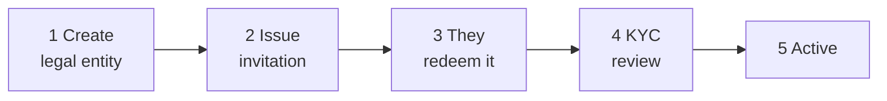

# Onboarding a customer

A new customer exists in the registry when **you** create them. There is no self-service sign-up: somebody has to decide this organisation should be here.

---

## The shape of it

You do steps 1, 2 and 4. The customer does 3. Step 5 follows from 4.

---

## 1. Create the legal entity

*Onboarding → Create entity.*

| Field | |
|---|---|
| **Legal name** | The registered name, exactly. |
| **Entity type** | `ISSUER`, `INVESTOR`, or `AUDITOR`. |
| **Contact email** | Where the invitation goes. |
| **Registration number and country** | |
| **LEI** | Where they have one. |
| **Incorporation date** | |

The entity is created with status **`PENDING_ONBOARDING`** and an auto-assigned entity number.

!!! tip "Get the legal name exactly right, now"
    It has to match their registration documents at KYC. A mismatch means a rejection and a resubmission, and the customer will reasonably regard that as your error.

    Name changes are supported and tracked in a name history, so the record survives — but it is easier not to need it.

!!! warning "Entity type constrains everything downstream"
    A customer registered as `INVESTOR` cannot have issuer users, however senior. Changing type afterwards is an operator correction, not a settings edit.

    If they will both issue and invest, decide now how you will represent that.

---

## 2. Issue the invitation

Generating an invitation produces a **one-time token**, valid for **48 hours** by default (`registerwerk.onboarding.token-ttl-hours`).

How it is built matters:

- 32 random bytes, URL-safe base64.
- **Only its SHA-256 hash is stored.** The cleartext is returned once, at generation, and never again — the database cannot reveal it, and neither can you.
- Generating a new token **invalidates any outstanding unused one**, so a resend cannot leave two live invitations.
- Tokens cannot be issued for a closed or dissolved entity.

!!! danger "The token authenticates whoever holds it"
    Redeeming it creates the customer's first administrator account. Anybody holding the token can become that administrator.

    Send it to the contact address of record, not to whoever asked for it. If someone telephones asking for it to be resent to a different address, treat that as the account-takeover attempt it may well be.

If it expires, generate a new one — which invalidates the old.

---

## 3. The customer redeems it

They open the link, and:

1. The token is validated without being consumed.
2. They set their administrator name, email and password.
3. Their first `COMPANY_ADMIN` account is created and the token is marked used.
4. They can optionally configure their identity provider.

From here they manage their own users. [Company administrator](../../customer/workspaces/company-admin.md) is their side of it.

---

## 4. KYC review

Issuers and investors submit KYC documents. **Auditors do not require KYC** — they hold no securities and take no positions.

[:octicons-arrow-right-24: Reviewing KYC](kyc-process.md)

!!! warning "Do not let them start before approval"
    The temptation to let a large client set up issuances while KYC is pending is strong.

    An unverified entity that has already created issuances and admitted investors is far harder to unwind than one that waited. The gate exists so that the expensive things happen after the cheap check.

---

## 5. Active

`PENDING_ONBOARDING` → `ACTIVE`. They can work.

---

## Entity statuses

The complete set — there are only four:

| Status | |
|---|---|
| `PENDING_ONBOARDING` | Created, not yet through onboarding and KYC. |
| `ACTIVE` | Operating normally. |
| `SUSPENDED` | Temporarily stopped. Reversible. |
| `DISSOLVED` | Ended. |

!!! note "There is no `PENDING_KYC` status"
    Status changes are explicit, named operations — `suspend`, `dissolve`, `reactivate`, `terminate` — under `/api/v1/entities/{id}/`, not a generic status write. That is deliberate: each transition has its own preconditions and its own audit event, which a free-form status field could not enforce.

---

## Managing entities afterwards

**Suspending** blocks the entity's users. Reversible via `reactivate`. Use it for an unresolved compliance matter or a lapsed verification you expect to be fixed.

**Dissolving** ends the relationship — see [Offboarding](offboarding.md), and note that dissolving an issuer with a live security leaves holders with claims and nobody administering them.

**Merging** handles genuine duplicates: the same organisation onboarded twice. It re-links issuances, holders and history to the surviving entity, deactivates the duplicate, and records the merge in `entity_merge_record` so the join stays auditable.

!!! danger "Merging is not for two entities that merely look similar"
    Two subsidiaries with near-identical names are two legal entities with separate obligations. Merging them fuses their register entries.

    Confirm you are looking at one organisation onboarded twice — not two organisations — before you merge. It is not easily undone.

---

## Where next

- [Reviewing KYC](kyc-process.md)
- [Roles and permissions](roles.md)
- [Offboarding](offboarding.md)
