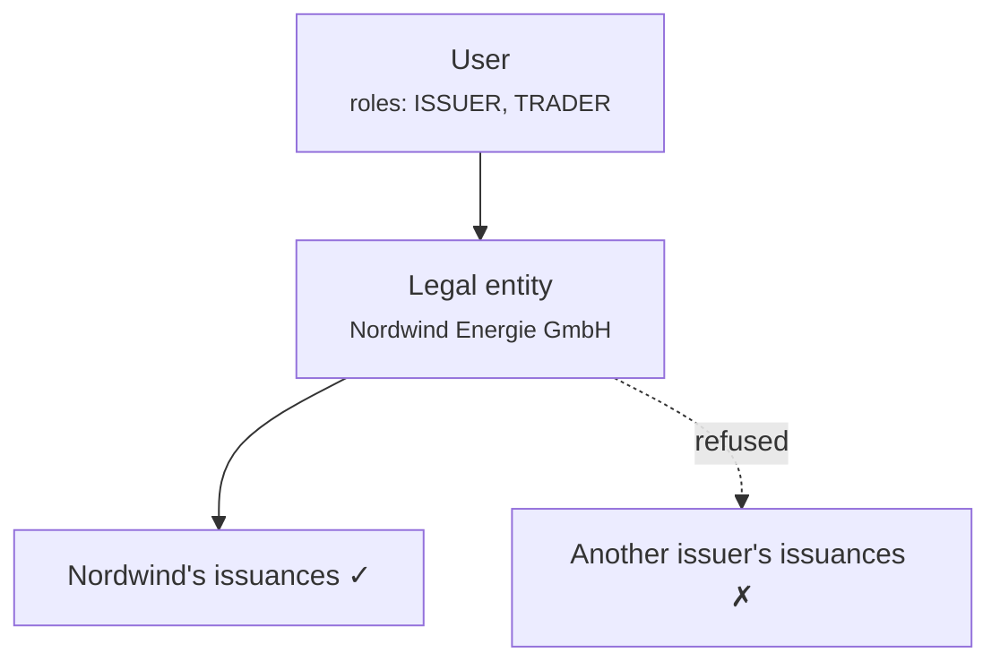

# Rollen und Berechtigungen

Drei getrennte Mechanismen entscheiden, was jemand tun kann. Sie zu verwechseln ist die Ursache der meisten Verwirrung rund um Zugriffsrechte – nehmen Sie sie deshalb der Reihe nach.

1. **Rollen** – welche Art von Nutzer Sie sind.
2. **Entity Scoping** – wessen Daten Sie berühren dürfen.
3. **Step-up und Vier-Augen-Prinzip** – zusätzlicher Nachweis für heikle Operationen.

Alle drei werden im **Backend** bei jeder Anfrage durchgesetzt. Die Navigation keines der beiden Portale ist eine Sicherheitsgrenze; ein ausgeblendeter Menüpunkt schützt nicht den Endpunkt dahinter.

---

## Die Rollen

| Rolle | Innehabend | Kann |
|---|---|---|
| `REGISTRY_ADMIN` | Bedienpersonal | Alles, kundenübergreifend. Einschließlich [Identitätsübernahme](impersonation.md). |
| `COMPLIANCE_OFFICER` | Bedienpersonal | KYC-/KYB-Workflow-Genehmigungen und -Ablehnungen. |
| `AUDIT` | Prüfer, Aufsichtspersonen | Lesezugriff auf das gesamte Register. Keine Schreibrechte. |
| `COMPANY_ADMIN` | Kunde | Verwaltet die Nutzer, IdP-Einstellungen und On-Chain-Identität der eigenen Organisation. |
| `ISSUER` | Kunde | Legt eigene Emissionen an und verwaltet sie. |
| `INVESTOR` | Kunde | Hält und betrachtet die eigenen Wertpapiere. |
| `TRADER` | Kunde | Kauft, verkauft und nutzt Liquiditätsmärkte. |
| `DAPP_PUBLISHER` | Kunde | Veröffentlicht Anwendungen im Marketplace. |

Ein Nutzer hat eine oder mehrere davon. Im Kundenportal bestimmen die Rollen, welche [Arbeitsbereiche](../../customer/workspaces/index.md) erscheinen.

!!! note "`COMPLIANCE_OFFICER` ist eine Workflow-Rolle, keine rechtliche Feststellung"
    Sie erlaubt jemandem, eine KYC-Genehmigung oder -Ablehnung im System zu erfassen. Sie macht diese Person nicht zu einem Compliance-Beauftragten im aufsichtsrechtlichen Sinne, und die Plattform beurteilt nicht, ob sie qualifiziert ist, die von ihr festgehaltene Einschätzung zu vertreten.

---

## Woher die Rollen kommen

!!! danger "Rollen leben in der Zeile `app_user`. Nicht beim Identitätsanbieter."
    Das ist die wichtigste Tatsache auf dieser Seite, und sie ist das Gegenteil dessen, was viele Bereitstellungen annehmen.

    Selbst wenn Kunden sich über Microsoft Entra ID anmelden, **bestimmt Entra nicht, was sie hier tun dürfen.** Entra beantwortet *wer ist diese Person*. Registerwerk beantwortet *was darf sie tun*. Entra-App-Rollen werden nur einmal herangezogen, wenn ein Nutzer erstmals angelegt wird, um einen sinnvollen Standardwert zu wählen.

    Folgen, die man sich einprägen sollte:

    - **Das Ändern einer Entra-App-Rollenzuweisung ändert für niemanden die Registerwerk-Berechtigungen.** Ein Administrator, der eine Rolle in Entra entfernt und erwartet, dass sich hier der Zugriff ändert, irrt sich und wird glauben, etwas widerrufen zu haben, das er nicht widerrufen hat.
    - **Um Zugriff zu widerrufen, ändern Sie ihn hier** – oder deaktivieren Sie das Konto in Entra, sodass sich der Nutzer überhaupt nicht mehr anmelden kann.
    - Es gibt genau eine Stelle, an der man nachsehen muss, wer was darf.

Ältere Dokumentation beschrieb Rollen als in einem JWT-Claim ankommend, der vom Identitätsanbieter befüllt und von einer Klasse namens `JwtEntityClaimsConverter` gelesen wird. Diese Klasse wurde entfernt, und dieses Modell hat nie beschrieben, wie das System tatsächlich funktioniert. Arbeiten Sie mit einem darauf aufbauenden mentalen Modell, ersetzen Sie es durch den obigen Absatz.

---

## Entity Scoping

Rollen sagen, *welche Art* von Handlung Sie vornehmen dürfen. Entity Scoping sagt, *wessen*.

Jeder Kundennutzer gehört zu einer **juristischen Person**, und sein Token trägt diese Zugehörigkeit. Ein `ISSUER` bei Nordwind kann Nordwinds Emissionen verwalten und die von niemandem sonst – nicht weil die Oberfläche sie verbirgt, sondern weil das Backend es ablehnt.

Entitätsübergreifender Zugriff erfordert `REGISTRY_ADMIN`. Es gibt keine kundenseitige Rolle, die an die Daten eines anderen Kunden heranreicht.

Der Zugriff wird pro Ressource geprüft, nicht nur pro Endpunkt – die Anfrage nach einem Asset, das Ihnen nicht gehört, wird abgelehnt, nicht mit einer gefilterten leeren Liste beantwortet, die Sie im Ungewissen lässt.

---

## Step-up und Vier-Augen-Prinzip

Manche Operationen verlangen mehr als eine gültige Sitzung.

**Step-up** verlangt einen frischen Identitätsnachweis im Moment der Handlung, nicht nur eine vor Stunden geöffnete Sitzung. Betreiber nutzen lokales TOTP. Kunden im Entra-Modus durchlaufen einen Conditional-Access-Authentifizierungskontext.

**Vier Augen** erfordert *zwei verschiedene Personen*. Es gilt für Operationen, bei denen eine einzelne irrtümliche oder böswillige Handlung am schlimmsten wiegt:

- Rückabwicklung eines abgewickelten Handels
- Genehmigung einer Kapitalmaßnahme zur Abwicklung
- Zurücksetzen der MFA-Methoden eines Kunden
- Ausstellen eines temporären Zugangspasses
- Vergabe und Widerruf von Ökosystem-Berechtigungen
- Token-Admin-Vergaben und deren Widerruf

!!! danger "Vier Augen sind nur so real wie Ihre Personalbesetzung"
    Das System erzwingt, dass der Genehmiger eine andere Nutzer-ID hat als der Initiator. Es kann nicht erkennen, dass beide Konten von derselben Person genutzt werden.

    Eine Bereitstellung, in der eine einzelne Person zwei Administratorkonten hält oder in der Zugangsdaten geteilt werden, hat Vier-Augen-Kontrollen nur dem Namen nach, nicht faktisch. Das ist eine organisatorische Kontrolle, die die Software unterstützt; es ist keine, die die Software garantiert.

[:octicons-arrow-right-24: Step-up-MFA und Vier-Augen-Prinzip](../../compliance/step-up-mfa.md)

---

## Rollen vergeben

**Innerhalb einer Kundenorganisation:** deren [Unternehmensadministrator](../../customer/workspaces/company-admin.md) gewährt seinen eigenen Nutzern Rollen. Er kann nicht mehr gewähren, als seine Organisation innehat, und er kann keine Betreiberrollen gewähren.

**Betreiberrollen:** werden von einem bestehenden `REGISTRY_ADMIN` im Operatorportal gewährt.

!!! tip "`REGISTRY_ADMIN` klein halten"
    Jeder Inhaber kann Emissionen genehmigen, das Register berichtigen und bei jedem Kunden eine Identitätsübernahme durchführen. Es ist die folgenreichste Liste in der Bereitstellung.

    Überprüfen Sie sie nach einem festen Zeitplan. Fragen Sie sich für jeden Namen, was schiefginge, wenn dessen Konto kompromittiert würde – und ob es irgendjemandem auffallen würde.

---

## Deaktivierung

Das Deaktivieren eines Nutzers wirkt sofort und ist reversibel, und es **löscht nichts**. Seine vergangenen Handlungen bleiben dauerhaft, ihm zugeordnet, im [Audit-Log](../../platform/audit-log.md) erhalten.

Das ist Absicht: Zugriff zu entziehen darf niemals die Aufzeichnung dessen, was mit ihm getan wurde, mit entziehen.

---

## Wo weiter

- [Onboarding eines Kunden](onboarding-flow.md)
- [Identitätsübernahme](impersonation.md)
- [Unternehmensadministrator](../../customer/workspaces/company-admin.md) – die Seite des Kunden
