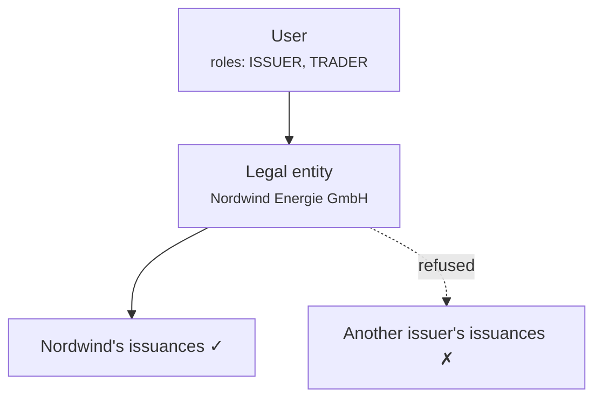

# Roles y permisos { #roles-and-permissions }

Tres mecanismos separados deciden lo que alguien puede hacer. Confundirlos es la fuente de la mayoría de las perplejidades relacionadas con el acceso, así que tómelos en orden.

1. **Roles** — qué tipo de usuario es usted.
2. **Alcance de la entidad** — de quién son los datos que puede tocar.
3. **Autenticación reforzada y doble control** — prueba adicional para operaciones delicadas.

Los tres se aplican en el **backend**, en cada solicitud. La navegación de ninguno de los dos portales es un límite de seguridad; ocultar un elemento de menú no protege el endpoint que hay detrás.

---

## Los roles { #the-roles }

| Rol | Ostentado por | Puede |
|---|---|---|
| `REGISTRY_ADMIN` | Personal del operador | Todo, en todos los clientes. Incluye [suplantación](impersonation.md). |
| `COMPLIANCE_OFFICER` | Personal del operador | Aprobaciones y rechazos del flujo de trabajo KYC/KYB. |
| `AUDIT` | Auditores, inspectores | Leer todo el registro. Sin escritura. |
| `COMPANY_ADMIN` | Cliente | Administrar los usuarios de su propia organización, la configuración del IdP y la identidad en cadena. |
| `ISSUER` | Cliente | Crear y administrar sus propias emisiones. |
| `INVESTOR` | Cliente | Mantener y consultar sus propios valores. |
| `TRADER` | Cliente | Comprar, vender y utilizar mercados de liquidez. |
| `DAPP_PUBLISHER` | Cliente | Publicar aplicaciones en el mercado. |

Un usuario tiene uno o más. En el portal del cliente, los roles determinan qué [espacios de trabajo](../../customer/workspaces/index.md) aparecen.

!!! note "`COMPLIANCE_OFFICER` es una función de flujo de trabajo, no una determinación legal"
    Permite que alguien registre una aprobación o rechazo KYC en el sistema. No convierte a esa persona en un oficial de cumplimiento en ningún sentido regulatorio, y la plataforma no evalúa si está calificado para mantener la opinión que está registrando.

---

## De dónde provienen los roles { #where-roles-come-from }

!!! danger "Los roles residen en la fila de `app_user`. No en el proveedor de identidad."
    Este es el hecho más importante de la página, y es lo contrario de lo que suponen muchas implementaciones.

    Incluso cuando los clientes inician sesión a través de Microsoft Entra ID, **Entra no determina qué pueden hacer aquí.** Entra responde *quién es esta persona*. Registerwerk responde *qué puede hacer*. Los roles de la aplicación Entra se consultan solo una vez, cuando se aprovisiona a un usuario por primera vez, para elegir un valor predeterminado razonable.

    Consecuencias que vale la pena interiorizar:

    - **Cambiar la asignación de un rol de la aplicación Entra no cambia los permisos de Registerwerk de nadie.** Un administrador que elimina un rol en Entra y espera que el acceso cambie aquí se equivocará, y creerá haber revocado algo que en realidad no ha revocado.
    - **Para revocar el acceso, cámbielo aquí** — o deshabilite la cuenta en Entra para que no pueda iniciar sesión en absoluto.
    - Hay exactamente un lugar donde mirar al auditar quién puede hacer qué.

Alguna documentación anterior describía que los roles llegaban en un claim JWT completado por el proveedor de identidad y leído por una clase llamada `JwtEntityClaimsConverter`. Esa clase ha sido eliminada, y ese modelo nunca fue cómo se comportó el sistema. Si está trabajando a partir de un modelo mental construido sobre eso, reemplácelo con el párrafo anterior.

---

## Alcance de la entidad { #entity-scoping }

Los roles dicen *qué tipo* de cosas puede hacer. El alcance de la entidad dice *de quién*.

Cada usuario cliente pertenece a una **entidad jurídica**, y su token lo lleva. Un `ISSUER` en Nordwind puede administrar las emisiones de Nordwind y las de nadie más — no porque la interfaz las oculte, sino porque el backend se niega.

El acceso entre entidades requiere `REGISTRY_ADMIN`. No existe una función del lado del cliente que llegue a los datos de otro cliente.

El acceso se verifica por recurso, no simplemente por punto final; al solicitar un activo que no es de su propiedad se obtiene un rechazo, no una lista vacía filtrada que lo deja adivinando.

---

## Autenticación reforzada y cuatro ojos { #step-up-and-four-eyes }

Algunas operaciones exigen más que una sesión válida.

**La autenticación reforzada (step-up)** exige una prueba de identidad nueva en el momento de la acción, no simplemente una sesión abierta hace horas. Los operadores usan TOTP local. Los clientes en modo Entra pasan por un contexto de autenticación de acceso condicional.

**Cuatro ojos** exige *dos personas distintas*. Se aplica a las operaciones en las que un único acto erróneo o malicioso resulta más grave:

- Revertir una operación liquidada
- Aprobar una operación societaria para su liquidación
- Restablecer los métodos MFA de un cliente
- Emitir un pase de acceso temporal
- Concesiones y revocaciones de permisos del ecosistema
- Concesiones de administración de tokens y su revocación

!!! danger "El control de cuatro ojos es tan real como su personal"
    El sistema exige que el aprobador tenga un id de usuario distinto al del iniciador. No puede detectar que ambas cuentas las usa la misma persona.

    Una implementación en la que una sola persona tiene dos cuentas de administrador, o donde se comparten credenciales, tiene controles de cuatro ojos de nombre, pero no de hecho. Este es un control organizativo que el software admite; no uno que el software garantice por sí mismo.

[:octicons-arrow-right-24: Step-up MFA y cuatro ojos](../../compliance/step-up-mfa.md)

---

## Otorgamiento de roles { #granting-roles }

**Dentro de una organización cliente:** su [administrador de la empresa](../../customer/workspaces/company-admin.md) otorga roles a sus propios usuarios. No puede otorgar más de lo que tiene su organización, y no puede otorgar roles de operador.

**Roles de operador:** otorgados por un `REGISTRY_ADMIN` existente, en el portal del operador.

!!! tip "Mantenga reducido el `REGISTRY_ADMIN`"
    Cualquiera que lo tenga puede aprobar emisiones, corregir el registro y suplantar a cualquier cliente. Es la lista más importante de toda la implementación.

    Revísela con regularidad. Pregunte, para cada nombre, qué saldría mal si esa cuenta se viera comprometida — y si alguien se daría cuenta.

---

## Desactivación { #deactivation }

La desactivación de un usuario es inmediata y reversible, y **no elimina nada**. Sus acciones pasadas permanecen en el [registro de auditoría](../../platform/audit-log.md), atribuido a ellos, de forma permanente.

Eso es deliberado: eliminar el acceso nunca debe eliminar el registro de lo que se hizo con él.

---

## Dónde siguiente { #where-next }

- [Incorporación de un cliente](onboarding-flow.md)
- [Suplantación](impersonation.md)
- [Administrador de la empresa](../../customer/workspaces/company-admin.md) — el lado del cliente
