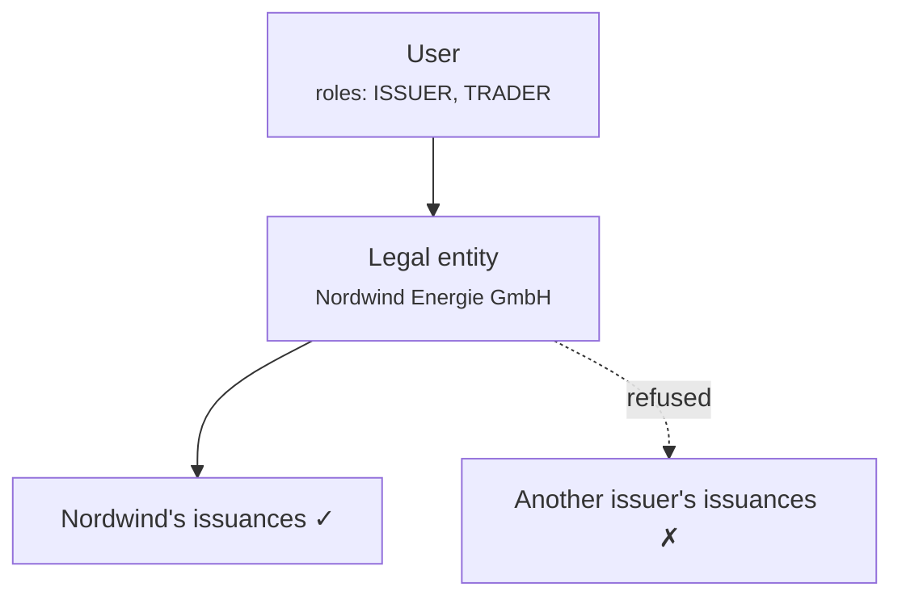

# Rôles et autorisations

Trois mécanismes distincts décident de ce que quelqu'un peut faire. Les confondre est la source de la plupart des perplexités liées à l'accès, alors prenez-les dans l'ordre.

1. **Rôles** — quel type d'utilisateur vous êtes.
2. **Portée de l'entité** — dont vous pouvez toucher les données.
3. **Authentification renforcée et quatre yeux** — une preuve supplémentaire pour les opérations sensibles.

Les trois sont appliqués dans le **backend**, à chaque requête. La navigation d'aucun des deux portails ne constitue une frontière de sécurité ; masquer un élément de menu ne protège pas le point de terminaison qui se trouve derrière.

---

## Les rôles

| Rôle | Détenu par | Peut |
|---|---|---|
| `REGISTRY_ADMIN` | Personnel opérateur | Tout, pour tous les clients. Inclut le [mode support](impersonation.md). |
| `COMPLIANCE_OFFICER` | Personnel opérateur | Approbations et rejets de flux de travail KYC/KYB. |
| `AUDIT` | Auditeurs, inspecteurs | Lire l'ensemble du registre. Aucune écriture. |
| `COMPANY_ADMIN` | Client | Gérer les utilisateurs de leur propre organisation, les paramètres IdP et l'identité on-chain. |
| `ISSUER` | Client | Créer et administrer leurs propres émissions. |
| `INVESTOR` | Client | Détenir et visualiser leurs propres titres. |
| `TRADER` | Client | Acheter, vendre et utiliser les marchés de liquidité. |
| `DAPP_PUBLISHER` | Client | Publier des applications sur le marketplace. |

Un utilisateur en détient un ou plusieurs. Dans le portail client, les rôles déterminent quels [espaces de travail](../../customer/workspaces/index.md) apparaissent.

!!! note "`COMPLIANCE_OFFICER` est un rôle de workflow, pas une détermination juridique"
    Il permet à quelqu'un d'enregistrer une approbation ou un rejet KYC dans le système. Cela ne fait pas de cette personne un responsable de la conformité au sens réglementaire, et la plateforme n'évalue pas si elle est qualifiée pour émettre l'avis qu'elle enregistre.

---

## D'où viennent les rôles

!!! danger "Les rôles se trouvent dans la ligne `app_user`. Pas dans le fournisseur d'identité."
    Il s'agit du fait le plus important de la page, et c'est le contraire de ce que supposent de nombreux déploiements.

    Même lorsque les clients se connectent via Microsoft Entra ID, **Entra ne détermine pas ce qu'ils peuvent faire ici.** Entra répond à *qui est cette personne*. Registerwerk répond à *ce qu'elle peut faire*. Les rôles d'application Entra ne sont consultés qu'une seule fois, lors du premier provisionnement d'un utilisateur, pour choisir une valeur par défaut raisonnable.

    Conséquences à bien intégrer :

    - **Modifier une attribution de rôle d'application dans Entra ne change les permissions Registerwerk de personne.** Un administrateur qui retire un rôle dans Entra et s'attend à ce que l'accès change ici aura tort, et croira avoir révoqué un accès qui, en réalité, ne l'a pas été.
    - **Pour révoquer un accès, modifiez-le ici** — ou désactivez le compte dans Entra pour que la personne ne puisse plus se connecter du tout.
    - Il n'y a qu'un seul endroit où regarder pour auditer qui peut faire quoi.

---

## Portée de l'entité

Les rôles indiquent *quel genre* de chose vous pouvez faire. La portée de l'entité indique *de qui*.

Chaque utilisateur client appartient à une **entité juridique**, et son jeton la porte. Un `ISSUER` chez Nordwind peut administrer les émissions de Nordwind et celles de personne d'autre — non pas parce que l'interface les cache, mais parce que le backend refuse.

L'accès inter-entités nécessite `REGISTRY_ADMIN`. Aucun rôle côté client n'atteint les données d'un autre client.

L'accès est vérifié par ressource, pas simplement par point de terminaison : demander un actif que vous ne possédez pas obtient un refus, pas une liste vide filtrée qui vous laisse deviner.

---

## Authentification renforcée et quatre yeux

Certaines opérations exigent plus qu'une session valide.

**L'authentification renforcée (step-up)** exige une nouvelle preuve d'identité au moment de l'action, pas seulement une session ouverte il y a plusieurs heures. Les opérateurs utilisent un TOTP local. Les clients en mode Entra passent par un contexte d'authentification à accès conditionnel.

**Les quatre yeux** exigent *deux personnes différentes*. Ce principe s'applique aux opérations où une seule action erronée ou malveillante serait la pire chose possible :

- Annulation d'une transaction déjà réglée
- Approbation d'une opération sur titres pour règlement
- Réinitialisation des méthodes MFA d'un client
- Délivrance d'un laissez-passer d'accès temporaire
- Octroi et révocation de permissions dans l'écosystème
- Octroi et révocation de droits d'administration de jetons

!!! danger "Les quatre yeux ne sont réels qu'à la mesure de vos effectifs"
    Le système impose que l'approbateur soit un identifiant utilisateur différent de celui de l'initiateur. Il ne peut pas détecter que les deux comptes sont utilisés par la même personne.

    Un déploiement où une seule personne détient deux comptes d'administrateur, ou où des identifiants sont partagés, dispose de contrôles à quatre yeux de nom, mais pas dans les faits. C'est un contrôle organisationnel que le logiciel prend en charge ; ce n'est pas un contrôle que le logiciel garantit à lui seul.

[:octicons-arrow-right-24: Authentification renforcée (MFA) et quatre yeux](../../compliance/step-up-mfa.md)

---

## Attribution des rôles

**Au sein d'une organisation cliente :** son [administrateur d'entreprise](../../customer/workspaces/company-admin.md) attribue des rôles à ses propres utilisateurs. Il ne peut pas attribuer plus que ce que détient son organisation, ni attribuer de rôles d'opérateur.

**Rôles d'opérateur :** attribués par un `REGISTRY_ADMIN` existant, dans le portail opérateur.

!!! tip "Gardez `REGISTRY_ADMIN` restreint"
    Chaque détenteur peut approuver des émissions, corriger le registre et prendre le mode support pour n'importe quel client. C'est la liste la plus lourde de conséquences de tout le déploiement.

    Passez-la en revue selon un calendrier régulier. Demandez-vous, pour chaque nom, ce qui se passerait de grave si le compte de cette personne était compromis — et si quelqu'un le remarquerait.

---

## Désactivation

La désactivation d'un utilisateur est immédiate et réversible, et elle **ne supprime rien**. Ses actions passées restent dans le [journal d'audit](../../platform/audit-log.md), attribuées à lui, de façon permanente.

C'est délibéré : retirer un accès ne doit jamais faire disparaître la trace de ce qui a été fait avec.

---

## Où suivant

- [Intégration d'un client](onboarding-flow.md)
- [Mode support](impersonation.md)
- [Administrateur d'entreprise](../../customer/workspaces/company-admin.md) — le point de vue du client
