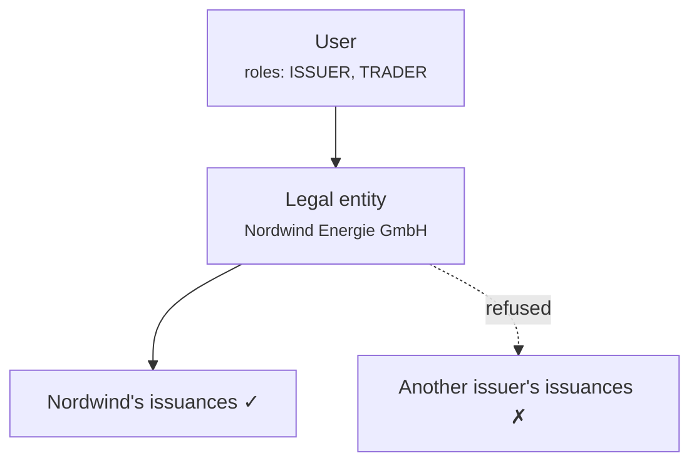

# Ruoli e autorizzazioni { #roles-and-permissions }

Tre meccanismi separati decidono cosa può fare qualcuno. Confonderli è la fonte della maggior parte delle perplessità relative all'accesso, quindi prendili in ordine.

1. **Ruoli**: che tipo di utente sei.
2. **Ambito entità**: i dati di chi puoi toccare.
3. **Step-up e quattro occhi**: prova extra per operazioni mirate.

Tutti e tre vengono applicati nel **backend**, a ogni richiesta. La navigazione di nessuno dei due portali costituisce un limite di sicurezza; nascondere una voce di menu non protegge l'endpoint dietro di essa.

---

## I ruoli { #the-roles }

| Ruolo | Tenuto da | Può |
|---|---|---|
| `REGISTRY_ADMIN` | Personale operatore | Tutto, per tutti i clienti. Include la [modalità supporto](impersonation.md) (impersonation). |
| `COMPLIANCE_OFFICER` | Personale operatore | Approvazioni e rifiuti del flusso di lavoro KYC/KYB. |
| `AUDIT` | Revisori dei conti, ispettori | Lettura su tutto il registro. Nessuna scrittura. |
| `COMPANY_ADMIN` | Cliente | Gestire gli utenti della propria organizzazione, le impostazioni IdP e l'identità on-chain. |
| `ISSUER` | Cliente | Creare e amministrare le proprie emissioni. |
| `INVESTOR` | Cliente | Conservare e visualizzare i propri titoli. |
| `TRADER` | Cliente | Acquistare, vendere e utilizzare i mercati della liquidità. |
| `DAPP_PUBLISHER` | Cliente | Pubblicare applicazioni sul marketplace. |

Un utente ne detiene uno o più. Nel portale clienti, i ruoli determinano quali [workspaces](../../customer/workspaces/index.md) verranno visualizzati.

!!! note "`COMPLIANCE_OFFICER` è un ruolo del flusso di lavoro, non una determinazione legale"
    Permette a qualcuno di registrare un'approvazione o un rifiuto KYC nel sistema. Non rende quella persona un responsabile della conformità in alcun senso normativo e la piattaforma non valuta se è qualificata per sostenere l'opinione che sta registrando.

---

## Da dove provengono i ruoli { #where-roles-come-from }

!!! danger "I ruoli risiedono nella riga `app_user`. Non nel provider di identità."
    Questo è il fatto più importante della pagina ed è l'opposto di quanto presuppongono molte distribuzioni.

    Anche quando i clienti accedono tramite Microsoft Entra ID, **Entra non determina cosa possono fare qui.** Entra risponde *chi è questa persona*. Registerwerk risponde *cosa possono fare*. I ruoli dell'app Entra vengono consultati solo una volta, quando viene effettuato il primo provisioning di un utente, per scegliere un'impostazione predefinita sensata.

    Conseguenze che vale la pena interiorizzare:

    - **La modifica dell'assegnazione del ruolo di un'app Entra non modifica le autorizzazioni Registerwerk di nessuno.** Un amministratore che rimuove un ruolo in Entra e si aspetta che l'accesso venga modificato qui si sbaglierà e crederà di aver revocato qualcosa che non ha.
    - **Per revocare l'accesso, modificalo qui** o disabilita l'account in Entra in modo che non possano accedere affatto.
    - C'è esattamente un posto in cui cercare quando si controlla chi può fare cosa.

Parte della documentazione precedente descriveva i ruoli come se arrivassero in un'attestazione JWT popolata dal provider di identità e letta da una classe chiamata `JwtEntityClaimsConverter`. Quella classe è stata rimossa e quel modello non è mai stato il modo in cui si è comportato il sistema. Se stai lavorando partendo da un modello mentale costruito su di esso, sostituiscilo con il paragrafo precedente.

---

## Scoping delle entità { #entity-scoping }

I ruoli dicono *che tipo* di cosa puoi fare. L'ambito dell'entità dice *di chi*.

Ogni utente cliente appartiene a un **soggetto giuridico** e il suo token lo trasporta. Un `ISSUER` presso Nordwind può amministrare le emissioni di Nordwind e di nessun altro, non perché l'interfaccia le nasconde, ma perché il backend rifiuta.

L'accesso tra entità richiede `REGISTRY_ADMIN`. Non esiste un ruolo lato cliente che raggiunga i dati di un altro cliente.

L'accesso viene controllato per risorsa, non semplicemente per endpoint: la richiesta di una risorsa che non possiedi riceve un rifiuto, non un elenco vuoto filtrato che ti lascia indovinare.

---

## Step-up e quattro occhi { #step-up-and-four-eyes }

Alcune operazioni richiedono più di una sessione valida.

**Step-up** richiede una nuova prova di identità al momento dell'azione, non semplicemente una sessione aperta ore prima. Gli operatori utilizzano TOTP locale. I clienti in modalità Entra attraversano un contesto di autenticazione di accesso condizionato.

**Quattro occhi** richiedono *due persone diverse*. Si applica alle operazioni in cui un singolo atto errato o dannoso è peggiore:

- Annullamento di un'operazione regolata
- Approvazione di un'operazione societaria ai fini del regolamento
- Reimpostazione dei metodi MFA di un cliente
- Emissione di un pass di accesso temporaneo
- Concessioni di autorizzazioni all'ecosistema e revoche
- Concessioni amministrative dei token e relativa revoca

!!! danger "Quattro occhi è reale quanto il tuo personale"
    Il sistema impone che l'approvatore sia un ID utente diverso dall'iniziatore. Non è in grado di rilevare che entrambi gli account siano utilizzati dalla stessa persona.

    Una distribuzione in cui un individuo possiede due account amministratore o in cui le credenziali sono condivise, ha controlli a quattro occhi di nome e non di fatto. Questo è un controllo organizzativo supportato dal software; non è uno di quelli forniti dal software.

[:octicons-arrow-right-24: Step-up MFA e quattro occhi](../../compliance/step-up-mfa.md)

---

## Concessione di ruoli { #granting-roles }

**All'interno dell'organizzazione di un cliente:** il loro [amministratore aziendale](../../customer/workspaces/company-admin.md) concede ruoli ai propri utenti. Non possono concedere più di quanto consentito dalla loro organizzazione e non possono concedere ruoli di operatore.

**Ruoli di operatore:** concessi da un `REGISTRY_ADMIN` esistente, nel portale dell'operatore.

!!! tip "Mantieni `REGISTRY_ADMIN` piccolo"
    Ogni titolare può approvare le emissioni, correggere il registro e impersonare qualsiasi cliente. È l'elenco più significativo nella distribuzione.

    Esaminarlo in base a una pianificazione. Chiedi, per ciascun nome, cosa andrebbe storto se l'account di quella persona fosse compromesso e se qualcuno se ne accorgerebbe.

---

## Disattivazione { #deactivation }

La disattivazione di un utente è immediata e reversibile e **non elimina nulla**. Le loro azioni passate rimangono nella [pista di controllo](../../platform/audit-log.md), attribuite a loro, in modo permanente.

Questo è intenzionale: la rimozione dell'accesso non deve mai rimuovere la registrazione di ciò che è stato fatto con esso.

---

## Dove andare adesso { #where-next }

- [Onboarding di un cliente](onboarding-flow.md)
- [Modalità supporto](impersonation.md)
- [Amministratore aziendale](../../customer/workspaces/company-admin.md): il lato del cliente
