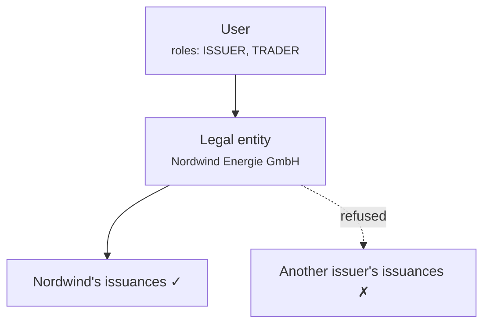

# Roles and permissions

Three separate mechanisms decide what somebody can do. Confusing them is the source of most access-related puzzlement, so take them in order.

1. **Roles** — what kind of user you are.
2. **Entity scoping** — whose data you may touch.
3. **Step-up and four eyes** — extra proof for sharp operations.

All three are enforced in the **backend**, on every request. Neither portal's navigation is a security boundary; hiding a menu item does not protect the endpoint behind it.

---

## The roles

| Role | Held by | Can |
|---|---|---|
| `REGISTRY_ADMIN` | Operator staff | Everything, across all customers. Includes [impersonation](impersonation.md). |
| `COMPLIANCE_OFFICER` | Operator staff | KYC/KYB workflow approvals and rejections. |
| `AUDIT` | Auditors, inspectors | Read across the registry. No writes. |
| `COMPANY_ADMIN` | Customer | Manage their own organisation's users, IdP settings, on-chain identity. |
| `ISSUER` | Customer | Create and administer their own issuances. |
| `INVESTOR` | Customer | Hold and view their own securities. |
| `TRADER` | Customer | Buy, sell, and use liquidity markets. |
| `DAPP_PUBLISHER` | Customer | Publish applications to the marketplace. |

A user holds one or more. In the customer portal, roles determine which [workspaces](../../customer/workspaces/index.md) appear.

!!! note "`COMPLIANCE_OFFICER` is a workflow role, not a legal determination"
    It permits somebody to record a KYC approval or rejection in the system. It does not make that person a compliance officer in any regulatory sense, and the platform does not assess whether they are qualified to hold the opinion they are recording.

---

## Where roles come from

!!! danger "Roles live in the `app_user` row. Not in the identity provider."
    This is the single most important fact on the page, and it is the opposite of what many deployments assume.

    Even when customers sign in through Microsoft Entra ID, **Entra does not determine what they may do here.** Entra answers *who is this person*. Registerwerk answers *what may they do*. Entra app roles are consulted only once, when a user is first provisioned, to pick a sensible default.

    Consequences worth internalising:

    - **Changing an Entra app role assignment does not change anybody's Registerwerk permissions.** An administrator who removes a role in Entra and expects access to change here will be wrong, and will believe they have revoked something they have not.
    - **To revoke access, change it here** — or disable the account in Entra so they cannot sign in at all.
    - There is exactly one place to look when auditing who can do what.

Some older documentation described roles as arriving in a JWT claim populated by the identity provider and read by a class called `JwtEntityClaimsConverter`. That class has been removed and that model was never how the system behaved. If you are working from a mental model built on it, replace it with the paragraph above.

---

## Entity scoping

Roles say *what kind* of thing you may do. Entity scoping says *whose*.

Every customer user belongs to a **legal entity**, and their token carries it. An `ISSUER` at Nordwind can administer Nordwind's issuances and nobody else's — not because the interface hides them, but because the backend refuses.

Cross-entity access requires `REGISTRY_ADMIN`. There is no customer-side role that reaches another customer's data.

Access is checked per resource, not merely per endpoint — asking for an asset you do not own gets a refusal, not a filtered empty list that leaves you guessing.

---

## Step-up and four eyes

Some operations demand more than a valid session.

**Step-up** requires fresh proof of identity at the moment of the action, not merely a session opened hours ago. Operators use local TOTP. Customers in Entra mode go through a Conditional Access authentication context.

**Four eyes** requires *two different people*. It applies to operations where a single mistaken or malicious act is worst:

- Reversing a settled trade
- Approving a corporate action for settlement
- Resetting a customer's MFA methods
- Issuing a temporary access pass
- Ecosystem permission grants and revocations
- Token admin grants and their revocation

!!! danger "Four eyes is only as real as your staffing"
    The system enforces that the approver is a different user id from the initiator. It cannot detect that both accounts are used by the same person.

    A deployment where one individual holds two administrator accounts, or where credentials are shared, has four-eyes controls in name and not in fact. This is an organisational control the software supports; it is not one the software provides.

[:octicons-arrow-right-24: Step-up MFA and four eyes](../../compliance/step-up-mfa.md)

---

## Granting roles

**Within a customer organisation:** their [company administrator](../../customer/workspaces/company-admin.md) grants roles to their own users. They cannot grant more than their organisation holds, and they cannot grant operator roles.

**Operator roles:** granted by an existing `REGISTRY_ADMIN`, in the operator portal.

!!! tip "Keep `REGISTRY_ADMIN` small"
    Every holder can approve issuances, correct the register, and impersonate any customer. It is the most consequential list in the deployment.

    Review it on a schedule. Ask, for each name, what would go wrong if that person's account were compromised — and whether anybody would notice.

---

## Deactivation

Deactivating a user is immediate and reversible, and it **deletes nothing**. Their past actions remain in the [audit log](../../platform/audit-log.md), attributed to them, permanently.

That is deliberate: removing access must never remove the record of what was done with it.

---

## Where next

- [Onboarding a customer](onboarding-flow.md)
- [Impersonation](impersonation.md)
- [Company administrator](../../customer/workspaces/company-admin.md) — the customer's side
