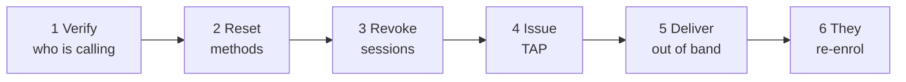

# Soporte de doble factor

Un cliente ha perdido el teléfono que alojaba su autenticador. No puede acceder. Le está llamando.

Esta página es el procedimiento, y las limitaciones que debe entender antes de empezar.

!!! info "Esto solo se aplica en modo Entra"
    Todo lo aquí descrito atañe a instalaciones con `ENTRA_ENABLED=true` en las que los clientes acceden mediante Microsoft Entra ID, con el acceso condicional imponiendo el segundo factor.

    En modo local no existe segundo factor de acceso para los clientes, y no hay nada que recuperar. La autenticación reforzada TOTP de los operadores es independiente y no se ve afectada.

    La consola de soporte exige `ENTRA_SUPPORT_ENABLED=true` y los permisos de Graph descritos en [Configuración de Entra](../../platform/entra-setup.md).

---

## Dos limitaciones que entender primero

### Usted no puede crearle un código QR

!!! danger "El secreto es de Microsoft, y no expone forma alguna de generar uno"
    Microsoft Graph no ofrece ninguna operación para crear un método autenticador o TOTP. Los extremos correspondientes solo permiten listar, leer y eliminar, y el campo de clave secreta está documentado como que devuelve siempre `null`.

    No es una función que falte en Registerwerk. **Ningún software puede hacerlo**, porque Entra nunca revela el secreto.

    La inscripción ocurre, por tanto, en la página de información de seguridad de Microsoft. Su trabajo es dejar al cliente en condiciones de inscribirse, no inscribirlo usted.

    Cuando la página `/security` del cliente muestra un código QR, este codifica un **enlace a la página de registro de Microsoft** — para que quien esté ante un ordenador pueda continuar en el teléfono que alojará la credencial. El QR de inscripción real es el de Microsoft, en la página de Microsoft.

### Eliminar un método no termina sus sesiones

!!! warning "Las sesiones sobreviven a los cambios de credenciales"
    Retirar un método de autenticación — o restablecer una contraseña — **no** invalida las sesiones existentes.

    Quien tenga una sesión viva en el dispositivo perdido la conserva hasta que caduque. Si el teléfono está perdido y no roto, eso importa.

    **Revoque siempre las sesiones de acceso como parte de la recuperación.** Es un paso aparte y explícito; saltárselo deja en pie exactamente la exposición por la que le llamaron.

---

## El procedimiento

*Users → el usuario del cliente → Manage 2FA.*

### 1. Verifique con quién habla

Todo lo que sigue entrega a alguien el control completo de una cuenta. Su procedimiento de verificación de identidad es aquí el verdadero control de seguridad; el software no puede ayudarle.

!!! danger "Este es el paso al que apuntan los atacantes"
    Un interlocutor convincente que dice haber perdido el teléfono es la vía clásica hacia la toma de control de una cuenta, y no exige romper nada técnico.

    Sea cual sea su procedimiento — devolución de llamada a un número registrado, confirmación de un contacto conocido, comprobación presencial — sígalo al pie de la letra y no deje que la urgencia lo acorte. La urgencia forma parte del ataque.

### 2. Restablezca los métodos de autenticación

Retira los métodos registrados para que el cliente pueda inscribir otros nuevos.

**Exige autenticación reforzada y [doble control](../../compliance/step-up-mfa.md).**

La consola elimina el método predeterminado del cliente **en último lugar** e informa de los fallos método a método en lugar de abortar a medio camino. Si uno no puede retirarse, usted ve cuál, en vez de quedarse adivinando ante un restablecimiento a medias.

### 3. Revoque las sesiones de acceso

Explícito, aparte y no opcional. Véase arriba.

### 4. Emita un Temporary Access Pass

Un TAP es una credencial de vida corta que permite al cliente acceder **sin** segundo factor, una vez, para registrar uno nuevo.

**Exige autenticación reforzada y doble control.**

!!! danger "Un TAP autentica plenamente como el cliente"
    Quien lo tenga puede acceder en su lugar. Es un instrumento de toma de control de cuentas, y por eso lleva el mismo doble control que una operación sobre claves de monedero.

    Registerwerk muestra el valor **exactamente una vez**, y está construido para que después no pueda recuperarse: no se escribe en ninguna tabla, no se registra ni siquiera en nivel de depuración, se excluye de la carga de auditoría (que solo anota el identificador del pase, su duración y la marca de un solo uso), se devuelve con `Cache-Control: no-store`, y se guarda en un campo de componente que se vacía al cerrar el diálogo — deliberadamente nunca en un aviso emergente, porque esos persisten en la página.

    Si lo pierde antes de entregarlo, emita otro. No puede consultarlo.

**No puede emitirse un TAP a un invitado externo.** La consola lo detecta y desactiva el botón con una explicación, en lugar de dejar que Graph falle de forma desconcertante. Para cuentas de invitado, restablezca los métodos y haga que se registren de nuevo por el flujo de invitación habitual.

### 5. Entréguelo por otro canal

No por el canal con el que le contactaron, si ese canal pudiera estar comprometido. Una llamada a un número registrado, si le escribieron por correo.

### 6. El cliente se inscribe de nuevo

Accede con el TAP y registra un método nuevo en la página de información de seguridad de Microsoft. Su página `/security` le guía y consulta hasta ver el nuevo registro.

---

## Clientes federados

Si la organización del cliente está **federada** — sus usuarios viven en su propio inquilino de Entra —, usted no puede gestionar en absoluto sus métodos de autenticación. No son usuarios de su directorio.

La consola muestra el identificador de su inquilino y **rechaza toda acción modificadora con un `409`** en lugar de hacer una llamada a Graph que fallaría de forma confusa.

Remítalos a su propio departamento de informática. Esa es la respuesta correcta, no una limitación que sortear.

---

## Qué ve el cliente

Su página `/security` muestra uno de cuatro estados:

| Estado | Significado |
|---|---|
| **Not applicable** | Modo local. Aquí no se usa el doble factor. |
| **Managed by your organisation** | Federado. Se ocupa su propia informática. |
| **Not registered** | Pasos numerados, un QR que enlaza a la página de Microsoft y un botón «volver a comprobar». |
| **Registered** | Sus métodos y cuándo se comprobó por última vez. |

El estado es una **caché orientativa**, actualizada bajo demanda y limitada para que las consultas repetidas no se conviertan en una denegación de servicio contra Graph. Nunca es una entrada de autorización — el acceso condicional es el punto de aplicación, y una caché caducada no debe poder conceder ni denegar el acceso.

---

## Por qué Registerwerk no impone el doble factor

Pregunta razonable, y la respuesta es operativa.

El acceso condicional bloquea a los usuarios no inscritos **al iniciar sesión** — nunca llegan a la aplicación. Añadir una segunda puerta dentro de la aplicación significaría que una caída de Microsoft Graph se convierte en una caída total del portal para todos los clientes, incluidos los que se inscribieron correctamente hace años.

Existe una marca opcional para exigir la inscripción dentro de la aplicación. Viene desactivada por defecto y, ante un error de estado, **permite el acceso (fail open)**, precisamente por ese motivo.

---

## Adónde ir ahora

- [Configuración de Entra ID](../../platform/entra-setup.md) — el manual de configuración
- [MFA reforzada y doble control](../../compliance/step-up-mfa.md)
- [Modo soporte](impersonation.md) — la otra herramienta principal de asistencia
