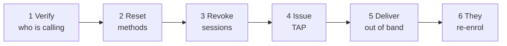

# Assistance deux facteurs

Un client a perdu le téléphone qui hébergeait son authentificateur. Il ne peut plus se connecter. Il vous appelle.

Cette page est la procédure, et les contraintes qu'il faut comprendre avant de commencer.

!!! info "Ceci ne vaut qu'en mode Entra"
    Tout ce qui suit concerne les installations où `ENTRA_ENABLED=true` et où les clients se connectent via Microsoft Entra ID, l'accès conditionnel imposant le second facteur.

    En mode local, il n'existe aucun second facteur de connexion pour les clients, et il n'y a rien à récupérer. L'authentification renforcée TOTP des opérateurs est distincte et n'est pas affectée.

    La console d'assistance exige `ENTRA_SUPPORT_ENABLED=true` et les permissions Graph décrites dans [Configuration Entra](../../platform/entra-setup.md).

---

## Deux contraintes à comprendre d'abord

### Vous ne pouvez pas créer de QR code pour lui

!!! danger "Microsoft détient le secret et n'expose aucun moyen d'en créer un"
    Microsoft Graph ne fournit aucune opération permettant de créer une méthode d'authentification ou TOTP. Les points d'accès concernés ne permettent que lister, lire et supprimer, et le champ de clé secrète est documenté comme renvoyant toujours `null`.

    Ce n'est pas une fonctionnalité manquante de Registerwerk. **Aucun logiciel ne peut le faire**, car Entra ne divulgue jamais le secret.

    L'enrôlement a donc lieu sur la page d'informations de sécurité de Microsoft. Votre travail consiste à mettre le client dans un état où il peut s'enrôler, pas à l'enrôler.

    Lorsque la page `/security` du client affiche un QR code, celui-ci encode un **lien vers la page d'inscription de Microsoft** — pour qu'une personne devant un ordinateur puisse poursuivre sur le téléphone qui hébergera l'identifiant. Le vrai QR d'enrôlement est celui de Microsoft, sur la page de Microsoft.

### Supprimer une méthode ne met pas fin à ses sessions

!!! warning "Les sessions survivent aux changements d'identifiants"
    Retirer une méthode d'authentification — ou réinitialiser un mot de passe — n'invalide **pas** les sessions existantes.

    Quiconque détient une session active sur l'appareil perdu la conserve jusqu'à son expiration. Si le téléphone est perdu plutôt que cassé, cela compte.

    **Révoquez toujours les sessions de connexion dans le cadre de la récupération.** C'est une étape distincte et explicite ; la sauter laisse subsister exactement l'exposition pour laquelle on vous a appelé.

---

## La procédure

*Users → l'utilisateur du client → Manage 2FA.*

### 1. Vérifiez à qui vous parlez

Tout ce qui suit remet à quelqu'un le contrôle complet d'un compte. Votre procédure de vérification d'identité est ici le véritable contrôle de sécurité ; le logiciel ne peut pas vous aider.

!!! danger "C'est l'étape que visent les attaquants"
    Un appelant convaincant prétendant avoir perdu son téléphone est la voie classique vers la prise de contrôle d'un compte, et elle ne demande de casser aucune barrière technique.

    Quelle que soit votre procédure — rappel sur un numéro connu, confirmation par un contact identifié, contrôle en personne — suivez-la à la lettre et ne laissez pas l'urgence l'abréger. L'urgence fait partie de l'attaque.

### 2. Réinitialisez les méthodes d'authentification

Cela retire les méthodes enregistrées afin que le client puisse en enrôler de nouvelles.

**Exige une authentification renforcée et une [double validation](../../compliance/step-up-mfa.md).**

La console supprime la méthode par défaut du client **en dernier** et signale les échecs méthode par méthode plutôt que d'abandonner en cours de route. Si l'une ne peut pas être retirée, vous voyez laquelle, au lieu de rester à deviner devant une réinitialisation à moitié faite.

### 3. Révoquez les sessions de connexion

Explicite, distincte et non facultative. Voir ci-dessus.

### 4. Délivrez un Temporary Access Pass

Un TAP est un identifiant éphémère qui permet au client de se connecter **sans** second facteur, une fois, afin d'en enregistrer un nouveau.

**Exige une authentification renforcée et une double validation.**

!!! danger "Un TAP authentifie pleinement en tant que client"
    Quiconque le détient peut se connecter à sa place. C'est un outil de prise de contrôle de compte, d'où le même contrôle en double validation qu'une opération sur des clés de portefeuille.

    Registerwerk n'affiche la valeur **qu'une seule fois**, et il est conçu pour qu'elle ne puisse pas être retrouvée ensuite : elle n'est écrite dans aucune table, jamais journalisée même au niveau debug, exclue de la charge utile d'audit (qui n'enregistre que l'identifiant du laissez-passer, sa durée et l'indicateur d'usage unique), renvoyée avec `Cache-Control: no-store`, et conservée dans un champ de composant vidé à la fermeture de la boîte de dialogue — délibérément jamais dans une notification, car celles-ci persistent dans la page.

    Si vous la perdez avant de la transmettre, délivrez-en une autre. Vous ne pouvez pas la consulter.

**Un TAP ne peut pas être délivré à un invité externe.** La console le détecte et désactive le bouton avec une explication plutôt que de laisser Graph échouer de façon déroutante. Pour les comptes invités, réinitialisez les méthodes et faites-les se réenregistrer par le parcours d'invitation habituel.

### 5. Transmettez-le par un autre canal

Pas par le canal qu'il a utilisé pour vous joindre, si ce canal peut être compromis. Un appel sur un numéro connu, s'il vous a écrit par e-mail.

### 6. Il se réenrôle

Il se connecte avec le TAP et enregistre une nouvelle méthode sur la page d'informations de sécurité de Microsoft. Sa page `/security` l'accompagne et interroge le service jusqu'à voir le nouvel enregistrement.

---

## Clients fédérés

Si l'organisation du client est **fédérée** — ses utilisateurs vivent dans son propre locataire Entra — vous ne pouvez pas gérer du tout ses méthodes d'authentification. Ce ne sont pas les utilisateurs de votre annuaire.

La console affiche l'identifiant de leur locataire et **refuse toute action modifiante par un `409`** plutôt que d'émettre un appel Graph qui échouerait de manière déroutante.

Renvoyez-les vers leur propre service informatique. C'est la bonne réponse, non une limitation à contourner.

---

## Ce que voit le client

Sa page `/security` affiche l'un de quatre états :

| État | Signification |
|---|---|
| **Not applicable** | Mode local. Le second facteur n'est pas utilisé ici. |
| **Managed by your organisation** | Fédéré. Son propre service informatique s'en occupe. |
| **Not registered** | Étapes numérotées, un QR renvoyant à la page de Microsoft, et un bouton « vérifier à nouveau ». |
| **Registered** | Ses méthodes et la date de la dernière vérification. |

Le statut est un **cache indicatif**, actualisé à la demande et bridé afin que les interrogations répétées ne deviennent pas un déni de service contre Graph. Il n'est jamais une entrée d'autorisation — l'accès conditionnel est le point d'application, et un cache périmé ne doit pouvoir ni accorder ni refuser l'accès.

---

## Pourquoi Registerwerk n'impose pas lui-même le second facteur

Question légitime, et la réponse est opérationnelle.

L'accès conditionnel bloque les utilisateurs non enrôlés **à la connexion** — ils n'atteignent jamais l'application. Ajouter une seconde porte à l'intérieur de l'application signifierait qu'une panne de Microsoft Graph devient une panne totale du portail pour tous les clients, y compris ceux qui se sont correctement enrôlés il y a des années.

Il existe un indicateur optionnel pour exiger l'enrôlement dans l'application. Il est désactivé par défaut et **autorise par défaut (fail open)** en cas d'erreur de statut, précisément pour cette raison.

---

## Où suivant

- [Configuration Entra ID](../../platform/entra-setup.md) — la procédure de configuration
- [MFA renforcée et double validation](../../compliance/step-up-mfa.md)
- [Mode support](impersonation.md) — l'autre grand outil d'assistance
