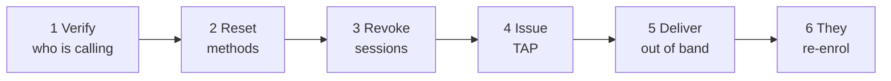

# Assistenza due fattori

Un cliente ha perso il telefono che ospitava il suo authenticator. Non riesce ad accedere. Ti sta chiamando.

Questa pagina è la procedura, e i vincoli che devi capire prima di iniziare.

!!! info "Vale solo in modalità Entra"
    Tutto ciò che segue riguarda le installazioni in cui `ENTRA_ENABLED=true` e i clienti accedono tramite Microsoft Entra ID, con l'accesso condizionale che impone il secondo fattore.

    In modalità locale non esiste alcun secondo fattore di accesso per i clienti, e non c'è nulla da recuperare. L'autenticazione rafforzata TOTP degli operatori è separata e non è toccata.

    La console di assistenza richiede `ENTRA_SUPPORT_ENABLED=true` e i permessi Graph descritti in [Configurazione Entra](../../platform/entra-setup.md).

---

## Due vincoli da capire per primi

### Non puoi creare un QR code per lui

!!! danger "Il segreto è di Microsoft, che non espone alcun modo per generarne uno"
    Microsoft Graph non fornisce alcuna operazione per creare un metodo authenticator o TOTP. Gli endpoint interessati supportano solo elenco, lettura ed eliminazione, e il campo della chiave segreta è documentato come restituente sempre `null`.

    Non è una funzione mancante in Registerwerk. **Nessun software può farlo**, perché Entra non divulga mai il segreto.

    La registrazione avviene quindi sulla pagina delle informazioni di sicurezza di Microsoft. Il tuo compito è portare il cliente in uno stato in cui possa registrarsi, non registrarlo tu.

    Quando la pagina `/security` del cliente mostra un QR code, questo codifica un **collegamento alla pagina di registrazione di Microsoft** — così chi è al computer può proseguire sul telefono che ospiterà la credenziale. Il vero QR di registrazione è di Microsoft, sulla pagina di Microsoft.

### Eliminare un metodo non chiude le sue sessioni

!!! warning "Le sessioni sopravvivono ai cambi di credenziali"
    Rimuovere un metodo di autenticazione — o reimpostare una password — **non** invalida le sessioni esistenti.

    Chi detiene una sessione attiva sul dispositivo perso la conserva fino alla scadenza. Se il telefono è perso anziché rotto, questo conta.

    **Revoca sempre le sessioni di accesso come parte del recupero.** È un passaggio distinto ed esplicito; saltarlo lascia in piedi esattamente l'esposizione per cui ti hanno chiamato.

---

## La procedura

*Users → l'utente del cliente → Manage 2FA.*

### 1. Verifica con chi stai parlando

Tutto ciò che segue consegna a qualcuno il controllo completo di un account. La tua procedura di verifica dell'identità è qui il vero controllo di sicurezza; il software non può aiutarti.

!!! danger "È questo il passaggio che gli attaccanti prendono di mira"
    Un chiamante convincente che dichiara di aver perso il telefono è la via classica alla presa di controllo di un account, e non richiede di rompere nulla sul piano tecnico.

    Qualunque sia la tua procedura — richiamata a un numero registrato, conferma da un contatto noto, verifica di persona — seguila alla lettera e non lasciare che l'urgenza la accorci. L'urgenza fa parte dell'attacco.

### 2. Reimposta i metodi di autenticazione

Rimuove i metodi registrati così che il cliente possa registrarne di nuovi.

**Richiede autenticazione rafforzata e il [principio dei quattro occhi](../../compliance/step-up-mfa.md).**

La console elimina il metodo predefinito del cliente **per ultimo** e segnala i fallimenti metodo per metodo anziché interrompersi a metà. Se un metodo non può essere rimosso vedi quale, invece di restare a indovinare davanti a un reset a metà.

### 3. Revoca le sessioni di accesso

Esplicito, distinto e non facoltativo. Vedi sopra.

### 4. Emetti un Temporary Access Pass

Un TAP è una credenziale di breve durata che consente al cliente di accedere **senza** secondo fattore, una volta, per registrarne uno nuovo.

**Richiede autenticazione rafforzata e quattro occhi.**

!!! danger "Un TAP autentica pienamente come il cliente"
    Chiunque lo possieda può accedere al suo posto. È uno strumento di presa di controllo dell'account, ed è per questo che porta lo stesso controllo a quattro occhi di un'operazione sulle chiavi di un wallet.

    Registerwerk mostra il valore **esattamente una volta**, ed è progettato perché non sia recuperabile in seguito: non viene scritto in nessuna tabella, non è mai registrato nemmeno a livello debug, è escluso dal payload di audit (che riporta solo l'id del pass, la durata e il flag di monouso), è restituito con `Cache-Control: no-store` ed è tenuto in un campo di componente svuotato alla chiusura della finestra — deliberatamente mai in una notifica a comparsa, perché quelle restano nella pagina.

    Se lo perdi prima di consegnarlo, emettine un altro. Non puoi consultarlo.

**Un TAP non può essere emesso a un ospite esterno.** La console lo rileva e disabilita il pulsante con una spiegazione anziché lasciare che Graph fallisca in modo confuso. Per gli account ospite, reimposta i metodi e falli registrare di nuovo con il normale percorso di invito.

### 5. Consegnalo su un altro canale

Non sul canale con cui ti ha contattato, se quel canale potrebbe essere compromesso. Una telefonata a un numero registrato, se ti ha raggiunto via email.

### 6. Il cliente si registra di nuovo

Accede con il TAP e registra un nuovo metodo sulla pagina delle informazioni di sicurezza di Microsoft. La sua pagina `/security` lo accompagna e interroga il servizio finché non vede la nuova registrazione.

---

## Clienti federati

Se l'organizzazione del cliente è **federata** — i suoi utenti vivono nel proprio tenant Entra — non puoi gestire affatto i suoi metodi di autenticazione. Non sono utenti della tua directory.

La console mostra l'id del loro tenant e **rifiuta ogni azione che modifica con un `409`** anziché effettuare una chiamata a Graph che fallirebbe in modo confuso.

Indirizzali al loro reparto informatico. È la risposta corretta, non una limitazione da aggirare.

---

## Che cosa vede il cliente

La sua pagina `/security` mostra uno di quattro stati:

| Stato | Significato |
|---|---|
| **Not applicable** | Modalità locale. Il secondo fattore qui non è in uso. |
| **Managed by your organisation** | Federato. Se ne occupa il loro reparto informatico. |
| **Not registered** | Passaggi numerati, un QR che rimanda alla pagina di Microsoft e un pulsante «ricontrolla». |
| **Registered** | I suoi metodi e quando è stato verificato l'ultima volta. |

Lo stato è una **cache indicativa**, aggiornata su richiesta e limitata perché le interrogazioni ripetute non diventino un attacco di negazione del servizio verso Graph. Non è mai un dato di autorizzazione — l'accesso condizionale è il punto di applicazione, e una cache vecchia non deve poter concedere né negare l'accesso.

---

## Perché non è Registerwerk a imporre il secondo fattore

Domanda ragionevole, e la risposta è operativa.

L'accesso condizionale blocca gli utenti non registrati **all'accesso** — non arrivano mai all'applicazione. Aggiungere un secondo punto di controllo dentro l'applicazione significherebbe che un'interruzione di Microsoft Graph diventa un'interruzione totale del portale per ogni cliente, compresi quelli che si sono registrati correttamente anni fa.

Esiste un flag opzionale per esigere la registrazione dentro l'applicazione. È disattivato per impostazione predefinita e in caso di errore di stato **si apre**, proprio per questo motivo.

---

## Dove andare adesso

- [Configurazione Entra ID](../../platform/entra-setup.md) — la procedura di configurazione
- [MFA rafforzata e quattro occhi](../../compliance/step-up-mfa.md)
- [Modalità supporto](impersonation.md) — l'altro strumento principale di assistenza
