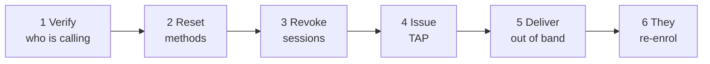

# Two-factor support

A customer has lost the phone holding their authenticator. They cannot sign in. They are calling you.

This page is the runbook, and the constraints you need to understand before you start.

!!! info "This applies only in Entra mode"
    Everything here concerns deployments where `ENTRA_ENABLED=true` and customers sign in through Microsoft Entra ID with Conditional Access enforcing two-factor.

    In local mode there is no sign-in second factor for customers at all, and there is nothing to recover. Operator TOTP step-up is separate and unaffected.

    The support console requires `ENTRA_SUPPORT_ENABLED=true` and the Graph permissions in [Entra setup](../../platform/entra-setup.md).

---

## Two constraints to understand first

### You cannot create a QR code for them

!!! danger "Microsoft owns the secret, and does not expose a way to mint one"
    Microsoft Graph provides no operation to create an authenticator or TOTP method. The relevant endpoints support list, get and delete only, and the secret key field is documented as always returning `null`.

    This is not a missing feature in Registerwerk. **No software can do it**, because Entra never discloses the secret.

    Enrolment therefore happens on Microsoft's own combined security-info page. Your job is to get the customer into a state where they can enrol, not to enrol them.

    When the customer's `/security` page shows a QR code, it encodes a **link to Microsoft's registration page** — so somebody at a desktop can continue on the phone that will hold the credential. The actual enrolment QR is Microsoft's, on Microsoft's page.

### Deleting a method does not end their sessions

!!! warning "Sessions survive credential changes"
    Removing an authentication method — or resetting a password — does **not** invalidate existing sessions.

    Somebody holding a live session on the lost device keeps it until it expires. If the phone is lost rather than broken, that matters.

    **Always revoke sign-in sessions as part of recovery.** It is a separate, explicit step, and skipping it leaves the exposure you were called about.

---

## The runbook

*Users → the customer's user → Manage 2FA.*

### 1. Verify who you are talking to

Everything below hands somebody complete control of an account. Your identity-verification procedure is the actual security control here; the software cannot help you.

!!! danger "This is the step attackers target"
    A convincing caller claiming a lost phone is the classic account-takeover route, and it does not require breaking anything technical.

    Whatever your procedure is — callback on a number of record, a known contact confirming, an in-person check — follow it exactly, and do not let urgency shorten it. Urgency is part of the attack.

### 2. Reset authentication methods

Removes the registered methods so the customer can enrol fresh ones.

**Requires step-up and [four eyes](../../compliance/step-up-mfa.md).**

The console deletes the customer's default method **last** and reports per-method failures rather than aborting partway. If one method cannot be removed you see which, instead of being left guessing at a half-completed reset.

### 3. Revoke sign-in sessions

Explicit, separate, and not optional. See above.

### 4. Issue a Temporary Access Pass

A TAP is a short-lived credential that lets the customer sign in **without** a second factor, once, so they can register a new one.

**Requires step-up and four eyes.**

!!! danger "A TAP fully authenticates as the customer"
    Anybody holding it can sign in as them. It is an account-takeover primitive, which is why it carries the same four-eyes control as a wallet key operation.

    Registerwerk shows the value **exactly once**, and it is engineered so it cannot be recovered afterwards: it is never written to any table, never logged even at debug level, excluded from the audit payload (which records only the pass id, lifetime, and single-use flag), returned with `Cache-Control: no-store`, and held in a component field cleared when the dialog closes — deliberately never in a notification toast, because those persist in the page.

    If you lose it before delivering it, issue another. You cannot look it up.

**A TAP cannot be issued to an external guest.** The console detects this and disables the button with an explanation rather than letting Graph fail confusingly. For guest accounts, reset methods and have them re-register through the normal invitation flow.

### 5. Deliver it out of band

Not by the channel they contacted you on, if that channel might be compromised. A phone call to a number of record, if they reached you by email.

### 6. They re-enrol

They sign in with the TAP and register a new method on Microsoft's security-info page. Their `/security` page walks them through it and polls until it sees the new registration.

---

## Federated customers

If the customer's organisation is **federated** — their users live in their own Entra tenant — you cannot manage their authentication methods at all. They are not your directory's users.

The console shows their tenant id and **refuses every mutating action with a `409`** rather than making a Graph call that would fail in a confusing way.

Route them to their own IT department. That is the correct answer, not a limitation to work around.

---

## What the customer sees

Their `/security` page shows one of four states:

| State | Meaning |
|---|---|
| **Not applicable** | Local mode. Two-factor is not in use here. |
| **Managed by your organisation** | Federated. Their own IT handles it. |
| **Not registered** | Numbered steps, a QR linking to Microsoft's page, and a "check again" button. |
| **Registered** | Their methods and when this was last checked. |

The status is an **advisory cache**, refreshed on demand and throttled so that polling cannot become a denial-of-service against Graph. It is never an authorisation input — Conditional Access is the enforcement point, and a stale cache must not be able to grant or deny access.

---

## Why two-factor is not enforced by Registerwerk

A reasonable question, and the answer is operational.

Conditional Access blocks unenrolled users **at sign-in** — they never reach the application. Adding a second gate inside the application would mean that a Microsoft Graph outage becomes a total portal outage for every customer, including those who enrolled correctly years ago.

There is an opt-in flag to require enrolment in-app. It defaults to off and **fails open** on a status error, for exactly that reason.

---

## Where next

- [Entra ID setup](../../platform/entra-setup.md) — the configuration runbook
- [Step-up MFA and four eyes](../../compliance/step-up-mfa.md)
- [Impersonation](impersonation.md) — the other main support tool
