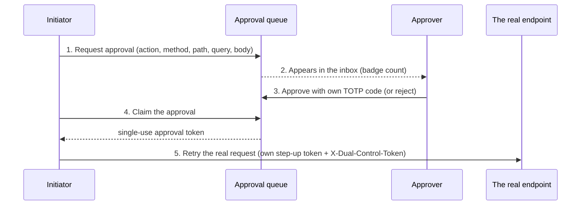

# Approval queue (four eyes)

Some operations need two people: the initiator, who has the right to do the thing, and a second, different operator who has looked at exactly what is about to happen and agrees. Which operations those are is generated from the code in the [step-up matrix](../../compliance/step-up-matrix.md). The approval queue is the in-application way to get that second approval, in the operator portal and for issuer actions in the customer portal.

!!! note "What this is, and is not"
    It is a technical control that makes a second operator's decision part of the audit trail. Whether two people are an adequate control for a given action, and who may be a second approver, is a policy decision for your organisation.

## Who can approve

An approver must be a **different** user from the initiator, still **enabled**, and hold `REGISTRY_ADMIN` or `COMPLIANCE_OFFICER`. There is no separate approver role. The approver must have TOTP enrolled, because approving asks for a fresh six-digit code. In Entra mode the approver's session must also satisfy the step-up authentication context; an HS256 operator session then receives the normal claims challenge.

Self-approval is impossible: the database refuses a row whose approver equals its requester.

## The flow

1. **Request.** In any operator dialog that needs a second approver, choose *Request approval*. The dialog files the exact request that is about to be sent and shows a waiting state with a countdown and a *Cancel request* button. In the customer portal the issuer token-administration panel (mint, burn, forced transfer, forced approve) and the confidential-mint form do the same with an approval-request box; the approver is operator staff, not a customer user.
2. **Inbox.** The approver opens **Approvals** in the operator portal (a badge on the menu item counts pending requests; it refreshes every 30 seconds while the page is visible). The *Inbox* tab shows the action, `METHOD /path?query`, the request body in canonical form, who asked and how long is left. Read the body: it is exactly what will run. Nothing notifies approvers by e-mail; they have to look at the inbox.
3. **Approve or reject.** *Approve* asks for the approver's own six-digit TOTP code inline. *Reject* takes an optional note. A rejected, cancelled or expired request is dead; the initiator files a new one.
4. **Claim.** After approval, the initiator confirms in the dialog. This asks for the initiator's own step-up code first, then *claims* the approval, which returns a single-use approval token. The *My requests* tab offers the same claim manually and shows the token with a copy button.
5. **Retry.** The original request is sent with the initiator's **own** step-up token as the Bearer and the approval token in the `X-Dual-Control-Token` header, before the token window closes. The server checks that the request is byte-for-byte what was approved.

If the browser is closed before the claim, open **Approvals → My requests** and claim from there; the dialog does not re-attach to an open request after a reload.

## What the approval is bound to

The token is minted for exactly one request: the action reason, the HTTP method, path and query, and the canonical JSON body. Change a field after approval, send it to another path, or send it twice, and the endpoint answers `403`. The token also names the initiator, so it is useless to anyone else, and it is refused as a Bearer credential everywhere.

The body is bound for every reason except five where the body is a secret or not JSON (`TERM_SHEET_AMENDMENT`, `WALLET_IMPORT_KEYSTORE`, `CASP_REGISTER_IMPORT`, `WALLET_IMPORT_RAW`, `WALLET_KEYSTORE_EXPORT`); method, path and query remain bound for those and a body is refused when filing. Requests with repeated JSON keys, repeated query parameters, or numbers that cannot be represented exactly are refused when filed, so the approver never reviews an ambiguous request.

## Limits

| Limit | Value | Setting |
|---|---|---|
| Time an open request lives (expires whether pending or approved) | 15 minutes | `registerwerk.auth.step-up.approval-queue.ttl` |
| Open requests per initiator | 20 | `registerwerk.auth.step-up.approval-queue.max-open-per-requester` |
| Maximum request body | 64 KiB | `registerwerk.auth.step-up.approval-queue.max-body-bytes` |
| Expiry sweep | every minute | `registerwerk.auth.step-up.approval-queue.sweep-interval` |
| Time to use a claimed token at the real endpoint | 300 seconds | `registerwerk.auth.step-up.dual-control.window-seconds` |

Other things worth knowing:

- Approval does not extend the 15 minutes: the initiator must claim within the original lifetime.
- A TOTP code is valid once per 30-second step, so one approver can approve only one request per step.
- If the approver is disabled or loses the role between approval and claim, the claim is refused.
- Impersonation sessions cannot use the queue (`403`).
- Only requests for routes that really need a second approver are accepted, and only with that route's own reason; anything else is `400`.

## API

All paths are under `/api/v1/approvals` and need a JWT. The portals send no `Idempotency-Key` on these calls, and a claim is never replayed from a cache.

| Call | Who | Result |
|---|---|---|
| `POST /` with `{action, method, path, query?, body?}` | any signed-in user | `201` with the request; `400` not a four-eyes route, body not bindable or too large; `409` too many open requests |
| `GET /pending?page&size`, `GET /pending/count` | approvers | pending requests of others, oldest first; `{count}` |
| `GET /mine?page&size`, `GET /{id}` | requester (and approvers for `{id}`) | own requests, newest first |
| `POST /{id}/approve` with `{code, note?}` | approver | `403` own request, ineligible or wrong code; `409` not pending, expired or lost a race |
| `POST /{id}/reject` with optional `{note}` | approver | the request, now rejected |
| `POST /{id}/cancel` | requester | cancels a pending or approved request; `409` otherwise |
| `POST /{id}/claim` | requester | `{approvalToken, expiresAt, target, headerName: "X-Dual-Control-Token"}`; `409` not approved, expired or already claimed |

Statuses: `PENDING`, `APPROVED`, `REJECTED`, `EXPIRED`, `CANCELLED`, `CLAIMED`. Every transition is audited (`APPROVAL_REQUEST_CREATED`, `_APPROVED`, `_REJECTED`, `_CANCELLED`, `_CLAIMED`, `_EXPIRED`); the body is never in the audit payload, its digest is.

## The manual route still works

A request can also be approved without the queue: the approver mints a token with `POST /api/v1/auth/step-up` from the copied `{action, target, targetBody}` block (operator portal: *Approvals → Manual fallback*), and the initiator pastes it. Use it only when the queue is unavailable; the token has the same bindings.

## Troubleshooting

| Symptom | Cause |
|---|---|
| Real endpoint answers `403` after approval | The request differs from the approved one (body, path or query), the token was already used, the window of 300 seconds passed, or the token belongs to another initiator |
| Approve answers `403` | Your own request, an account that is not `REGISTRY_ADMIN`/`COMPLIANCE_OFFICER` or not enabled, or a wrong or reused TOTP code |
| Approve answers `409` | Already decided, expired, or another approver was faster |
| Claim answers `409` | Not approved yet, expired, or already claimed |
| Nobody sees the request | No second eligible approver exists; until two enabled, TOTP-enrolled administrators exist the bootstrap rule lets one step-up suffice (see the [step-up matrix](../../compliance/step-up-mfa.md)) |
