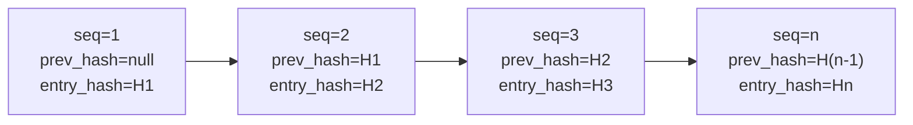

# Audit-Log { #audit-log }

Geprüfte Anwendungspfade geben ein `AuditEvent` aus; die Abdeckung ist noch nicht für jede
Zustandsmutation nachgewiesen. Die Tabelle `audit_event` ist append-only, Hash-verkettet und
PostgreSQL-seitig monatlich partitioniert. Das sind ausschließlich technische Kontrollen:
Vollständigkeit, Aufbewahrung, Betriebsüberwachung und rechtliche Angemessenheit nach eWpG, GwG,
DORA oder DSGVO erfordern gesonderte Nachweise und eine externe Prüfung.

---

## Schema { #schema }

```sql
CREATE TABLE audit_event (
    id              UUID         PRIMARY KEY DEFAULT gen_random_uuid(),
    sequence_no     BIGINT       GENERATED ALWAYS AS IDENTITY,
    event_type      TEXT         NOT NULL,
    actor_id        UUID,                        -- NULL for system-initiated events
    entity_id       UUID,                        -- The primary entity affected
    asset_id        UUID,                        -- If asset-related
    jurisdiction    TEXT,                        -- Jurisdiction context
    payload         JSONB        NOT NULL,       -- Full event details
    prev_hash       BYTEA,                       -- SHA-256 of previous entry
    entry_hash      BYTEA        NOT NULL,       -- SHA-256(prev_hash ‖ payload ‖ sequence_no)
    signature       BYTEA,                       -- Ed25519 over entry_hash (optional)
    occurred_at     TIMESTAMPTZ  NOT NULL DEFAULT now(),
    trace_id        TEXT                         -- OpenTelemetry trace ID
) PARTITION BY RANGE (occurred_at);
```

---

## Hash-Kette { #hash-chain }

Jedes `AuditEvent` trägt:

- `prev_hash` — der `entry_hash` der unmittelbar vorangehenden Zeile (nach `sequence_no`)
- `entry_hash` — `SHA-256(prev_hash ‖ canonical_json(payload) ‖ sequence_no)`

Das erste Ereignis in der Kette hat `prev_hash = null`; sein `entry_hash` ist
`SHA-256(null ‖ payload ‖ 1)`.



**Manipulationserkennung:** Wird eine Zeile verändert, stimmt ihr `entry_hash` nicht mehr mit
`SHA-256(prev_hash ‖ payload ‖ sequence_no)` überein. Auch der `prev_hash` jeder nachfolgenden Zeile
ist dann falsch. `AuditChainVerificationService.verify()` erkennt das und gibt die Sequenznummer des
ersten gebrochenen Kettenglieds zurück.

---

## Append-only-Durchsetzung { #append-only-enforcement }

Ein PostgreSQL-Trigger auf `audit_event` löst bei jedem `UPDATE` oder `DELETE` eine Exception aus:

```sql
CREATE TRIGGER audit_event_no_update_delete
BEFORE UPDATE OR DELETE ON audit_event
FOR EACH ROW EXECUTE FUNCTION raise_immutable_exception();
```

Selbst der Datenbank-Superuser kann Datensätze nicht ändern, ohne diesen Trigger zuvor zu
deaktivieren – was seinerseits eine Break-Glass-Prozedur erfordert und einen `pg_audit`-Log-Eintrag
erzeugt.

---

## Täglicher Anker { #daily-anchor }

Alle 24 Stunden hängt `AuditChainVerificationService` ein **Anker-Ereignis** an:

- `event_type = AUDIT_ANCHOR`
- `payload` enthält den `entry_hash` des letzten Ereignisses des Tages sowie einen UTC-Zeitstempel
- Optional wird der Anker-Hash als Calldata-Transaktion auf das Ethereum-Mainnet geschrieben, wodurch
  ein öffentlicher, unveränderlicher Querverweis entsteht

Der Anker erlaubt es externen Prüfern zu verifizieren, dass die Audit-Kette an einem bestimmten Datum
mit einem bekannten Hash übereinstimmte, ohne die gesamte Kette ab Genesis erneut durchlaufen zu
müssen.

---

## Ereignistypen { #event-types }

| Ereignistyp | Auslöser |
|---|---|
| `ASSET_CREATED` / `ASSET_DEPLOYED` / `ASSET_STATUS_CHANGED` | Asset-Lebenszyklus |
| `KYC_SUBMITTED` / `KYC_APPROVED` / `KYC_REJECTED` / `KYC_EXPIRED` | KYC-Workflow |
| `HOLDER_BLOCK_CREATED` / `HOLDER_BLOCK_LIFTED` / `HOLDER_BLOCK_EXPIRED` | Sperrvermerk |
| `SCREENING_RUN_COMPLETED` / `SCREENING_HIT_ACCEPTED` | Sanktionsprüfung |
| `FORCE_TRANSFER` / `FORCE_BURN` / `FORCE_APPROVE` | Privilegierte Token-Operationen |
| `STEP_UP_ISSUED` / `DUAL_CONTROL_CONFIRMED` / `PROTECTED_OPERATION_EXECUTED` | Step-up-Authentifizierung |
| `IMPERSONATION_STARTED` / `IMPERSONATION_ENDED` | Admin-Impersonation |
| `ICT_INCIDENT_CREATED` / `ICT_INCIDENT_RESOLVED` | DORA-Vorfälle |
| `REGREPORT_SUBMITTED` | MiFIR-/DAC8-Meldung |
| `NATURAL_PERSON_REDACTED` | DSGVO-Löschung |
| `AUDIT_ANCHOR` | Täglicher Hash-Anker |

---

## Partitionsverwaltung { #partition-management }

`audit_event` ist nach `occurred_at` bereichspartitioniert (monatliche Partitionen):

- Aktive Partition: `audit_event_YYYY_MM` für den laufenden Monat
- Ein `@Scheduled(cron = "0 0 1 1 * *")`-Job legt die Partitionen der nächsten 6 Monate im Voraus an
- `audit_event_default` fängt Ereignisse auf, die außerhalb einer definierten Partition liegen (sollte
  bei korrekt laufendem Job nie vorkommen)

!!! warning "Partitionsablauf"
    Das ursprüngliche Schema wird mit Partitionen für 3 Monate ausgeliefert. Der geplante Job zur
    Partitionserstellung muss laufen, bevor die letzte Partition abläuft – sonst fallen Ereignisse in
    `audit_event_default` (was automatisch einen DORA-`MEDIUM`-Vorfall auslöst).

---

## Prüfung der Audit-Kette { #verifying-the-audit-chain }

```
GET /api/v1/admin/audit/verify
```

Liefert:

```json
{
  "status": "OK",
  "lastVerifiedAt": "2026-05-22T03:00:00Z",
  "lastSequenceNo": 1847293,
  "lastEntryHash": "a3f7...",
  "brokenAt": null
}
```

Ist `brokenAt` nicht null, enthält es die `sequence_no` des ersten Eintrags, an dem die Hash-Kette
unterbrochen ist. Das löst automatisch einen `IctIncident` mit Schweregrad `MAJOR` und Kategorie
`INTEGRITY` aus.
