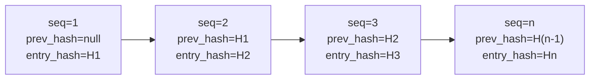

# Audit-Log { #audit-log }

Geprüfte Anwendungspfade geben ein `AuditEvent` aus; die Abdeckung ist noch nicht für jede
Zustandsmutation nachgewiesen. Die Tabelle `audit_event` ist append-only, Hash-verkettet und
PostgreSQL-seitig monatlich partitioniert. Das sind ausschließlich technische Kontrollen:
Vollständigkeit, Aufbewahrung, Betriebsüberwachung und rechtliche Angemessenheit nach eWpG, GwG,
DORA oder DSGVO erfordern gesonderte Nachweise und eine externe Prüfung.

---

## Schema { #schema }

```sql
CREATE TABLE audit_event (
    id              UUID         PRIMARY KEY DEFAULT gen_random_uuid(),
    sequence_no     BIGINT       GENERATED ALWAYS AS IDENTITY,
    event_type      TEXT         NOT NULL,
    actor_id        UUID,                        -- NULL for system-initiated events
    entity_id       UUID,                        -- The primary entity affected
    asset_id        UUID,                        -- If asset-related
    jurisdiction    TEXT,                        -- Jurisdiction context
    payload         JSONB        NOT NULL,       -- Full event details
    prev_hash       BYTEA,                       -- SHA-256 of previous entry
    entry_hash      BYTEA        NOT NULL,       -- SHA-256(prev_hash ‖ payload ‖ sequence_no)
    signature       BYTEA,                       -- Ed25519 over entry_hash (optional)
    occurred_at     TIMESTAMPTZ  NOT NULL DEFAULT now(),
    trace_id        TEXT                         -- OpenTelemetry trace ID
) PARTITION BY RANGE (occurred_at);
```

---

## Hash-Kette { #hash-chain }

Jedes `AuditEvent` trägt:

- `prev_hash` — der `entry_hash` der unmittelbar vorangehenden Zeile (nach `sequence_no`)
- `entry_hash` — `SHA-256(prev_hash ‖ canonical_json(payload) ‖ sequence_no)`

Das erste Ereignis in der Kette hat `prev_hash = null`; sein `entry_hash` ist
`SHA-256(null ‖ payload ‖ 1)`.


```mermaid
graph LR
    E1["seq=1<br/>prev_hash=null<br/>entry_hash=H1"] --> E2["seq=2<br/>prev_hash=H1<br/>entry_hash=H2"]
    E2 --> E3["seq=3<br/>prev_hash=H2<br/>entry_hash=H3"]
    E3 --> En["seq=n<br/>prev_hash=H(n-1)<br/>entry_hash=Hn"]
```

**Manipulationserkennung:** Wird eine Zeile verändert, stimmt ihr `entry_hash` nicht mehr mit
`SHA-256(prev_hash ‖ payload ‖ sequence_no)` überein. Auch der `prev_hash` jeder nachfolgenden Zeile
ist dann falsch. `AuditChainVerificationService.verify()` erkennt das und gibt die Sequenznummer des
ersten gebrochenen Kettenglieds zurück.

---

## Append-only-Durchsetzung { #append-only-enforcement }

Ein PostgreSQL-Trigger auf `audit_event` löst bei jedem `UPDATE` oder `DELETE` eine Exception aus:

```sql
CREATE TRIGGER audit_event_no_update_delete
BEFORE UPDATE OR DELETE ON audit_event
FOR EACH ROW EXECUTE FUNCTION raise_immutable_exception();
```

Selbst der Datenbank-Superuser kann Datensätze nicht ändern, ohne diesen Trigger zuvor zu
deaktivieren – was seinerseits eine Break-Glass-Prozedur erfordert und einen `pg_audit`-Log-Eintrag
erzeugt.

---

## Täglicher Anker { #daily-anchor }

Alle 24 Stunden hängt `AuditChainVerificationService` ein **Anker-Ereignis** an:

- `event_type = AUDIT_ANCHOR`
- `payload` enthält den `entry_hash` des letzten Ereignisses des Tages sowie einen UTC-Zeitstempel
- Optional wird der Anker-Hash als Calldata-Transaktion auf das Ethereum-Mainnet geschrieben, wodurch
  ein öffentlicher, unveränderlicher Querverweis entsteht

Der Anker erlaubt es externen Prüfern zu verifizieren, dass die Audit-Kette an einem bestimmten Datum
mit einem bekannten Hash übereinstimmte, ohne die gesamte Kette ab Genesis erneut durchlaufen zu
müssen.

---

## Ereignistypen { #event-types }

| Ereignistyp | Auslöser |
|---|---|
| `ASSET_CREATED` / `ASSET_DEPLOYED` / `ASSET_STATUS_CHANGED` | Asset-Lebenszyklus |
| `KYC_SUBMITTED` / `KYC_APPROVED` / `KYC_REJECTED` / `KYC_EXPIRED` | KYC-Workflow |
| `HOLDER_BLOCK_CREATED` / `HOLDER_BLOCK_LIFTED` / `HOLDER_BLOCK_EXPIRY_REVIEW` | Sperrvermerk |
| `SCREENING_RUN_COMPLETED` / `SCREENING_HIT_ACCEPTED` | Sanktionsprüfung |
| `FORCE_TRANSFER` / `FORCE_BURN` / `FORCE_APPROVE` | Privilegierte Token-Operationen |
| `TOTP_ENROLLED` / `TOTP_RESET` / `DUAL_CONTROL_APPROVED` / `DUAL_CONTROL_BOOTSTRAP_USED` / `APPROVAL_REQUEST_CREATED` / `_APPROVED` / `_CLAIMED` | Step-up-Authentifizierung |
| `ADMIN_IMPERSONATION_STARTED` / `ADMIN_IMPERSONATION_HANDOFF_EXCHANGED` / `ADMIN_IMPERSONATION_ENDED` | Admin-Impersonation |
| `ICT_INCIDENT_CREATED` / `ICT_INCIDENT_RESOLVED` | DORA-Vorfälle |
| `REGREPORT_SUBMITTED` | MiFIR-/DAC8-Meldung |
| `NATURAL_PERSON_REDACTED` | DSGVO-Löschung |
| `AUDIT_ANCHOR` | Täglicher Hash-Anker |

---

## Partitionsverwaltung { #partition-management }

`audit_event` ist nach `occurred_at` bereichspartitioniert (monatliche Partitionen):

- Aktive Partition: `audit_event_YYYY_MM` für den laufenden Monat
- Ein `@Scheduled(cron = "0 0 1 1 * *")`-Job legt die Partitionen der nächsten 6 Monate im Voraus an
- `audit_event_default` fängt Ereignisse auf, die außerhalb einer definierten Partition liegen (sollte
  bei korrekt laufendem Job nie vorkommen)

!!! warning "Partitionsablauf"
    Das ursprüngliche Schema wird mit Partitionen für 3 Monate ausgeliefert. Der geplante Job zur
    Partitionserstellung muss laufen, bevor die letzte Partition abläuft – sonst fallen Ereignisse in
    `audit_event_default` (was automatisch einen DORA-`MEDIUM`-Vorfall auslöst).

---

## Prüfung der Audit-Kette { #verifying-the-audit-chain }

```
GET  /api/v1/audit/chain/status    # zuletzt erfasstes Ergebnis (Nachtlauf oder früherer Lauf)
POST /api/v1/audit/chain/verify    # jetzt eine vollständige Prüfung ausführen
```

Beide erfordern `REGISTRY_ADMIN` oder `AUDIT`. Die Antwort:

```json
{
  "valid": true,
  "rowsChecked": 1847293,
  "firstBrokenSequenceNo": null,
  "checkedAt": "2026-05-22T03:00:00Z",
  "reason": null,
  "status": "VALID",
  "verificationId": "6d1f..."
}
```

Ist `valid` gleich `false` (`status` `BROKEN`), nennt `firstBrokenSequenceNo` die `sequence_no` des ersten Eintrags, an dem die Kette bricht, und `reason` den Grund. Das Ergebnis wird gespeichert und speist den Health-Indikator, die Kennzahl `registerwerk_audit_chain_valid` (`1` gültig, `0` gebrochen, `-1` kein Lauf erfasst) und die Alarme `AuditChainBroken`, `AuditChainUnverified` und `AuditChainVerificationStale`.

### Ein BROKEN-Ergebnis quittieren

Ein gebrochenes Ergebnis hält `/actuator/health` auf **DOWN** (die Readiness bleibt unberührt), bis **beides** zutrifft: Ein **späterer** Lauf ist gültig, **und** der gebrochene Lauf wurde quittiert:

```
POST /api/v1/audit/verification/{verificationId}/ack?note=<Freitext>
```

Die Quittierung ist nur `REGISTRY_ADMIN` vorbehalten und erfordert Step-up **und einen zweiten Genehmiger** (Grund `AUDIT_CHAIN_VERIFICATION_ACK`); die Audit-Log-Seite des Betreiberportals hat dafür eine Schaltfläche. Quittiert werden kann nur eine gebrochene Prüfung, und nur einmal. Führen Sie nach einer Wiederherstellung aus der Sicherung `POST /api/v1/audit/chain/verify` aus, untersuchen Sie jedes BROKEN-Ergebnis und quittieren Sie es, damit der Health-Indikator wieder auf UP gehen kann.

---

## Integritätsmodell (Kanonisierung v2, Anker, Wiederholung)

- **Kanonische Version.** Jede Zeile trägt `canon_version`. Version 2 umfasst `eventType`, Subjekt, Payload, **Akteur-ID, Akteursrolle, Ereigniszeit (`occurred_at`, Epoche in Mikrosekunden), Korrelations-ID und den Korrekturverweis**; wer eines davon ändert, bricht die Kette. Zeilen der Version 1 (vor dieser Änderung geschrieben) werden weiterhin nach dem alten Format geprüft; eine unbekannte Version lässt die Prüfung fehlschlagen.
- **Ereigniszeit.** `occurred_at` wird synchron bei der Veröffentlichung des Ereignisses erfasst, nicht beim asynchronen Schreiben; `recorded_at` ist der Einfügezeitpunkt. Handlungen, die ein Operator im Namen eines Kunden ausführt (Impersonation), werden mit der Rolle `REGISTRY_ADMIN_IMPERSONATING` und einem gehashten `_imp`-Objekt (Sitzung, Operator, Entität, Modus) festgehalten.
- **Die Prüfung** erkennt: eine erste Zeile, die nicht der Anfang der Kette ist (abgeschnittener Kopf, entfernte Partition), eine letzte Zeile, die von `audit_chain_tip` abweicht, nach einem signierten Tagesanker (`audit_chain_anchor`, optional über eine externe `AuditAnchorSink` veröffentlicht) entfernte Zeilen sowie eine fehlende `entry_sig` ab der Signatur-Wasserlinie (erste signierte Sequenznummer, nur einmal beschreibbar). Eine später aktivierte Signierung signiert frühere Zeilen nicht nachträglich.
- **Nachweis-Export.** `/audit/events/export[/signed]` ist nach `sequence_no` sortiert und beginnt mit einem `# key=value`-Block (`firstSeq`, `lastSeq`, `rowCount`, `truncated`, `nextAfterSeq`, `tipSeq`, `tipEntryHash`); die Zeilen enthalten `prevHash` und `entryHash`. Die Signatur deckt Kopfblock und Zeilen ab. Mit `afterSeq` wird ein abgeschnittener Export fortgesetzt.
- **Fehlgeschlagene Schreibvorgänge** werden jede Minute wiederholt (Veröffentlichungen älter als zwei Minuten) und nach `registerwerk.audit.max-attempts` (20) Versuchen in `audit_event_dead_letter` verschoben. Alarmieren Sie auf `registerwerk_audit_oldest_incomplete_seconds` und `registerwerk_audit_dead_letter_count`.
- **Tabelleneigentümer.** `REVOKE UPDATE, DELETE, TRUNCATE` und die WORM-Trigger binden den Tabelleneigentümer nicht; deshalb darf die Laufzeit-Anmeldung `audit_event` nicht besitzen. Verwenden Sie getrennte Anmeldungen: Migrator/Eigentümer (`DB_USER`, per `SPRING_FLYWAY_USER` an Flyway übergeben) und die Laufzeit-Anmeldung `registerwerk_app` (`DB_APP_USER`), die auf den Audit-Tabellen kein UPDATE, DELETE oder TRUNCATE und im Schema kein CREATE hält. Im Produktionsmodus schlägt die Startprüfung fehl, wenn die Laufzeit-Anmeldung die Tabelle besitzt oder diese Rechte noch hält oder wenn beide Anmeldungen identisch sind; `registerwerk.audit.allow-owner-runtime-role=true` ist eine ausdrückliche Bestätigung des Übergangsrisikos nur für den Eigentümerfall. Der Produktionsmodus verlangt außerdem einen Signaturschlüssel-Provider.
- **Externer Anker.** Tägliche Anker können in einen S3-Bucket mit Object Lock veröffentlicht werden (`registerwerk.audit.anchor-sink=s3`, Standard `none`), sodass ein Angreifer mit Datenbankzugriff die Ankerhistorie nicht umschreiben kann; fehlgeschlagene Veröffentlichungen werden stündlich wiederholt und gezählt (`registerwerk_audit_anchor_sink_failures_total`).
- **Umstellung.** `registerwerk.audit.legacy-listener=true` (Standard) arbeitet vor dem Upgrade erzeugte Veröffentlichungen ab; abschalten, sobald `event_publication` keine unvollständigen Audit-Zeilen mehr enthält.
