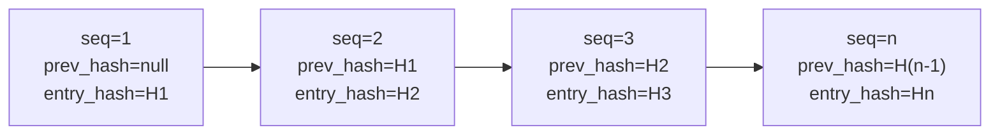

# Registro de auditoría { #audit-log }

Las rutas de aplicación auditadas emiten un `AuditEvent`; aún no se ha demostrado la cobertura para cada mutación de estado.
La tabla `audit_event` es de solo inserción (append-only), encadenada mediante hash y particionada por PostgreSQL por mes. Estos son solo controles técnicos: la integridad, la retención, la supervisión operativa y la adecuación legal según eWpG, GwG, DORA o GDPR requieren evidencia separada y revisión externa.

---

## Esquema { #schema }

```sql
CREATE TABLE audit_event (
    id              UUID         PRIMARY KEY DEFAULT gen_random_uuid(),
    sequence_no     BIGINT       GENERATED ALWAYS AS IDENTITY,
    event_type      TEXT         NOT NULL,
    actor_id        UUID,                        -- NULL for system-initiated events
    entity_id       UUID,                        -- The primary entity affected
    asset_id        UUID,                        -- If asset-related
    jurisdiction    TEXT,                        -- Jurisdiction context
    payload         JSONB        NOT NULL,       -- Full event details
    prev_hash       BYTEA,                       -- SHA-256 of previous entry
    entry_hash      BYTEA        NOT NULL,       -- SHA-256(prev_hash ‖ payload ‖ sequence_no)
    signature       BYTEA,                       -- Ed25519 over entry_hash (optional)
    occurred_at     TIMESTAMPTZ  NOT NULL DEFAULT now(),
    trace_id        TEXT                         -- OpenTelemetry trace ID
) PARTITION BY RANGE (occurred_at);
```

---

## Cadena hash { #hash-chain }

Cada `AuditEvent` lleva:

- `prev_hash` — el `entry_hash` de la fila inmediatamente anterior (por `sequence_no`)
- `entry_hash` — `SHA-256(prev_hash ‖ canonical_json(payload) ‖ sequence_no)`

El primer evento de la cadena tiene `prev_hash = null`; su `entry_hash` es `SHA-256(null ‖ payload ‖ 1)`.


```mermaid
graph LR
    E1["seq=1<br/>prev_hash=null<br/>entry_hash=H1"] --> E2["seq=2<br/>prev_hash=H1<br/>entry_hash=H2"]
    E2 --> E3["seq=3<br/>prev_hash=H2<br/>entry_hash=H3"]
    E3 --> En["seq=n<br/>prev_hash=H(n-1)<br/>entry_hash=Hn"]
```

**Detección de manipulación:** Si se modifica alguna fila, su `entry_hash` ya no coincidirá con `SHA-256(prev_hash ‖ payload ‖ sequence_no)`. El `prev_hash` de cada fila posterior también será incorrecto. `AuditChainVerificationService.verify()` detecta esto y devuelve el número de secuencia del primer enlace roto.

---

## Aplicación de solo inserción (append-only) { #append-only-enforcement }

Un disparador (trigger) de PostgreSQL en `audit_event` genera una excepción ante cualquier `UPDATE` o `DELETE`:

```sql
CREATE TRIGGER audit_event_no_update_delete
BEFORE UPDATE OR DELETE ON audit_event
FOR EACH ROW EXECUTE FUNCTION raise_immutable_exception();
```

Incluso el superusuario de la base de datos no puede modificar registros sin deshabilitar primero este disparador, lo que a su vez requiere un procedimiento de emergencia (break-glass) y genera una entrada de registro `pg_audit`.

---

## Ancla diaria { #daily-anchor }

Cada 24 horas, `AuditChainVerificationService` agrega un **evento ancla**:

- `event_type = AUDIT_ANCHOR`
- `payload` contiene el `entry_hash` del último evento del día y una marca de tiempo UTC
- Opcionalmente, el hash de anclaje se escribe en la red principal de Ethereum como una transacción con datos de llamada (calldata), creando una referencia cruzada pública e inmutable

El ancla permite a los auditores externos verificar que la cadena de auditoría en una fecha determinada coincida con un hash conocido, sin necesidad de reproducir toda la cadena desde génesis.

---

## Tipos de eventos { #event-types }

| Tipo de evento | Activador |
|---|---|
| `ASSET_CREATED` / `ASSET_DEPLOYED` / `ASSET_STATUS_CHANGED` | Ciclo de vida del activo |
| `KYC_SUBMITTED` / `KYC_APPROVED` / `KYC_REJECTED` / `KYC_EXPIRED` | Flujo de trabajo KYC |
| `HOLDER_BLOCK_CREATED` / `HOLDER_BLOCK_LIFTED` / `HOLDER_BLOCK_EXPIRY_REVIEW` | Sperrvermerk |
| `SCREENING_RUN_COMPLETED` / `SCREENING_HIT_ACCEPTED` | Filtrado de sanciones |
| `FORCE_TRANSFER` / `FORCE_BURN` / `FORCE_APPROVE` | Operaciones privilegiadas sobre tokens |
| `TOTP_ENROLLED` / `TOTP_RESET` / `DUAL_CONTROL_APPROVED` / `DUAL_CONTROL_BOOTSTRAP_USED` / `APPROVAL_REQUEST_CREATED` / `_APPROVED` / `_CLAIMED` | Autenticación reforzada (step-up) |
| `ADMIN_IMPERSONATION_STARTED` / `ADMIN_IMPERSONATION_HANDOFF_EXCHANGED` / `ADMIN_IMPERSONATION_ENDED` | Suplantación de administrador |
| `ICT_INCIDENT_CREATED` / `ICT_INCIDENT_RESOLVED` | Incidentes DORA |
| `REGREPORT_SUBMITTED` | Archivo MiFIR / DAC8 |
| `NATURAL_PERSON_REDACTED` | Borrado de GDPR |
| `AUDIT_ANCHOR` | Ancla hash diaria |

---

## Gestión de particiones { #partition-management }

`audit_event` está particionada por rango por `occurred_at` (particiones mensuales):

- Partición activa: `audit_event_YYYY_MM` para el mes actual
- Un trabajo `@Scheduled(cron = "0 0 1 1 * *")` crea los próximos 6 meses de particiones antes de tiempo
- `audit_event_default` detecta cualquier evento que quede fuera de una partición definida (nunca debería ocurrir si el trabajo se ejecuta correctamente)

!!! warning "Caducidad de la partición"
    El esquema inicial se envía con particiones durante 3 meses. El trabajo de creación de partición programada debe ejecutarse antes de que caduque la última partición, o los eventos caerán en `audit_event_default` (lo que desencadena un incidente DORA `MEDIUM` automáticamente).

---

## Verificando la cadena de auditoría { #verifying-the-audit-chain }

```
GET  /api/v1/audit/chain/status    # último resultado registrado (tarea nocturna o ejecución previa)
POST /api/v1/audit/chain/verify    # ejecutar ahora una verificación completa
```

Ambos exigen `REGISTRY_ADMIN` o `AUDIT`. La respuesta:

```json
{
  "valid": true,
  "rowsChecked": 1847293,
  "firstBrokenSequenceNo": null,
  "checkedAt": "2026-05-22T03:00:00Z",
  "reason": null,
  "status": "VALID",
  "verificationId": "6d1f..."
}
```

Si `valid` es `false` (`status` `BROKEN`), `firstBrokenSequenceNo` es el `sequence_no` de la primera entrada donde se rompe la cadena y `reason` indica el motivo. El veredicto se persiste y alimenta el indicador de salud, el indicador `registerwerk_audit_chain_valid` (`1` válida, `0` rota, `-1` ninguna ejecución registrada) y las alertas `AuditChainBroken`, `AuditChainUnverified` y `AuditChainVerificationStale`.

### Reconocer un veredicto BROKEN

Un veredicto roto mantiene `/actuator/health` en **DOWN** (la readiness no se ve afectada) hasta que se cumplan **ambas** condiciones: una ejecución **posterior** es válida, **y** la ejecución rota ha sido reconocida:

```
POST /api/v1/audit/verification/{verificationId}/ack?note=<texto libre>
```

El reconocimiento es exclusivo de `REGISTRY_ADMIN` y exige autenticación reforzada **y un segundo aprobador** (motivo `AUDIT_CHAIN_VERIFICATION_ACK`); la página del registro de auditoría del portal del operador tiene un botón para ello. Solo se puede reconocer una verificación rota, y una sola vez. Tras una restauración desde una copia de seguridad, ejecute `POST /api/v1/audit/chain/verify`, investigue cualquier resultado BROKEN y reconózcalo para que el indicador de salud pueda volver a UP.

---

## Modelo de integridad (canónico v2, anclas, reintento)

- **Versión canónica.** Cada fila lleva `canon_version`. La versión 2 cubre `eventType`, sujeto, carga útil, **id y rol del actor, hora del evento (`occurred_at`, época en microsegundos), id de correlación y vínculo de reversión**: modificar cualquiera rompe la cadena. Las filas de versión 1 (escritas antes de este cambio) se siguen verificando con el formato anterior; una versión desconocida hace fallar la verificación.
- **Hora del evento.** `occurred_at` se captura de forma síncrona al publicar el evento, no al escribirlo de forma asíncrona; `recorded_at` es la hora de inserción. Las acciones que un operador realiza en nombre de un cliente (suplantación) se registran con el rol `REGISTRY_ADMIN_IMPERSONATING` y un objeto `_imp` con hash (sesión, operador, entidad, modo).
- **La verificación** detecta: una primera fila que no es el origen de la cadena (cabecera truncada, partición eliminada), una última fila distinta de `audit_chain_tip`, filas eliminadas tras un ancla diaria firmada (`audit_chain_anchor`, publicada opcionalmente mediante un `AuditAnchorSink` externo) y una `entry_sig` ausente a partir del umbral de firma (primer número de secuencia firmado, de escritura única). Activar la firma más tarde no firma retroactivamente las filas anteriores.
- **Exportación probatoria.** `/audit/events/export[/signed]` se ordena por `sequence_no` y comienza con un bloque `# key=value` (`firstSeq`, `lastSeq`, `rowCount`, `truncated`, `nextAfterSeq`, `tipSeq`, `tipEntryHash`); las filas incluyen `prevHash` y `entryHash`. La firma cubre cabecera y filas. `afterSeq` permite continuar una exportación truncada.
- **Las escrituras fallidas** se reintentan cada minuto (publicaciones de más de dos minutos) y, tras `registerwerk.audit.max-attempts` (20) intentos, se mueven a `audit_event_dead_letter`. Configure alertas sobre `registerwerk_audit_oldest_incomplete_seconds` y `registerwerk_audit_dead_letter_count`.
- **Propiedad de la tabla.** `REVOKE UPDATE, DELETE, TRUNCATE` y los disparadores WORM no vinculan al propietario de la tabla, por lo que el login de ejecución no debe ser propietario de `audit_event`. Use logins separados: el migrador/propietario (`DB_USER`, pasado a Flyway como `SPRING_FLYWAY_USER`) y el login de ejecución `registerwerk_app` (`DB_APP_USER`), que no tiene UPDATE, DELETE ni TRUNCATE sobre las tablas de auditoría ni CREATE sobre el esquema. En modo producción la comprobación de arranque falla cuando el login de ejecución es propietario de la tabla o aún tiene esos privilegios, o cuando ambos logins coinciden; `registerwerk.audit.allow-owner-runtime-role=true` es un reconocimiento explícito del riesgo transitorio solo para el caso del propietario. El modo producción también exige un proveedor de clave de firma.
- **Ancla externa.** Las anclas diarias pueden publicarse en un bucket S3 con Object Lock (`registerwerk.audit.anchor-sink=s3`, `none` por defecto), de modo que un atacante con acceso a la base de datos no pueda reescribir el historial de anclas; las publicaciones fallidas se reintentan cada hora y se cuentan (`registerwerk_audit_anchor_sink_failures_total`).
- **Transición.** `registerwerk.audit.legacy-listener=true` (por defecto) procesa las publicaciones creadas antes de la actualización; desactívelo cuando `event_publication` ya no contenga filas de auditoría incompletas.
