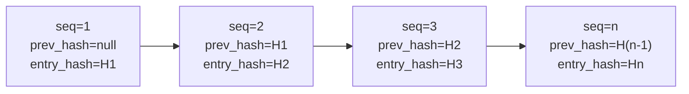

# Journal d'audit { #audit-log }

Les chemins d'application audités émettent un `AuditEvent` ; la couverture n'est pas encore prouvée pour chaque mutation d'état.
La table `audit_event` est en ajout uniquement, chaînée par hachage et partitionnée par PostgreSQL par mois. Il s'agit uniquement de contrôles techniques
: l'exhaustivité, la conservation, la surveillance opérationnelle et l'adéquation juridique sous
eWpG, GwG, DORA ou RGPD nécessitent des preuves distinctes et un examen externe.

---

## Schéma { #schema }

```sql
CREATE TABLE audit_event (
    id              UUID         PRIMARY KEY DEFAULT gen_random_uuid(),
    sequence_no     BIGINT       GENERATED ALWAYS AS IDENTITY,
    event_type      TEXT         NOT NULL,
    actor_id        UUID,                        -- NULL for system-initiated events
    entity_id       UUID,                        -- The primary entity affected
    asset_id        UUID,                        -- If asset-related
    jurisdiction    TEXT,                        -- Jurisdiction context
    payload         JSONB        NOT NULL,       -- Full event details
    prev_hash       BYTEA,                       -- SHA-256 of previous entry
    entry_hash      BYTEA        NOT NULL,       -- SHA-256(prev_hash ‖ payload ‖ sequence_no)
    signature       BYTEA,                       -- Ed25519 over entry_hash (optional)
    occurred_at     TIMESTAMPTZ  NOT NULL DEFAULT now(),
    trace_id        TEXT                         -- OpenTelemetry trace ID
) PARTITION BY RANGE (occurred_at);
```

---

## Chaîne de hachage { #hash-chain }

Chaque `AuditEvent` porte :

- `prev_hash` — le `entry_hash` de la rangée immédiatement précédente (par `sequence_no`)
- `entry_hash` — `SHA-256(prev_hash ‖ canonical_json(payload) ‖ sequence_no)`

Le premier événement de la chaîne a `prev_hash = null` ; son `entry_hash` est `SHA-256(null ‖ payload ‖ 1)`.



**Détection de sabotage :** Si une ligne est modifiée, son `entry_hash` ne correspondra plus à `SHA-256(prev_hash ‖ payload ‖ sequence_no)`. Le `prev_hash` de chaque ligne suivante sera également erroné. `AuditChainVerificationService.verify()` détecte cela et renvoie le numéro de séquence du premier lien rompu.

---

## Application par ajout uniquement { #append-only-enforcement }

Un déclencheur PostgreSQL sur `audit_event` lève une exception sur tout `UPDATE` ou `DELETE` :

```sql
CREATE TRIGGER audit_event_no_update_delete
BEFORE UPDATE OR DELETE ON audit_event
FOR EACH ROW EXECUTE FUNCTION raise_immutable_exception();
```

Même le superutilisateur de la base de données ne peut pas modifier les enregistrements sans désactiver au préalable ce déclencheur, qui lui-même nécessite une procédure de type « bris de glace » et génère une entrée de journal `pg_audit`.

---

## Ancre quotidienne { #daily-anchor }

Toutes les 24 heures, `AuditChainVerificationService` ajoute un **événement d'ancrage** :

- `event_type = AUDIT_ANCHOR`
- `payload` contient le `entry_hash` du dernier événement de la journée et un horodatage UTC
- En option, le hachage d'ancrage est écrit sur le réseau principal Ethereum sous la forme d'une transaction avec calldata, créant une référence croisée publique et immuable

L'ancre permet aux auditeurs externes de vérifier que la chaîne d'audit à une date donnée correspond à un hachage connu, sans avoir besoin de rejouer l'intégralité de la chaîne depuis la genèse.

---

## Types d'événements { #event-types }

| Type d'événement | Déclencheur |
|---|---|
| `ASSET_CREATED` / `ASSET_DEPLOYED` / `ASSET_STATUS_CHANGED` | Cycle de vie des actifs |
| `KYC_SUBMITTED` / `KYC_APPROVED` / `KYC_REJECTED` / `KYC_EXPIRED` | Flux de travail KYC |
| `HOLDER_BLOCK_CREATED` / `HOLDER_BLOCK_LIFTED` / `HOLDER_BLOCK_EXPIRED` | Sperrvermerk (blocage du titulaire) |
| `SCREENING_RUN_COMPLETED` / `SCREENING_HIT_ACCEPTED` | Contrôle des sanctions |
| `FORCE_TRANSFER` / `FORCE_BURN` / `FORCE_APPROVE` | Opérations de jetons privilégiés |
| `STEP_UP_ISSUED` / `DUAL_CONTROL_CONFIRMED` / `PROTECTED_OPERATION_EXECUTED` | Step-up (authentification renforcée) |
| `IMPERSONATION_STARTED` / `IMPERSONATION_ENDED` | Mode support administrateur (impersonation) |
| `ICT_INCIDENT_CREATED` / `ICT_INCIDENT_RESOLVED` | Incidents DORA |
| `REGREPORT_SUBMITTED` | Dépôt MiFIR / DAC8 |
| `NATURAL_PERSON_REDACTED` | Effacement RGPD |
| `AUDIT_ANCHOR` | Ancrage de hachage quotidien |

---

## Gestion des partitions { #partition-management }

`audit_event` est partitionné en plage par `occurred_at` (partitions mensuelles) :

- Partition active : `audit_event_YYYY_MM` pour le mois en cours
- Un travail `@Scheduled(cron = "0 0 1 1 * *")` crée les 6 prochains mois de partitions à l'avance
- `audit_event_default` détecte tous les événements qui se situent en dehors d'une partition définie (ne devrait jamais se produire si le travail s'exécute correctement)

!!! warning "Expiration des partitions"
    Le schéma initial est livré avec les partitions pendant 3 mois. La tâche de création de partition planifiée doit être exécutée avant l'expiration de la dernière partition, sinon les événements tomberont dans `audit_event_default` (ce qui déclenche automatiquement un incident DORA `MEDIUM`).

---

## Vérification de la chaîne d'audit { #verifying-the-audit-chain }

```
GET /api/v1/admin/audit/verify
```

Retours :

```json
{
  "status": "OK",
  "lastVerifiedAt": "2026-05-22T03:00:00Z",
  "lastSequenceNo": 1847293,
  "lastEntryHash": "a3f7...",
  "brokenAt": null
}
```

Si `brokenAt` n'est pas nul, il contient le `sequence_no` de la première entrée où la chaîne de hachage est rompue. Cela déclenche un `IctIncident` automatique de gravité `MAJOR` et de catégorie `INTEGRITY`.
