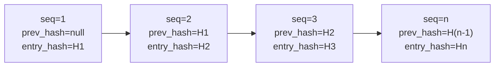

# Pista di controllo { #audit-log }

I percorsi applicativi sottoposti a controllo emettono un `AuditEvent`; la copertura non è ancora stata dimostrata per ogni mutazione di stato.
La tabella `audit_event` è di sola aggiunta, concatenata con hash e partizionata PostgreSQL per mese. Questi sono
solo controlli tecnici: completezza, conservazione, monitoraggio operativo e adeguatezza legale ai sensi di
eWpG, GwG, DORA o GDPR richiedono prove separate e revisione esterna.

---

## Schema { #schema }

```sql
CREATE TABLE audit_event (
    id              UUID         PRIMARY KEY DEFAULT gen_random_uuid(),
    sequence_no     BIGINT       GENERATED ALWAYS AS IDENTITY,
    event_type      TEXT         NOT NULL,
    actor_id        UUID,                        -- NULL for system-initiated events
    entity_id       UUID,                        -- The primary entity affected
    asset_id        UUID,                        -- If asset-related
    jurisdiction    TEXT,                        -- Jurisdiction context
    payload         JSONB        NOT NULL,       -- Full event details
    prev_hash       BYTEA,                       -- SHA-256 of previous entry
    entry_hash      BYTEA        NOT NULL,       -- SHA-256(prev_hash ‖ payload ‖ sequence_no)
    signature       BYTEA,                       -- Ed25519 over entry_hash (optional)
    occurred_at     TIMESTAMPTZ  NOT NULL DEFAULT now(),
    trace_id        TEXT                         -- OpenTelemetry trace ID
) PARTITION BY RANGE (occurred_at);
```

---

## Catena hash { #hash-chain }

Ogni `AuditEvent` trasporta:

- `prev_hash` — `entry_hash` della riga immediatamente precedente (tramite `sequence_no`)
- `entry_hash` — `SHA-256(prev_hash ‖ canonical_json(payload) ‖ sequence_no)`

Il primo evento della catena ha `prev_hash = null`; il suo `entry_hash` è `SHA-256(null ‖ payload ‖ 1)`.


```mermaid
graph LR
    E1["seq=1<br/>prev_hash=null<br/>entry_hash=H1"] --> E2["seq=2<br/>prev_hash=H1<br/>entry_hash=H2"]
    E2 --> E3["seq=3<br/>prev_hash=H2<br/>entry_hash=H3"]
    E3 --> En["seq=n<br/>prev_hash=H(n-1)<br/>entry_hash=Hn"]
```

**Rilevamento manomissione:** Se una riga viene modificata, la relativa `entry_hash` non corrisponderà più a `SHA-256(prev_hash ‖ payload ‖ sequence_no)`. Anche `prev_hash` di ogni riga successiva sarà errato. `AuditChainVerificationService.verify()` lo rileva e restituisce il numero di sequenza del primo collegamento interrotto.

---

## Applicazione di sola aggiunta { #append-only-enforcement }

Il trigger PostgreSQL su `audit_event` solleva un'eccezione su qualsiasi `UPDATE` o `DELETE`:

```sql
CREATE TRIGGER audit_event_no_update_delete
BEFORE UPDATE OR DELETE ON audit_event
FOR EACH ROW EXECUTE FUNCTION raise_immutable_exception();
```

Anche il superutente del database non può modificare i record senza prima disabilitare questo trigger, che a sua volta richiede una procedura break-glass e genera una voce di registro `pg_audit`.

---

## Ancoraggio giornaliero { #daily-anchor }

Ogni 24 ore, `AuditChainVerificationService` aggiunge un **evento di ancoraggio**:

- `event_type = AUDIT_ANCHOR`
- `payload` contiene `entry_hash` dell'ultimo evento del giorno e un timestamp UTC
- Facoltativamente, l'hash di ancoraggio viene scritto sulla rete principale di Ethereum come transazione calldata, creando un riferimento incrociato pubblico e immutabile

L'ancora consente agli auditor esterni di verificare che la catena di audit in una determinata data corrispondesse a un hash noto, senza la necessità di riprodurre l'intera catena dalla genesi.

---

## Tipi di eventi { #event-types }

| Tipo evento | Trigger |
|---|---|
| `ASSET_CREATED` / `ASSET_DEPLOYED` / `ASSET_STATUS_CHANGED` | Ciclo di vita dell'asset |
| `KYC_SUBMITTED` / `KYC_APPROVED` / `KYC_REJECTED` / `KYC_EXPIRED` | Flusso di lavoro KYC |
| `HOLDER_BLOCK_CREATED` / `HOLDER_BLOCK_LIFTED` / `HOLDER_BLOCK_EXPIRY_REVIEW` | Sperrvermerk |
| `SCREENING_RUN_COMPLETED` / `SCREENING_HIT_ACCEPTED` | Screening sanzioni |
| `FORCE_TRANSFER` / `FORCE_BURN` / `FORCE_APPROVE` | Operazioni token privilegiate |
| `TOTP_ENROLLED` / `TOTP_RESET` / `DUAL_CONTROL_APPROVED` / `DUAL_CONTROL_BOOTSTRAP_USED` / `APPROVAL_REQUEST_CREATED` / `_APPROVED` / `_CLAIMED` | Autenticazione avanzata |
| `ADMIN_IMPERSONATION_STARTED` / `ADMIN_IMPERSONATION_HANDOFF_EXCHANGED` / `ADMIN_IMPERSONATION_ENDED` | Modalità supporto (impersonation) |
| `ICT_INCIDENT_CREATED` / `ICT_INCIDENT_RESOLVED` | Incidenti DORA |
| `REGREPORT_SUBMITTED` | Archiviazione MiFIR / DAC8 |
| `NATURAL_PERSON_REDACTED` | GDPR cancellazione |
| `AUDIT_ANCHOR` | Ancoraggio hash giornaliero |

---

## Gestione delle partizioni { #partition-management }

`audit_event` è suddiviso in intervalli da `occurred_at` (partizioni mensili):

- Partizione attiva: `audit_event_YYYY_MM` per il mese corrente
- Un lavoro `@Scheduled(cron = "0 0 1 1 * *")` crea i successivi 6 mesi di partizioni in anticipo
- `audit_event_default` rileva tutti gli eventi che non rientrano in una partizione definita (non dovrebbe mai verificarsi se il lavoro viene eseguito correttamente)

!!! warning "Scadenza partizione"
    Lo schema iniziale viene fornito con partizioni per 3 mesi. Il processo di creazione della partizione pianificata deve essere eseguito prima della scadenza dell'ultima partizione, altrimenti gli eventi rientreranno in `audit_event_default` (che attiva automaticamente un incidente DORA `MEDIUM`).

---

## Verifica della catena di controllo { #verifying-the-audit-chain }

```
GET  /api/v1/audit/chain/status    # ultimo risultato registrato (job notturno o esecuzione precedente)
POST /api/v1/audit/chain/verify    # eseguire subito una verifica completa
```

Entrambi richiedono `REGISTRY_ADMIN` o `AUDIT`. La risposta:

```json
{
  "valid": true,
  "rowsChecked": 1847293,
  "firstBrokenSequenceNo": null,
  "checkedAt": "2026-05-22T03:00:00Z",
  "reason": null,
  "status": "VALID",
  "verificationId": "6d1f..."
}
```

Se `valid` è `false` (`status` `BROKEN`), `firstBrokenSequenceNo` è il `sequence_no` della prima voce in cui la catena si interrompe e `reason` ne indica il motivo. L'esito viene persistito e alimenta l'indicatore di salute, il gauge `registerwerk_audit_chain_valid` (`1` valida, `0` interrotta, `-1` nessuna esecuzione registrata) e gli alert `AuditChainBroken`, `AuditChainUnverified` e `AuditChainVerificationStale`.

### Riconoscere un esito BROKEN

Un esito interrotto mantiene `/actuator/health` su **DOWN** (la readiness non è influenzata) finché non sono vere **entrambe** le condizioni: un'esecuzione **successiva** è valida, **e** l'esecuzione interrotta è stata riconosciuta:

```
POST /api/v1/audit/verification/{verificationId}/ack?note=<testo libero>
```

Il riconoscimento è riservato a `REGISTRY_ADMIN` e richiede autenticazione rafforzata **e un secondo approvatore** (motivo `AUDIT_CHAIN_VERIFICATION_ACK`); la pagina del registro di audit del portale operatore ha un pulsante apposito. Si può riconoscere solo una verifica interrotta, e una sola volta. Dopo un ripristino da backup, esegui `POST /api/v1/audit/chain/verify`, indaga su ogni risultato BROKEN e riconoscilo perché l'indicatore di salute possa tornare a UP.

---

## Modello di integrità (canonico v2, ancore, ripetizione)

- **Versione canonica.** Ogni riga riporta `canon_version`. La versione 2 copre `eventType`, soggetto, payload, **ID e ruolo dell'attore, ora dell'evento (`occurred_at`, epoca in microsecondi), ID di correlazione e collegamento di storno**: modificarne uno rompe la catena. Le righe di versione 1 (scritte prima di questa modifica) continuano a essere verificate con il formato precedente; una versione sconosciuta fa fallire la verifica.
- **Ora dell'evento.** `occurred_at` viene acquisita in modo sincrono alla pubblicazione dell'evento, non alla scrittura asincrona; `recorded_at` è l'ora di inserimento. Le azioni eseguite da un operatore che agisce per conto di un cliente (impersonificazione) sono registrate con il ruolo `REGISTRY_ADMIN_IMPERSONATING` e un oggetto `_imp` sottoposto a hash (sessione, operatore, entità, modalità).
- **La verifica** rileva: una prima riga che non è l'origine della catena (testa troncata, partizione eliminata), un'ultima riga diversa da `audit_chain_tip`, righe rimosse dopo un'ancora giornaliera firmata (`audit_chain_anchor`, pubblicata facoltativamente tramite un `AuditAnchorSink` esterno) e una `entry_sig` mancante dalla soglia di firma in poi (primo numero di sequenza firmato, scrivibile una sola volta). Attivare la firma in seguito non firma retroattivamente le righe precedenti.
- **Esportazione probatoria.** `/audit/events/export[/signed]` è ordinata per `sequence_no` e inizia con un blocco `# key=value` (`firstSeq`, `lastSeq`, `rowCount`, `truncated`, `nextAfterSeq`, `tipSeq`, `tipEntryHash`); le righe contengono `prevHash` e `entryHash`. La firma copre intestazione e righe. `afterSeq` consente di proseguire un'esportazione troncata.
- **Le scritture fallite** vengono ritentate ogni minuto (pubblicazioni più vecchie di due minuti) e, dopo `registerwerk.audit.max-attempts` (20) tentativi, spostate in `audit_event_dead_letter`. Impostate allarmi su `registerwerk_audit_oldest_incomplete_seconds` e `registerwerk_audit_dead_letter_count`.
- **Proprietà della tabella.** `REVOKE UPDATE, DELETE, TRUNCATE` e i trigger WORM non vincolano il proprietario della tabella, quindi il login di runtime non deve possedere `audit_event`. Usa login separati: il migratore/proprietario (`DB_USER`, passato a Flyway come `SPRING_FLYWAY_USER`) e il login di runtime `registerwerk_app` (`DB_APP_USER`), che non detiene UPDATE, DELETE o TRUNCATE sulle tabelle di audit né CREATE sullo schema. In modalità produzione il controllo all'avvio fallisce quando il login di runtime possiede la tabella o detiene ancora quei privilegi, o quando i due login coincidono; `registerwerk.audit.allow-owner-runtime-role=true` è un riconoscimento esplicito del rischio transitorio solo per il caso del proprietario. La modalità produzione richiede anche un provider della chiave di firma.
- **Ancora esterna.** Le ancore giornaliere possono essere pubblicate in un bucket S3 con Object Lock (`registerwerk.audit.anchor-sink=s3`, `none` per impostazione predefinita), così che chi ha accesso al database non possa riscrivere lo storico delle ancore; le pubblicazioni fallite vengono ritentate ogni ora e conteggiate (`registerwerk_audit_anchor_sink_failures_total`).
- **Passaggio.** `registerwerk.audit.legacy-listener=true` (predefinito) smaltisce le pubblicazioni create prima dell'aggiornamento; disattivatelo quando `event_publication` non contiene più righe di audit incomplete.
