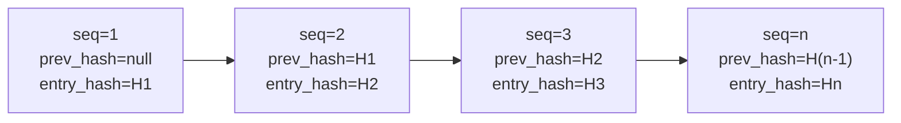

# Audit Log

Audited application paths emit an `AuditEvent`; coverage is not yet proven for every state mutation.
The `audit_event` table is append-only, hash-chained, and PostgreSQL-partitioned by month. These are
technical controls only: completeness, retention, operational monitoring, and legal adequacy under
eWpG, GwG, DORA, or GDPR require separate evidence and external review.

---

## Schema

```sql
CREATE TABLE audit_event (
    id              UUID         PRIMARY KEY DEFAULT gen_random_uuid(),
    sequence_no     BIGINT       GENERATED ALWAYS AS IDENTITY,
    event_type      TEXT         NOT NULL,
    actor_id        UUID,                        -- NULL for system-initiated events
    entity_id       UUID,                        -- The primary entity affected
    asset_id        UUID,                        -- If asset-related
    jurisdiction    TEXT,                        -- Jurisdiction context
    payload         JSONB        NOT NULL,       -- Full event details
    prev_hash       BYTEA,                       -- SHA-256 of previous entry
    entry_hash      BYTEA        NOT NULL,       -- SHA-256(prev_hash ‖ payload ‖ sequence_no)
    signature       BYTEA,                       -- Ed25519 over entry_hash (optional)
    occurred_at     TIMESTAMPTZ  NOT NULL DEFAULT now(),
    trace_id        TEXT                         -- OpenTelemetry trace ID
) PARTITION BY RANGE (occurred_at);
```

---

## Hash chain

Each `AuditEvent` carries:

- `prev_hash` — the `entry_hash` of the immediately preceding row (by `sequence_no`)
- `entry_hash` — `SHA-256(prev_hash ‖ canonical_json(payload) ‖ sequence_no)`

The first event in the chain has `prev_hash = null`; its `entry_hash` is `SHA-256(null ‖ payload ‖ 1)`.



**Tamper detection:** If any row is modified, its `entry_hash` will no longer match `SHA-256(prev_hash ‖ payload ‖ sequence_no)`. Every subsequent row's `prev_hash` will also be wrong. `AuditChainVerificationService.verify()` detects this and returns the sequence number of the first broken link.

---

## Append-only enforcement

A PostgreSQL trigger on `audit_event` raises an exception on any `UPDATE` or `DELETE`:

```sql
CREATE TRIGGER audit_event_no_update_delete
BEFORE UPDATE OR DELETE ON audit_event
FOR EACH ROW EXECUTE FUNCTION raise_immutable_exception();
```

Even the database superuser cannot modify records without first disabling this trigger — which itself requires a break-glass procedure and generates a `pg_audit` log entry.

---

## Daily anchor

Every 24 hours, `AuditChainVerificationService` appends an **anchor event**:

- `event_type = AUDIT_ANCHOR`
- `payload` contains the `entry_hash` of the day's last event and a UTC timestamp
- Optionally, the anchor hash is written to Ethereum mainnet as a calldata transaction, creating a public, immutable cross-reference

The anchor allows external auditors to verify that the audit chain at a given date matched a known hash, without needing to replay the entire chain from genesis.

---

## Event types

| Event type | Trigger |
|---|---|
| `ASSET_CREATED` / `ASSET_DEPLOYED` / `ASSET_STATUS_CHANGED` | Asset lifecycle |
| `KYC_SUBMITTED` / `KYC_APPROVED` / `KYC_REJECTED` / `KYC_EXPIRED` | KYC workflow |
| `HOLDER_BLOCK_CREATED` / `HOLDER_BLOCK_LIFTED` / `HOLDER_BLOCK_EXPIRED` | Sperrvermerk |
| `SCREENING_RUN_COMPLETED` / `SCREENING_HIT_ACCEPTED` | Sanctions screening |
| `FORCE_TRANSFER` / `FORCE_BURN` / `FORCE_APPROVE` | Privileged token operations |
| `STEP_UP_ISSUED` / `DUAL_CONTROL_CONFIRMED` / `PROTECTED_OPERATION_EXECUTED` | Step-up auth |
| `IMPERSONATION_STARTED` / `IMPERSONATION_ENDED` | Admin impersonation |
| `ICT_INCIDENT_CREATED` / `ICT_INCIDENT_RESOLVED` | DORA incidents |
| `REGREPORT_SUBMITTED` | MiFIR / DAC8 filing |
| `NATURAL_PERSON_REDACTED` | GDPR erasure |
| `AUDIT_ANCHOR` | Daily hash anchor |

---

## Partition management

`audit_event` is range-partitioned by `occurred_at` (monthly partitions):

- Active partition: `audit_event_YYYY_MM` for the current month
- A `@Scheduled(cron = "0 0 1 1 * *")` job creates the next 6 months of partitions ahead of time
- `audit_event_default` catches any events that fall outside a defined partition (should never occur if the job runs correctly)

!!! warning "Partition expiry"
    The initial schema ships with partitions for 3 months. The scheduled partition creation job must run before the last partition expires, or events will fall into `audit_event_default` (which triggers a DORA `MEDIUM` incident automatically).

---

## Verifying the audit chain

```
GET /api/v1/admin/audit/verify
```

Returns:

```json
{
  "status": "OK",
  "lastVerifiedAt": "2026-05-22T03:00:00Z",
  "lastSequenceNo": 1847293,
  "lastEntryHash": "a3f7...",
  "brokenAt": null
}
```

If `brokenAt` is non-null, it contains the `sequence_no` of the first entry where the hash chain is broken. This triggers an automatic `IctIncident` of severity `MAJOR` and category `INTEGRITY`.
