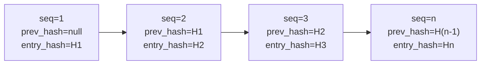

# Audit Log

Audited application paths emit an `AuditEvent`; coverage is not yet proven for every state mutation.
The `audit_event` table is append-only, hash-chained, and PostgreSQL-partitioned by month. These are
technical controls only: completeness, retention, operational monitoring, and legal adequacy under
eWpG, GwG, DORA, or GDPR require separate evidence and external review.

---

## Schema

```sql
CREATE TABLE audit_event (
    id              UUID         PRIMARY KEY DEFAULT gen_random_uuid(),
    sequence_no     BIGINT       GENERATED ALWAYS AS IDENTITY,
    event_type      TEXT         NOT NULL,
    actor_id        UUID,                        -- NULL for system-initiated events
    entity_id       UUID,                        -- The primary entity affected
    asset_id        UUID,                        -- If asset-related
    jurisdiction    TEXT,                        -- Jurisdiction context
    payload         JSONB        NOT NULL,       -- Full event details
    prev_hash       BYTEA,                       -- SHA-256 of previous entry
    entry_hash      BYTEA        NOT NULL,       -- SHA-256(prev_hash ‖ payload ‖ sequence_no)
    signature       BYTEA,                       -- Ed25519 over entry_hash (optional)
    occurred_at     TIMESTAMPTZ  NOT NULL DEFAULT now(),
    trace_id        TEXT                         -- OpenTelemetry trace ID
) PARTITION BY RANGE (occurred_at);
```

---

## Hash chain

Each `AuditEvent` carries:

- `prev_hash` — the `entry_hash` of the immediately preceding row (by `sequence_no`)
- `entry_hash` — `SHA-256(prev_hash ‖ canonical_json(payload) ‖ sequence_no)`

The first event in the chain has `prev_hash = null`; its `entry_hash` is `SHA-256(null ‖ payload ‖ 1)`.


```mermaid
graph LR
    E1["seq=1<br/>prev_hash=null<br/>entry_hash=H1"] --> E2["seq=2<br/>prev_hash=H1<br/>entry_hash=H2"]
    E2 --> E3["seq=3<br/>prev_hash=H2<br/>entry_hash=H3"]
    E3 --> En["seq=n<br/>prev_hash=H(n-1)<br/>entry_hash=Hn"]
```

**Tamper detection:** If any row is modified, its `entry_hash` will no longer match `SHA-256(prev_hash ‖ payload ‖ sequence_no)`. Every subsequent row's `prev_hash` will also be wrong. `AuditChainVerificationService.verify()` detects this and returns the sequence number of the first broken link.

---

## Append-only enforcement

A PostgreSQL trigger on `audit_event` raises an exception on any `UPDATE` or `DELETE`:

```sql
CREATE TRIGGER audit_event_no_update_delete
BEFORE UPDATE OR DELETE ON audit_event
FOR EACH ROW EXECUTE FUNCTION raise_immutable_exception();
```

Even the database superuser cannot modify records without first disabling this trigger — which itself requires a break-glass procedure and generates a `pg_audit` log entry.

---

## Daily anchor

Every 24 hours, `AuditChainVerificationService` appends an **anchor event**:

- `event_type = AUDIT_ANCHOR`
- `payload` contains the `entry_hash` of the day's last event and a UTC timestamp
- Optionally, the anchor hash is written to Ethereum mainnet as a calldata transaction, creating a public, immutable cross-reference

The anchor allows external auditors to verify that the audit chain at a given date matched a known hash, without needing to replay the entire chain from genesis.

---

## Event types

| Event type | Trigger |
|---|---|
| `ASSET_CREATED` / `ASSET_DEPLOYED` / `ASSET_STATUS_CHANGED` | Asset lifecycle |
| `KYC_SUBMITTED` / `KYC_APPROVED` / `KYC_REJECTED` / `KYC_EXPIRED` | KYC workflow |
| `HOLDER_BLOCK_CREATED` / `HOLDER_BLOCK_LIFTED` / `HOLDER_BLOCK_EXPIRY_REVIEW` | Sperrvermerk |
| `SCREENING_RUN_COMPLETED` / `SCREENING_HIT_ACCEPTED` | Sanctions screening |
| `FORCE_TRANSFER` / `FORCE_BURN` / `FORCE_APPROVE` | Privileged token operations |
| `TOTP_ENROLLED` / `TOTP_RESET` / `DUAL_CONTROL_APPROVED` / `DUAL_CONTROL_BOOTSTRAP_USED` / `APPROVAL_REQUEST_CREATED` / `_APPROVED` / `_CLAIMED` | Step-up auth |
| `ADMIN_IMPERSONATION_STARTED` / `ADMIN_IMPERSONATION_HANDOFF_EXCHANGED` / `ADMIN_IMPERSONATION_ENDED` | Admin impersonation |
| `ICT_INCIDENT_CREATED` / `ICT_INCIDENT_RESOLVED` | DORA incidents |
| `REGREPORT_SUBMITTED` | MiFIR / DAC8 filing |
| `NATURAL_PERSON_REDACTED` | GDPR erasure |
| `AUDIT_ANCHOR` | Daily hash anchor |

---

## Partition management

`audit_event` is range-partitioned by `occurred_at` (monthly partitions):

- Active partition: `audit_event_YYYY_MM` for the current month
- A `@Scheduled(cron = "0 0 1 1 * *")` job creates the next 6 months of partitions ahead of time
- `audit_event_default` catches any events that fall outside a defined partition (should never occur if the job runs correctly)

!!! warning "Partition expiry"
    The initial schema ships with partitions for 3 months. The scheduled partition creation job must run before the last partition expires, or events will fall into `audit_event_default` (which triggers a DORA `MEDIUM` incident automatically).

---

## Verifying the audit chain

```
GET  /api/v1/audit/chain/status    # latest recorded result (nightly job or a prior run)
POST /api/v1/audit/chain/verify    # run a full verification now
```

Both need `REGISTRY_ADMIN` or `AUDIT`. The response:

```json
{
  "valid": true,
  "rowsChecked": 1847293,
  "firstBrokenSequenceNo": null,
  "checkedAt": "2026-05-22T03:00:00Z",
  "reason": null,
  "status": "VALID",
  "verificationId": "6d1f..."
}
```

If `valid` is `false` (`status` `BROKEN`), `firstBrokenSequenceNo` is the `sequence_no` of the first entry where the chain breaks and `reason` says why. The verdict is persisted and drives the health indicator, the gauge `registerwerk_audit_chain_valid` (`1` valid, `0` broken, `-1` no run recorded) and the alerts `AuditChainBroken`, `AuditChainUnverified` and `AuditChainVerificationStale`.

### Acknowledging a BROKEN verdict

A broken verdict keeps `/actuator/health` **DOWN** (readiness is not affected) until **both** hold: a **later** run is valid, **and** the broken run has been acknowledged:

```
POST /api/v1/audit/verification/{verificationId}/ack?note=<free text>
```

The acknowledgement is `REGISTRY_ADMIN` only and needs step-up **and a second approver** (reason `AUDIT_CHAIN_VERIFICATION_ACK`); the operator portal's audit-log page has an acknowledge button. Only a broken verification can be acknowledged, and only once. After a restore from backup, run `POST /api/v1/audit/chain/verify`, investigate any BROKEN result, then acknowledge it so the health indicator can return to UP.

---

## Integrity model (canonical v2, anchors, retry)

- **Canonical version.** Every row carries `canon_version`. Version 2 covers `eventType`, subject, payload, **actor id, actor role, event time (`occurred_at`, epoch microseconds), correlation id and the reversal link**, so editing any of them breaks the chain. Version 1 rows (written before this change) keep verifying under the legacy envelope; an unknown version fails verification.
- **Event time.** `occurred_at` is captured synchronously when the event is published, not when the asynchronous listener writes it; `recorded_at` is the insert time. Actions performed while an operator impersonates a customer are recorded with role `REGISTRY_ADMIN_IMPERSONATING` and a hashed `_imp` object (session, impersonator, entity, mode).
- **Verification** detects: a first row that is not the genesis (head truncation, dropped partition), a last row that differs from `audit_chain_tip`, rows removed after a signed daily anchor (`audit_chain_anchor`, optionally published through an external `AuditAnchorSink`), and a missing `entry_sig` at or after the signing watermark (first signed sequence number, write-once). Enabling signing later never signs earlier rows retroactively.
- **Evidence export.** `/audit/events/export[/signed]` is ordered by `sequence_no` and starts with a `# key=value` block (`firstSeq`, `lastSeq`, `rowCount`, `truncated`, `nextAfterSeq`, `tipSeq`, `tipEntryHash`); rows include `prevHash` and `entryHash`. The signature covers header and rows. Use `afterSeq` to continue a truncated export.
- **Failed writes** are retried every minute (publications older than two minutes) and, after `registerwerk.audit.max-attempts` (20) attempts, moved to `audit_event_dead_letter`. Alert on `registerwerk_audit_oldest_incomplete_seconds` and `registerwerk_audit_dead_letter_count`.
- **Table ownership.** `REVOKE UPDATE, DELETE, TRUNCATE` and the WORM triggers do not bind the table owner, so the runtime login must not own `audit_event`. Use separate logins: the migrator/owner (`DB_USER`, passed to Flyway as `SPRING_FLYWAY_USER`) and the runtime login `registerwerk_app` (`DB_APP_USER`), which holds no UPDATE, DELETE or TRUNCATE on the audit tables and no CREATE on the schema. In production mode the start-up check fails when the runtime login owns the table or still holds those privileges, and when the two logins coincide; `registerwerk.audit.allow-owner-runtime-role=true` is an explicit acknowledgement of the interim risk for the owner case only. Production mode also requires a signing key provider.
- **External anchor.** Daily anchors can be published to an S3 bucket with Object Lock (`registerwerk.audit.anchor-sink=s3`, default `none`), so an attacker with database access cannot rewrite the anchor history; failed publications are retried hourly and counted (`registerwerk_audit_anchor_sink_failures_total`).
- **Cut-over.** `registerwerk.audit.legacy-listener=true` (default) drains publications created before the upgrade; switch it off once `event_publication` has no incomplete audit rows.
