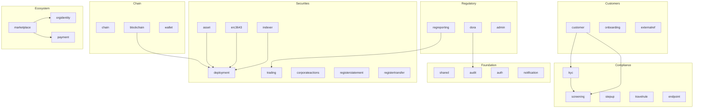

# Modularchitektur { #module-architecture }

Das Registerwerk-Backend ist ein **Modulith**: ein einzelnes bereitstellbares JAR, das intern als 34 Spring Modulith-Module strukturiert ist – jedes Top-Level-Paket unter `de.makibytes.registerwerk` trägt `@ApplicationModule`. Jeder besitzt seine Datenbanktabellen, seine Domänenentitäten und seine Geschäftslogik. Die modulübergreifende Kommunikation erfolgt ausschließlich über **Domänenereignisse** (über den Transaktionsausgang von Spring Modulith).

Die meisten sind begrenzte Kontexte im Domänensinn. Drei sind es nicht, werden aber trotzdem entsprechend annotiert, damit Modulith auch deren Grenzen durchsetzt: `shared` (übergreifende Typen), `bootstrap` (Demo-Daten-Seeder) und `infrastructure` (übergreifende `@Configuration`).

---

## Modulzuordnung { #module-map }



---

## Modulverantwortung { #module-responsibilities }

| Modul | Paket | Kerneinheiten | Schlüsseldienste |
|---|---|---|---|
| `shared` | `shared` | Ausnahmen, Hilfsmittel | — |
| `audit` | `audit` | `AuditEvent` | `AuditEventRecorder`, `AuditChainVerificationService` |
| `auth` | `auth` | `AppUser`, `UserActionToken` | `JwtMintingService`, `SecurityConfig` |
| `notification` | `notification` | — | `EmailNotificationService` (ereignisgesteuert) |
| `chain` | `chain` | `ChainConfig`, `RpcNode` | `ChainConfigService` |
| `blockchain` | `blockchain` | `BlockchainTransaction` | `BlockchainClientRegistry`, Bereitstellungsdienste, `RpcNodeHealthService` |
| `wallet` | `wallet` | `OperatorWallet` | `WalletService`, `WalletBalanceService` |
| `kyc` | `kyc` | `KycDocument`, `NaturalPerson`, `BeneficialOwner`, `HolderBlock` | `KycService`, `KycMonitoringJob` |
| `screening` | `screening` | `ScreeningRun`, `ScreeningHit` | `ScreeningService`, Adapter |
| `stepup` | `stepup` | `StepUpToken`, `DualControlToken` | `StepUpService`, `StepUpEnforcementAspect` |
| `travelrule` | `travelrule` | `TravelRuleMessage` | `TravelRuleService`, Adapter |
| `endpoint` | `endpoint` | `AddressEndpoint` | `EndpointService` – risikobewertetes Kontrahenten-Wallet-Adressregister (`RiskLevel`), das von Travel-Rule-/AML-Prüfungen konsumiert wird |
| `customer` | `customer` | `LegalEntity`, `CompanyUser` | `LegalEntityService`, `CompanyUserService` |
| `onboarding` | `onboarding` | `OnboardingToken` | `OnboardingService` |
| `externalref` | `externalref` | `CompanyExternalReference` | `RegistryOverviewService` |
| `asset` | `asset` | `Asset`, `AssetDocument` | `AssetService`, `MintControlService` |
| `deployment` | `deployment` | `AssetDeployment`, `AssetHolder`, `AssetBondTerms`, `AssetSlot`, `VaultRequest`, `AssetVaultState`, `MintControlRule` | Portschnittstellen |
| `erc3643` | `erc3643` | `OnchainIdentity`, `OnchainClaim` | `IdentityRegistryService`, `ClaimIssuanceService` |
| `indexer` | `indexer` | `IndexerState` | `HolderSyncScheduler`, `IndexerMonitorService` |
| `trading` | `trading` | `TradeListing`, `TradeExecution` | `TradingService` |
| `corporateactions` | `corporateactions` | `CorporateAction` | `CorporateActionService` (Vier-Augen-Abwicklungsgenehmigung, tägliche Lebenszyklusübergänge), `CouponPaymentJob`, `CorporateActionSettlementListener` (Abwicklung geroutet per Token-Standard – Canton-Anleihen automatisiert, ERC-3525/4626/7540 zur Überprüfung durch den Betreiber zurückgehalten); Betreiber-Oberfläche: Reiter „Corporate Actions“ auf der Asset-Detailseite |
| `registerstatement` | `registerstatement` | `RegisterStatement` | `RegisterStatementService`, `AnnualRegisterStatementJob`, `RegisterStatementPdfRenderer` – jährliche/auf Abruf verfügbare eWpG-Registerauszüge für Anleger |
| `registertransfer` | `registertransfer` | `RegisterTransfer`, `RegisterInspectionRequest` | `RegisterTransferService`, `RegisterInspectionService`, `RegisterExtractRenderer` – Registerauszug-Exporte und Einsichtnahmeanfragen Dritter |
| `regreporting` | `regreporting` | `RegreportSubmission` | `MifirReportingService`, `Dac8ExportService` (beide Entwürfe/nicht validierte Prototypen) |
| `dora` | `dora` | `IctIncident`, `ThirdPartyProvider`, `ResilienceTest` | `DoraService` — Art. 17 Vorfälle, Art. 28 Drittanbieterregister, Art. 24/25 Resilienztests (Schwachstellenscans, TLPT) |
| `admin` | `admin` | `OperatorUser` | `AdminImpersonationService` |
| `orgidentity` | `orgidentity` | `OrgRegistration`, `OrgMemberWallet`, `PermissionDefinition`, `PermissionGrant`, `EcosystemTrustedIssuer` | `OrgRegistrationService`, `MemberWalletService`, `PermissionAdminService`; stellt den `PermissionGate`-Port bereit |
| `marketplace` | `marketplace` | `DappListing`, `DappVersion`, `DappRequiredPermission`, `DappPaymentMethod`, `DappReviewEvent` | `ListingLifecycleService`, `ManifestValidationService`, `ManifestSigningService`, `MarketplaceOnchainAnchorService` |
| `payment` | `payment` | `PaymentRail`, `PaymentRailChainAddress` | `PaymentRailAdminService` – vom Betreiber kuratierte Zahlungswege (MiCAR-Stablecoins, Pontes-API, ERC-7573-DvP, SEPA), auf die dApp-Manifeste per Code verweisen |

---

## Paketstruktur pro Modul { #package-structure-per-module }

Jedes Modul folgt derselben internen Struktur:

```
<module>/
├── package-info.java          @ApplicationModule(displayName = "...")
├── api/
│   ├── package-info.java      @NamedInterface — public types
│   ├── <Entity>.java          JPA entities / interfaces
│   ├── <Entity>Repository.java
│   └── <ModulePort>.java      Port interface for cross-module calls
├── internal/
│   ├── <Service>.java         Business logic — not accessible by other modules
│   ├── <Job>.java             Scheduled tasks
│   └── <Adapter>.java         Outbound port implementations
├── events/
│   ├── package-info.java      @NamedInterface
│   └── <Event>.java           Domain events — records only
└── web/
    ├── package-info.java      @NamedInterface
    ├── <Controller>.java      REST controllers
    └── dto/
        ├── package-info.java  @NamedInterface
        └── <Request/Response>.java  Java records with Bean Validation
```

---

## Modulübergreifende Kommunikationsmuster { #cross-module-communication-patterns }

### Ereignisse (asynchron, Outbox-gestützt) { #events-async-outbox-backed }

Das bevorzugte Muster. Ereignisse werden über `ApplicationEventPublisher` veröffentlicht und von `@ApplicationModuleListener` konsumiert. Die Spring-Modulith-Outbox (Tabelle `event_publication`) garantiert eine mindestens einmalige Zustellung auch über Neustarts hinweg:

```java
// In KycService (kyc module) — publisher
eventPublisher.publishEvent(new KycApprovedEvent(entityId));

// In ClaimIssuanceService (erc3643 module) — consumer
@ApplicationModuleListener
void on(KycApprovedEvent event) {
    identityRegistryService.deployIdentity(event.entityId());
}
```

### Ports (Synchronisation, modulübergreifende Abfrage) { #ports-sync-cross-module-query }

Wenn ein Modul Daten eines anderen Moduls synchron abfragen muss (z. B. `Asset`-Daten aus dem `blockchain`-Modul lesen), verwendet es eine **Port-Schnittstelle**, die im `api/`-Paket des Quellmoduls definiert ist:

```java
// In deployment/api/ — port interface
public interface AssetLookupPort {
    Optional<AssetInfo> findById(UUID assetId);
}

// In asset/internal/ — implementation
@Service
public class AssetLookupPortImpl implements AssetLookupPort { ... }
```

Dadurch wird der Import von JPA-Entitäten über Modulgrenzen hinweg vermieden (was Modulzyklen erzeugen würde).

---

## Warum es das Modul `deployment` gibt { #why-the-deployment-module-exists }

On-Chain-Zustandsentitäten – `AssetDeployment`, `AssetHolder`, `AssetVaultState`, `VaultRequest`, `AssetSlot`, `AssetTokenUnit`, `AssetBondTerms`, `MintControlRule`, `AssetCouponPayment` – werden sowohl vom `asset`-Modul (Geschäftslogik) als auch vom `blockchain`-Modul (On-Chain-Operationen) benötigt. Sie in einem der beiden Module zu platzieren, würde eine zirkuläre Abhängigkeit erzeugen.

Das Modul `deployment` ist ein **neutrales Datenmodul**: Es besitzt diese Entitäten und stellt sie über `@NamedInterface` in seinem `api/`-Paket bereit. Sowohl `asset` als auch `blockchain` hängen von `deployment` ab, aber keines von beiden hängt vom anderen ab – das durchbricht den Kreislauf.
