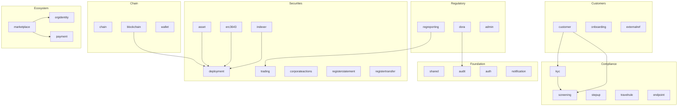

# Arquitectura de módulos { #module-architecture }

El backend de Registerwerk es un **modulith**: un único JAR desplegable estructurado internamente como 34 módulos de Spring Modulith; cada paquete de nivel superior en `de.makibytes.registerwerk` lleva `@ApplicationModule`. Cada uno posee sus tablas de base de datos, sus entidades de dominio y su lógica de negocio. La comunicación entre módulos ocurre exclusivamente a través de **eventos de dominio** (mediante la bandeja de salida transaccional — outbox — de Spring Modulith).

La mayoría son contextos acotados en el sentido de dominio. Tres no lo son, y están anotados de todos modos para que Modulith también aplique sus límites: `shared` (tipos transversales), `bootstrap` (sembradoras de datos de demostración) y `infrastructure` (`@Configuration` transversal).

---

## Mapa del módulo { #module-map }



---

## Responsabilidades del módulo { #module-responsibilities }

| Módulo | Paquete | Entidades centrales | Servicios clave |
|---|---|---|---|
| `shared` | `shared` | Excepciones, utilidades | — |
| `audit` | `audit` | `AuditEvent` | `AuditEventRecorder`, `AuditChainVerificationService` |
| `auth` | `auth` | `AppUser`, `UserActionToken` | `JwtMintingService`, `SecurityConfig` |
| `notification` | `notification` | — | `EmailNotificationService` (basado en eventos) |
| `chain` | `chain` | `ChainConfig`, `RpcNode` | `ChainConfigService` |
| `blockchain` | `blockchain` | `BlockchainTransaction` | `BlockchainClientRegistry`, servicios de implementación, `RpcNodeHealthService` |
| `wallet` | `wallet` | `OperatorWallet` | `WalletService`, `WalletBalanceService` |
| `kyc` | `kyc` | `KycDocument`, `NaturalPerson`, `BeneficialOwner`, `HolderBlock` | `KycService`, `KycMonitoringJob` |
| `screening` | `screening` | `ScreeningRun`, `ScreeningHit` | `ScreeningService`, adaptadores |
| `stepup` | `stepup` | `StepUpToken`, `DualControlToken` | `StepUpService`, `StepUpEnforcementAspect` |
| `travelrule` | `travelrule` | `TravelRuleMessage` | `TravelRuleService`, adaptadores |
| `endpoint` | `endpoint` | `AddressEndpoint` | `EndpointService` — registro de direcciones de monedero de contraparte con puntuación de riesgo (`RiskLevel`), consumido por las verificaciones de Travel Rule/AML |
| `customer` | `customer` | `LegalEntity`, `CompanyUser` | `LegalEntityService`, `CompanyUserService` |
| `onboarding` | `onboarding` | `OnboardingToken` | `OnboardingService` |
| `externalref` | `externalref` | `CompanyExternalReference` | `RegistryOverviewService` |
| `asset` | `asset` | `Asset`, `AssetDocument` | `AssetService`, `MintControlService` |
| `deployment` | `deployment` | `AssetDeployment`, `AssetHolder`, `AssetBondTerms`, `AssetSlot`, `VaultRequest`, `AssetVaultState`, `MintControlRule` | Interfaces de puerto |
| `erc3643` | `erc3643` | `OnchainIdentity`, `OnchainClaim` | `IdentityRegistryService`, `ClaimIssuanceService` |
| `indexer` | `indexer` | `IndexerState` | `HolderSyncScheduler`, `IndexerMonitorService` |
| `trading` | `trading` | `TradeListing`, `TradeExecution` | `TradingService` |
| `corporateactions` | `corporateactions` | `CorporateAction` | `CorporateActionService` (aprobación de liquidación con control dual, transiciones diarias del ciclo de vida), `CouponPaymentJob`, `CorporateActionSettlementListener` (enruta la liquidación según el estándar de token: bonos de Canton automatizados, ERC-3525/4626/7540 retenidos para revisión del operador); interfaz de operador: pestaña Corporate Actions en la página de detalle del activo |
| `registerstatement` | `registerstatement` | `RegisterStatement` | `RegisterStatementService`, `AnnualRegisterStatementJob`, `RegisterStatementPdfRenderer` — extractos registrales (Registerauszug) eWpG anuales/bajo demanda para los titulares |
| `registertransfer` | `registertransfer` | `RegisterTransfer`, `RegisterInspectionRequest` | `RegisterTransferService`, `RegisterInspectionService`, `RegisterExtractRenderer`: exportaciones de extractos de registros y solicitudes de inspección de terceros |
| `regreporting` | `regreporting` | `RegreportSubmission` | `MifirReportingService`, `Dac8ExportService` (ambos prototipos borrador/no validados) |
| `dora` | `dora` | `IctIncident`, `ThirdPartyProvider`, `ResilienceTest` | `DoraService` — incidentes del art. 17, registro de terceros del art. 28, pruebas de resiliencia de los arts. 24/25 (análisis de vulnerabilidades, TLPT) |
| `admin` | `admin` | `OperatorUser` | `AdminImpersonationService` |
| `orgidentity` | `orgidentity` | `OrgRegistration`, `OrgMemberWallet`, `PermissionDefinition`, `PermissionGrant`, `EcosystemTrustedIssuer` | `OrgRegistrationService`, `MemberWalletService`, `PermissionAdminService`; expone el puerto `PermissionGate` |
| `marketplace` | `marketplace` | `DappListing`, `DappVersion`, `DappRequiredPermission`, `DappPaymentMethod`, `DappReviewEvent` | `ListingLifecycleService`, `ManifestValidationService`, `ManifestSigningService`, `MarketplaceOnchainAnchorService` |
| `payment` | `payment` | `PaymentRail`, `PaymentRailChainAddress` | `PaymentRailAdminService` — vías de pago seleccionadas por el operador (stablecoins MiCAR, API de Pontes, DvP ERC-7573, SEPA) que los manifiestos de dApp referencian por código |

---

## Estructura del paquete por módulo { #package-structure-per-module }

Todos los módulos siguen la misma estructura interna:

```
<module>/
├── package-info.java          @ApplicationModule(displayName = "...")
├── api/
│   ├── package-info.java      @NamedInterface — public types
│   ├── <Entity>.java          JPA entities / interfaces
│   ├── <Entity>Repository.java
│   └── <ModulePort>.java      Port interface for cross-module calls
├── internal/
│   ├── <Service>.java         Business logic — not accessible by other modules
│   ├── <Job>.java             Scheduled tasks
│   └── <Adapter>.java         Outbound port implementations
├── events/
│   ├── package-info.java      @NamedInterface
│   └── <Event>.java           Domain events — records only
└── web/
    ├── package-info.java      @NamedInterface
    ├── <Controller>.java      REST controllers
    └── dto/
        ├── package-info.java  @NamedInterface
        └── <Request/Response>.java  Java records with Bean Validation
```

---

## Patrones de comunicación entre módulos { #cross-module-communication-patterns }

### Eventos (asincrónicos, respaldados por la bandeja de salida) { #events-async-outbox-backed }

El patrón preferido. Los eventos se publican a través de `ApplicationEventPublisher` y son consumidos por `@ApplicationModuleListener`. La bandeja de salida de Spring Modulith (tabla `event_publication`) garantiza la entrega al menos una vez incluso después de reinicios:

```java
// In KycService (kyc module) — publisher
eventPublisher.publishEvent(new KycApprovedEvent(entityId));

// In ClaimIssuanceService (erc3643 module) — consumer
@ApplicationModuleListener
void on(KycApprovedEvent event) {
    identityRegistryService.deployIdentity(event.entityId());
}
```

### Puertos (sincronización, consulta entre módulos) { #ports-sync-cross-module-query }

Cuando un módulo necesita consultar datos propiedad de otro módulo de forma sincrónica (por ejemplo, leer datos `Asset` desde el módulo `blockchain`), utiliza una **interfaz de puerto** definida en el paquete `api/` del módulo de origen:

```java
// In deployment/api/ — port interface
public interface AssetLookupPort {
    Optional<AssetInfo> findById(UUID assetId);
}

// In asset/internal/ — implementation
@Service
public class AssetLookupPortImpl implements AssetLookupPort { ... }
```

Esto evita importar entidades JPA a través de los límites del módulo (lo que crearía ciclos de módulo).

---

## Por qué existe el módulo `deployment` { #why-the-deployment-module-exists }

Las entidades de estado en cadena — `AssetDeployment`, `AssetHolder`, `AssetVaultState`, `VaultRequest`, `AssetSlot`, `AssetTokenUnit`, `AssetBondTerms`, `MintControlRule`, `AssetCouponPayment` — son necesarias tanto para el módulo `asset` (lógica de negocio) como para el módulo `blockchain` (operaciones en cadena). Colocarlas en cualquiera de los dos módulos crearía una dependencia circular.

El módulo `deployment` es un **módulo de datos neutral**: posee estas entidades y las expone a través de `@NamedInterface` en su paquete `api/`. Tanto `asset` como `blockchain` dependen de `deployment`, pero ninguno depende del otro, rompiendo el ciclo.
