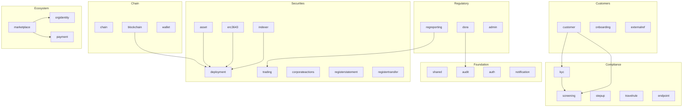

# Architecture des modules { #module-architecture }

Le backend Registerwerk est un **modulith** : un seul JAR déployable structuré en interne en 34 modules Spring Modulith — chaque package de niveau supérieur sous `de.makibytes.registerwerk` contient `@ApplicationModule`. Chacun possède ses tables de base de données, ses entités de domaine et sa logique métier. La communication entre modules se produit exclusivement via des **événements de domaine** (via la boîte d'envoi transactionnelle Spring Modulith).

La plupart sont des contextes délimités au sens du domaine. Trois ne le sont pas, et sont de toute façon annotés afin que Modulith applique également leurs limites : `shared` (types transversaux), `bootstrap` (semeurs de données de démonstration) et `infrastructure` (`@Configuration` transversal).

---

## Module map { #module-map }



---

## Responsabilités du module { #module-responsibilities }

| Module | Package | Entités principales | Services clés |
|---|---|---|---|
| `shared` | `shared` | Exceptions, utilitaires | — |
| `audit` | `audit` | `AuditEvent` | `AuditEventRecorder`, `AuditChainVerificationService` |
| `auth` | `auth` | `AppUser`, `UserActionToken` | `JwtMintingService`, `SecurityConfig` |
| `notification` | `notification` | — | `EmailNotificationService` (piloté par les événements) |
| `chain` | `chain` | `ChainConfig`, `RpcNode` | `ChainConfigService` |
| `blockchain` | `blockchain` | `BlockchainTransaction` | `BlockchainClientRegistry`, services de déploiement, `RpcNodeHealthService` |
| `wallet` | `wallet` | `OperatorWallet` | `WalletService`, `WalletBalanceService` |
| `kyc` | `kyc` | `KycDocument`, `NaturalPerson`, `BeneficialOwner`, `HolderBlock` | `KycService`, `KycMonitoringJob` |
| `screening` | `screening` | `ScreeningRun`, `ScreeningHit` | `ScreeningService`, adaptateurs |
| `stepup` | `stepup` | `StepUpToken`, `DualControlToken` | `StepUpService`, `StepUpEnforcementAspect` |
| `travelrule` | `travelrule` | `TravelRuleMessage` | `TravelRuleService`, adaptateurs |
| `endpoint` | `endpoint` | `AddressEndpoint` | `EndpointService` — registre d'adresses de portefeuille de contrepartie à risque (`RiskLevel`) consommé par les contrôles de règle de voyage/AML |
| `customer` | `customer` | `LegalEntity`, `CompanyUser` | `LegalEntityService`, `CompanyUserService` |
| `onboarding` | `onboarding` | `OnboardingToken` | `OnboardingService` |
| `externalref` | `externalref` | `CompanyExternalReference` | `RegistryOverviewService` |
| `asset` | `asset` | `Asset`, `AssetDocument` | `AssetService`, `MintControlService` |
| `deployment` | `deployment` | `AssetDeployment`, `AssetHolder`, `AssetBondTerms`, `AssetSlot`, `VaultRequest`, `AssetVaultState`, `MintControlRule` | Interfaces de ports |
| `erc3643` | `erc3643` | `OnchainIdentity`, `OnchainClaim` | `IdentityRegistryService`, `ClaimIssuanceService` |
| `indexer` | `indexer` | `IndexerState` | `HolderSyncScheduler`, `IndexerMonitorService` |
| `trading` | `trading` | `TradeListing`, `TradeExecution` | `TradingService` |
| `corporateactions` | `corporateactions` | `CorporateAction` | `CorporateActionService` (approbation de règlement à double contrôle, transitions quotidiennes du cycle de vie), `CouponPaymentJob`, `CorporateActionSettlementListener` (règlement des itinéraires par norme de jeton — obligations cantonales automatisées, ERC-3525/4626/7540 détenues pour examen par l'opérateur) ; interface utilisateur de l'opérateur : onglet Opérations sur titres sur la page de détails de l'actif |
| `registerstatement` | `registerstatement` | `RegisterStatement` | `RegisterStatementService`, `AnnualRegisterStatementJob`, `RegisterStatementPdfRenderer` — déclarations annuelles/sur demande du registre eWpG aux investisseurs |
| `registertransfer` | `registertransfer` | `RegisterTransfer`, `RegisterInspectionRequest` | `RegisterTransferService`, `RegisterInspectionService`, `RegisterExtractRenderer` — exports d'extraits de registre et demandes d'inspection par des tiers |
| `regreporting` | `regreporting` | `RegreportSubmission` | `MifirReportingService`, `Dac8ExportService` (tous deux prototypes brouillons/non validés) |
| `dora` | `dora` | `IctIncident`, `ThirdPartyProvider`, `ResilienceTest` | `DoraService` — incidents Art. 17, registre des tiers Art. 28, tests de résilience Art. 24/25 (analyses de vulnérabilité, TLPT) |
| `admin` | `admin` | `OperatorUser` | `AdminImpersonationService` |
| `orgidentity` | `orgidentity` | `OrgRegistration`, `OrgMemberWallet`, `PermissionDefinition`, `PermissionGrant`, `EcosystemTrustedIssuer` | `OrgRegistrationService`, `MemberWalletService`, `PermissionAdminService` ; expose le port `PermissionGate` |
| `marketplace` | `marketplace` | `DappListing`, `DappVersion`, `DappRequiredPermission`, `DappPaymentMethod`, `DappReviewEvent` | `ListingLifecycleService`, `ManifestValidationService`, `ManifestSigningService`, `MarketplaceOnchainAnchorService` |
| `payment` | `payment` | `PaymentRail`, `PaymentRailChainAddress` | `PaymentRailAdminService` — rails de paiement organisés par l'opérateur (stablecoins MiCAR, API Pontes, DvP ERC-7573, SEPA) que les manifestes de dApp référencent par code |

---

## Structure du package par module { #package-structure-per-module }

Chaque module suit la même structure interne :

```
<module>/
├── package-info.java          @ApplicationModule(displayName = "...")
├── api/
│   ├── package-info.java      @NamedInterface — public types
│   ├── <Entity>.java          JPA entities / interfaces
│   ├── <Entity>Repository.java
│   └── <ModulePort>.java      Port interface for cross-module calls
├── internal/
│   ├── <Service>.java         Business logic — not accessible by other modules
│   ├── <Job>.java             Scheduled tasks
│   └── <Adapter>.java         Outbound port implementations
├── events/
│   ├── package-info.java      @NamedInterface
│   └── <Event>.java           Domain events — records only
└── web/
    ├── package-info.java      @NamedInterface
    ├── <Controller>.java      REST controllers
    └── dto/
        ├── package-info.java  @NamedInterface
        └── <Request/Response>.java  Java records with Bean Validation
```

---

## Modèles de communication entre modules { #cross-module-communication-patterns }

### Événements (asynchrones, sauvegardés dans la boîte d'envoi) { #events-async-outbox-backed }

Le modèle préféré. Les événements sont publiés via `ApplicationEventPublisher` et consommés par `@ApplicationModuleListener`. La boîte d'envoi Spring Modulith (table `event_publication`) garantit une livraison au moins une fois, même après les redémarrages :

```java
// In KycService (kyc module) — publisher
eventPublisher.publishEvent(new KycApprovedEvent(entityId));

// In ClaimIssuanceService (erc3643 module) — consumer
@ApplicationModuleListener
void on(KycApprovedEvent event) {
    identityRegistryService.deployIdentity(event.entityId());
}
```

### Ports (synchronisation, requête inter-modules) { #ports-sync-cross-module-query }

Lorsqu'un module doit interroger des données appartenant à un autre module de manière synchrone (par exemple, lire les données `Asset` à partir du module `blockchain`), il utilise une **interface de port** définie dans le package `api/` du module source :

```java
// In deployment/api/ — port interface
public interface AssetLookupPort {
    Optional<AssetInfo> findById(UUID assetId);
}

// In asset/internal/ — implementation
@Service
public class AssetLookupPortImpl implements AssetLookupPort { ... }
```

Cela évite d'importer des entités JPA au-delà des limites du module (ce qui créerait des cycles de module).

---

## Pourquoi le module `deployment` existe { #why-the-deployment-module-exists }

Entités d'état en chaîne - `AssetDeployment`, `AssetHolder`, `AssetVaultState`, `VaultRequest`, `AssetSlot`, `AssetTokenUnit`, `AssetBondTerms`, `MintControlRule`, `AssetCouponPayment` — sont nécessaires à la fois au module `asset` (logique métier) et au module `blockchain` (opérations en chaîne). Les placer dans l'un ou l'autre module créerait une dépendance circulaire.

Le module `deployment` est un **module de données neutre** : il possède ces entités et les expose via `@NamedInterface` dans son package `api/`. `asset` et `blockchain` dépendent tous deux de `deployment`, mais aucun ne dépend de l'autre – brisant le cycle.
