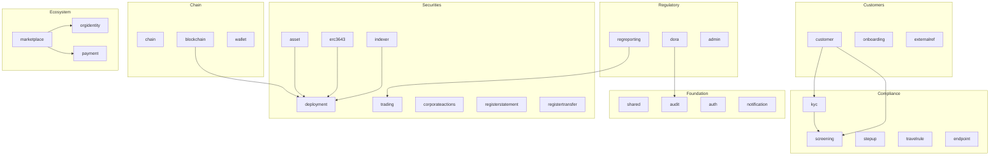

# Architettura del modulo { #module-architecture }

Il backend Registerwerk è un **modulith**: un singolo JAR distribuibile strutturato internamente come 34 moduli Spring Modulith: ogni pacchetto di livello superiore sotto `de.makibytes.registerwerk` trasporta `@ApplicationModule`. Ciascuno possiede le proprie tabelle di database, le proprie entità di dominio e la propria logica aziendale. La comunicazione tra moduli avviene esclusivamente tramite **eventi di dominio** (tramite l'outbox transazionale di Spring Modulith).

La maggior parte sono contesti delimitati nel senso del dominio. Tre non lo sono e sono comunque annotati in modo che anche Modulith rafforzi i propri limiti: `shared` (tipi trasversali), `bootstrap` (seminatrici di dati demo) e `infrastructure` (`@Configuration` trasversali).

---

## Mappa dei moduli { #module-map }



---

## Responsabilità del modulo { #module-responsibilities }

| Modulo | Pacchetto | Entità principali | Servizi principali |
|---|---|---|---|
| `shared` | `shared` | Eccezioni, utilità | — |
| `audit` | `audit` | `AuditEvent` | `AuditEventRecorder`, `AuditChainVerificationService` |
| `auth` | `auth` | `AppUser`, `UserActionToken` | `JwtMintingService`, `SecurityConfig` |
| `notification` | `notification` | — | `EmailNotificationService` (guidato da eventi) |
| `chain` | `chain` | `ChainConfig`, `RpcNode` | `ChainConfigService` |
| `blockchain` | `blockchain` | `BlockchainTransaction` | `BlockchainClientRegistry`, servizi di distribuzione, `RpcNodeHealthService` |
| `wallet` | `wallet` | `OperatorWallet` | `WalletService`, `WalletBalanceService` |
| `kyc` | `kyc` | `KycDocument`, `NaturalPerson`, `BeneficialOwner`, `HolderBlock` | `KycService`, `KycMonitoringJob` |
| `screening` | `screening` | `ScreeningRun`, `ScreeningHit` | `ScreeningService`, adattatori |
| `stepup` | `stepup` | `StepUpToken`, `DualControlToken` | `StepUpService`, `StepUpEnforcementAspect` |
| `travelrule` | `travelrule` | `TravelRuleMessage` | `TravelRuleService`, adattatori |
| `endpoint` | `endpoint` | `AddressEndpoint` | `EndpointService` — registro degli indirizzi del portafoglio della controparte con punteggio di rischio (`RiskLevel`) utilizzato dai controlli travel-rule/AML |
| `customer` | `customer` | `LegalEntity`, `CompanyUser` | `LegalEntityService`, `CompanyUserService` |
| `onboarding` | `onboarding` | `OnboardingToken` | `OnboardingService` |
| `externalref` | `externalref` | `CompanyExternalReference` | `RegistryOverviewService` |
| `asset` | `asset` | `Asset`, `AssetDocument` | `AssetService`, `MintControlService` |
| `deployment` | `deployment` | `AssetDeployment`, `AssetHolder`, `AssetBondTerms`, `AssetSlot`, `VaultRequest`, `AssetVaultState`, `MintControlRule` | Interfacce porta |
| `erc3643` | `erc3643` | `OnchainIdentity`, `OnchainClaim` | `IdentityRegistryService`, `ClaimIssuanceService` |
| `indexer` | `indexer` | `IndexerState` | `HolderSyncScheduler`, `IndexerMonitorService` |
| `trading` | `trading` | `TradeListing`, `TradeExecution` | `TradingService` |
| `corporateactions` | `corporateactions` | `CorporateAction` | `CorporateActionService` (approvazione della transazione a doppio controllo, transizioni del ciclo di vita giornaliero), `CouponPaymentJob`, `CorporateActionSettlementListener` (regolamento delle rotte tramite token standard - Canton bond automatizzato, ERC-3525/4626/7540 trattenuto per la revisione dell'operatore); UI dell'operatore: scheda Azioni aziendali nella pagina dei dettagli della risorsa |
| `registerstatement` | `registerstatement` | `RegisterStatement` | `RegisterStatementService`, `AnnualRegisterStatementJob`, `RegisterStatementPdfRenderer` — estratti conto annuali/su richiesta eWpG per gli investitori |
| `registertransfer` | `registertransfer` | `RegisterTransfer`, `RegisterInspectionRequest` | `RegisterTransferService`, `RegisterInspectionService`, `RegisterExtractRenderer` — registra le esportazioni di estratti e le richieste di ispezione di terze parti |
| `regreporting` | `regreporting` | `RegreportSubmission` | `MifirReportingService`, `Dac8ExportService` (entrambi i prototipi bozza/non convalidati) |
| `dora` | `dora` | `IctIncident`, `ThirdPartyProvider`, `ResilienceTest` | `DoraService` — Art. 17 incidenti, art. 28 registro dei terzi, art. 24/25 test di resilienza (scansioni di vulnerabilità, TLPT) |
| `admin` | `admin` | `OperatorUser` | `AdminImpersonationService` |
| `orgidentity` | `orgidentity` | `OrgRegistration`, `OrgMemberWallet`, `PermissionDefinition`, `PermissionGrant`, `EcosystemTrustedIssuer` | `OrgRegistrationService`, `MemberWalletService`, `PermissionAdminService`; espone la porta `PermissionGate` |
| `marketplace` | `marketplace` | `DappListing`, `DappVersion`, `DappRequiredPermission`, `DappPaymentMethod`, `DappReviewEvent` | `ListingLifecycleService`, `ManifestValidationService`, `ManifestSigningService`, `MarketplaceOnchainAnchorService` |
| `payment` | `payment` | `PaymentRail`, `PaymentRailChainAddress` | `PaymentRailAdminService` — canali di pagamento curati dall'operatore (stablecoin MiCAR, API Pontes, DvP ERC-7573, SEPA), a cui i manifest delle dApp fanno riferimento tramite codice |

---

## Struttura del pacchetto per modulo { #package-structure-per-module }

Ogni modulo segue la stessa struttura interna:

```
<module>/
├── package-info.java          @ApplicationModule(displayName = "...")
├── api/
│   ├── package-info.java      @NamedInterface — public types
│   ├── <Entity>.java          JPA entities / interfaces
│   ├── <Entity>Repository.java
│   └── <ModulePort>.java      Port interface for cross-module calls
├── internal/
│   ├── <Service>.java         Business logic — not accessible by other modules
│   ├── <Job>.java             Scheduled tasks
│   └── <Adapter>.java         Outbound port implementations
├── events/
│   ├── package-info.java      @NamedInterface
│   └── <Event>.java           Domain events — records only
└── web/
    ├── package-info.java      @NamedInterface
    ├── <Controller>.java      REST controllers
    └── dto/
        ├── package-info.java  @NamedInterface
        └── <Request/Response>.java  Java records with Bean Validation
```

---

## Schemi di comunicazione tra moduli { #cross-module-communication-patterns }

### Eventi (asincroni, supportati da outbox) { #events-async-outbox-backed }

Lo schema preferito. Gli eventi vengono pubblicati tramite `ApplicationEventPublisher` e consumati da `@ApplicationModuleListener`. L'outbox di Spring Modulith (tabella `event_publication`) garantisce la consegna almeno una volta anche tra i riavvii:

```java
// In KycService (kyc module) — publisher
eventPublisher.publishEvent(new KycApprovedEvent(entityId));

// In ClaimIssuanceService (erc3643 module) — consumer
@ApplicationModuleListener
void on(KycApprovedEvent event) {
    identityRegistryService.deployIdentity(event.entityId());
}
```

### Porte (sincronizzazione, query tra moduli) { #ports-sync-cross-module-query }

Quando un modulo deve interrogare i dati di proprietà di un altro modulo in modo sincrono (ad esempio, leggere i dati `Asset` dall'interno del modulo `blockchain`), utilizza un'**interfaccia di porta** definita nel pacchetto `api/` del modulo sorgente:

```java
// In deployment/api/ — port interface
public interface AssetLookupPort {
    Optional<AssetInfo> findById(UUID assetId);
}

// In asset/internal/ — implementation
@Service
public class AssetLookupPortImpl implements AssetLookupPort { ... }
```

Ciò evita di importare entità JPA oltre i confini del modulo (il che creerebbe cicli del modulo).

---

## Perché esiste il modulo `deployment` { #why-the-deployment-module-exists }

Entità con stato in catena: `AssetDeployment`, `AssetHolder`, `AssetVaultState`, `VaultRequest`, `AssetSlot`, `AssetTokenUnit`, `AssetBondTerms`, `MintControlRule`, `AssetCouponPayment` — sono necessari sia dal modulo `asset` (logica aziendale) che dal modulo `blockchain` (operazioni on-chain). Posizionarli in uno dei moduli creerebbe una dipendenza circolare.

Il modulo `deployment` è un **modulo dati neutrale**: possiede queste entità e le espone tramite `@NamedInterface` nel suo pacchetto `api/`. Sia `asset` che `blockchain` dipendono da `deployment`, ma nessuno dei due dipende dall'altro, interrompendo il ciclo.
