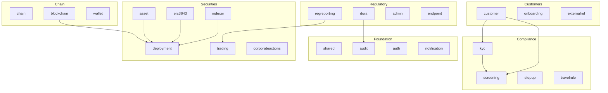

# Module Architecture

The Registerwerk backend is a **modulith**: a single deployable JAR internally structured as 22 Spring Modulith bounded contexts. Each module owns its database tables, its domain entities, and its business logic. Cross-module communication happens exclusively through **domain events** (via the Spring Modulith transactional outbox).

---

## Module map



---

## Module responsibilities

| Module | Package | Core entities | Key services |
|---|---|---|---|
| `shared` | `shared` | Exceptions, utils | — |
| `audit` | `audit` | `AuditEvent` | `AuditEventRecorder`, `AuditChainVerificationService` |
| `auth` | `auth` | `AppUser`, `UserActionToken` | `JwtMintingService`, `SecurityConfig` |
| `notification` | `notification` | — | `EmailNotificationService` (event-driven) |
| `chain` | `chain` | `ChainConfig`, `RpcNode` | `ChainConfigService` |
| `blockchain` | `blockchain` | `BlockchainTransaction` | `BlockchainClientRegistry`, deployment services, `RpcNodeHealthService` |
| `wallet` | `wallet` | `OperatorWallet` | `WalletService`, `WalletBalanceService` |
| `kyc` | `kyc` | `KycDocument`, `NaturalPerson`, `BeneficialOwner`, `HolderBlock` | `KycService`, `KycMonitoringJob` |
| `screening` | `screening` | `ScreeningRun`, `ScreeningHit` | `ScreeningService`, adapters |
| `stepup` | `stepup` | `StepUpToken`, `DualControlToken` | `StepUpService`, `StepUpEnforcementAspect` |
| `travelrule` | `travelrule` | `TravelRuleMessage` | `TravelRuleService`, adapters |
| `customer` | `customer` | `LegalEntity`, `CompanyUser` | `LegalEntityService`, `CompanyUserService` |
| `onboarding` | `onboarding` | `OnboardingToken` | `OnboardingService` |
| `externalref` | `externalref` | `CompanyExternalReference` | `RegistryOverviewService` |
| `asset` | `asset` | `Asset`, `AssetDocument` | `AssetService`, `MintControlService` |
| `deployment` | `deployment` | `AssetDeployment`, `AssetHolder`, `AssetBondTerms`, `AssetSlot`, `VaultRequest`, `AssetVaultState`, `MintControlRule` | Port interfaces |
| `erc3643` | `erc3643` | `OnchainIdentity`, `OnchainClaim` | `IdentityRegistryService`, `ClaimIssuanceService` |
| `indexer` | `indexer` | `IndexerState` | `HolderSyncScheduler`, `IndexerMonitorService` |
| `trading` | `trading` | `TradeListing`, `TradeExecution` | `TradingService` |
| `corporateactions` | `corporateactions` | `CorporateAction` | `CorporateActionService`, `CouponScheduler` |
| `regreporting` | `regreporting` | `RegreportSubmission` | `MifirReportingService`, `CrarsExportService` |
| `dora` | `dora` | `IctIncident`, `ThirdPartyProvider` | `DoraService` |
| `admin` | `admin` | `OperatorUser` | `AdminImpersonationService` |

---

## Package structure per module

Every module follows the same internal structure:

```
<module>/
├── package-info.java          @ApplicationModule(displayName = "...")
├── api/
│   ├── package-info.java      @NamedInterface — public types
│   ├── <Entity>.java          JPA entities / interfaces
│   ├── <Entity>Repository.java
│   └── <ModulePort>.java      Port interface for cross-module calls
├── internal/
│   ├── <Service>.java         Business logic — not accessible by other modules
│   ├── <Job>.java             Scheduled tasks
│   └── <Adapter>.java         Outbound port implementations
├── events/
│   ├── package-info.java      @NamedInterface
│   └── <Event>.java           Domain events — records only
└── web/
    ├── package-info.java      @NamedInterface
    ├── <Controller>.java      REST controllers
    └── dto/
        ├── package-info.java  @NamedInterface
        └── <Request/Response>.java  Java records with Bean Validation
```

---

## Cross-module communication patterns

### Events (async, outbox-backed)

The preferred pattern. Events are published via `ApplicationEventPublisher` and consumed by `@ApplicationModuleListener`. The Spring Modulith outbox (`event_publication` table) guarantees at-least-once delivery even across restarts:

```java
// In KycService (kyc module) — publisher
eventPublisher.publishEvent(new KycApprovedEvent(entityId));

// In ClaimIssuanceService (erc3643 module) — consumer
@ApplicationModuleListener
void on(KycApprovedEvent event) {
    identityRegistryService.deployIdentity(event.entityId());
}
```

### Ports (sync, cross-module query)

When a module needs to query data owned by another module synchronously (e.g., read `Asset` data from within the `blockchain` module), it uses a **port interface** defined in the source module's `api/` package:

```java
// In deployment/api/ — port interface
public interface AssetLookupPort {
    Optional<AssetInfo> findById(UUID assetId);
}

// In asset/internal/ — implementation
@Service
public class AssetLookupPortImpl implements AssetLookupPort { ... }
```

This avoids importing JPA entities across module boundaries (which would create module cycles).

---

## Why the `deployment` module exists

On-chain state entities — `AssetDeployment`, `AssetHolder`, `AssetVaultState`, `VaultRequest`, `AssetSlot`, `AssetTokenUnit`, `AssetBondTerms`, `MintControlRule`, `AssetCouponPayment` — are needed by both the `asset` module (business logic) and the `blockchain` module (on-chain operations). Placing them in either module would create a circular dependency.

The `deployment` module is a **neutral data module**: it owns these entities and exposes them via `@NamedInterface` in its `api/` package. Both `asset` and `blockchain` depend on `deployment`, but neither depends on the other — breaking the cycle.
