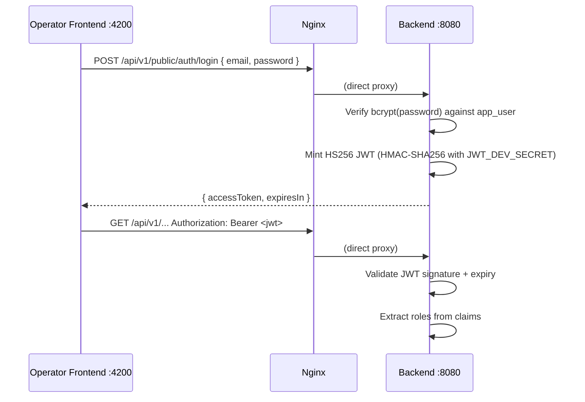
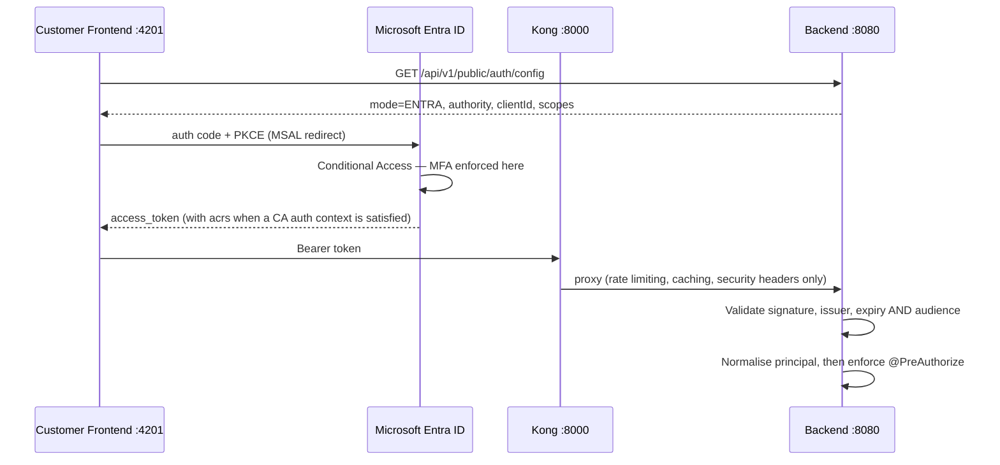

# Sicherheit und Authentifizierung { #security-authentication }

Registerwerk betreibt ein duales Authentifizierungsmodell: ein integriertes HS256-JWT-Login für
das Operator-Frontend und Microsoft Entra ID (oder einen beliebigen OIDC-Provider) für das
Kunden-Frontend in der Produktion.

**Das Backend ist in beiden Modi der einzige JWT-Validator.** Kong fügt vor dem Kunden-API-Pfad
Ratenbegrenzung, Antwort-Caching und Sicherheitsheader hinzu; es validiert keine Token und fügt
keine Identitäts-Header ein. Nichts im Backend vertraut einem Header zur Identitätsprüfung.

---

## Authentifizierungsmodi { #authentication-modes }

Die Umgebungsvariable `ENTRA_ENABLED` (und die grundlegendere `JWT_ISSUER_URI`) bestimmt, welcher
Modus aktiv ist:

| `ENTRA_ENABLED` | `JWT_ISSUER_URI` | Authentifizierungsmodus |
|---|---|---|
| `false` | (leer) | Integriertes HS256 – Benutzername-/Passwort-Login für beide Portale |
| `true` | Auf OIDC-Aussteller gesetzt | Entra-Anmeldung für Kunden; Betreiber behalten die integrierte Anmeldung |

Die beiden Flags hängen zusammen, sind aber unterschiedlich: `ENTRA_ENABLED` entscheidet, wie sich
Benutzer **anmelden**, `JWT_ISSUER_URI` entscheidet, wie ihre Token **validiert** werden. Das
Backend ist ein reiner **Resource Server** – es stellt selbst niemals OIDC-Token aus.

### Der delegierende Decoder { #the-delegating-decoder }

Beide Portale rufen dieselben URLs auf (`/api/v1/wallets`, `/api/v1/holder-blocks`, …), sodass
pfadbezogene Filterketten sie nicht trennen können. `DelegatingJwtDecoder` leitet stattdessen
anhand des JWS-`alg`-Headers weiter:

- **HS256** → der lokale Decoder, für Sitzungs-, Impersonation- und Step-up-Token, die
  Registerwerk selbst geprägt hat.
- **alles andere** → der JWKS-Decoder für den konfigurierten OIDC-Aussteller.

Das Routing anhand eines nicht authentifizierten Headers ist sicher, da dadurch nur ein Decoder
ausgewählt wird; jeder Zweig führt anschließend eine vollständige Signatur- und
Anspruchsprüfung durch. Das eigentlich relevante Risiko ist die gegenseitige Akzeptanz, daher sind
beide Zweige gepinnt:

| Zweig | Gepinnt durch |
|---|---|
| Lokal HS256 | `iss` muss `registerwerk-local` entsprechen, sodass die Kenntnis von `JWT_DEV_SECRET` allein nicht ausreicht, um ein akzeptiertes Token zu fälschen |
| OIDC | Aussteller, Ablauf **und `aud`** müssen mit `JWT_AUDIENCE` übereinstimmen – ohne das würde hier ein Token akzeptiert, das Entra für eine beliebige andere App im selben Mandanten ausgestellt hat |

Das ermöglicht es, in einer Bereitstellung die Entra-Anmeldung für Kunden zu betreiben, während
Betreiber die integrierte Anmeldung und lokales TOTP-Step-up behalten.

### Principal-Normalisierung { #principal-normalisation }

`sub` und `oid` eines Entra-Tokens sind Entras eigene Kennungen; die zugehörige `app_user`-Zeile
trägt eine DB-generierte UUID. `EntraPrincipalNormalizationFilter` schreibt das authentifizierte
Token so um, dass `sub` gleich `app_user.id` ist, und übernimmt Rollen und Entitätsbereich aus der
Kontozeile statt aus den Ansprüchen des Tokens. Entra-App-Rollen werden nur bei der erstmaligen
Bereitstellung eines Kontos herangezogen; danach ist die Datenbank maßgeblich, sodass ein
Betreiber eine Rolle entziehen kann, ohne auf den Ablauf eines Tokens warten zu müssen.

---

## Operator-Frontend – direkte HS256-Anmeldung { #operator-frontend-direct-hs256-login }



Das Operator-Frontend verbindet sich **direkt** mit dem Backend über Nginx – es geht nie über
Kong. Dadurch bleibt das Operator-Portal unabhängig von der Verfügbarkeit von Kong funktionsfähig.

---

## Kunden-Frontend – Entra-Anmeldung { #customer-frontend-entra-sign-in }



Das SPA ruft seine Anmeldekonfiguration zur Laufzeit ab, statt sie zur Build-Zeit fest
einzubacken, sodass ein einziges Frontend-Image gegen jeden Betreiber-Mandanten bereitgestellt
werden kann – MSAL benötigt `clientId` und `authority` bereits bei der Konstruktion.

**Die Zwei-Faktor-Authentifizierung wird durch Conditional Access erzwungen, nicht durch
Anwendungscode.** Ein nicht registrierter Benutzer wird während der Anmeldung zu Microsofts
Registrierungsablauf geleitet und erreicht das SPA nie mit einem gültigen Token. Registerwerk
zeigt eine `/security`-Seite mit Status und Anleitung, gated die App aber bewusst nicht darüber:
Den Status bei jeder Navigation von Graph zu lesen, würde einen Graph-Ausfall in einen
vollständigen Portalausfall verwandeln.

### Step-up: Claims-Challenge { #step-up-claims-challenge }

Wird in Entra-Modus ein `@RequiresStepUp`-Endpunkt aufgerufen und dem Token fehlt der
erforderliche Conditional-Access-Authentifizierungskontext, antwortet das Backend mit **401**
(nicht 403) mit:

```
WWW-Authenticate: Bearer realm="", authorization_uri="…", error="insufficient_claims", claims="<base64>"
```

Das SPA dekodiert `claims`, ruft `acquireTokenRedirect({ claims })` auf und versucht es erneut –
die Nutzerin oder der Nutzer authentifiziert sich erneut für genau diese eine Aktion, statt
abgemeldet zu werden. Die Challenge wird zusätzlich im JSON-Body wiederholt, da ein Header nur
dann für Browser-JavaScript sichtbar ist, wenn ihn jeder Proxy-Hop weiterreicht.

---

## Rollendurchsetzung { #role-enforcement }

Jede Controller-Methode, die eine Autorisierung erfordert, ist mit `@PreAuthorize` annotiert:

```java
@GetMapping("/assets")
@PreAuthorize("hasAnyRole('REGISTRY_ADMIN', 'COMPLIANCE_OFFICER', 'AUDITOR', 'ISSUER')")
public List<AssetResponse> listAssets() { ... }

@PostMapping("/assets/{id}/deploy")
@PreAuthorize("hasRole('REGISTRY_ADMIN')")
public AssetResponse deployAsset(@PathVariable UUID id) { ... }
```

Die Klasse `SecurityConfig` (`auth/internal/`) konfiguriert Spring Security mit:
- `/api/v1/public/**` → keine Authentifizierung erforderlich
- `/api/v1/onboarding/token-info/**` und `/api/v1/onboarding/complete` → keine Authentifizierung erforderlich
- Alle anderen `/api/v1/**` → JWT erforderlich
- Alles andere → verweigern

Beachten Sie, dass die Filterkette nur die **Authentifizierung** erzwingt, nicht Rollen oder
Mandantenzugehörigkeit – jeder `/api/v1/**`-Endpunkt ist für jeden authentifizierten Benutzer
erreichbar, sofern er nicht selbst eine eigene `@PreAuthorize`-Prüfung trägt. Eine fehlende
Prüfung auf Methodenebene ist eine echte Lücke, keine bloße Verteidigung-in-der-Tiefe-Nettigkeit.

---

## Mandantentrennung (nicht nur Rollenprüfungen) { #multi-tenant-scoping-not-just-role-checks }

Eine alleinige `@PreAuthorize("hasRole(...)")`-Prüfung reicht bei einem Endpunkt, der zusätzlich
eine vom Aufrufer übergebene Ressourcen-ID entgegennimmt, nicht aus – eine Rollenprüfung bestätigt
nur, *welche Art* von Akteur aufruft, nicht *auf welchen Mandanten* er zugreifen darf. Zwei Muster
setzen die zweite Hälfte durch:

- **Lese-/Schreibzugriffe auf eine bestehende Ressource** – gaten Sie mit der eigenen
  Zugriffsprüfungs-Bean der Ressource (z. B. `@assetAccessChecker.canRead(#assetId,
  authentication)` / `canActAsIssuer(#assetId, authentication)`), die die Ressource nachschlägt
  und ihre besitzende Entität mit `SecurityUtils.extractEntityId(auth)` vergleicht.
  `AssetController`, `DeploymentController` und `MintControlController` folgen diesem Muster
  durchgängig für jeden asset-bezogenen Endpunkt.
- **List-/Create-Endpunkte, die eine Mandanten-ID als Request-Parameter entgegennehmen** –
  vertrauen Sie bei einem Nicht-Admin-Aufrufer nie einer vom Client übergebenen
  `issuerId`/`entityId`. `AssetController.listAssets` erzwingt die Abfrage auf die eigene Entität
  des Aufrufers, es sei denn `SecurityUtils.isAdminOrAudit(auth)` gilt; `AssetController.createAsset`s
  `resolveIssuerId` berücksichtigt einen expliziten `issuerId` im Request-Body nur für
  `REGISTRY_ADMIN`, andernfalls wird er stillschweigend durch die eigene Entität des Aufrufers
  ersetzt. Wird dieser Schritt übersprungen, kann jeder authentifizierte Kunde Datensätze
  auflisten oder einem anderen Unternehmen zuordnen, indem er einfach eine andere ID übergibt –
  die Rollenprüfung allein hätte das nicht verhindert.

---

## Fail-Fast-Schutz für die Produktion { #production-fail-fast-guard }

!!! danger "Standard-JWT-Geheimnis in der Produktion"
    Startet die Anwendung mit leerem `JWT_ISSUER_URI` UND entspricht `JWT_DEV_SECRET` dem im
    Repository ausgelieferten Standardwert (`registerwerk-dev-jwt-secret-change-in-production!!`)
    UND ist das aktive Spring-Profil `prod`, **wirft die Anwendung beim Start eine
    `IllegalStateException`** und verweigert den Start.

Dieser Schutz ist in `SecurityConfig.@PostConstruct` implementiert:

```java
@PostConstruct
void validateProductionConfig() {
    boolean isDevProfile = Arrays.asList(environment.getActiveProfiles()).contains("dev")
                        || Arrays.asList(environment.getActiveProfiles()).contains("test");
    if (!StringUtils.hasText(jwtIssuerUri)
            && DEFAULT_DEV_SECRET.equals(devSecret)
            && !isDevProfile) {
        throw new IllegalStateException(
            "SECURITY: JWT_ISSUER_URI is not set and JWT_DEV_SECRET is the default. " +
            "This configuration must not be used in production. " +
            "Either set JWT_ISSUER_URI (OIDC mode) or set a unique JWT_DEV_SECRET.");
    }
}
```

---

## JWT-Anspruchsstruktur { #jwt-claims-structure }

| Anspruch | Quelle | Beschreibung |
|---|---|---|
| `sub` | UUID des Benutzers | Subject – der authentifizierte Benutzer |
| `email` | E-Mail des Benutzers | |
| `roles` | `AppRole[]` | Array von Rollen-Strings |
| `entityId` | `LegalEntity.id` | Entität des Kunden (nur Kunden-FE) |
| `acr` | Auth-Kontext | `"stepup"`, wenn Step-up-Authentifizierung aktuell ist |
| `iat` / `exp` | JWT-Prägezeit | Ausgestellt am / läuft ab am |

---

## CORS { #cors }

Cross-Origin Resource Sharing ist auf zwei Ebenen konfiguriert:

1. **Kong** (für das Kunden-Frontend): Kongs CORS-Plugin fügt passende Header hinzu, konfiguriert über `OPERATOR_FRONTEND_URL` und `CUSTOMER_FRONTEND_URL`
2. **Backend** (`WebConfig`): Ursprünge aus `registerwerk.cors.allowed-origins`; in der Produktion auf exakte Frontend-Ursprünge verschärft

Beide Ebenen müssen `WWW-Authenticate` sichtbar machen (Browser verbergen Antwort-Header sonst vor
JavaScript, was die Claims-Challenge zerstören würde) und `X-Dual-Control-Token` bei Requests
zulassen (Vier-Augen-Endpunkte).

---

## API-Sicherheitsheader { #api-security-headers }

Das Kong-Plugin `response-transformer` fügt allen Antworten Sicherheitsheader hinzu:

```
X-Content-Type-Options: nosniff
X-Frame-Options: DENY
Strict-Transport-Security: max-age=31536000; includeSubDomains
Content-Security-Policy: default-src 'self'; frame-ancestors 'none'
Permissions-Policy: geolocation=(), camera=(), microphone=()
Referrer-Policy: strict-origin-when-cross-origin
```
