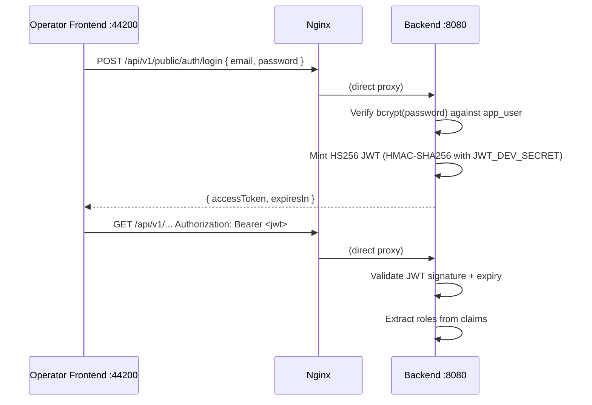
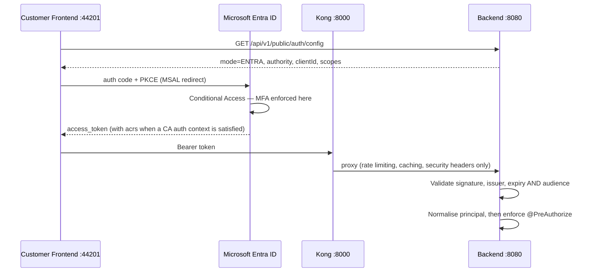

# Sicherheit und Authentifizierung { #security-authentication }

Registerwerk betreibt ein duales Authentifizierungsmodell: ein integriertes HS256-JWT-Login für
das Operator-Frontend und Microsoft Entra ID (oder einen beliebigen OIDC-Provider) für das
Kunden-Frontend in der Produktion.

**Das Backend ist in beiden Modi der einzige JWT-Validator.** Kong fügt vor dem Kunden-API-Pfad
Ratenbegrenzung, Antwort-Caching und Sicherheitsheader hinzu; es validiert keine Token und fügt
keine Identitäts-Header ein. Nichts im Backend vertraut einem Header zur Identitätsprüfung.

---

## Authentifizierungsmodi { #authentication-modes }

Die Umgebungsvariable `ENTRA_ENABLED` (und die grundlegendere `JWT_ISSUER_URI`) bestimmt, welcher
Modus aktiv ist:

| `ENTRA_ENABLED` | `JWT_ISSUER_URI` | Authentifizierungsmodus |
|---|---|---|
| `false` | (leer) | Integriertes HS256 – Benutzername-/Passwort-Login für beide Portale |
| `true` | Auf OIDC-Aussteller gesetzt | Entra-Anmeldung für Kunden; Betreiber behalten die integrierte Anmeldung |

Die beiden Flags hängen zusammen, sind aber unterschiedlich: `ENTRA_ENABLED` entscheidet, wie sich
Benutzer **anmelden**, `JWT_ISSUER_URI` entscheidet, wie ihre Token **validiert** werden. Das
Backend ist ein reiner **Resource Server** – es stellt selbst niemals OIDC-Token aus.

### Der delegierende Decoder { #the-delegating-decoder }

Beide Portale rufen dieselben URLs auf (`/api/v1/wallets`, `/api/v1/holder-blocks`, …), sodass
pfadbezogene Filterketten sie nicht trennen können. `DelegatingJwtDecoder` leitet stattdessen
anhand des JWS-`alg`-Headers weiter:

- **HS256** → der lokale Decoder, für Sitzungs-, Impersonation- und Step-up-Token, die
  Registerwerk selbst geprägt hat.
- **alles andere** → der JWKS-Decoder für den konfigurierten OIDC-Aussteller.

Das Routing anhand eines nicht authentifizierten Headers ist sicher, da dadurch nur ein Decoder
ausgewählt wird; jeder Zweig führt anschließend eine vollständige Signatur- und
Anspruchsprüfung durch. Das eigentlich relevante Risiko ist die gegenseitige Akzeptanz, daher sind
beide Zweige gepinnt:

| Zweig | Gepinnt durch |
|---|---|
| Lokal HS256 | `iss` muss `registerwerk-local` entsprechen, sodass die Kenntnis von `JWT_DEV_SECRET` allein nicht ausreicht, um ein akzeptiertes Token zu fälschen |
| OIDC | Aussteller, Ablauf **und `aud`** müssen mit `JWT_AUDIENCE` übereinstimmen – ohne das würde hier ein Token akzeptiert, das Entra für eine beliebige andere App im selben Mandanten ausgestellt hat |

Das ermöglicht es, in einer Bereitstellung die Entra-Anmeldung für Kunden zu betreiben, während
Betreiber die integrierte Anmeldung und lokales TOTP-Step-up behalten.

### Principal-Normalisierung { #principal-normalisation }

`sub` und `oid` eines Entra-Tokens sind Entras eigene Kennungen; die zugehörige `app_user`-Zeile
trägt eine DB-generierte UUID. `EntraPrincipalNormalizationFilter` schreibt das authentifizierte
Token so um, dass `sub` gleich `app_user.id` ist, und übernimmt Rollen und Entitätsbereich aus der
Kontozeile statt aus den Ansprüchen des Tokens. Entra-App-Rollen werden nur bei der erstmaligen
Bereitstellung eines Kontos herangezogen; danach ist die Datenbank maßgeblich, sodass ein
Betreiber eine Rolle entziehen kann, ohne auf den Ablauf eines Tokens warten zu müssen.

---

## Operator-Frontend – direkte HS256-Anmeldung { #operator-frontend-direct-hs256-login }


```mermaid
sequenceDiagram
    participant OperatorFE as Operator Frontend :44200
    participant Nginx
    participant Backend as Backend :8080

    OperatorFE->>Nginx: POST /api/v1/public/auth/login { email, password }
    Nginx->>Backend: (direct proxy)
    Backend->>Backend: Verify bcrypt(password) against app_user
    Backend->>Backend: Mint HS256 JWT (HMAC-SHA256 with JWT_DEV_SECRET)
    Backend-->>OperatorFE: { accessToken, expiresIn }
    OperatorFE->>Nginx: GET /api/v1/... Authorization: Bearer <jwt>
    Nginx->>Backend: (direct proxy)
    Backend->>Backend: Validate JWT signature + expiry
    Backend->>Backend: Extract roles from claims
```

Das Operator-Frontend verbindet sich **direkt** mit dem Backend über Nginx – es geht nie über
Kong. Dadurch bleibt das Operator-Portal unabhängig von der Verfügbarkeit von Kong funktionsfähig.

---

## Kunden-Frontend – Entra-Anmeldung { #customer-frontend-entra-sign-in }


```mermaid
sequenceDiagram
    participant CustomerFE as Customer Frontend :44201
    participant Entra as Microsoft Entra ID
    participant Kong as Kong :8000
    participant Backend as Backend :8080

    CustomerFE->>Backend: GET /api/v1/public/auth/config
    Backend-->>CustomerFE: mode=ENTRA, authority, clientId, scopes
    CustomerFE->>Entra: auth code + PKCE (MSAL redirect)
    Entra->>Entra: Conditional Access — MFA enforced here
    Entra-->>CustomerFE: access_token (with acrs when a CA auth context is satisfied)
    CustomerFE->>Kong: Bearer token
    Kong->>Backend: proxy (rate limiting, caching, security headers only)
    Backend->>Backend: Validate signature, issuer, expiry AND audience
    Backend->>Backend: Normalise principal, then enforce @PreAuthorize
```

Das SPA ruft seine Anmeldekonfiguration zur Laufzeit ab, statt sie zur Build-Zeit fest
einzubacken, sodass ein einziges Frontend-Image gegen jeden Betreiber-Mandanten bereitgestellt
werden kann – MSAL benötigt `clientId` und `authority` bereits bei der Konstruktion.

**Die Zwei-Faktor-Authentifizierung wird durch Conditional Access erzwungen, nicht durch
Anwendungscode.** Ein nicht registrierter Benutzer wird während der Anmeldung zu Microsofts
Registrierungsablauf geleitet und erreicht das SPA nie mit einem gültigen Token. Registerwerk
zeigt eine `/security`-Seite mit Status und Anleitung, gated die App aber bewusst nicht darüber:
Den Status bei jeder Navigation von Graph zu lesen, würde einen Graph-Ausfall in einen
vollständigen Portalausfall verwandeln.

### Step-up: Claims-Challenge { #step-up-claims-challenge }

Wird in Entra-Modus ein `@RequiresStepUp`-Endpunkt aufgerufen und dem Token fehlt der
erforderliche Conditional-Access-Authentifizierungskontext, antwortet das Backend mit **401**
(nicht 403) mit:

```
WWW-Authenticate: Bearer realm="", authorization_uri="…", error="insufficient_claims", claims="<base64>"
```

Das SPA dekodiert `claims`, ruft `acquireTokenRedirect({ claims })` auf und versucht es erneut –
die Nutzerin oder der Nutzer authentifiziert sich erneut für genau diese eine Aktion, statt
abgemeldet zu werden. Die Challenge wird zusätzlich im JSON-Body wiederholt, da ein Header nur
dann für Browser-JavaScript sichtbar ist, wenn ihn jeder Proxy-Hop weiterreicht.

---

## Chain-Operationen: Zieladress-Gate, Vier-Augen-Nachweis, Signer-Lebenszyklus { #chain-operations }

**Zieladress-Gate.** Whitelist, Mint, Forced Transfer (einzeln, Batch, Canton, Solana, vertraulich) und Forced Approve akzeptieren nur eine Zieladresse, die **aktiver Registerhalter desselben Assets** ist, dessen Rechtsträger ACTIVE und KYC-genehmigt ist, kein ungeklärtes Sanktionsscreening-Ergebnis (Rechtsträger oder wirtschaftlich Berechtigte) hat und keinem §16-eWpG-Sperrvermerk unterliegt. Andernfalls antwortet die API mit `403` und der Begründung; es gibt keinen Ausnahmepfad – die neue Partei wird zuerst als Halter onboardet. Gemischt geschriebene EVM-Adressen müssen die EIP-55-Prüfsumme bestehen. Die Antworten von Whitelist und Mint geben den aufgelösten Halternamen zurück (`destinationHolder`). Schalter: `registerwerk.chain.destination-gate.enabled` (Standard `true`; nur in einem Demo-Profil deaktivieren). Zwangsmaßnahmen erfordern eine `legalBasis` mit mindestens 10 Zeichen; ein optionaler Header `X-Case-Reference` wird mit der Transaktion gespeichert.

**Vier-Augen-Nachweis.** `/whitelist`, `/unwhitelist` und der Emittenten-`/mint` erfordern Step-up plus einen zweiten Freigeber (REGISTRY_ADMIN oder COMPLIANCE_OFFICER; der Auslöser kann nicht selbst freigeben). Für jede Vier-Augen-Anfrage schreibt der Step-up-Aspekt *vor* der Aktion ein Audit-Ereignis `DUAL_CONTROL_APPROVED` (Auslöser, Freigeber, Aktion, Pfad); schlägt dieses Schreiben fehl, wird die Aktion nicht ausgeführt. Die Freigeber-ID steht zusätzlich in `blockchain_transaction.approver_id` und im fachlichen Audit-Ereignis.

**Claims.** KYC- und AML-Claims werden nur für einen Rechtsträger ausgestellt, dessen KYC APPROVED ist und der weder einen ungeklärten Screening-Treffer noch eine Sperre hat. Ihr Ablauf entspricht dem nächsten periodischen Überprüfungsdatum (fehlt es, wird abgelehnt). `registerwerk.claims.allow-unapproved-in-nonprod=true` lockert dies ausschließlich außerhalb von Produktionsprofilen.

**Signer-Lebenszyklus.** Erzeugen, Import (Raw, Keystore) und HSM-Anbindung erfordern Step-up plus zweiten Freigeber; ein neues Wallet wird nie automatisch zum Chain-Default (nur das allererste Wallet einer Neuinstallation); Defaults werden mit der Vier-Augen-Aktion *Default setzen* geändert. Das Löschen eines Wallets ist ein **Soft-Delete**: Der verschlüsselte Schlüssel bleibt `registerwerk.wallet.retention-days` (Standard 90) erhalten und kann wiederhergestellt werden; danach vernichtet ihn ein Purge-Job. Löschen wird abgelehnt, solange das Wallet Chain-Default ist oder seine Adresse je eine Chain-Transaktion signiert hat (es könnte Deployer-, Registry- oder Claim-Issuer-Rechte halten).

!!! warning "Runbook Signer-Rotation (manuell)"
    Eine automatische Übergabe gibt es noch nicht. So ersetzen Sie einen Registry-Signer: (1) neues Wallet erzeugen oder anbinden (Vier-Augen); (2) mit dem alten Schlüssel der neuen Adresse die nötigen Rollen on-chain mit Foundry `cast send` erteilen (`grantRole` / `transferRegistry` / Claim-Issuer `addKey`), im Beisein einer zweiten Person; (3) mit `cast call` prüfen, dass die neue Adresse alle Rollen hält; (4) Chain-Default auf das neue Wallet umstellen (Vier-Augen); (5) den alten Schlüssel on-chain entziehen (`revokeRole` / `removeKey`) und prüfen; (6) erst dann das alte Wallet löschen – es bleibt für die Aufbewahrungsfrist wiederherstellbar.

## Rollendurchsetzung { #role-enforcement }

Jede Controller-Methode, die eine Autorisierung erfordert, ist mit `@PreAuthorize` annotiert:

```java
@GetMapping("/assets")
@PreAuthorize("hasAnyRole('REGISTRY_ADMIN', 'COMPLIANCE_OFFICER', 'AUDITOR', 'ISSUER')")
public List<AssetResponse> listAssets() { ... }

@PostMapping("/assets/{id}/deploy")
@PreAuthorize("hasRole('REGISTRY_ADMIN')")
public AssetResponse deployAsset(@PathVariable UUID id) { ... }
```

Die Klasse `SecurityConfig` (`auth/internal/`) konfiguriert Spring Security mit:
- `/api/v1/public/**` → keine Authentifizierung erforderlich
- `/api/v1/onboarding/token-info/**` und `/api/v1/onboarding/complete` → keine Authentifizierung erforderlich
- Alle anderen `/api/v1/**` → JWT erforderlich
- Alles andere → verweigern

Beachten Sie, dass die Filterkette nur die **Authentifizierung** erzwingt, nicht Rollen oder
Mandantenzugehörigkeit – jeder `/api/v1/**`-Endpunkt ist für jeden authentifizierten Benutzer
erreichbar, sofern er nicht selbst eine eigene `@PreAuthorize`-Prüfung trägt. Eine fehlende
Prüfung auf Methodenebene ist eine echte Lücke, keine bloße Verteidigung-in-der-Tiefe-Nettigkeit.

---

## Mandantentrennung (nicht nur Rollenprüfungen) { #multi-tenant-scoping-not-just-role-checks }

Eine alleinige `@PreAuthorize("hasRole(...)")`-Prüfung reicht bei einem Endpunkt, der zusätzlich
eine vom Aufrufer übergebene Ressourcen-ID entgegennimmt, nicht aus – eine Rollenprüfung bestätigt
nur, *welche Art* von Akteur aufruft, nicht *auf welchen Mandanten* er zugreifen darf. Zwei Muster
setzen die zweite Hälfte durch:

- **Lese-/Schreibzugriffe auf eine bestehende Ressource** – gaten Sie mit der eigenen
  Zugriffsprüfungs-Bean der Ressource (z. B. `@assetAccessChecker.canRead(#assetId,
  authentication)` / `canActAsIssuer(#assetId, authentication)`), die die Ressource nachschlägt
  und ihre besitzende Entität mit `SecurityUtils.extractEntityId(auth)` vergleicht.
  `AssetController`, `DeploymentController` und `MintControlController` folgen diesem Muster
  durchgängig für jeden asset-bezogenen Endpunkt.
- **List-/Create-Endpunkte, die eine Mandanten-ID als Request-Parameter entgegennehmen** –
  vertrauen Sie bei einem Nicht-Admin-Aufrufer nie einer vom Client übergebenen
  `issuerId`/`entityId`. `AssetController.listAssets` erzwingt die Abfrage auf die eigene Entität
  des Aufrufers, es sei denn `SecurityUtils.isAdminOrAudit(auth)` gilt; `AssetController.createAsset`s
  `resolveIssuerId` berücksichtigt einen expliziten `issuerId` im Request-Body nur für
  `REGISTRY_ADMIN`, andernfalls wird er stillschweigend durch die eigene Entität des Aufrufers
  ersetzt. Wird dieser Schritt übersprungen, kann jeder authentifizierte Kunde Datensätze
  auflisten oder einem anderen Unternehmen zuordnen, indem er einfach eine andere ID übergibt –
  die Rollenprüfung allein hätte das nicht verhindert.

---

## Sitzungswächter, Widerruf und Operator-Impersonation { #session-guard }

Eine gültige Signatur genügt nicht. Jede authentifizierte Anfrage (integriertes HS256 ebenso wie Entra/OIDC) wird gegen das Konto geprüft:

- das Konto muss existieren und **aktiviert** sein, die zugehörige Entität darf nicht CLOSED oder DISSOLVED sein;
- lokal ausgestellte Token dürfen nicht älter sein als `app_user.tokens_valid_after`; dieser Wert wird bei Deaktivierung/Reaktivierung sowie bei Änderung von Rollen, Entität oder Passwort und bei explizitem Widerruf vorgesetzt;
- die `jti` des Tokens darf nicht widerrufen sein: `POST /api/v1/public/auth/logout` widerruft das Token jetzt serverseitig, statt nur Cookies zu löschen.

Die Abfrage wird 15 Sekunden gecacht und im Prozess sofort verworfen; bei mehreren Replikas wirkt ein Widerruf daher innerhalb von 15 Sekunden. Vor diesem Release ausgestellte Token tragen keine `jti` und bleiben bis zum Ablauf (höchstens 8 Stunden) gültig, sofern der Benutzer nicht widerrufen wird. Ablehnungen werden in `registerwerk_session_rejections_total{reason}` gezählt.

Ein Step-up-Token (`acr=stepup`) wird nur an `@RequiresStepUp`-Endpunkten akzeptiert; als gewöhnliches Bearer-Token anderswo wird es mit 403 abgewiesen.

**Operator-Impersonation.** Der Start erfordert ein Step-up-Token und eine Pflichtbegründung (mindestens 15 Zeichen, optional Ticket-Referenz). Standardmodus ist **READ_ONLY**: nur GET/HEAD/OPTIONS, alles andere liefert 403 `IMPERSONATION_READ_ONLY`. **ACT_ON_BEHALF** (`POST /api/v1/impersonation/act-on-behalf`) braucht zusätzlich einen zweiten Freigeber und kann Attestierungs- und Kontoverwaltungs-Endpunkte des Kunden weiterhin nicht aufrufen (`registerwerk.auth.impersonation-deny-patterns`). Sitzungen dauern 30 Minuten, werden in `impersonation_session` erfasst, sind für die Company-Admins des Kunden einsehbar (`GET /api/v1/company/impersonation-sessions`) und enden mit einem Audit-Ereignis. Die Start-Antwort enthält kein Token: Die Handoff-URL trägt einen Einmalcode (60 Sekunden gültig), den die Kunden-App gegen ein Sitzungs-Cookie tauscht; eine Wiederverwendung beendet die Sitzung. Derselbe Benutzer kann bei einem Handel nicht für Käufer und Verkäufer handeln.

## Benutzerlebenszyklus, Zugriffsüberprüfung und Identitätsbindung { #user-lifecycle }

- **Zurückgezogene Einladungen bleiben zurückgezogen.** Das Deaktivieren oder Löschen eines Kontos macht dessen nicht eingelöste Registrierungs- und Passwort-Zurücksetzen-Token ungültig; das Einlösen eines Tokens wird (mit der allgemeinen Meldung „ungültiger oder abgelaufener Token“) abgelehnt, solange das Konto deaktiviert oder seine Entität nicht ACTIVE ist. Eine Registrierung aktiviert ein Konto nie erneut.
- **Bootstrap-Administrator.** `DefaultAdminSeeder` legt den Administrator nur an, wenn kein `REGISTRY_ADMIN` existiert, und verändert ein vorhandenes Konto nie. Das Konto trägt das Kennzeichen `must_change_password`; die Produktion startet 24 Stunden später nicht mehr, solange das Kennzeichen gesetzt ist oder das Umgebungspasswort noch funktioniert. (Die Einschränkung des gekennzeichneten Kontos beim Login folgt separat.)
- **Zugriffsüberprüfung.** Eine Entscheidung `REVOKED` durchläuft dieselben Schutzregeln wie die Benutzerverwaltung (nicht das eigene Konto, nicht der letzte aktivierte `REGISTRY_ADMIN`, nicht der letzte aktivierte `COMPANY_ADMIN` einer Entität), beendet die Sitzungen des Benutzers und macht dessen Token ungültig. Entscheidungen sind einmalig beschreibbar; eine Korrektur ist ein ausdrückliches Wiedereröffnen (`POST /api/v1/access-reviews/{id}/items/{itemId}/reopen`, `REGISTRY_ADMIN`, Begründung Pflicht, das Konto bleibt deaktiviert). Der Entzug eines privilegierten Kontos (`REGISTRY_ADMIN`, `COMPLIANCE_OFFICER`, `COMPANY_ADMIN`) ist zunächst nur `REVOKE_PROPOSED` und wird wirksam, wenn ein zweiter, anderer Prüfer mit `REVOKED` bestätigt. Jede Entscheidung erfordert ein Step-up-Token. Ändern sich Rollen oder Aktivierungsstatus eines Kontos nach dem Snapshot, wird der Eintrag `STALE` und muss wieder eröffnet werden; eine Kampagne lässt sich nicht abschließen, solange Einträge `STALE` sind oder seit ihrem Start angelegte bzw. in ihren Rollen geänderte Konten fehlen. Wer die Rollen eines Kontos zuletzt geändert hat, darf es nicht prüfen. Rollenpaare in `registerwerk.access-review.sod-conflicts` (Standard `REGISTRY_ADMIN+COMPLIANCE_OFFICER`) werden je Eintrag nur als Warnung angezeigt. Der Entzug wirkt nicht automatisch auf Wallets, On-Chain-Rollen oder offene Vier-Augen-Anfragen; das Audit-Ereignis führt diese manuellen Folgeaufgaben auf.
- **Operator-Konten.** Einladen, Rollenänderung, Aktivieren, Deaktivieren und Löschen erfordern ein Step-up-Token und werden mit Rollen, bisherigen Rollen, Entität und der tatsächlichen Akteursrolle protokolliert. Das Anlegen oder Zuweisen von `REGISTRY_ADMIN`/`COMPLIANCE_OFFICER` alarmiert alle `REGISTRY_ADMIN`. Das Einladen eines Operator-Kontos oder eines Kontos mit `REGISTRY_ADMIN`/`COMPLIANCE_OFFICER`/`AUDIT`, die Änderung dieser Rollen sowie das erneute Aktivieren oder Löschen eines solchen Kontos erfordert zusätzlich eine zweite genehmigende Person (`X-Dual-Control-Token`, an die Anfrage gebunden, einmalig verwendbar). Bei weniger als zwei aktivierten Administratoren mit eingerichtetem TOTP genügt das einzelne Step-up, und das Ereignis trägt `bootstrap=true` (sonst ließe sich auf einer Neuinstallation nie ein zweiter Administrator anlegen). Das erneute Aktivieren eines durch eine Zugriffsüberprüfung entzogenen Kontos erfordert eine Begründung und stets die zweite genehmigende Person, auch in diesem Bootstrap-Zustand. Die optionale Einstellung `registerwerk.admin.operator-email-domains` beschränkt die Domains eingeladener Benutzer. Unternehmensadministratoren dürfen nur `COMPANY_ADMIN`, `ISSUER`, `INVESTOR` und `TRADER` vergeben; Onboarding-Passwörter folgen der Registrierungsrichtlinie (8 bis 200 Zeichen).
- **Identitätsbindung.** Ein Entra-/OIDC-Token wird nur dann per E-Mail mit einem vorhandenen Konto verknüpft, wenn das Konto noch an keine Identität gebunden ist, der Tenant der konfigurierte (oder der föderierte Tenant der Entität) ist und das Token eine verifizierte Adresse zusichert (`xms_edov`/`email_verified`; `registerwerk.auth.link-by-email-without-verification` erlaubt außerhalb des Produktionsmodus die Verknüpfung ohne diese Zusicherung). Ein gebundenes Konto wird nie umgehängt: Das Token löst kein Konto auf, und `IDENTITY_REBIND_REFUSED` wird protokolliert. Der vorgesehene Weg ist `POST /api/v1/admin/users/{id}/reset-identity` (Step-up, zweiter Genehmiger, Begründung); danach bindet die nächste Anmeldung neu. Im Entra-Modus kann ein Operator ein lokales Konto mit Begründung deaktivieren (Deprovisionierung).

## Anmelde-Drosselung { #login-throttling }

Die integrierte Anmeldung (`POST /api/v1/public/auth/login`, genutzt vom Betreiberportal, das Kong umgeht) wird in der Tabelle `login_attempt` gedrosselt, die alle Replikate teilen:

| Zähler | Schlüssel | Wirkung |
|---|---|---|
| Paar | E-Mail + Quelladresse | 5 Fehlversuche in 15 Minuten sperren **dieses Konto von dieser Adresse**; die Sperre verdoppelt sich mit jeder weiteren Episode (15, 30, 60 … bis 240 Minuten) und wird pro Episode einmal protokolliert (`LOGIN_LOCKED`) |
| Adresse | Quelladresse | 30 Fehlversuche von einer Adresse im Fenster weisen diese Adresse ab (Passwort-Spraying über viele Konten) |
| Konto | nur E-Mail | **Nie eine Sperre.** Nach 5 Fehlversuchen von beliebiger Stelle wird die Anmeldung um 1, 2, dann 4 Sekunden verzögert, für vorhandene und unbekannte E-Mails gleichermaßen |
| Global | gesamte Plattform | oberhalb von 600 Fehlversuchen pro Minute werden Adressen abgewiesen, die bereits gescheitert sind; saubere Adressen funktionieren weiter |

Ein Angreifer kann einen echten Benutzer daher nicht mehr aussperren, indem er von anderswo dessen Adresse durchprobiert. Unbekannte E-Mails verursachen denselben Passwort-Hash-Aufwand wie bekannte und werden in derselben begrenzten Tabelle gezählt: `LoginRequest.email` ist auf 254 Zeichen begrenzt, neue Kontozeilen enden bei `registerwerk.auth.login-max-tracked-keys` (Standard 200 000), und ein Job löscht abgelaufene Zeilen alle zehn Minuten (Zeilen gesperrter Paare bleiben 24 Stunden erhalten, damit der Backoff gemerkt wird).

Die Quelladresse ist `request.getRemoteAddr()`. Hinter einem Proxy ersetzt Tomcat sie durch den `X-Forwarded-For`-Client, **aber nur, wenn die TCP-Gegenstelle zu `registerwerk.auth.trusted-proxies` passt** (Standard: Loopback- und private Bereiche, also das mitgelieferte nginx, Kong und der Ingress); ein Client, der das Backend direkt erreicht, kann seinen Zähler nicht selbst wählen. Beide mitgelieferten nginx-Konfigurationen leiten jetzt `X-Forwarded-For` weiter. Einstellbar über `REGISTERWERK_AUTH_LOGIN_MAX_ATTEMPTS`, `…_LOCKOUT_MINUTES`, `…_MAX_LOCKOUT_MINUTES`, `…_IP_MAX_FAILURES`, `…_GLOBAL_MAX_FAILURES` und `REGISTERWERK_AUTH_TRUSTED_PROXIES`.

## Fail-Fast-Schutz für die Produktion { #production-fail-fast-guard }

!!! danger "Standard-JWT-Geheimnis in der Produktion"
    Startet die Anwendung mit leerem `JWT_ISSUER_URI` UND entspricht `JWT_DEV_SECRET` dem im
    Repository ausgelieferten Standardwert (`registerwerk-dev-jwt-secret-change-in-production!!`)
    UND ist das aktive Spring-Profil `prod`, **wirft die Anwendung beim Start eine
    `IllegalStateException`** und verweigert den Start.

Dieser Schutz ist in `SecurityConfig.@PostConstruct` implementiert:

```java
@PostConstruct
void validateProductionConfig() {
    boolean isDevProfile = Arrays.asList(environment.getActiveProfiles()).contains("dev")
                        || Arrays.asList(environment.getActiveProfiles()).contains("test");
    if (!StringUtils.hasText(jwtIssuerUri)
            && DEFAULT_DEV_SECRET.equals(devSecret)
            && !isDevProfile) {
        throw new IllegalStateException(
            "SECURITY: JWT_ISSUER_URI is not set and JWT_DEV_SECRET is the default. " +
            "This configuration must not be used in production. " +
            "Either set JWT_ISSUER_URI (OIDC mode) or set a unique JWT_DEV_SECRET.");
    }
}
```

---

## JWT-Anspruchsstruktur { #jwt-claims-structure }

| Anspruch | Quelle | Beschreibung |
|---|---|---|
| `sub` | UUID des Benutzers | Subject – der authentifizierte Benutzer |
| `email` | E-Mail des Benutzers | |
| `roles` | `AppRole[]` | Array von Rollen-Strings |
| `entityId` | `LegalEntity.id` | Entität des Kunden (nur Kunden-FE) |
| `acr` | Auth-Kontext | `"stepup"`, wenn Step-up-Authentifizierung aktuell ist |
| `iat` / `exp` | JWT-Prägezeit | Ausgestellt am / läuft ab am |

---

## CORS { #cors }

Cross-Origin Resource Sharing ist auf zwei Ebenen konfiguriert:

1. **Kong** (für das Kunden-Frontend): Kongs CORS-Plugin fügt passende Header hinzu, konfiguriert über `OPERATOR_FRONTEND_URL` und `CUSTOMER_FRONTEND_URL`
2. **Backend** (`WebConfig`): Ursprünge aus `registerwerk.cors.allowed-origins`; in der Produktion auf exakte Frontend-Ursprünge verschärft

Beide Ebenen müssen `WWW-Authenticate` sichtbar machen (Browser verbergen Antwort-Header sonst vor
JavaScript, was die Claims-Challenge zerstören würde) und `X-Dual-Control-Token` bei Requests
zulassen (Vier-Augen-Endpunkte).

---

## API-Sicherheitsheader { #api-security-headers }

Das Kong-Plugin `response-transformer` fügt allen Antworten Sicherheitsheader hinzu:

```
X-Content-Type-Options: nosniff
X-Frame-Options: DENY
Strict-Transport-Security: max-age=31536000; includeSubDomains
Content-Security-Policy: default-src 'self'; frame-ancestors 'none'
Permissions-Policy: geolocation=(), camera=(), microphone=()
Referrer-Policy: strict-origin-when-cross-origin
```
