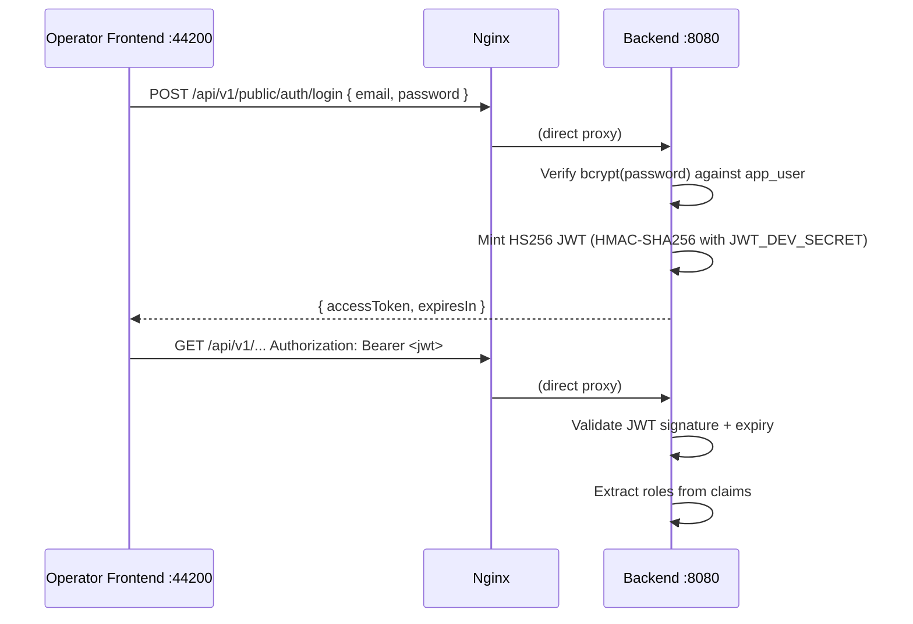
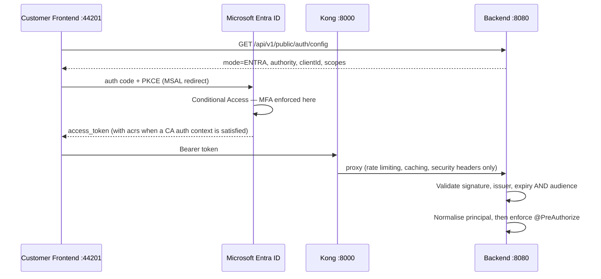

# Seguridad y autenticación { #security-authentication }

Registerwerk ejecuta un modelo de autenticación dual: un inicio de sesión integrado HS256 JWT para la interfaz del operador y Microsoft Entra ID (o cualquier proveedor OIDC) para la interfaz del cliente en producción.

**El backend es el único validador de JWT, en ambos modos.** Kong agrega limitación de velocidad, almacenamiento en caché de respuestas y encabezados de seguridad delante de la ruta API del cliente; no valida tokens y no inyecta encabezados de identidad. Nada en el backend confía en un encabezado para la identidad.

---

## Modos de autenticación { #authentication-modes }

La variable de entorno `ENTRA_ENABLED` (y la más fundamental `JWT_ISSUER_URI`) controla qué modo está activo:

| `ENTRA_ENABLED` | `JWT_ISSUER_URI` | Modo de autenticación |
|---|---|---|
| `false` | (en blanco) | HS256 integrado: inicio de sesión con nombre de usuario/contraseña para ambos portales |
| `true` | Establecido como emisor OIDC | Inicio de sesión con Entra para los clientes; los operadores mantienen el inicio de sesión integrado |

Las dos banderas están relacionadas pero son distintas: `ENTRA_ENABLED` decide cómo los usuarios **inician sesión**, `JWT_ISSUER_URI` decide cómo se **validan** sus tokens. El backend es un **servidor de recursos** puro: nunca emite tokens OIDC.

### El decodificador delegado { #the-delegating-decoder }

Ambos portales acceden a las mismas URL (`/api/v1/wallets`, `/api/v1/holder-blocks`,…), por lo que las cadenas de filtros con alcance de ruta no pueden separarlos. En su lugar, `DelegatingJwtDecoder` se enruta en el encabezado JWS `alg`:

- **HS256** → el decodificador local, para tokens de sesión, suplantación (impersonation) y step-up acuñados por el propio Registerwerk.
- **cualquier otro valor** → el decodificador JWKS para el emisor OIDC configurado.

Enrutar según un encabezado no autenticado es seguro porque solo selecciona un decodificador; cada rama realiza después la validación completa de la firma y de las atestaciones (claims). El riesgo que importa es la aceptación cruzada, por lo que ambas ramas están fijadas (pinned):

| Rama | Fijada por |
|---|---|
| HS256 local | `iss` debe ser igual a `registerwerk-local`, por lo que conocer `JWT_DEV_SECRET` no basta por sí solo para falsificar un token aceptado |
| OIDC | el emisor, la caducidad **y `aud`** deben coincidir con `JWT_AUDIENCE`; sin esa comprobación, un token que Entra emitió para cualquier otra aplicación del mismo tenant se aceptaría aquí |

Esto es lo que permite que una misma implementación ejecute el inicio de sesión con Entra para los clientes mientras los operadores mantienen el inicio de sesión integrado y el step-up local por TOTP.

### Normalización principal { #principal-normalisation }

El `sub` y el `oid` de un token de Entra son identificadores de Entra; la fila `app_user` correspondiente lleva un UUID generado por la base de datos. `EntraPrincipalNormalizationFilter` reescribe el token autenticado para que `sub` sea `app_user.id`, y toma los roles y el alcance de entidad de la fila de la cuenta en lugar de las atestaciones (claims) del token. Los roles de la aplicación Entra se consultan solo cuando se aprovisiona una cuenta por primera vez; después, la base de datos tiene autoridad, por lo que un operador puede revocar una función sin esperar a que caduque un token.

---

## Interfaz del operador: inicio de sesión directo en HS256 { #operator-frontend-direct-hs256-login }



La interfaz del operador se conecta **directamente** al backend a través de nginx; nunca pasa por Kong. Esto mantiene el portal del operador funcional independientemente de la disponibilidad de Kong.

---

## Interfaz del cliente — inicio de sesión con Entra { #customer-frontend-entra-sign-in }



El SPA recupera su configuración de inicio de sesión en tiempo de ejecución en lugar de tenerla incorporada en el momento de la compilación, de modo que una sola imagen de frontend puede desplegarse contra el tenant de cualquier operador: MSAL necesita `clientId` y `authority` en el momento de la construcción.

**La autenticación de dos factores se aplica mediante acceso condicional, no mediante código de aplicación.** Un usuario no registrado se envía al flujo de registro de Microsoft durante el inicio de sesión y nunca llega al SPA con un token válido. Registerwerk muestra una página `/security` con estado y orientación, pero deliberadamente no bloquea la aplicación en ella: leer el estado de Graph en cada navegación convertiría una interrupción de Graph en una interrupción total del portal.

### Step-up: desafío de atestaciones (claims challenge) { #step-up-claims-challenge }

Cuando se llama a un punto final `@RequiresStepUp` en modo Entra y el token carece del contexto de autenticación de acceso condicional requerido, el backend responde **401** (no 403) con:

```
WWW-Authenticate: Bearer realm="", authorization_uri="…", error="insufficient_claims", claims="<base64>"
```

El SPA decodifica `claims`, llama a `acquireTokenRedirect({ claims })` y vuelve a intentarlo: el usuario se vuelve a autenticar para esa acción en lugar de cerrar sesión. El desafío también se repite en el cuerpo de JSON, porque un encabezado solo llega al JavaScript del navegador si cada salto de proxy lo expone.

---

## Aplicación de roles { #role-enforcement }

Todos los métodos de controlador que requieren autorización están anotados con `@PreAuthorize`:

```java
@GetMapping("/assets")
@PreAuthorize("hasAnyRole('REGISTRY_ADMIN', 'COMPLIANCE_OFFICER', 'AUDITOR', 'ISSUER')")
public List<AssetResponse> listAssets() { ... }

@PostMapping("/assets/{id}/deploy")
@PreAuthorize("hasRole('REGISTRY_ADMIN')")
public AssetResponse deployAsset(@PathVariable UUID id) { ... }
```

La clase `SecurityConfig` (`auth/internal/`) configura Spring Security con:
- `/api/v1/public/**` → no se requiere autenticación
- `/api/v1/onboarding/token-info/**` y `/api/v1/onboarding/complete` → no se requiere autenticación
- Todos los demás `/api/v1/**` → JWT requerido
- Todo lo demás → denegar

Tenga en cuenta que la cadena de filtros solo aplica la **autenticación**, no los roles ni el aislamiento entre tenants: cualquier usuario autenticado puede acceder a cualquier endpoint
`/api/v1/**` a menos que este también lleve su propio
`@PreAuthorize`. Una comprobación ausente a nivel de método es una brecha real, no un simple matiz de defensa en profundidad.

---

## Alcance multiinquilino (no solo comprobaciones de rol) { #multi-tenant-scoping-not-just-role-checks }

Una comprobación `@PreAuthorize("hasRole(...)")` por sí sola no basta en un endpoint que también acepta
un identificador de recurso proporcionado por quien llama — una comprobación de rol confirma *qué tipo* de actor está
llamando, no *de qué tenant* son los datos que puede tocar. Dos patrones aplican esa segunda mitad:

- **Lecturas/escrituras sobre un recurso existente** — restrínjalas con el propio bean verificador de
  acceso del recurso (por ejemplo, `@assetAccessChecker.canRead(#assetId, authentication)` /
  `canActAsIssuer(#assetId, authentication)`), que busca el recurso y compara su entidad propietaria
  con `SecurityUtils.extractEntityId(auth)`. `AssetController`, `DeploymentController` y
  `MintControlController` siguen este patrón en todos los endpoints con alcance de activo.
- **Endpoints de listado/creación que reciben un identificador de tenant como parámetro de la
  solicitud** — nunca confíe en un `issuerId`/`entityId` proporcionado por el cliente para una
  persona que llama sin rol de administrador. `AssetController.listAssets` fuerza la consulta a la
  propia entidad de quien llama salvo que `SecurityUtils.isAdminOrAudit(auth)`; el `resolveIssuerId`
  de `AssetController.createAsset` solo respeta un `issuerId` explícito en el cuerpo de la solicitud
  para REGISTRY_ADMIN — en cualquier otro caso, se sobrescribe silenciosamente con la propia entidad
  de quien llama. Omitir este paso permitiría a cualquier cliente autenticado enumerar o atribuir
  registros a una empresa distinta con solo pasar un id distinto — la comprobación de rol por sí
  sola no lo habría detectado.

---

## Protección de fallo rápido en producción (fail-fast) { #production-fail-fast-guard }

!!! danger "Secreto JWT predeterminado en producción"
    Si la aplicación arranca con `JWT_ISSUER_URI` en blanco Y `JWT_DEV_SECRET` es igual al valor predeterminado incluido en el repositorio (`registerwerk-dev-jwt-secret-change-in-production!!`) Y el perfil de Spring activo es `prod`, la aplicación **lanza `IllegalStateException` al arrancar** y se niega a iniciarse.

Esta protección está implementada en `SecurityConfig.@PostConstruct`:

```java
@PostConstruct
void validateProductionConfig() {
    boolean isDevProfile = Arrays.asList(environment.getActiveProfiles()).contains("dev")
                        || Arrays.asList(environment.getActiveProfiles()).contains("test");
    if (!StringUtils.hasText(jwtIssuerUri)
            && DEFAULT_DEV_SECRET.equals(devSecret)
            && !isDevProfile) {
        throw new IllegalStateException(
            "SECURITY: JWT_ISSUER_URI is not set and JWT_DEV_SECRET is the default. " +
            "This configuration must not be used in production. " +
            "Either set JWT_ISSUER_URI (OIDC mode) or set a unique JWT_DEV_SECRET.");
    }
}
```

---

## Estructura de atestaciones (claims) del JWT { #jwt-claims-structure }

| Atestación (claim) | Origen | Descripción |
|---|---|---|
| `sub` | UUID del usuario | Sujeto — el usuario autenticado |
| `email` | Correo electrónico del usuario | |
| `roles` | `AppRole[]` | Array de cadenas de rol |
| `entityId` | `LegalEntity.id` | Entidad del cliente (solo en el FE de cliente) |
| `acr` | Contexto de autenticación | `"stepup"` cuando el step-up está vigente |
| `iat` / `exp` | Hora de acuñación del JWT | Emitido en / expira en |

---

## CORS { #cors }

El uso compartido de recursos entre orígenes está configurado en dos capas:

1. **Kong** (para la interfaz del cliente): el complemento CORS de Kong agrega encabezados apropiados, configurados con `OPERATOR_FRONTEND_URL` y `CUSTOMER_FRONTEND_URL`
2. **Backend** (`WebConfig`): orígenes de `registerwerk.cors.allowed-origins`; ajustado en producción para orígenes exactos de la interfaz

Ambas capas deben exponer `WWW-Authenticate` (de lo contrario, los navegadores ocultan ese encabezado de respuesta a JavaScript, lo que rompería el desafío de atestaciones/claims) y permitir `X-Dual-Control-Token` en las solicitudes (endpoints de 4-eyes).

---

## Encabezados de seguridad API { #api-security-headers }

El complemento Kong `response-transformer` agrega encabezados de seguridad a todas las respuestas:

```
X-Content-Type-Options: nosniff
X-Frame-Options: DENY
Strict-Transport-Security: max-age=31536000; includeSubDomains
Content-Security-Policy: default-src 'self'; frame-ancestors 'none'
Permissions-Policy: geolocation=(), camera=(), microphone=()
Referrer-Policy: strict-origin-when-cross-origin
```
