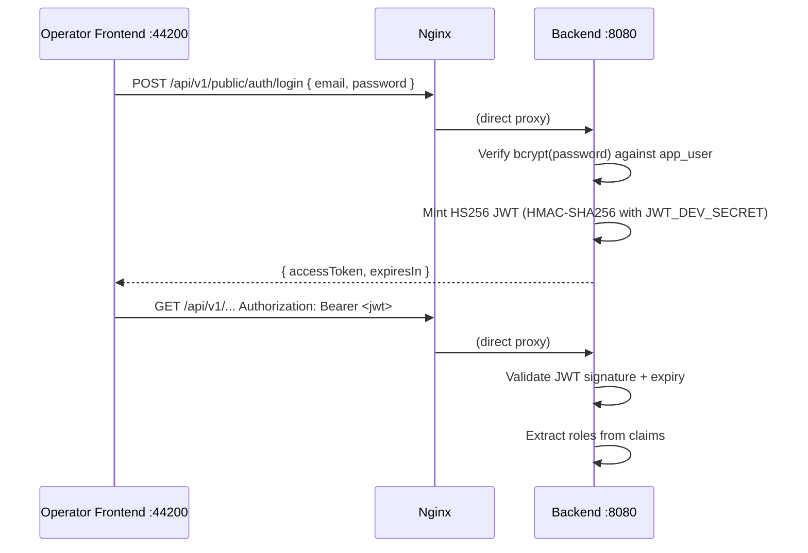
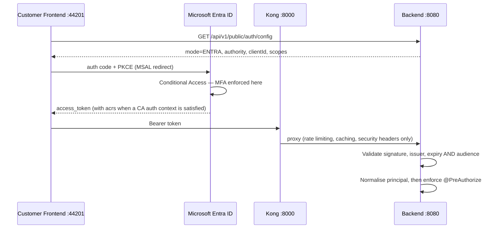

# Seguridad y autenticación { #security-authentication }

Registerwerk ejecuta un modelo de autenticación dual: un inicio de sesión integrado HS256 JWT para la interfaz del operador y Microsoft Entra ID (o cualquier proveedor OIDC) para la interfaz del cliente en producción.

**El backend es el único validador de JWT, en ambos modos.** Kong agrega limitación de velocidad, almacenamiento en caché de respuestas y encabezados de seguridad delante de la ruta API del cliente; no valida tokens y no inyecta encabezados de identidad. Nada en el backend confía en un encabezado para la identidad.

---

## Modos de autenticación { #authentication-modes }

La variable de entorno `ENTRA_ENABLED` (y la más fundamental `JWT_ISSUER_URI`) controla qué modo está activo:

| `ENTRA_ENABLED` | `JWT_ISSUER_URI` | Modo de autenticación |
|---|---|---|
| `false` | (en blanco) | HS256 integrado: inicio de sesión con nombre de usuario/contraseña para ambos portales |
| `true` | Establecido como emisor OIDC | Inicio de sesión con Entra para los clientes; los operadores mantienen el inicio de sesión integrado |

Las dos banderas están relacionadas pero son distintas: `ENTRA_ENABLED` decide cómo los usuarios **inician sesión**, `JWT_ISSUER_URI` decide cómo se **validan** sus tokens. El backend es un **servidor de recursos** puro: nunca emite tokens OIDC.

### El decodificador delegado { #the-delegating-decoder }

Ambos portales acceden a las mismas URL (`/api/v1/wallets`, `/api/v1/holder-blocks`,…), por lo que las cadenas de filtros con alcance de ruta no pueden separarlos. En su lugar, `DelegatingJwtDecoder` se enruta en el encabezado JWS `alg`:

- **HS256** → el decodificador local, para tokens de sesión, suplantación (impersonation) y step-up acuñados por el propio Registerwerk.
- **cualquier otro valor** → el decodificador JWKS para el emisor OIDC configurado.

Enrutar según un encabezado no autenticado es seguro porque solo selecciona un decodificador; cada rama realiza después la validación completa de la firma y de las atestaciones (claims). El riesgo que importa es la aceptación cruzada, por lo que ambas ramas están fijadas (pinned):

| Rama | Fijada por |
|---|---|
| HS256 local | `iss` debe ser igual a `registerwerk-local`, por lo que conocer `JWT_DEV_SECRET` no basta por sí solo para falsificar un token aceptado |
| OIDC | el emisor, la caducidad **y `aud`** deben coincidir con `JWT_AUDIENCE`; sin esa comprobación, un token que Entra emitió para cualquier otra aplicación del mismo tenant se aceptaría aquí |

Esto es lo que permite que una misma implementación ejecute el inicio de sesión con Entra para los clientes mientras los operadores mantienen el inicio de sesión integrado y el step-up local por TOTP.

### Normalización principal { #principal-normalisation }

El `sub` y el `oid` de un token de Entra son identificadores de Entra; la fila `app_user` correspondiente lleva un UUID generado por la base de datos. `EntraPrincipalNormalizationFilter` reescribe el token autenticado para que `sub` sea `app_user.id`, y toma los roles y el alcance de entidad de la fila de la cuenta en lugar de las atestaciones (claims) del token. Los roles de la aplicación Entra se consultan solo cuando se aprovisiona una cuenta por primera vez; después, la base de datos tiene autoridad, por lo que un operador puede revocar una función sin esperar a que caduque un token.

---

## Interfaz del operador: inicio de sesión directo en HS256 { #operator-frontend-direct-hs256-login }


```mermaid
sequenceDiagram
    participant OperatorFE as Operator Frontend :44200
    participant Nginx
    participant Backend as Backend :8080

    OperatorFE->>Nginx: POST /api/v1/public/auth/login { email, password }
    Nginx->>Backend: (direct proxy)
    Backend->>Backend: Verify bcrypt(password) against app_user
    Backend->>Backend: Mint HS256 JWT (HMAC-SHA256 with JWT_DEV_SECRET)
    Backend-->>OperatorFE: { accessToken, expiresIn }
    OperatorFE->>Nginx: GET /api/v1/... Authorization: Bearer <jwt>
    Nginx->>Backend: (direct proxy)
    Backend->>Backend: Validate JWT signature + expiry
    Backend->>Backend: Extract roles from claims
```

La interfaz del operador se conecta **directamente** al backend a través de nginx; nunca pasa por Kong. Esto mantiene el portal del operador funcional independientemente de la disponibilidad de Kong.

---

## Interfaz del cliente — inicio de sesión con Entra { #customer-frontend-entra-sign-in }


```mermaid
sequenceDiagram
    participant CustomerFE as Customer Frontend :44201
    participant Entra as Microsoft Entra ID
    participant Kong as Kong :8000
    participant Backend as Backend :8080

    CustomerFE->>Backend: GET /api/v1/public/auth/config
    Backend-->>CustomerFE: mode=ENTRA, authority, clientId, scopes
    CustomerFE->>Entra: auth code + PKCE (MSAL redirect)
    Entra->>Entra: Conditional Access — MFA enforced here
    Entra-->>CustomerFE: access_token (with acrs when a CA auth context is satisfied)
    CustomerFE->>Kong: Bearer token
    Kong->>Backend: proxy (rate limiting, caching, security headers only)
    Backend->>Backend: Validate signature, issuer, expiry AND audience
    Backend->>Backend: Normalise principal, then enforce @PreAuthorize
```

El SPA recupera su configuración de inicio de sesión en tiempo de ejecución en lugar de tenerla incorporada en el momento de la compilación, de modo que una sola imagen de frontend puede desplegarse contra el tenant de cualquier operador: MSAL necesita `clientId` y `authority` en el momento de la construcción.

**La autenticación de dos factores se aplica mediante acceso condicional, no mediante código de aplicación.** Un usuario no registrado se envía al flujo de registro de Microsoft durante el inicio de sesión y nunca llega al SPA con un token válido. Registerwerk muestra una página `/security` con estado y orientación, pero deliberadamente no bloquea la aplicación en ella: leer el estado de Graph en cada navegación convertiría una interrupción de Graph en una interrupción total del portal.

### Step-up: desafío de atestaciones (claims challenge) { #step-up-claims-challenge }

Cuando se llama a un punto final `@RequiresStepUp` en modo Entra y el token carece del contexto de autenticación de acceso condicional requerido, el backend responde **401** (no 403) con:

```
WWW-Authenticate: Bearer realm="", authorization_uri="…", error="insufficient_claims", claims="<base64>"
```

El SPA decodifica `claims`, llama a `acquireTokenRedirect({ claims })` y vuelve a intentarlo: el usuario se vuelve a autenticar para esa acción en lugar de cerrar sesión. El desafío también se repite en el cuerpo de JSON, porque un encabezado solo llega al JavaScript del navegador si cada salto de proxy lo expone.

---

## Operaciones on-chain: control de destino, evidencia de doble control, ciclo de vida de firmantes { #chain-operations }

**Control de destino.** Whitelist, mint, transferencia forzada (individual, por lotes, Canton, Solana, confidencial) y aprobación forzada solo aceptan un destino que sea un **titular activo del registro del mismo activo**, cuya entidad jurídica esté ACTIVE y aprobada por KYC, sin resultado de cribado de sanciones sin resolver (entidad o titular real) y sin bloqueo (Sperrvermerk) §16 eWpG. En caso contrario la API responde `403` con el motivo; no existe vía de excepción: primero se incorpora a la nueva parte como titular. Las direcciones EVM en mayúsculas y minúsculas mezcladas deben superar la suma de comprobación EIP-55. Las respuestas de whitelist y mint devuelven el nombre del titular resuelto (`destinationHolder`). Interruptor: `registerwerk.chain.destination-gate.enabled` (por defecto `true`; desactívelo solo en un perfil de demostración). Las operaciones forzadas exigen una `legalBasis` de al menos 10 caracteres; una cabecera opcional `X-Case-Reference` se guarda con la transacción.

**Evidencia de doble control.** `/whitelist`, `/unwhitelist` y el `/mint` del emisor requieren step-up más un segundo aprobador (REGISTRY_ADMIN o COMPLIANCE_OFFICER; el iniciador no puede aprobar). Para cada solicitud de 4-eyes el aspecto de step-up escribe *antes* de la acción un evento de auditoría `DUAL_CONTROL_APPROVED` (iniciador, aprobador, acción, ruta); si esa escritura falla, la acción no se ejecuta. El id del aprobador también se guarda en `blockchain_transaction.approver_id` y en el evento de auditoría de dominio.

**Claims.** Los claims KYC y AML solo se emiten para una entidad con KYC APPROVED, sin resultado de cribado sin resolver ni bloqueo. Su vencimiento es la próxima fecha de revisión periódica (si falta, se rechaza). `registerwerk.claims.allow-unapproved-in-nonprod=true` solo relaja esto fuera de perfiles de producción.

**Ciclo de vida de firmantes.** Generar, importar (raw, keystore) y adjuntar HSM requieren step-up más un segundo aprobador; un wallet nuevo nunca se promociona automáticamente a predeterminado de cadena (solo el primer wallet de una instalación nueva); cambie los predeterminados con la acción de 4-eyes *establecer predeterminado*. Eliminar un wallet es una **eliminación lógica**: la clave cifrada se conserva durante `registerwerk.wallet.retention-days` (90 por defecto) y puede restaurarse; después un job de purga la destruye. La eliminación se rechaza mientras el wallet sea predeterminado de una cadena o su dirección haya firmado alguna transacción (puede tener autoridad de desplegador, registro o emisor de claims).

!!! warning "Runbook de rotación del firmante (manual)"
    Todavía no existe un traspaso automático. Para sustituir un firmante del registro: (1) cree o adjunte el nuevo wallet (4-eyes); (2) con la clave antigua, conceda a la nueva dirección los roles necesarios on-chain con Foundry `cast send` (`grantRole` / `transferRegistry` / `addKey` del emisor de claims), con una segunda persona presente; (3) compruebe con `cast call` que la nueva dirección tiene todos los roles; (4) cambie el predeterminado de la cadena al nuevo wallet (4-eyes); (5) revoque la clave antigua on-chain (`revokeRole` / `removeKey`) y verifique; (6) solo entonces elimine el wallet antiguo: seguirá siendo restaurable durante el periodo de conservación.

## Aplicación de roles { #role-enforcement }

Todos los métodos de controlador que requieren autorización están anotados con `@PreAuthorize`:

```java
@GetMapping("/assets")
@PreAuthorize("hasAnyRole('REGISTRY_ADMIN', 'COMPLIANCE_OFFICER', 'AUDITOR', 'ISSUER')")
public List<AssetResponse> listAssets() { ... }

@PostMapping("/assets/{id}/deploy")
@PreAuthorize("hasRole('REGISTRY_ADMIN')")
public AssetResponse deployAsset(@PathVariable UUID id) { ... }
```

La clase `SecurityConfig` (`auth/internal/`) configura Spring Security con:
- `/api/v1/public/**` → no se requiere autenticación
- `/api/v1/onboarding/token-info/**` y `/api/v1/onboarding/complete` → no se requiere autenticación
- Todos los demás `/api/v1/**` → JWT requerido
- Todo lo demás → denegar

Tenga en cuenta que la cadena de filtros solo aplica la **autenticación**, no los roles ni el aislamiento entre tenants: cualquier usuario autenticado puede acceder a cualquier endpoint
`/api/v1/**` a menos que este también lleve su propio
`@PreAuthorize`. Una comprobación ausente a nivel de método es una brecha real, no un simple matiz de defensa en profundidad.

---

## Alcance multiinquilino (no solo comprobaciones de rol) { #multi-tenant-scoping-not-just-role-checks }

Una comprobación `@PreAuthorize("hasRole(...)")` por sí sola no basta en un endpoint que también acepta
un identificador de recurso proporcionado por quien llama — una comprobación de rol confirma *qué tipo* de actor está
llamando, no *de qué tenant* son los datos que puede tocar. Dos patrones aplican esa segunda mitad:

- **Lecturas/escrituras sobre un recurso existente** — restrínjalas con el propio bean verificador de
  acceso del recurso (por ejemplo, `@assetAccessChecker.canRead(#assetId, authentication)` /
  `canActAsIssuer(#assetId, authentication)`), que busca el recurso y compara su entidad propietaria
  con `SecurityUtils.extractEntityId(auth)`. `AssetController`, `DeploymentController` y
  `MintControlController` siguen este patrón en todos los endpoints con alcance de activo.
- **Endpoints de listado/creación que reciben un identificador de tenant como parámetro de la
  solicitud** — nunca confíe en un `issuerId`/`entityId` proporcionado por el cliente para una
  persona que llama sin rol de administrador. `AssetController.listAssets` fuerza la consulta a la
  propia entidad de quien llama salvo que `SecurityUtils.isAdminOrAudit(auth)`; el `resolveIssuerId`
  de `AssetController.createAsset` solo respeta un `issuerId` explícito en el cuerpo de la solicitud
  para REGISTRY_ADMIN — en cualquier otro caso, se sobrescribe silenciosamente con la propia entidad
  de quien llama. Omitir este paso permitiría a cualquier cliente autenticado enumerar o atribuir
  registros a una empresa distinta con solo pasar un id distinto — la comprobación de rol por sí
  sola no lo habría detectado.

---

## Guarda de sesión, revocación y suplantación (impersonation) por el operador { #session-guard }

Una firma válida no basta. Cada solicitud autenticada (HS256 integrado y Entra/OIDC) se vuelve a comprobar contra la cuenta:

- la cuenta debe existir y estar **habilitada**, y su entidad no puede estar CLOSED ni DISSOLVED;
- los tokens emitidos localmente no pueden ser anteriores a `app_user.tokens_valid_after`, que avanza al deshabilitar o rehabilitar la cuenta, al cambiar roles, entidad o contraseña, y en una revocación explícita;
- el `jti` del token no puede estar revocado: `POST /api/v1/public/auth/logout` ahora revoca el token en el servidor en lugar de limitarse a borrar cookies.

La consulta se almacena en caché 15 segundos y se invalida de inmediato en el proceso; con varias réplicas, una revocación surte efecto en 15 segundos. Los tokens emitidos antes de esta versión no llevan `jti` y siguen siendo válidos hasta que caducan (8 horas como máximo) salvo que se revoque al usuario. Los rechazos se cuentan en `registerwerk_session_rejections_total{reason}`.

Un token de step-up (`acr=stepup`) solo se acepta en endpoints `@RequiresStepUp`; usado en otro lugar como bearer ordinario se rechaza con 403.

**Suplantación por el operador.** Iniciarla exige un token de step-up y un motivo obligatorio (mínimo 15 caracteres, referencia de ticket opcional). El modo por defecto es **READ_ONLY**: solo GET/HEAD/OPTIONS; lo demás devuelve 403 `IMPERSONATION_READ_ONLY`. **ACT_ON_BEHALF** (`POST /api/v1/impersonation/act-on-behalf`) exige además un segundo aprobador y sigue sin poder llamar a los endpoints de atestación o administración de cuentas del cliente (`registerwerk.auth.impersonation-deny-patterns`). Las sesiones duran 30 minutos, se registran en `impersonation_session`, son visibles para los administradores de empresa del cliente (`GET /api/v1/company/impersonation-sessions`) y terminan con un evento de auditoría. La respuesta de inicio no contiene ningún token: la URL de traspaso lleva un código de un solo uso válido 60 segundos que la aplicación del cliente canjea por una cookie de sesión; reutilizar un código finaliza la sesión. Un mismo usuario no puede actuar como comprador y vendedor de una operación.

## Ciclo de vida de usuarios, revisión de accesos y vinculación de identidad { #user-lifecycle }

- **Las invitaciones retiradas siguen retiradas.** Desactivar o eliminar una cuenta invalida sus tokens de registro y de restablecimiento de contraseña no consumidos; se rechaza el uso de un token (mensaje genérico «token no válido o caducado») mientras la cuenta esté desactivada o su entidad no esté ACTIVE. Completar un registro nunca reactiva una cuenta.
- **Administrador inicial.** `DefaultAdminSeeder` crea el administrador solo si no existe ningún `REGISTRY_ADMIN` y nunca modifica una cuenta existente. La cuenta lleva el indicador `must_change_password`; producción se niega a arrancar 24 horas después mientras el indicador siga activo o la contraseña del entorno siga funcionando. (La restricción de la cuenta marcada en el inicio de sesión queda como seguimiento.)
- **Revisión de accesos.** Una decisión `REVOKED` pasa por las mismas protecciones que la gestión de usuarios (no uno mismo, no el último `REGISTRY_ADMIN` habilitado, no el último `COMPANY_ADMIN` habilitado de una entidad), finaliza las sesiones del usuario e invalida sus tokens. Las decisiones solo se escriben una vez; una corrección es una reapertura explícita (`POST /api/v1/access-reviews/{id}/items/{itemId}/reopen`, `REGISTRY_ADMIN`, motivo obligatorio, la cuenta sigue desactivada). La revocación de una cuenta privilegiada (`REGISTRY_ADMIN`, `COMPLIANCE_OFFICER`, `COMPANY_ADMIN`) es primero solo `REVOKE_PROPOSED` y surte efecto cuando un segundo revisor distinto confirma con `REVOKED`. Cada decisión requiere un token de autenticación reforzada (step-up). Si los roles o el estado de habilitación de una cuenta cambian tras la instantánea, el elemento pasa a `STALE` y debe reabrirse; una campaña no puede cerrarse mientras haya elementos `STALE` o falten cuentas creadas o con roles modificados desde su inicio. Quien modificó por última vez los roles de una cuenta no puede revisarla. Los pares de roles de `registerwerk.access-review.sod-conflicts` (por defecto `REGISTRY_ADMIN+COMPLIANCE_OFFICER`) solo se muestran como advertencia. La revocación no se propaga a monederos, roles on-chain ni solicitudes de doble control pendientes; el evento de auditoría enumera estas tareas manuales.
- **Cuentas de operador.** Invitar, cambiar roles, habilitar, deshabilitar y eliminar requieren un token step-up y se auditan con los roles, los roles anteriores, la entidad y el rol real del actor. Crear u otorgar `REGISTRY_ADMIN`/`COMPLIANCE_OFFICER` avisa a todos los `REGISTRY_ADMIN`. Invitar una cuenta de operador o una cuenta `REGISTRY_ADMIN`/`COMPLIANCE_OFFICER`/`AUDIT`, cambiar esos roles, deshabilitar, rehabilitar o eliminar una cuenta así exige además un segundo aprobador (`X-Dual-Control-Token`, vinculado a la solicitud, de un solo uso). Mientras no hayan existido a la vez dos administradores habilitados con TOTP registrado, basta un único step-up y el evento lleva `bootstrap=true`; después esa excepción no vuelve nunca, aunque uno de ellos se deshabilite más tarde (de lo contrario una instalación nueva nunca podría crear a su segundo administrador). Rehabilitar una cuenta revocada por una revisión de accesos exige un motivo y siempre el segundo aprobador, incluso en ese estado de arranque. `registerwerk.admin.operator-email-domains` (opcional) restringe los dominios de los invitados. Los administradores de empresa solo pueden asignar `COMPANY_ADMIN`, `ISSUER`, `INVESTOR` y `TRADER`; las contraseñas de incorporación siguen la política de registro (8 a 200 caracteres).
- **Vinculación de identidad.** Un token Entra/OIDC solo se vincula por correo electrónico a una cuenta existente si la cuenta aún no está vinculada a una identidad, el tenant es el configurado (o el tenant federado de la entidad) y el token afirma una dirección verificada (`xms_edov`/`email_verified`; `registerwerk.auth.link-by-email-without-verification` permite fuera del modo producción vincular sin esa afirmación). Una cuenta vinculada nunca se reasigna: el token no resuelve ninguna cuenta y se audita `IDENTITY_REBIND_REFUSED`. La vía prevista es `POST /api/v1/admin/users/{id}/reset-identity` (step-up, segundo aprobador, motivo), tras lo cual el siguiente inicio de sesión vuelve a vincular. En modo Entra, un operador puede desactivar (desaprovisionar) una cuenta local indicando un motivo.

## Limitación de intentos de inicio de sesión { #login-throttling }

El inicio de sesión integrado (`POST /api/v1/public/auth/login`, usado por el portal del operador, que no pasa por Kong) se limita en la tabla `login_attempt`, compartida por todas las réplicas:

| Contador | Clave | Efecto |
|---|---|---|
| Par | correo + dirección de origen | 5 fallos en 15 minutos bloquean **esa cuenta desde esa dirección**; el bloqueo se duplica en cada episodio posterior (15, 30, 60 … hasta 240 minutos) y se audita una vez por episodio (`LOGIN_LOCKED`) |
| Dirección | dirección de origen | 30 fallos desde una dirección en la ventana hacen que se rechace esa dirección (password spraying sobre muchas cuentas) |
| Cuenta | solo correo | **Nunca un bloqueo.** Tras 5 fallos desde cualquier origen el siguiente intento debe esperar 1, 2 y luego 4 segundos desde el último fallo, igual para correos existentes y desconocidos |
| Global | toda la plataforma | por encima de 600 fallos por minuto se rechazan las direcciones que ya han fallado; las direcciones sin fallos siguen funcionando |

!!! note "Los inicios de sesión limitados reciben 429"
    Un inicio de sesión rechazado por cualquier contador devuelve **HTTP 429** con una cabecera `Retry-After` (segundos enteros), idéntica para correos existentes y desconocidos. El hilo de la petición nunca duerme y el inicio de sesión no mantiene ninguna transacción de base de datos, por lo que una avalancha de inicios fallidos no puede agotar el pool de conexiones.

Por tanto, un atacante ya no puede bloquear a un usuario real probando su cuenta desde otro lugar. Los correos desconocidos requieren el mismo trabajo de hash que los conocidos y se cuentan en la misma tabla acotada: `LoginRequest.email` se limita a 254 caracteres, las nuevas filas de cuenta se detienen en `registerwerk.auth.login-max-tracked-keys` (200 000 por defecto) y una tarea purga las filas caducadas cada diez minutos (las filas de pares bloqueados se conservan 24 horas para recordar el retroceso exponencial).

La dirección de origen es `request.getRemoteAddr()`. Detrás de un proxy, Tomcat la sustituye por el cliente de `X-Forwarded-For` **solo cuando el par TCP coincide con `registerwerk.auth.trusted-proxies`** (por defecto de la aplicación: loopback y todos los rangos privados, lo que la puerta de preparación para producción señala; Compose lo reduce a los rangos del puente de Docker para la demo local, y el chart de Helm no tiene valor por defecto y no se renderiza hasta que `env.REGISTERWERK_AUTH_TRUSTED_PROXIES` cubra solo los pods delante del backend, es decir, Kong y el nginx del operador: un rango privado completo permitiría a cualquier cliente del clúster elegir su propio contador); un cliente que llega directamente al backend no puede elegir su propio contador. Las dos configuraciones de nginx incluidas reenvían ahora `X-Forwarded-For`. Se ajusta con `REGISTERWERK_AUTH_LOGIN_MAX_ATTEMPTS`, `…_LOCKOUT_MINUTES`, `…_MAX_LOCKOUT_MINUTES`, `…_IP_MAX_FAILURES`, `…_GLOBAL_MAX_FAILURES` y `REGISTERWERK_AUTH_TRUSTED_PROXIES`.

## Protección de fallo rápido en producción (fail-fast) { #production-fail-fast-guard }

!!! danger "Secreto JWT predeterminado en producción"
    Si la aplicación arranca con `JWT_ISSUER_URI` en blanco Y `JWT_DEV_SECRET` es igual al valor predeterminado incluido en el repositorio (`registerwerk-dev-jwt-secret-change-in-production!!`) Y el perfil de Spring activo es `prod`, la aplicación **lanza `IllegalStateException` al arrancar** y se niega a iniciarse.

Esta protección está implementada en `SecurityConfig.@PostConstruct`:

```java
@PostConstruct
void validateProductionConfig() {
    boolean isDevProfile = Arrays.asList(environment.getActiveProfiles()).contains("dev")
                        || Arrays.asList(environment.getActiveProfiles()).contains("test");
    if (!StringUtils.hasText(jwtIssuerUri)
            && DEFAULT_DEV_SECRET.equals(devSecret)
            && !isDevProfile) {
        throw new IllegalStateException(
            "SECURITY: JWT_ISSUER_URI is not set and JWT_DEV_SECRET is the default. " +
            "This configuration must not be used in production. " +
            "Either set JWT_ISSUER_URI (OIDC mode) or set a unique JWT_DEV_SECRET.");
    }
}
```

---

## Estructura de atestaciones (claims) del JWT { #jwt-claims-structure }

| Atestación (claim) | Origen | Descripción |
|---|---|---|
| `sub` | UUID del usuario | Sujeto — el usuario autenticado |
| `email` | Correo electrónico del usuario | |
| `roles` | `AppRole[]` | Array de cadenas de rol |
| `entityId` | `LegalEntity.id` | Entidad del cliente (solo en el FE de cliente) |
| `acr` | Contexto de autenticación | `"stepup"` cuando el step-up está vigente |
| `iat` / `exp` | Hora de acuñación del JWT | Emitido en / expira en |

---

## CORS { #cors }

El uso compartido de recursos entre orígenes está configurado en dos capas:

1. **Kong** (para la interfaz del cliente): el complemento CORS de Kong agrega encabezados apropiados, configurados con `OPERATOR_FRONTEND_URL` y `CUSTOMER_FRONTEND_URL`
2. **Backend** (`WebConfig`): orígenes de `registerwerk.cors.allowed-origins`; ajustado en producción para orígenes exactos de la interfaz

Ambas capas deben exponer `WWW-Authenticate` (de lo contrario, los navegadores ocultan ese encabezado de respuesta a JavaScript, lo que rompería el desafío de atestaciones/claims) y permitir `X-Dual-Control-Token` en las solicitudes (endpoints de 4-eyes).

---

## Encabezados de seguridad API { #api-security-headers }

El complemento Kong `response-transformer` agrega encabezados de seguridad a todas las respuestas:

```
X-Content-Type-Options: nosniff
X-Frame-Options: DENY
Strict-Transport-Security: max-age=31536000; includeSubDomains
Content-Security-Policy: default-src 'self'; frame-ancestors 'none'
Permissions-Policy: geolocation=(), camera=(), microphone=()
Referrer-Policy: strict-origin-when-cross-origin
```
