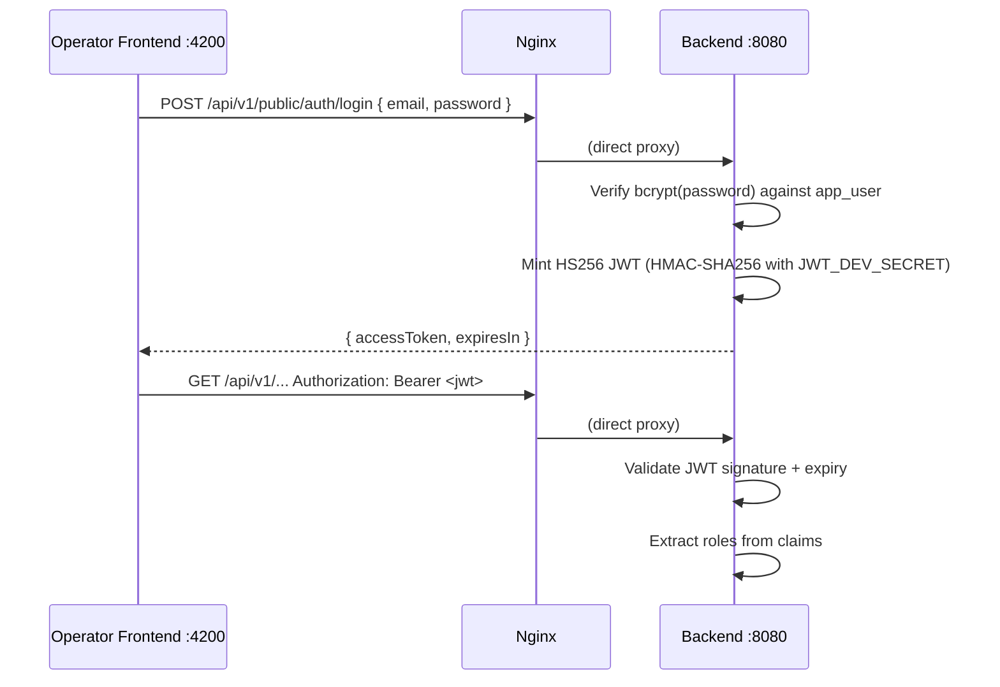
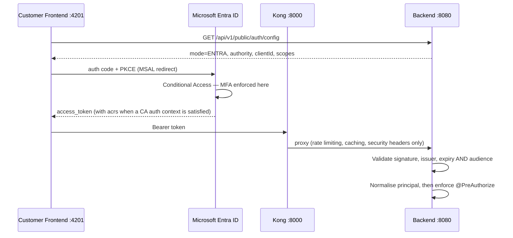

# Sécurité et authentification { #security-authentication }

Registerwerk exécute un modèle d'authentification double : une connexion HS256 JWT intégrée pour l'interface de l'opérateur, et Microsoft Entra ID (ou tout autre fournisseur OIDC) pour l'interface client en production.

**Le backend est le seul validateur de JWT, dans les deux modes.** Kong ajoute une limitation de débit, une mise en cache des réponses et des en-têtes de sécurité devant le chemin API du client ; il ne valide pas les jetons et n'injecte pas d'en-têtes d'identité. Rien dans le backend ne fait confiance à un en-tête pour l'identité.

---

## Modes d'authentification { #authentication-modes }

La variable d'environnement `ENTRA_ENABLED` (et la plus fondamentale `JWT_ISSUER_URI`) détermine quel mode est actif :

| `ENTRA_ENABLED` | `JWT_ISSUER_URI` | Mode d'authentification |
|---|---|---|
| `false` | (vide) | HS256 intégré — connexion par nom d'utilisateur/mot de passe pour les deux portails |
| `true` | Réglé sur l'émetteur OIDC | Connexion Entra pour les clients ; les opérateurs conservent la connexion intégrée |

Les deux réglages sont liés mais distincts : `ENTRA_ENABLED` détermine comment les utilisateurs **se connectent**, `JWT_ISSUER_URI` détermine comment leurs jetons sont **validés**. Le backend est un pur **serveur de ressources** — il n'émet jamais lui-même de jetons OIDC.

### Le décodeur délégant { #the-delegating-decoder }

Les deux portails appellent les mêmes URL (`/api/v1/wallets`, `/api/v1/holder-blocks`, …), si bien que des chaînes de filtres définies par chemin ne peuvent pas les distinguer. `DelegatingJwtDecoder` s'appuie à la place sur l'en-tête JWS `alg` :

- **HS256** → le décodeur local, pour les jetons de session, d'impersonation et de step-up que Registerwerk a lui-même émis.
- **tout le reste** → le décodeur JWKS pour l'émetteur OIDC configuré.

Router sur un en-tête non authentifié est sûr, car cela ne fait que sélectionner un décodeur ; chaque branche effectue ensuite une validation complète de la signature et des revendications. Le risque qui compte est l'acceptation croisée, c'est pourquoi les deux branches sont épinglées :

| Branche | Épinglée par |
|---|---|
| HS256 local | `iss` doit être égal à `registerwerk-local`, donc connaître `JWT_DEV_SECRET` ne suffit pas à lui seul pour forger un jeton accepté |
| OIDC | l'émetteur, l'expiration **et `aud`** doivent correspondre à `JWT_AUDIENCE` — sans cela, un jeton émis par Entra pour n'importe quelle autre application du même locataire serait accepté ici |

C'est ce qui permet à un même déploiement de faire tourner la connexion Entra pour les clients tout en laissant les opérateurs conserver la connexion intégrée et le step-up TOTP local.

### Normalisation du principal { #principal-normalisation }

Les `sub` et `oid` d'un jeton Entra sont des identifiants propres à Entra ; la ligne `app_user` correspondante porte un UUID généré par la base de données. `EntraPrincipalNormalizationFilter` réécrit le jeton authentifié de sorte que `sub` devienne `app_user.id`, et prend les rôles ainsi que le périmètre d'entité depuis la ligne du compte plutôt que depuis les revendications du jeton. Les rôles d'application Entra ne sont consultés que lors du premier provisionnement d'un compte ; ensuite, la base de données fait autorité, si bien qu'un opérateur peut révoquer un rôle sans attendre l'expiration d'un jeton.

---

## Frontend opérateur — connexion HS256 directe { #operator-frontend-direct-hs256-login }



Le frontend de l'opérateur se connecte **directement** au backend via nginx — il ne passe jamais par Kong. Cela permet au portail opérateur de rester fonctionnel indépendamment de la disponibilité de Kong.

---

## Frontend client — connexion via Entra { #customer-frontend-entra-sign-in }



Le SPA récupère sa configuration de connexion à l'exécution plutôt que de l'intégrer au moment de la construction, de sorte qu'une seule image frontend peut être déployée face à n'importe quel locataire opérateur — MSAL a besoin de `clientId` et `authority` à la construction de l'instance.

**L'authentification à deux facteurs est imposée par l'accès conditionnel, pas par le code applicatif.** Un utilisateur non inscrit est redirigé vers le flux d'inscription de Microsoft lors de la connexion et n'atteint jamais le SPA avec un jeton valide. Registerwerk affiche une page `/security` avec un statut et des conseils, mais ne conditionne délibérément pas l'accès à l'application à ce statut : lire l'état depuis Graph à chaque navigation transformerait une panne de Graph en panne complète du portail.

### Step-up : défi de revendications { #step-up-claims-challenge }

Lorsqu'un point de terminaison `@RequiresStepUp` est appelé en mode Entra et que le jeton ne porte pas le contexte d'authentification d'accès conditionnel requis, le backend répond **401** (et non 403) avec :

```
WWW-Authenticate: Bearer realm="", authorization_uri="…", error="insufficient_claims", claims="<base64>"
```

Le SPA décode `claims`, appelle `acquireTokenRedirect({ claims })`, puis réessaie — l'utilisateur se ré-authentifie pour cette seule action plutôt que d'être déconnecté. Le défi est également répété dans le corps JSON, car un en-tête n'atteint le JavaScript du navigateur que si chaque saut de proxy l'expose.

---

## Contrôle des rôles { #role-enforcement }

Chaque méthode de contrôleur nécessitant une autorisation est annotée avec `@PreAuthorize` :

```java
@GetMapping("/assets")
@PreAuthorize("hasAnyRole('REGISTRY_ADMIN', 'COMPLIANCE_OFFICER', 'AUDITOR', 'ISSUER')")
public List<AssetResponse> listAssets() { ... }

@PostMapping("/assets/{id}/deploy")
@PreAuthorize("hasRole('REGISTRY_ADMIN')")
public AssetResponse deployAsset(@PathVariable UUID id) { ... }
```

La classe `SecurityConfig` (`auth/internal/`) configure Spring Security ainsi :
- `/api/v1/public/**` → aucune authentification requise
- `/api/v1/onboarding/token-info/**` et `/api/v1/onboarding/complete` → aucune authentification requise
- Tous les autres `/api/v1/**` → JWT requis
- Tout le reste → refusé

Notez que la chaîne de filtres n'impose que l'**authentification**, pas les rôles ni le rattachement au bon locataire — chaque point de terminaison `/api/v1/**` est accessible à tout utilisateur authentifié, sauf s'il porte lui-même sa propre annotation `@PreAuthorize`. Un contrôle manquant au niveau de la méthode est une véritable faille, pas un simple raffinement de défense en profondeur.

---

## Périmétrage multi-tenant (pas seulement des contrôles de rôle) { #multi-tenant-scoping-not-just-role-checks }

Un contrôle `@PreAuthorize("hasRole(...)")` seul ne suffit pas sur un point de terminaison qui accepte aussi un identifiant de ressource fourni par l'appelant — un contrôle de rôle confirme *quel type* d'acteur appelle, pas *les données de quel client* il peut toucher. Deux motifs assurent la seconde moitié :

- **Lectures/écritures sur une ressource existante** — protégées par le bean de vérification d'accès propre à la ressource (par ex. `@assetAccessChecker.canRead(#assetId, authentication)` /
  `canActAsIssuer(#assetId, authentication)`), qui recherche la ressource et compare son entité propriétaire à `SecurityUtils.extractEntityId(auth)`. `AssetController`, `DeploymentController` et `MintControlController` suivent tous ce motif pour chaque point de terminaison porté sur un actif.
- **Points de terminaison de liste/création prenant un identifiant de client en paramètre de requête** — ne jamais faire confiance à un `issuerId`/`entityId` fourni par le client pour un appelant non-administrateur. `AssetController.listAssets` force la requête sur la propre entité de l'appelant, sauf si `SecurityUtils.isAdminOrAudit(auth)` ; le `resolveIssuerId` d'`AssetController.createAsset` n'honore un `issuerId` explicite dans le corps de la requête que pour un `REGISTRY_ADMIN`, sinon il est silencieusement remplacé par la propre entité de l'appelant. Sauter cette étape permettrait à n'importe quel client authentifié d'énumérer des enregistrements ou de les attribuer à une autre société en passant simplement un identifiant différent — le seul contrôle de rôle ne l'aurait pas détecté.

---

## Garde-fou fail-fast en production { #production-fail-fast-guard }

!!! danger "Secret JWT par défaut en production"
    Si l'application démarre avec `JWT_ISSUER_URI` vide ET que `JWT_DEV_SECRET` est égal à la valeur par défaut fournie dans le dépôt (`registerwerk-dev-jwt-secret-change-in-production!!`) ET que le profil Spring actif est `prod`, l'application **lève une `IllegalStateException` au démarrage** et refuse de démarrer.

Ce garde-fou est implémenté dans `SecurityConfig.@PostConstruct` :

```java
@PostConstruct
void validateProductionConfig() {
    boolean isDevProfile = Arrays.asList(environment.getActiveProfiles()).contains("dev")
                        || Arrays.asList(environment.getActiveProfiles()).contains("test");
    if (!StringUtils.hasText(jwtIssuerUri)
            && DEFAULT_DEV_SECRET.equals(devSecret)
            && !isDevProfile) {
        throw new IllegalStateException(
            "SECURITY: JWT_ISSUER_URI is not set and JWT_DEV_SECRET is the default. " +
            "This configuration must not be used in production. " +
            "Either set JWT_ISSUER_URI (OIDC mode) or set a unique JWT_DEV_SECRET.");
    }
}
```

---

## Structure des revendications JWT { #jwt-claims-structure }

| Revendication | Source | Description |
|---|---|---|
| `sub` | UUID de l'utilisateur | Sujet — l'utilisateur authentifié |
| `email` | E-mail de l'utilisateur | |
| `roles` | `AppRole[]` | Tableau de chaînes de rôles |
| `entityId` | `LegalEntity.id` | Entité du client (frontend client uniquement) |
| `acr` | Contexte d'authentification | `"stepup"` lorsqu'une authentification step-up est en cours de validité |
| `iat` / `exp` | Horodatage d'émission du JWT | Émis le / expire le |

---

## CORS { #cors }

Le partage de ressources cross-origin (CORS) est configuré sur deux couches :

1. **Kong** (pour le frontend client) : le plugin CORS de Kong ajoute les en-têtes appropriés, configurés avec `OPERATOR_FRONTEND_URL` et `CUSTOMER_FRONTEND_URL`
2. **Backend** (`WebConfig`) : origines issues de `registerwerk.cors.allowed-origins` ; resserré en production aux origines exactes des frontends

Les deux couches doivent exposer `WWW-Authenticate` (sinon les navigateurs masquent cet en-tête de réponse au JavaScript, ce qui casserait le défi de revendications) et autoriser `X-Dual-Control-Token` sur les requêtes (points de terminaison à quatre yeux).

---

## En-têtes de sécurité de l'API { #api-security-headers }

Le plugin Kong `response-transformer` ajoute des en-têtes de sécurité à toutes les réponses :

```
X-Content-Type-Options: nosniff
X-Frame-Options: DENY
Strict-Transport-Security: max-age=31536000; includeSubDomains
Content-Security-Policy: default-src 'self'; frame-ancestors 'none'
Permissions-Policy: geolocation=(), camera=(), microphone=()
Referrer-Policy: strict-origin-when-cross-origin
```
