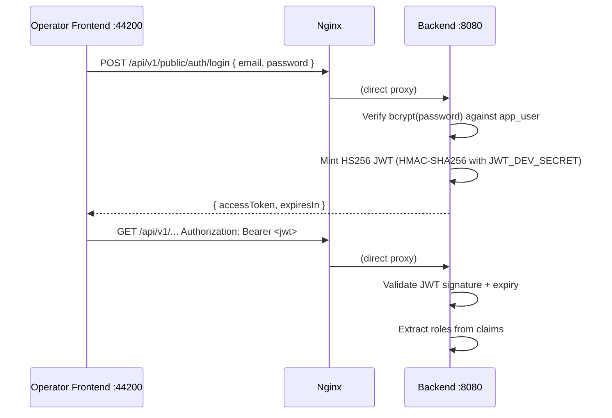
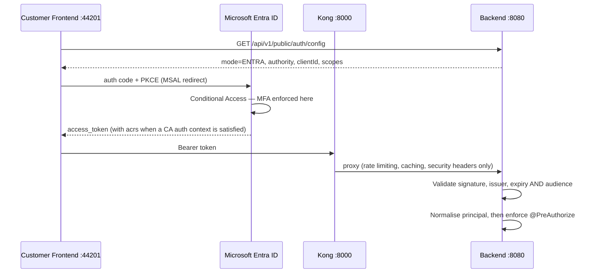

# Sécurité et authentification { #security-authentication }

Registerwerk exécute un modèle d'authentification double : une connexion HS256 JWT intégrée pour l'interface de l'opérateur, et Microsoft Entra ID (ou tout autre fournisseur OIDC) pour l'interface client en production.

**Le backend est le seul validateur de JWT, dans les deux modes.** Kong ajoute une limitation de débit, une mise en cache des réponses et des en-têtes de sécurité devant le chemin API du client ; il ne valide pas les jetons et n'injecte pas d'en-têtes d'identité. Rien dans le backend ne fait confiance à un en-tête pour l'identité.

---

## Modes d'authentification { #authentication-modes }

La variable d'environnement `ENTRA_ENABLED` (et la plus fondamentale `JWT_ISSUER_URI`) détermine quel mode est actif :

| `ENTRA_ENABLED` | `JWT_ISSUER_URI` | Mode d'authentification |
|---|---|---|
| `false` | (vide) | HS256 intégré — connexion par nom d'utilisateur/mot de passe pour les deux portails |
| `true` | Réglé sur l'émetteur OIDC | Connexion Entra pour les clients ; les opérateurs conservent la connexion intégrée |

Les deux réglages sont liés mais distincts : `ENTRA_ENABLED` détermine comment les utilisateurs **se connectent**, `JWT_ISSUER_URI` détermine comment leurs jetons sont **validés**. Le backend est un pur **serveur de ressources** — il n'émet jamais lui-même de jetons OIDC.

### Le décodeur délégant { #the-delegating-decoder }

Les deux portails appellent les mêmes URL (`/api/v1/wallets`, `/api/v1/holder-blocks`, …), si bien que des chaînes de filtres définies par chemin ne peuvent pas les distinguer. `DelegatingJwtDecoder` s'appuie à la place sur l'en-tête JWS `alg` :

- **HS256** → le décodeur local, pour les jetons de session, d'impersonation et de step-up que Registerwerk a lui-même émis.
- **tout le reste** → le décodeur JWKS pour l'émetteur OIDC configuré.

Router sur un en-tête non authentifié est sûr, car cela ne fait que sélectionner un décodeur ; chaque branche effectue ensuite une validation complète de la signature et des revendications. Le risque qui compte est l'acceptation croisée, c'est pourquoi les deux branches sont épinglées :

| Branche | Épinglée par |
|---|---|
| HS256 local | `iss` doit être égal à `registerwerk-local`, donc connaître `JWT_DEV_SECRET` ne suffit pas à lui seul pour forger un jeton accepté |
| OIDC | l'émetteur, l'expiration **et `aud`** doivent correspondre à `JWT_AUDIENCE` — sans cela, un jeton émis par Entra pour n'importe quelle autre application du même locataire serait accepté ici |

C'est ce qui permet à un même déploiement de faire tourner la connexion Entra pour les clients tout en laissant les opérateurs conserver la connexion intégrée et le step-up TOTP local.

### Normalisation du principal { #principal-normalisation }

Les `sub` et `oid` d'un jeton Entra sont des identifiants propres à Entra ; la ligne `app_user` correspondante porte un UUID généré par la base de données. `EntraPrincipalNormalizationFilter` réécrit le jeton authentifié de sorte que `sub` devienne `app_user.id`, et prend les rôles ainsi que le périmètre d'entité depuis la ligne du compte plutôt que depuis les revendications du jeton. Les rôles d'application Entra ne sont consultés que lors du premier provisionnement d'un compte ; ensuite, la base de données fait autorité, si bien qu'un opérateur peut révoquer un rôle sans attendre l'expiration d'un jeton.

---

## Frontend opérateur — connexion HS256 directe { #operator-frontend-direct-hs256-login }


```mermaid
sequenceDiagram
    participant OperatorFE as Operator Frontend :44200
    participant Nginx
    participant Backend as Backend :8080

    OperatorFE->>Nginx: POST /api/v1/public/auth/login { email, password }
    Nginx->>Backend: (direct proxy)
    Backend->>Backend: Verify bcrypt(password) against app_user
    Backend->>Backend: Mint HS256 JWT (HMAC-SHA256 with JWT_DEV_SECRET)
    Backend-->>OperatorFE: { accessToken, expiresIn }
    OperatorFE->>Nginx: GET /api/v1/... Authorization: Bearer <jwt>
    Nginx->>Backend: (direct proxy)
    Backend->>Backend: Validate JWT signature + expiry
    Backend->>Backend: Extract roles from claims
```

Le frontend de l'opérateur se connecte **directement** au backend via nginx — il ne passe jamais par Kong. Cela permet au portail opérateur de rester fonctionnel indépendamment de la disponibilité de Kong.

---

## Frontend client — connexion via Entra { #customer-frontend-entra-sign-in }


```mermaid
sequenceDiagram
    participant CustomerFE as Customer Frontend :44201
    participant Entra as Microsoft Entra ID
    participant Kong as Kong :8000
    participant Backend as Backend :8080

    CustomerFE->>Backend: GET /api/v1/public/auth/config
    Backend-->>CustomerFE: mode=ENTRA, authority, clientId, scopes
    CustomerFE->>Entra: auth code + PKCE (MSAL redirect)
    Entra->>Entra: Conditional Access — MFA enforced here
    Entra-->>CustomerFE: access_token (with acrs when a CA auth context is satisfied)
    CustomerFE->>Kong: Bearer token
    Kong->>Backend: proxy (rate limiting, caching, security headers only)
    Backend->>Backend: Validate signature, issuer, expiry AND audience
    Backend->>Backend: Normalise principal, then enforce @PreAuthorize
```

Le SPA récupère sa configuration de connexion à l'exécution plutôt que de l'intégrer au moment de la construction, de sorte qu'une seule image frontend peut être déployée face à n'importe quel locataire opérateur — MSAL a besoin de `clientId` et `authority` à la construction de l'instance.

**L'authentification à deux facteurs est imposée par l'accès conditionnel, pas par le code applicatif.** Un utilisateur non inscrit est redirigé vers le flux d'inscription de Microsoft lors de la connexion et n'atteint jamais le SPA avec un jeton valide. Registerwerk affiche une page `/security` avec un statut et des conseils, mais ne conditionne délibérément pas l'accès à l'application à ce statut : lire l'état depuis Graph à chaque navigation transformerait une panne de Graph en panne complète du portail.

### Step-up : défi de revendications { #step-up-claims-challenge }

Lorsqu'un point de terminaison `@RequiresStepUp` est appelé en mode Entra et que le jeton ne porte pas le contexte d'authentification d'accès conditionnel requis, le backend répond **401** (et non 403) avec :

```
WWW-Authenticate: Bearer realm="", authorization_uri="…", error="insufficient_claims", claims="<base64>"
```

Le SPA décode `claims`, appelle `acquireTokenRedirect({ claims })`, puis réessaie — l'utilisateur se ré-authentifie pour cette seule action plutôt que d'être déconnecté. Le défi est également répété dans le corps JSON, car un en-tête n'atteint le JavaScript du navigateur que si chaque saut de proxy l'expose.

---

## Opérations on-chain : contrôle de destination, preuve de double contrôle, cycle de vie des signataires { #chain-operations }

**Contrôle de destination.** Whitelist, mint, transfert forcé (unitaire, par lot, Canton, Solana, confidentiel) et approbation forcée n'acceptent qu'une destination qui est un **détenteur actif du registre du même actif**, dont l'entité juridique est ACTIVE et approuvée KYC, sans résultat de filtrage des sanctions non résolu (entité ou bénéficiaire effectif) et sans blocage (Sperrvermerk) §16 eWpG. Sinon l'API répond `403` avec le motif ; il n'existe aucune voie d'exception — intégrez d'abord la nouvelle partie comme détenteur. Les adresses EVM en casse mixte doivent respecter la somme de contrôle EIP-55. Les réponses de whitelist et de mint renvoient le nom du détenteur résolu (`destinationHolder`). Interrupteur : `registerwerk.chain.destination-gate.enabled` (défaut `true` ; ne le désactivez que dans un profil de démonstration). Les opérations forcées exigent une `legalBasis` d'au moins 10 caractères ; un en-tête optionnel `X-Case-Reference` est conservé avec la transaction.

**Preuve de double contrôle.** `/whitelist`, `/unwhitelist` et le `/mint` émetteur exigent un step-up plus un second approbateur (REGISTRY_ADMIN ou COMPLIANCE_OFFICER ; l'initiateur ne peut pas approuver). Pour chaque requête à quatre yeux, l'aspect step-up écrit *avant* l'action un événement d'audit `DUAL_CONTROL_APPROVED` (initiateur, approbateur, action, chemin) ; si cette écriture échoue, l'action n'est pas exécutée. L'identifiant de l'approbateur figure aussi dans `blockchain_transaction.approver_id` et dans l'événement d'audit métier.

**Claims.** Les claims KYC et AML ne sont émis que pour une entité au KYC APPROVED, sans résultat de filtrage non résolu ni blocage. Leur expiration correspond à la prochaine date de revue périodique (une date absente est refusée). `registerwerk.claims.allow-unapproved-in-nonprod=true` n'assouplit cette règle que hors profils de production.

**Cycle de vie des signataires.** La génération, l'import (brut, keystore) et le rattachement HSM exigent un step-up plus un second approbateur ; un nouveau wallet n'est jamais promu automatiquement par défaut de chaîne (seul le tout premier wallet d'une installation neuve l'est) ; modifiez les défauts avec l'action à quatre yeux *définir par défaut*. La suppression d'un wallet est une **suppression logique** : la clé chiffrée est conservée pendant `registerwerk.wallet.retention-days` (90 par défaut) et peut être restaurée ; une tâche de purge la détruit ensuite. La suppression est refusée tant que le wallet est un défaut de chaîne ou que son adresse a déjà signé une transaction (elle peut détenir des droits de déployeur, de registre ou d'émetteur de claims).

!!! warning "Procédure de rotation du signataire (manuelle)"
    Il n'existe pas encore de transfert automatique. Pour remplacer un signataire du registre : (1) créez ou rattachez le nouveau wallet (quatre yeux) ; (2) avec l'ancienne clé, accordez à la nouvelle adresse les rôles nécessaires on-chain avec Foundry `cast send` (`grantRole` / `transferRegistry` / `addKey` de l'émetteur de claims), en présence d'une seconde personne ; (3) vérifiez avec `cast call` que la nouvelle adresse détient tous les rôles ; (4) basculez le défaut de chaîne vers le nouveau wallet (quatre yeux) ; (5) révoquez l'ancienne clé on-chain (`revokeRole` / `removeKey`) et vérifiez ; (6) seulement ensuite, supprimez l'ancien wallet — il reste restaurable pendant la durée de conservation.

## Contrôle des rôles { #role-enforcement }

Chaque méthode de contrôleur nécessitant une autorisation est annotée avec `@PreAuthorize` :

```java
@GetMapping("/assets")
@PreAuthorize("hasAnyRole('REGISTRY_ADMIN', 'COMPLIANCE_OFFICER', 'AUDITOR', 'ISSUER')")
public List<AssetResponse> listAssets() { ... }

@PostMapping("/assets/{id}/deploy")
@PreAuthorize("hasRole('REGISTRY_ADMIN')")
public AssetResponse deployAsset(@PathVariable UUID id) { ... }
```

La classe `SecurityConfig` (`auth/internal/`) configure Spring Security ainsi :
- `/api/v1/public/**` → aucune authentification requise
- `/api/v1/onboarding/token-info/**` et `/api/v1/onboarding/complete` → aucune authentification requise
- Tous les autres `/api/v1/**` → JWT requis
- Tout le reste → refusé

Notez que la chaîne de filtres n'impose que l'**authentification**, pas les rôles ni le rattachement au bon locataire — chaque point de terminaison `/api/v1/**` est accessible à tout utilisateur authentifié, sauf s'il porte lui-même sa propre annotation `@PreAuthorize`. Un contrôle manquant au niveau de la méthode est une véritable faille, pas un simple raffinement de défense en profondeur.

---

## Périmétrage multi-tenant (pas seulement des contrôles de rôle) { #multi-tenant-scoping-not-just-role-checks }

Un contrôle `@PreAuthorize("hasRole(...)")` seul ne suffit pas sur un point de terminaison qui accepte aussi un identifiant de ressource fourni par l'appelant — un contrôle de rôle confirme *quel type* d'acteur appelle, pas *les données de quel client* il peut toucher. Deux motifs assurent la seconde moitié :

- **Lectures/écritures sur une ressource existante** — protégées par le bean de vérification d'accès propre à la ressource (par ex. `@assetAccessChecker.canRead(#assetId, authentication)` /
  `canActAsIssuer(#assetId, authentication)`), qui recherche la ressource et compare son entité propriétaire à `SecurityUtils.extractEntityId(auth)`. `AssetController`, `DeploymentController` et `MintControlController` suivent tous ce motif pour chaque point de terminaison porté sur un actif.
- **Points de terminaison de liste/création prenant un identifiant de client en paramètre de requête** — ne jamais faire confiance à un `issuerId`/`entityId` fourni par le client pour un appelant non-administrateur. `AssetController.listAssets` force la requête sur la propre entité de l'appelant, sauf si `SecurityUtils.isAdminOrAudit(auth)` ; le `resolveIssuerId` d'`AssetController.createAsset` n'honore un `issuerId` explicite dans le corps de la requête que pour un `REGISTRY_ADMIN`, sinon il est silencieusement remplacé par la propre entité de l'appelant. Sauter cette étape permettrait à n'importe quel client authentifié d'énumérer des enregistrements ou de les attribuer à une autre société en passant simplement un identifiant différent — le seul contrôle de rôle ne l'aurait pas détecté.

---

## Garde de session, révocation et usurpation d'identité par l'opérateur { #session-guard }

Une signature valide ne suffit pas. Chaque requête authentifiée (HS256 intégré comme Entra/OIDC) est revérifiée par rapport au compte :

- le compte doit exister et être **activé**, et son entité ne doit pas être CLOSED ou DISSOLVED ;
- les jetons émis localement ne doivent pas être antérieurs à `app_user.tokens_valid_after`, avancé lors d'une désactivation/réactivation, d'un changement de rôles, d'entité ou de mot de passe, et lors d'une révocation explicite ;
- le `jti` du jeton ne doit pas être révoqué : `POST /api/v1/public/auth/logout` révoque désormais le jeton côté serveur au lieu de seulement effacer les cookies.

La recherche est mise en cache 15 secondes et invalidée immédiatement dans le processus ; avec plusieurs réplicas, une révocation prend donc effet en 15 secondes. Les jetons émis avant cette version n'ont pas de `jti` et restent valides jusqu'à expiration (8 heures au plus) sauf révocation de l'utilisateur. Les rejets sont comptés dans `registerwerk_session_rejections_total{reason}`.

Un jeton de step-up (`acr=stepup`) n'est accepté que sur les endpoints `@RequiresStepUp` ; utilisé ailleurs comme jeton porteur ordinaire, il est refusé avec 403.

**Impersonation par l'opérateur.** Le démarrage exige un jeton de step-up et un motif obligatoire (15 caractères minimum, référence de ticket facultative). Le mode par défaut est **READ_ONLY** : seuls GET/HEAD/OPTIONS sont autorisés, le reste renvoie 403 `IMPERSONATION_READ_ONLY`. **ACT_ON_BEHALF** (`POST /api/v1/impersonation/act-on-behalf`) exige en plus un second approbateur et ne peut toujours pas appeler les endpoints d'attestation ou d'administration de compte du client (`registerwerk.auth.impersonation-deny-patterns`). Les sessions durent 30 minutes, sont enregistrées dans `impersonation_session`, visibles des administrateurs de l'entreprise du client (`GET /api/v1/company/impersonation-sessions`) et se terminent par un événement d'audit. La réponse de démarrage ne contient aucun jeton : l'URL de transfert porte un code à usage unique valable 60 secondes, échangé par l'application client contre un cookie de session ; la réutilisation d'un code termine la session. Un même utilisateur ne peut pas agir pour l'acheteur et le vendeur d'une transaction.

## Cycle de vie des utilisateurs, revue des accès et liaison d'identité { #user-lifecycle }

- **Les invitations retirées le restent.** Désactiver ou supprimer un compte invalide ses jetons d'enregistrement et de réinitialisation de mot de passe non consommés ; l'utilisation d'un jeton est refusée (message générique « jeton invalide ou expiré ») tant que le compte est désactivé ou que son entité n'est pas ACTIVE. Une inscription ne réactive jamais un compte.
- **Administrateur d'amorçage.** `DefaultAdminSeeder` crée l'administrateur uniquement si aucun `REGISTRY_ADMIN` n'existe et ne modifie jamais un compte existant. Le compte porte l'indicateur `must_change_password` ; la production refuse de démarrer 24 heures plus tard tant que l'indicateur est positionné ou que le mot de passe d'environnement fonctionne encore. (La restriction du compte signalé à la connexion fera l'objet d'un suivi.)
- **Revue des accès.** Une décision `REVOKED` passe par les mêmes garde-fous que la gestion des utilisateurs (pas soi-même, pas le dernier `REGISTRY_ADMIN` actif, pas le dernier `COMPANY_ADMIN` actif d'une entité), met fin aux sessions de l'utilisateur et invalide ses jetons. Les décisions sont inscriptibles une seule fois ; une correction est une réouverture explicite (`POST /api/v1/access-reviews/{id}/items/{itemId}/reopen`, `REGISTRY_ADMIN`, motif obligatoire, le compte reste désactivé). Le retrait d'un compte privilégié (`REGISTRY_ADMIN`, `COMPLIANCE_OFFICER`, `COMPANY_ADMIN`) n'est d'abord qu'un `REVOKE_PROPOSED` et ne prend effet que lorsqu'un second réviseur, différent, confirme par `REVOKED`. Chaque décision exige un jeton d'authentification renforcée (step-up). Si les rôles ou l'état d'activation d'un compte changent après l'instantané, l'élément passe à `STALE` et doit être rouvert ; une campagne ne peut pas être clôturée tant que des éléments sont `STALE` ou que des comptes créés ou dont les rôles ont changé depuis son démarrage n'y figurent pas. La personne qui a modifié en dernier les rôles d'un compte ne peut pas le réviser. Les paires de rôles de `registerwerk.access-review.sod-conflicts` (par défaut `REGISTRY_ADMIN+COMPLIANCE_OFFICER`) ne sont affichées que comme avertissement. Le retrait ne se propage pas aux portefeuilles, aux rôles on-chain ni aux demandes de double validation en cours ; l'événement d'audit énumère ces suites manuelles.
- **Comptes opérateur.** L'invitation, la modification de rôles, l'activation, la désactivation et la suppression exigent un jeton step-up et sont journalisées avec les rôles, les rôles précédents, l'entité et le rôle réel de l'acteur. La création ou l'octroi de `REGISTRY_ADMIN`/`COMPLIANCE_OFFICER` alerte tous les `REGISTRY_ADMIN`. L'invitation d'un compte opérateur ou d'un compte `REGISTRY_ADMIN`/`COMPLIANCE_OFFICER`/`AUDIT`, la modification de ces rôles, la désactivation, la réactivation ou la suppression d'un tel compte exigent en plus un second approbateur (`X-Dual-Control-Token`, lié à la requête, à usage unique). Tant que deux administrateurs actifs ayant enregistré le TOTP n'ont jamais existé en même temps, un seul step-up suffit et l'événement porte `bootstrap=true` ; ensuite cette exception ne revient plus, même si l'un d'eux est désactivé plus tard (sinon une installation neuve ne pourrait jamais créer son second administrateur). La réactivation d'un compte retiré par une revue des accès exige un motif et toujours le second approbateur, même dans cet état d'amorçage. `registerwerk.admin.operator-email-domains` (facultatif) restreint les domaines des invités. Les administrateurs d'entreprise ne peuvent attribuer que `COMPANY_ADMIN`, `ISSUER`, `INVESTOR` et `TRADER` ; les mots de passe d'onboarding suivent la politique d'inscription (8 à 200 caractères).
- **Liaison d'identité.** Un jeton Entra/OIDC n'est rattaché par e-mail à un compte existant que si le compte n'est pas encore lié à une identité, si le tenant est celui configuré (ou le tenant fédéré de l'entité) et si le jeton atteste une adresse vérifiée (`xms_edov`/`email_verified` ; `registerwerk.auth.link-by-email-without-verification` autorise hors mode production le rattachement sans cette attestation). Un compte lié n'est jamais réorienté : le jeton ne correspond à aucun compte et `IDENTITY_REBIND_REFUSED` est journalisé. La voie prévue est `POST /api/v1/admin/users/{id}/reset-identity` (step-up, second approbateur, motif), après quoi la connexion suivante se lie à nouveau. En mode Entra, un opérateur peut désactiver (déprovisionner) un compte local en indiquant un motif.

## Limitation des tentatives de connexion { #login-throttling }

La connexion intégrée (`POST /api/v1/public/auth/login`, utilisée par le portail opérateur, qui contourne Kong) est limitée dans la table `login_attempt`, partagée par tous les réplicas :

| Compteur | Clé | Effet |
|---|---|---|
| Paire | e-mail + adresse source | 5 échecs en 15 minutes verrouillent **ce compte depuis cette adresse** ; le verrou double à chaque épisode supplémentaire (15, 30, 60 … jusqu'à 240 minutes) et est journalisé une fois par épisode (`LOGIN_LOCKED`) |
| Adresse | adresse source | 30 échecs depuis une même adresse dans la fenêtre font refuser cette adresse (pulvérisation de mots de passe sur de nombreux comptes) |
| Compte | e-mail seul | **Jamais un verrou.** Après 5 échecs de n'importe où, la tentative suivante doit attendre 1, 2, puis 4 secondes après le dernier échec, pour les e-mails existants et inconnus sans distinction |
| Global | toute la plateforme | au-delà de 600 échecs par minute, les adresses ayant déjà échoué sont refusées ; les adresses sans échec continuent de fonctionner |

!!! note "Les connexions limitées reçoivent 429"
    Une connexion refusée par un compteur renvoie **HTTP 429** avec un en-tête `Retry-After` (secondes entières), identique pour les e-mails existants et inconnus. Le thread de la requête ne dort jamais et la connexion ne retient aucune transaction de base de données : un déluge de connexions échouées ne peut donc pas épuiser le pool de connexions.

Un attaquant ne peut donc plus verrouiller un vrai utilisateur en essayant son compte depuis ailleurs. Les e-mails inconnus entraînent le même travail de hachage que les e-mails connus et sont comptés dans la même table bornée : `LoginRequest.email` est limité à 254 caractères, les nouvelles lignes de compte s'arrêtent à `registerwerk.auth.login-max-tracked-keys` (200 000 par défaut), et une tâche purge les lignes expirées toutes les dix minutes (les lignes des paires verrouillées sont conservées 24 heures afin de mémoriser le recul exponentiel).

L'adresse source est `request.getRemoteAddr()`. Derrière un proxy, Tomcat la remplace par le client `X-Forwarded-For` **uniquement si le pair TCP correspond à `registerwerk.auth.trusted-proxies`** (par défaut : boucle locale et plages privées, c'est-à-dire le nginx fourni, Kong et l'ingress) ; un client qui atteint directement le backend ne peut pas choisir son propre compteur. Les deux configurations nginx fournies transmettent désormais `X-Forwarded-For`. Réglage via `REGISTERWERK_AUTH_LOGIN_MAX_ATTEMPTS`, `…_LOCKOUT_MINUTES`, `…_MAX_LOCKOUT_MINUTES`, `…_IP_MAX_FAILURES`, `…_GLOBAL_MAX_FAILURES` et `REGISTERWERK_AUTH_TRUSTED_PROXIES`.

## Garde-fou fail-fast en production { #production-fail-fast-guard }

!!! danger "Secret JWT par défaut en production"
    Si l'application démarre avec `JWT_ISSUER_URI` vide ET que `JWT_DEV_SECRET` est égal à la valeur par défaut fournie dans le dépôt (`registerwerk-dev-jwt-secret-change-in-production!!`) ET que le profil Spring actif est `prod`, l'application **lève une `IllegalStateException` au démarrage** et refuse de démarrer.

Ce garde-fou est implémenté dans `SecurityConfig.@PostConstruct` :

```java
@PostConstruct
void validateProductionConfig() {
    boolean isDevProfile = Arrays.asList(environment.getActiveProfiles()).contains("dev")
                        || Arrays.asList(environment.getActiveProfiles()).contains("test");
    if (!StringUtils.hasText(jwtIssuerUri)
            && DEFAULT_DEV_SECRET.equals(devSecret)
            && !isDevProfile) {
        throw new IllegalStateException(
            "SECURITY: JWT_ISSUER_URI is not set and JWT_DEV_SECRET is the default. " +
            "This configuration must not be used in production. " +
            "Either set JWT_ISSUER_URI (OIDC mode) or set a unique JWT_DEV_SECRET.");
    }
}
```

---

## Structure des revendications JWT { #jwt-claims-structure }

| Revendication | Source | Description |
|---|---|---|
| `sub` | UUID de l'utilisateur | Sujet — l'utilisateur authentifié |
| `email` | E-mail de l'utilisateur | |
| `roles` | `AppRole[]` | Tableau de chaînes de rôles |
| `entityId` | `LegalEntity.id` | Entité du client (frontend client uniquement) |
| `acr` | Contexte d'authentification | `"stepup"` lorsqu'une authentification step-up est en cours de validité |
| `iat` / `exp` | Horodatage d'émission du JWT | Émis le / expire le |

---

## CORS { #cors }

Le partage de ressources cross-origin (CORS) est configuré sur deux couches :

1. **Kong** (pour le frontend client) : le plugin CORS de Kong ajoute les en-têtes appropriés, configurés avec `OPERATOR_FRONTEND_URL` et `CUSTOMER_FRONTEND_URL`
2. **Backend** (`WebConfig`) : origines issues de `registerwerk.cors.allowed-origins` ; resserré en production aux origines exactes des frontends

Les deux couches doivent exposer `WWW-Authenticate` (sinon les navigateurs masquent cet en-tête de réponse au JavaScript, ce qui casserait le défi de revendications) et autoriser `X-Dual-Control-Token` sur les requêtes (points de terminaison à quatre yeux).

---

## En-têtes de sécurité de l'API { #api-security-headers }

Le plugin Kong `response-transformer` ajoute des en-têtes de sécurité à toutes les réponses :

```
X-Content-Type-Options: nosniff
X-Frame-Options: DENY
Strict-Transport-Security: max-age=31536000; includeSubDomains
Content-Security-Policy: default-src 'self'; frame-ancestors 'none'
Permissions-Policy: geolocation=(), camera=(), microphone=()
Referrer-Policy: strict-origin-when-cross-origin
```
