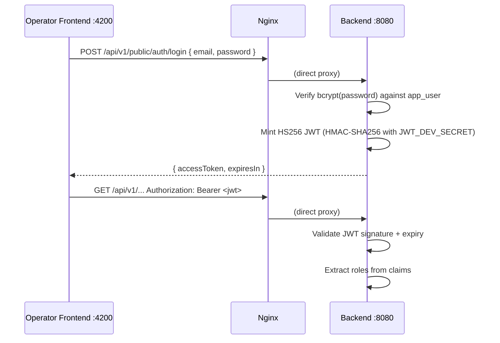
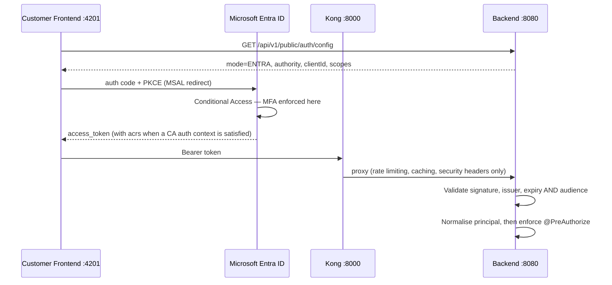

# Sicurezza e autenticazione { #security-authentication }

Registerwerk esegue un doppio modello di autenticazione: un login JWT HS256 integrato per il frontend dell'operatore e Microsoft Entra ID (o qualsiasi provider OIDC) per il frontend del cliente in produzione.

**Il backend è l'unico validatore JWT, in entrambe le modalità.** Kong aggiunge limitazione della velocità, memorizzazione nella cache delle risposte e intestazioni di sicurezza davanti al percorso API del cliente; non convalida i token e non inserisce intestazioni di identità. Niente nel backend si fida di un'intestazione per l'identità.

---

## Modalità di autenticazione { #authentication-modes }

La variabile di ambiente `ENTRA_ENABLED` (e la più fondamentale `JWT_ISSUER_URI`) controlla quale modalità è attiva:

| `ENTRA_ENABLED` | `JWT_ISSUER_URI` | Modalità autenticazione |
|---|---|---|
| `false` | (vuoto) | HS256 integrato: login con nome utente/password per entrambi i portali |
| `true` | Impostato su OIDC emittente | Entra login per i clienti; gli operatori mantengono il login integrato |

I due flag sono correlati ma distinti: `ENTRA_ENABLED` decide come gli utenti **accedono**, `JWT_ISSUER_URI` decide come i loro token vengono **convalidati**. Il backend è un puro **server di risorse**: non emette mai token OIDC.

### Il decodificatore delegante { #the-delegating-decoder }

Entrambi i portali raggiungono gli stessi URL (`/api/v1/wallets`, `/api/v1/holder-blocks`, …), quindi le catene di filtri con ambito di percorso non possono separarli. `DelegatingJwtDecoder` invece instrada sull'intestazione JWS `alg`:

- **HS256** → il decoder locale, per i token di sessione, impersonazione e step-up che Registerwerk stesso ha coniato.
- **qualsiasi altra cosa** → il decoder JWKS per l'emittente OIDC configurato.

Il routing su un'intestazione non autenticata è sicuro perché seleziona solo un decodificatore; ciascun ramo esegue poi la convalida completa della firma e delle attestazioni (claim). Il rischio che conta è l'accettazione incrociata, quindi entrambi i rami sono appuntati (pinned):

| Ramo | Appuntato da |
|---|---|
| Locale HS256 | `iss` deve essere uguale a `registerwerk-local`, quindi conoscere `JWT_DEV_SECRET` non è di per sé sufficiente per creare un token accettato |
| OIDC | emittente, scadenza, **e `aud`** devono corrispondere a `JWT_AUDIENCE`: senza di esso, un token Entra emesso per qualsiasi altra app nello stesso tenant verrebbe accettato qui |

Questo è ciò che consente a una distribuzione di eseguire l'accesso Entra per i clienti mentre gli operatori mantengono l'accesso integrato e lo step-up TOTP locale.

### Normalizzazione del principal { #principal-normalisation }

`sub` e `oid` del token Entra sono gli identificatori di Entra; la riga `app_user` corrispondente contiene un UUID generato dal DB. `EntraPrincipalNormalizationFilter` riscrive il token autenticato in modo che `sub` sia `app_user.id` e prende i ruoli e l'ambito dell'entità dalla riga dell'account anziché dalle attestazioni del token. I ruoli dell'app Entra vengono consultati solo al primo provisioning di un account; successivamente il database è autorevole, quindi un operatore può revocare un ruolo senza attendere la scadenza del token.

---

## Frontend operatore — login HS256 diretto { #operator-frontend-direct-hs256-login }



Il frontend dell'operatore si connette **direttamente** al backend tramite nginx: non passa mai attraverso Kong. Ciò mantiene il portale dell'operatore funzionante indipendentemente dalla disponibilità di Kong.

---

## Frontend cliente — accesso Entra { #customer-frontend-entra-sign-in }



La SPA recupera la configurazione di accesso in fase di runtime anziché integrarla in fase di compilazione, quindi un'immagine frontend è distribuibile su qualsiasi tenant dell'operatore: MSAL ha bisogno di `clientId` e `authority` in fase di costruzione.

**L'autenticazione a due fattori viene applicata dall'accesso condizionale, non dal codice dell'applicazione.** L'utente non registrato viene inviato al flusso di registrazione di Microsoft durante l'accesso e non raggiunge mai la SPA con un token valido. Registerwerk mostra una pagina `/security` con stato e guida, ma deliberatamente non blocca l'app su di essa: leggere lo stato da Graph a ogni navigazione trasformerebbe un'interruzione di Graph in un'interruzione completa del portale.

### Step-up: sfida delle attestazioni (claims challenge) { #step-up-claims-challenge }

Quando un endpoint `@RequiresStepUp` viene chiamato in modalità Entra e il token non dispone del contesto di autenticazione di accesso condizionale richiesto, il backend risponde **401** (non 403) con:

```
WWW-Authenticate: Bearer realm="", authorization_uri="…", error="insufficient_claims", claims="<base64>"
```

La SPA decodifica `claims`, chiama `acquireTokenRedirect({ claims })` e riprova: l'utente si autentica nuovamente per quell'azione anziché essere disconnesso. La sfida si ripete anche nel corpo JSON, perché un'intestazione raggiunge il JavaScript del browser solo se ogni hop proxy la espone.

---

## Applicazione del ruolo { #role-enforcement }

Ogni metodo del controller che richiede l'autorizzazione è annotato con `@PreAuthorize`:

```java
@GetMapping("/assets")
@PreAuthorize("hasAnyRole('REGISTRY_ADMIN', 'COMPLIANCE_OFFICER', 'AUDITOR', 'ISSUER')")
public List<AssetResponse> listAssets() { ... }

@PostMapping("/assets/{id}/deploy")
@PreAuthorize("hasRole('REGISTRY_ADMIN')")
public AssetResponse deployAsset(@PathVariable UUID id) { ... }
```

La classe `SecurityConfig` (`auth/internal/`) configura Spring Security con:
- `/api/v1/public/**` → nessuna autenticazione richiesta
- `/api/v1/onboarding/token-info/**` e `/api/v1/onboarding/complete` → nessuna autenticazione richiesta
- Tutti gli altri `/api/v1/**` → JWT richiesto
- Tutto il resto → nega

Nota che la catena di filtri applica solo l'**autenticazione**, non i ruoli o l'appartenenza al tenant (multi-tenancy):
ogni endpoint `/api/v1/**` è raggiungibile da qualsiasi utente autenticato a meno che non abbia anche il suo proprio
`@PreAuthorize`. Un controllo a livello di metodo mancante è una vera lacuna, non un dettaglio di difesa in profondità.

---

## Ambito multi-tenant (non solo controlli di ruolo) { #multi-tenant-scoping-not-just-role-checks }

Un controllo `@PreAuthorize("hasRole(...)")` da solo non è sufficiente su un endpoint che accetta anche
un identificatore di risorsa dal chiamante: un controllo di ruolo conferma *che tipo* di attore sta chiamando,
non *i dati di quale tenant* potrebbe toccare. Due modelli applicano la seconda metà:

- **Legge/scrive su una risorsa esistente** — gate con il bean di controllo dell'accesso della risorsa
(ad esempio `@assetAccessChecker.canRead(#assetId, authentication)` /
`canActAsIssuer(#assetId, authentication)`), che cerca la risorsa e confronta la sua entità proprietaria con
`SecurityUtils.extractEntityId(auth)`. `AssetController`,
`DeploymentController` e `MintControlController` seguono tutti questo modello per ogni endpoint
con ambito asset.
- **Elenca/crea endpoint che accettano un identificatore tenant come parametro di richiesta**: non fidarsi mai di
un `issuerId`/`entityId` fornito dal client per un chiamante non amministratore. `AssetController.listAssets`
forza la query all'entità del chiamante a meno che `SecurityUtils.isAdminOrAudit(auth)` non sia vero;
il `resolveIssuerId` di `AssetController.createAsset` rispetta un `issuerId` esplicito nel corpo della richiesta
solo per REGISTRY_ADMIN, altrimenti viene sovrascritto silenziosamente con l'entità
del chiamante. Saltare questo passaggio consente a qualsiasi cliente autenticato di enumerare o attribuire record a
un'altra società semplicemente passando un ID diverso: il solo controllo del ruolo non lo avrebbe
rilevato.

---

## Protezione fail-fast per la produzione { #production-fail-fast-guard }

!!! danger "Segreto JWT predefinito in produzione"
    Se l'applicazione si avvia con `JWT_ISSUER_URI` vuoto AND `JWT_DEV_SECRET` uguale al valore predefinito fornito nel repository (`registerwerk-dev-jwt-secret-change-in-production!!`) AND il profilo Spring attivo è `prod`, l'applicazione **genera `IllegalStateException` all'avvio** e si rifiuta di avviarsi.

Questa protezione è implementata in `SecurityConfig.@PostConstruct`:

```java
@PostConstruct
void validateProductionConfig() {
    boolean isDevProfile = Arrays.asList(environment.getActiveProfiles()).contains("dev")
                        || Arrays.asList(environment.getActiveProfiles()).contains("test");
    if (!StringUtils.hasText(jwtIssuerUri)
            && DEFAULT_DEV_SECRET.equals(devSecret)
            && !isDevProfile) {
        throw new IllegalStateException(
            "SECURITY: JWT_ISSUER_URI is not set and JWT_DEV_SECRET is the default. " +
            "This configuration must not be used in production. " +
            "Either set JWT_ISSUER_URI (OIDC mode) or set a unique JWT_DEV_SECRET.");
    }
}
```

---

## Struttura delle attestazioni (claim) JWT { #jwt-claims-structure }

| Attestazione (claim) | Fonte | Descrizione |
|---|---|---|
| `sub` | UUID dell'utente | Oggetto (subject) — l'utente autenticato |
| `email` | E-mail dell'utente | |
| `roles` | `AppRole[]` | Array di stringhe di ruolo |
| `entityId` | `LegalEntity.id` | Entità del cliente (solo FE cliente) |
| `acr` | Contesto di autenticazione | `"stepup"` quando l'autenticazione step-up è corrente |
| `iat` / `exp` | Tempo di conio del JWT | Emesso il / scade il |

---

## CORS { #cors }

La condivisione delle risorse tra origini è configurata su due livelli:

1. **Kong** (per il frontend del cliente): il plugin CORS di Kong aggiunge intestazioni appropriate, configurate con `OPERATOR_FRONTEND_URL` e `CUSTOMER_FRONTEND_URL`
2. **Backend** (`WebConfig`): origini da `registerwerk.cors.allowed-origins`; serrato in produzione per esatte origini frontend

Entrambi i livelli devono esporre `WWW-Authenticate` (altrimenti i browser nascondono le intestazioni di risposta da JavaScript, il che interromperebbe la sfida delle attestazioni) e consentire `X-Dual-Control-Token` sulle richieste (endpoint a 4 occhi).

---

## Intestazioni di sicurezza API { #api-security-headers }

Il plugin Kong `response-transformer` aggiunge intestazioni di sicurezza a tutte le risposte:

```
X-Content-Type-Options: nosniff
X-Frame-Options: DENY
Strict-Transport-Security: max-age=31536000; includeSubDomains
Content-Security-Policy: default-src 'self'; frame-ancestors 'none'
Permissions-Policy: geolocation=(), camera=(), microphone=()
Referrer-Policy: strict-origin-when-cross-origin
```
