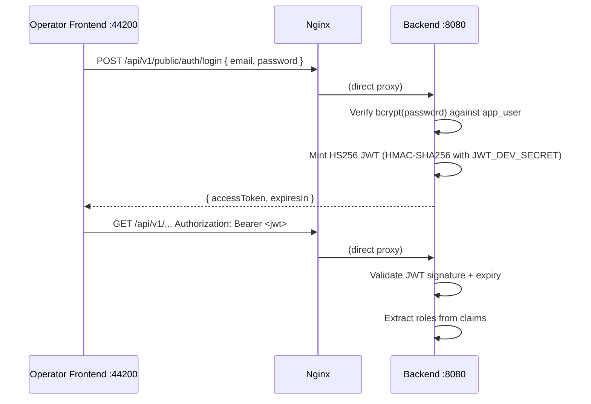
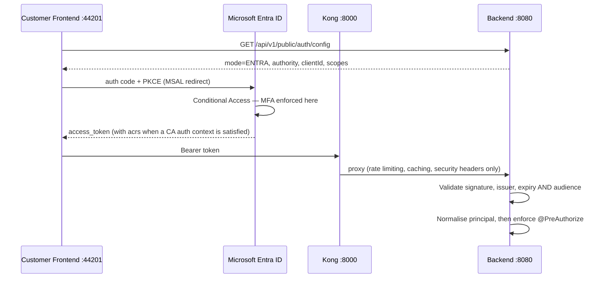

# Sicurezza e autenticazione { #security-authentication }

Registerwerk esegue un doppio modello di autenticazione: un login JWT HS256 integrato per il frontend dell'operatore e Microsoft Entra ID (o qualsiasi provider OIDC) per il frontend del cliente in produzione.

**Il backend è l'unico validatore JWT, in entrambe le modalità.** Kong aggiunge limitazione della velocità, memorizzazione nella cache delle risposte e intestazioni di sicurezza davanti al percorso API del cliente; non convalida i token e non inserisce intestazioni di identità. Niente nel backend si fida di un'intestazione per l'identità.

---

## Modalità di autenticazione { #authentication-modes }

La variabile di ambiente `ENTRA_ENABLED` (e la più fondamentale `JWT_ISSUER_URI`) controlla quale modalità è attiva:

| `ENTRA_ENABLED` | `JWT_ISSUER_URI` | Modalità autenticazione |
|---|---|---|
| `false` | (vuoto) | HS256 integrato: login con nome utente/password per entrambi i portali |
| `true` | Impostato su OIDC emittente | Entra login per i clienti; gli operatori mantengono il login integrato |

I due flag sono correlati ma distinti: `ENTRA_ENABLED` decide come gli utenti **accedono**, `JWT_ISSUER_URI` decide come i loro token vengono **convalidati**. Il backend è un puro **server di risorse**: non emette mai token OIDC.

### Il decodificatore delegante { #the-delegating-decoder }

Entrambi i portali raggiungono gli stessi URL (`/api/v1/wallets`, `/api/v1/holder-blocks`, …), quindi le catene di filtri con ambito di percorso non possono separarli. `DelegatingJwtDecoder` invece instrada sull'intestazione JWS `alg`:

- **HS256** → il decoder locale, per i token di sessione, impersonazione e step-up che Registerwerk stesso ha coniato.
- **qualsiasi altra cosa** → il decoder JWKS per l'emittente OIDC configurato.

Il routing su un'intestazione non autenticata è sicuro perché seleziona solo un decodificatore; ciascun ramo esegue poi la convalida completa della firma e delle attestazioni (claim). Il rischio che conta è l'accettazione incrociata, quindi entrambi i rami sono appuntati (pinned):

| Ramo | Appuntato da |
|---|---|
| Locale HS256 | `iss` deve essere uguale a `registerwerk-local`, quindi conoscere `JWT_DEV_SECRET` non è di per sé sufficiente per creare un token accettato |
| OIDC | emittente, scadenza, **e `aud`** devono corrispondere a `JWT_AUDIENCE`: senza di esso, un token Entra emesso per qualsiasi altra app nello stesso tenant verrebbe accettato qui |

Questo è ciò che consente a una distribuzione di eseguire l'accesso Entra per i clienti mentre gli operatori mantengono l'accesso integrato e lo step-up TOTP locale.

### Normalizzazione del principal { #principal-normalisation }

`sub` e `oid` del token Entra sono gli identificatori di Entra; la riga `app_user` corrispondente contiene un UUID generato dal DB. `EntraPrincipalNormalizationFilter` riscrive il token autenticato in modo che `sub` sia `app_user.id` e prende i ruoli e l'ambito dell'entità dalla riga dell'account anziché dalle attestazioni del token. I ruoli dell'app Entra vengono consultati solo al primo provisioning di un account; successivamente il database è autorevole, quindi un operatore può revocare un ruolo senza attendere la scadenza del token.

---

## Frontend operatore — login HS256 diretto { #operator-frontend-direct-hs256-login }


```mermaid
sequenceDiagram
    participant OperatorFE as Operator Frontend :44200
    participant Nginx
    participant Backend as Backend :8080

    OperatorFE->>Nginx: POST /api/v1/public/auth/login { email, password }
    Nginx->>Backend: (direct proxy)
    Backend->>Backend: Verify bcrypt(password) against app_user
    Backend->>Backend: Mint HS256 JWT (HMAC-SHA256 with JWT_DEV_SECRET)
    Backend-->>OperatorFE: { accessToken, expiresIn }
    OperatorFE->>Nginx: GET /api/v1/... Authorization: Bearer <jwt>
    Nginx->>Backend: (direct proxy)
    Backend->>Backend: Validate JWT signature + expiry
    Backend->>Backend: Extract roles from claims
```

Il frontend dell'operatore si connette **direttamente** al backend tramite nginx: non passa mai attraverso Kong. Ciò mantiene il portale dell'operatore funzionante indipendentemente dalla disponibilità di Kong.

---

## Frontend cliente — accesso Entra { #customer-frontend-entra-sign-in }


```mermaid
sequenceDiagram
    participant CustomerFE as Customer Frontend :44201
    participant Entra as Microsoft Entra ID
    participant Kong as Kong :8000
    participant Backend as Backend :8080

    CustomerFE->>Backend: GET /api/v1/public/auth/config
    Backend-->>CustomerFE: mode=ENTRA, authority, clientId, scopes
    CustomerFE->>Entra: auth code + PKCE (MSAL redirect)
    Entra->>Entra: Conditional Access — MFA enforced here
    Entra-->>CustomerFE: access_token (with acrs when a CA auth context is satisfied)
    CustomerFE->>Kong: Bearer token
    Kong->>Backend: proxy (rate limiting, caching, security headers only)
    Backend->>Backend: Validate signature, issuer, expiry AND audience
    Backend->>Backend: Normalise principal, then enforce @PreAuthorize
```

La SPA recupera la configurazione di accesso in fase di runtime anziché integrarla in fase di compilazione, quindi un'immagine frontend è distribuibile su qualsiasi tenant dell'operatore: MSAL ha bisogno di `clientId` e `authority` in fase di costruzione.

**L'autenticazione a due fattori viene applicata dall'accesso condizionale, non dal codice dell'applicazione.** L'utente non registrato viene inviato al flusso di registrazione di Microsoft durante l'accesso e non raggiunge mai la SPA con un token valido. Registerwerk mostra una pagina `/security` con stato e guida, ma deliberatamente non blocca l'app su di essa: leggere lo stato da Graph a ogni navigazione trasformerebbe un'interruzione di Graph in un'interruzione completa del portale.

### Step-up: sfida delle attestazioni (claims challenge) { #step-up-claims-challenge }

Quando un endpoint `@RequiresStepUp` viene chiamato in modalità Entra e il token non dispone del contesto di autenticazione di accesso condizionale richiesto, il backend risponde **401** (non 403) con:

```
WWW-Authenticate: Bearer realm="", authorization_uri="…", error="insufficient_claims", claims="<base64>"
```

La SPA decodifica `claims`, chiama `acquireTokenRedirect({ claims })` e riprova: l'utente si autentica nuovamente per quell'azione anziché essere disconnesso. La sfida si ripete anche nel corpo JSON, perché un'intestazione raggiunge il JavaScript del browser solo se ogni hop proxy la espone.

---

## Operazioni on-chain: controllo della destinazione, evidenza del doppio controllo, ciclo di vita dei firmatari { #chain-operations }

**Controllo della destinazione.** Whitelist, mint, trasferimento forzato (singolo, batch, Canton, Solana, confidenziale) e approvazione forzata accettano solo una destinazione che sia un **detentore attivo del registro dello stesso asset**, la cui entità giuridica sia ACTIVE e approvata KYC, senza esito di screening sanzioni non risolto (entità o titolare effettivo) e senza blocco (Sperrvermerk) §16 eWpG. Altrimenti l'API risponde `403` con il motivo; non esiste una via di eccezione: la nuova parte va prima acquisita come detentore. Gli indirizzi EVM in maiuscole/minuscole miste devono superare il checksum EIP-55. Le risposte di whitelist e mint restituiscono il nome del detentore risolto (`destinationHolder`). Interruttore: `registerwerk.chain.destination-gate.enabled` (predefinito `true`; disattivarlo solo in un profilo demo). Le operazioni forzate richiedono una `legalBasis` di almeno 10 caratteri; un header opzionale `X-Case-Reference` viene salvato con la transazione.

**Evidenza del doppio controllo.** `/whitelist`, `/unwhitelist` e il `/mint` dell'emittente richiedono step-up più un secondo approvatore (REGISTRY_ADMIN o COMPLIANCE_OFFICER; chi avvia non può approvare). Per ogni richiesta a quattro occhi l'aspetto step-up scrive *prima* dell'azione un evento di audit `DUAL_CONTROL_APPROVED` (iniziatore, approvatore, azione, percorso); se la scrittura fallisce, l'azione non viene eseguita. L'id dell'approvatore è salvato anche in `blockchain_transaction.approver_id` e nell'evento di audit di dominio.

**Claim.** I claim KYC e AML sono emessi solo per un'entità con KYC APPROVED, senza esito di screening non risolto né blocco. La scadenza coincide con la prossima data di revisione periodica (se manca, la richiesta è rifiutata). `registerwerk.claims.allow-unapproved-in-nonprod=true` allenta la regola solo fuori dai profili di produzione.

**Ciclo di vita dei firmatari.** Generazione, importazione (raw, keystore) e collegamento HSM richiedono step-up più un secondo approvatore; un nuovo wallet non viene mai promosso automaticamente a predefinito della chain (solo il primissimo wallet di un'installazione nuova); modificare i predefiniti con l'azione a quattro occhi *imposta predefinito*. L'eliminazione di un wallet è una **eliminazione logica**: la chiave cifrata resta per `registerwerk.wallet.retention-days` (90 di default) e può essere ripristinata; poi un job di purge la distrugge. L'eliminazione è rifiutata finché il wallet è predefinito di una chain o il suo indirizzo ha mai firmato una transazione (potrebbe detenere poteri di deployer, registro o emittente di claim).

!!! warning "Runbook di rotazione del firmatario (manuale)"
    Non esiste ancora un passaggio di consegne automatico. Per sostituire un firmatario del registro: (1) creare o collegare il nuovo wallet (quattro occhi); (2) con la vecchia chiave, concedere al nuovo indirizzo i ruoli necessari on-chain con Foundry `cast send` (`grantRole` / `transferRegistry` / `addKey` dell'emittente di claim), con una seconda persona presente; (3) verificare con `cast call` che il nuovo indirizzo abbia tutti i ruoli; (4) spostare il predefinito della chain sul nuovo wallet (quattro occhi); (5) revocare la vecchia chiave on-chain (`revokeRole` / `removeKey`) e verificare; (6) solo allora eliminare il vecchio wallet: resta ripristinabile per il periodo di conservazione.

## Applicazione del ruolo { #role-enforcement }

Ogni metodo del controller che richiede l'autorizzazione è annotato con `@PreAuthorize`:

```java
@GetMapping("/assets")
@PreAuthorize("hasAnyRole('REGISTRY_ADMIN', 'COMPLIANCE_OFFICER', 'AUDITOR', 'ISSUER')")
public List<AssetResponse> listAssets() { ... }

@PostMapping("/assets/{id}/deploy")
@PreAuthorize("hasRole('REGISTRY_ADMIN')")
public AssetResponse deployAsset(@PathVariable UUID id) { ... }
```

La classe `SecurityConfig` (`auth/internal/`) configura Spring Security con:
- `/api/v1/public/**` → nessuna autenticazione richiesta
- `/api/v1/onboarding/token-info/**` e `/api/v1/onboarding/complete` → nessuna autenticazione richiesta
- Tutti gli altri `/api/v1/**` → JWT richiesto
- Tutto il resto → nega

Nota che la catena di filtri applica solo l'**autenticazione**, non i ruoli o l'appartenenza al tenant (multi-tenancy):
ogni endpoint `/api/v1/**` è raggiungibile da qualsiasi utente autenticato a meno che non abbia anche il suo proprio
`@PreAuthorize`. Un controllo a livello di metodo mancante è una vera lacuna, non un dettaglio di difesa in profondità.

---

## Ambito multi-tenant (non solo controlli di ruolo) { #multi-tenant-scoping-not-just-role-checks }

Un controllo `@PreAuthorize("hasRole(...)")` da solo non è sufficiente su un endpoint che accetta anche
un identificatore di risorsa dal chiamante: un controllo di ruolo conferma *che tipo* di attore sta chiamando,
non *i dati di quale tenant* potrebbe toccare. Due modelli applicano la seconda metà:

- **Legge/scrive su una risorsa esistente** — gate con il bean di controllo dell'accesso della risorsa
(ad esempio `@assetAccessChecker.canRead(#assetId, authentication)` /
`canActAsIssuer(#assetId, authentication)`), che cerca la risorsa e confronta la sua entità proprietaria con
`SecurityUtils.extractEntityId(auth)`. `AssetController`,
`DeploymentController` e `MintControlController` seguono tutti questo modello per ogni endpoint
con ambito asset.
- **Elenca/crea endpoint che accettano un identificatore tenant come parametro di richiesta**: non fidarsi mai di
un `issuerId`/`entityId` fornito dal client per un chiamante non amministratore. `AssetController.listAssets`
forza la query all'entità del chiamante a meno che `SecurityUtils.isAdminOrAudit(auth)` non sia vero;
il `resolveIssuerId` di `AssetController.createAsset` rispetta un `issuerId` esplicito nel corpo della richiesta
solo per REGISTRY_ADMIN, altrimenti viene sovrascritto silenziosamente con l'entità
del chiamante. Saltare questo passaggio consente a qualsiasi cliente autenticato di enumerare o attribuire record a
un'altra società semplicemente passando un ID diverso: il solo controllo del ruolo non lo avrebbe
rilevato.

---

## Guardia di sessione, revoca e impersonation da parte dell'operatore { #session-guard }

Una firma valida non basta. Ogni richiesta autenticata (HS256 integrato e Entra/OIDC) viene ricontrollata rispetto all'account:

- l'account deve esistere ed essere **abilitato** e la sua entità non deve essere CLOSED o DISSOLVED;
- i token emessi localmente non devono essere anteriori a `app_user.tokens_valid_after`, che avanza alla disabilitazione/riabilitazione, al cambio di ruoli, entità o password e in caso di revoca esplicita;
- il `jti` del token non deve essere revocato: `POST /api/v1/public/auth/logout` ora revoca il token lato server invece di limitarsi a cancellare i cookie.

La verifica è in cache per 15 secondi e viene invalidata subito nel processo; con più repliche una revoca ha effetto entro 15 secondi. I token emessi prima di questa versione non hanno `jti` e restano validi fino alla scadenza (al massimo 8 ore), salvo revoca dell'utente. I rifiuti sono contati in `registerwerk_session_rejections_total{reason}`.

Un token di step-up (`acr=stepup`) è accettato solo sugli endpoint `@RequiresStepUp`; usato altrove come normale bearer viene rifiutato con 403.

**Impersonation da parte dell'operatore.** L'avvio richiede un token di step-up e un motivo obbligatorio (almeno 15 caratteri, riferimento di ticket facoltativo). La modalità predefinita è **READ_ONLY**: solo GET/HEAD/OPTIONS, il resto restituisce 403 `IMPERSONATION_READ_ONLY`. **ACT_ON_BEHALF** (`POST /api/v1/impersonation/act-on-behalf`) richiede inoltre un secondo approvatore e non può comunque chiamare gli endpoint di attestazione o amministrazione degli account del cliente (`registerwerk.auth.impersonation-deny-patterns`). Le sessioni durano 30 minuti, sono registrate in `impersonation_session`, sono visibili agli amministratori aziendali del cliente (`GET /api/v1/company/impersonation-sessions`) e terminano con un evento di audit. La risposta di avvio non contiene alcun token: l'URL di handoff porta un codice monouso valido 60 secondi che l'app cliente scambia con un cookie di sessione; il riuso di un codice termina la sessione. Lo stesso utente non può agire sia per l'acquirente sia per il venditore di un'operazione.

## Ciclo di vita degli utenti, revisione degli accessi e vincolo di identità { #user-lifecycle }

- **Gli inviti ritirati restano ritirati.** Disattivare o eliminare un account invalida i suoi token di registrazione e di reimpostazione della password non consumati; l'uso di un token viene rifiutato (messaggio generico «token non valido o scaduto») finché l'account è disattivato o la sua entità non è ACTIVE. Completare una registrazione non riattiva mai un account.
- **Amministratore iniziale.** `DefaultAdminSeeder` crea l'amministratore solo se non esiste alcun `REGISTRY_ADMIN` e non modifica mai un account esistente. L'account porta l'indicatore `must_change_password`; la produzione si rifiuta di avviarsi dopo 24 ore finché l'indicatore è impostato o la password d'ambiente funziona ancora. (La limitazione dell'account contrassegnato al login è un seguito.)
- **Revisione degli accessi.** Una decisione `REVOKED` passa per le stesse protezioni della gestione utenti (non se stessi, non l'ultimo `REGISTRY_ADMIN` abilitato, non l'ultimo `COMPANY_ADMIN` abilitato di un'entità), termina le sessioni dell'utente e invalida i suoi token. Le decisioni sono scrivibili una sola volta; una correzione è una riapertura esplicita (`POST /api/v1/access-reviews/{id}/items/{itemId}/reopen`, `REGISTRY_ADMIN`, motivazione obbligatoria, l'account resta disattivato). La revoca di un account privilegiato (`REGISTRY_ADMIN`, `COMPLIANCE_OFFICER`, `COMPANY_ADMIN`) è dapprima solo `REVOKE_PROPOSED` e diventa efficace quando un secondo revisore, diverso, conferma con `REVOKED`. Ogni decisione richiede un token di autenticazione rafforzata (step-up). Se ruoli o stato di abilitazione di un account cambiano dopo l'istantanea, la voce diventa `STALE` e va riaperta; una campagna non può essere chiusa finché ci sono voci `STALE` o mancano account creati o con ruoli modificati dopo il suo avvio. Chi ha modificato per ultimo i ruoli di un account non può rivederlo. Le coppie di ruoli in `registerwerk.access-review.sod-conflicts` (predefinito `REGISTRY_ADMIN+COMPLIANCE_OFFICER`) sono mostrate per voce solo come avviso. La revoca non si propaga a wallet, ruoli on-chain né a richieste di doppio controllo in sospeso; l'evento di audit elenca questi seguiti manuali.
- **Account operatore.** Invito, modifica dei ruoli, abilitazione, disabilitazione ed eliminazione richiedono un token step-up e sono registrati con ruoli, ruoli precedenti, entità e ruolo effettivo dell'attore. La creazione o l'assegnazione di `REGISTRY_ADMIN`/`COMPLIANCE_OFFICER` avvisa tutti i `REGISTRY_ADMIN`. L'invito di un account operatore o di un account `REGISTRY_ADMIN`/`COMPLIANCE_OFFICER`/`AUDIT`, la modifica di tali ruoli, la disabilitazione, la riabilitazione o l'eliminazione di un tale account richiedono inoltre un secondo approvatore (`X-Dual-Control-Token`, legato alla richiesta, monouso). Finché non sono mai esistiti contemporaneamente due amministratori abilitati con TOTP registrato basta un solo step-up e l'evento reca `bootstrap=true`; dopo, questa eccezione non torna più, anche se uno di loro viene poi disabilitato (altrimenti una nuova installazione non potrebbe mai creare il secondo amministratore). La riabilitazione di un account revocato da una revisione degli accessi richiede una motivazione e sempre il secondo approvatore, anche in tale stato di avvio. `registerwerk.admin.operator-email-domains` (facoltativo) limita i domini degli invitati. Gli amministratori aziendali possono assegnare solo `COMPANY_ADMIN`, `ISSUER`, `INVESTOR` e `TRADER`; le password di onboarding seguono la policy di registrazione (da 8 a 200 caratteri).
- **Vincolo di identità.** Un token Entra/OIDC viene collegato via email a un account esistente solo se l'account non è ancora vincolato a un'identità, il tenant è quello configurato (o il tenant federato dell'entità) e il token attesta un indirizzo verificato (`xms_edov`/`email_verified`; `registerwerk.auth.link-by-email-without-verification` consente fuori dalla modalità produzione il collegamento senza tale attestazione). Un account vincolato non viene mai riassegnato: il token non risolve alcun account e viene registrato `IDENTITY_REBIND_REFUSED`. Il percorso previsto è `POST /api/v1/admin/users/{id}/reset-identity` (step-up, secondo approvatore, motivazione), dopodiché il successivo accesso si vincola di nuovo. In modalità Entra un operatore può disattivare (deprovisioning) un account locale indicando una motivazione.

## Limitazione dei tentativi di accesso { #login-throttling }

L'accesso integrato (`POST /api/v1/public/auth/login`, usato dal portale operatore, che aggira Kong) è limitato nella tabella `login_attempt`, condivisa da tutte le repliche:

| Contatore | Chiave | Effetto |
|---|---|---|
| Coppia | e-mail + indirizzo di origine | 5 errori in 15 minuti bloccano **quell'account da quell'indirizzo**; il blocco raddoppia a ogni episodio successivo (15, 30, 60 … fino a 240 minuti) ed è registrato una volta per episodio (`LOGIN_LOCKED`) |
| Indirizzo | indirizzo di origine | 30 errori da un indirizzo nella finestra fanno rifiutare quell'indirizzo (password spraying su molti account) |
| Account | solo e-mail | **Mai un blocco.** Dopo 5 errori da qualsiasi origine il tentativo successivo deve attendere 1, 2, poi 4 secondi dall'ultimo errore, per e-mail esistenti e sconosciute allo stesso modo |
| Globale | intera piattaforma | oltre 600 errori al minuto gli indirizzi che hanno già fallito sono rifiutati; gli indirizzi senza errori continuano a funzionare |

!!! note "Gli accessi limitati ricevono 429"
    Un accesso rifiutato da un contatore restituisce **HTTP 429** con un header `Retry-After` (secondi interi), identico per e-mail esistenti e sconosciute. Il thread della richiesta non dorme mai e l'accesso non trattiene alcuna transazione di database, quindi una raffica di accessi falliti non può esaurire il pool di connessioni.

Un attaccante non può quindi più bloccare un utente reale provando il suo account da altrove. Le e-mail sconosciute richiedono lo stesso lavoro di hashing di quelle note e sono conteggiate nella stessa tabella limitata: `LoginRequest.email` è limitata a 254 caratteri, le nuove righe di account si fermano a `registerwerk.auth.login-max-tracked-keys` (predefinito 200 000) e un job elimina le righe scadute ogni dieci minuti (le righe delle coppie bloccate sono conservate 24 ore perché il backoff venga ricordato).

L'indirizzo di origine è `request.getRemoteAddr()`. Dietro un proxy, Tomcat lo sostituisce con il client di `X-Forwarded-For` **solo se il peer TCP corrisponde a `registerwerk.auth.trusted-proxies`** (predefinito: loopback e intervalli privati, cioè il nginx incluso, Kong e l'ingress); un client che raggiunge direttamente il backend non può scegliere il proprio contatore. Entrambe le configurazioni nginx incluse inoltrano ora `X-Forwarded-For`. Regolabile con `REGISTERWERK_AUTH_LOGIN_MAX_ATTEMPTS`, `…_LOCKOUT_MINUTES`, `…_MAX_LOCKOUT_MINUTES`, `…_IP_MAX_FAILURES`, `…_GLOBAL_MAX_FAILURES` e `REGISTERWERK_AUTH_TRUSTED_PROXIES`.

## Protezione fail-fast per la produzione { #production-fail-fast-guard }

!!! danger "Segreto JWT predefinito in produzione"
    Se l'applicazione si avvia con `JWT_ISSUER_URI` vuoto AND `JWT_DEV_SECRET` uguale al valore predefinito fornito nel repository (`registerwerk-dev-jwt-secret-change-in-production!!`) AND il profilo Spring attivo è `prod`, l'applicazione **genera `IllegalStateException` all'avvio** e si rifiuta di avviarsi.

Questa protezione è implementata in `SecurityConfig.@PostConstruct`:

```java
@PostConstruct
void validateProductionConfig() {
    boolean isDevProfile = Arrays.asList(environment.getActiveProfiles()).contains("dev")
                        || Arrays.asList(environment.getActiveProfiles()).contains("test");
    if (!StringUtils.hasText(jwtIssuerUri)
            && DEFAULT_DEV_SECRET.equals(devSecret)
            && !isDevProfile) {
        throw new IllegalStateException(
            "SECURITY: JWT_ISSUER_URI is not set and JWT_DEV_SECRET is the default. " +
            "This configuration must not be used in production. " +
            "Either set JWT_ISSUER_URI (OIDC mode) or set a unique JWT_DEV_SECRET.");
    }
}
```

---

## Struttura delle attestazioni (claim) JWT { #jwt-claims-structure }

| Attestazione (claim) | Fonte | Descrizione |
|---|---|---|
| `sub` | UUID dell'utente | Oggetto (subject) — l'utente autenticato |
| `email` | E-mail dell'utente | |
| `roles` | `AppRole[]` | Array di stringhe di ruolo |
| `entityId` | `LegalEntity.id` | Entità del cliente (solo FE cliente) |
| `acr` | Contesto di autenticazione | `"stepup"` quando l'autenticazione step-up è corrente |
| `iat` / `exp` | Tempo di conio del JWT | Emesso il / scade il |

---

## CORS { #cors }

La condivisione delle risorse tra origini è configurata su due livelli:

1. **Kong** (per il frontend del cliente): il plugin CORS di Kong aggiunge intestazioni appropriate, configurate con `OPERATOR_FRONTEND_URL` e `CUSTOMER_FRONTEND_URL`
2. **Backend** (`WebConfig`): origini da `registerwerk.cors.allowed-origins`; serrato in produzione per esatte origini frontend

Entrambi i livelli devono esporre `WWW-Authenticate` (altrimenti i browser nascondono le intestazioni di risposta da JavaScript, il che interromperebbe la sfida delle attestazioni) e consentire `X-Dual-Control-Token` sulle richieste (endpoint a 4 occhi).

---

## Intestazioni di sicurezza API { #api-security-headers }

Il plugin Kong `response-transformer` aggiunge intestazioni di sicurezza a tutte le risposte:

```
X-Content-Type-Options: nosniff
X-Frame-Options: DENY
Strict-Transport-Security: max-age=31536000; includeSubDomains
Content-Security-Policy: default-src 'self'; frame-ancestors 'none'
Permissions-Policy: geolocation=(), camera=(), microphone=()
Referrer-Policy: strict-origin-when-cross-origin
```
