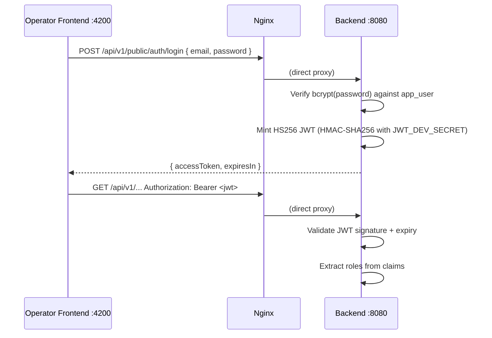
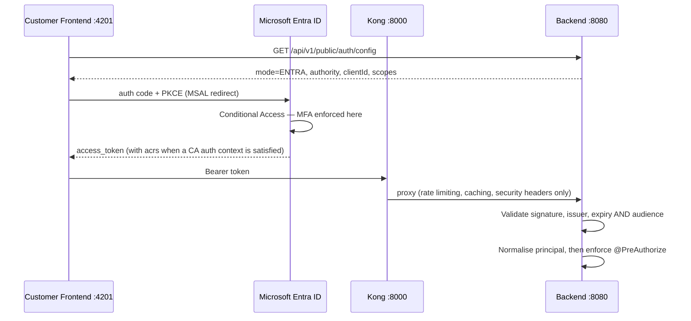

# Security & Authentication

Registerwerk runs a dual authentication model: a built-in HS256 JWT login for the operator frontend, and Microsoft Entra ID (or any OIDC provider) for the customer frontend in production.

**The backend is the sole JWT validator, in both modes.** Kong adds rate limiting, response caching and security headers in front of the customer API path; it does not validate tokens and does not inject identity headers. Nothing in the backend trusts a header for identity.

---

## Authentication modes

The `ENTRA_ENABLED` environment variable (and the more fundamental `JWT_ISSUER_URI`) controls which mode is active:

| `ENTRA_ENABLED` | `JWT_ISSUER_URI` | Auth mode |
|---|---|---|
| `false` | (blank) | Built-in HS256 — username/password login for both portals |
| `true` | Set to OIDC issuer | Entra sign-in for customers; operators keep built-in login |

The two flags are related but distinct: `ENTRA_ENABLED` decides how users **sign in**, `JWT_ISSUER_URI` decides how their tokens are **validated**. The backend is a pure **resource server** — it never issues OIDC tokens itself.

### The delegating decoder

Both portals hit the same URLs (`/api/v1/wallets`, `/api/v1/holder-blocks`, …), so path-scoped filter chains cannot separate them. `DelegatingJwtDecoder` instead routes on the JWS `alg` header:

- **HS256** → the local decoder, for session, impersonation and step-up tokens Registerwerk minted itself.
- **anything else** → the JWKS decoder for the configured OIDC issuer.

Routing on an unauthenticated header is safe because it only selects a decoder; each branch then performs full signature and claim validation. The risk that matters is cross-acceptance, so both branches are pinned:

| Branch | Pinned by |
|---|---|
| Local HS256 | `iss` must equal `registerwerk-local`, so knowing `JWT_DEV_SECRET` is not on its own enough to forge an accepted token |
| OIDC | issuer, expiry, **and `aud`** must match `JWT_AUDIENCE` — without it, a token Entra issued for any other app in the same tenant would be accepted here |

This is what lets one deployment run Entra sign-in for customers while operators keep built-in login and local TOTP step-up.

### Principal normalisation

An Entra token's `sub` and `oid` are Entra's identifiers; the corresponding `app_user` row carries a DB-generated UUID. `EntraPrincipalNormalizationFilter` rewrites the authenticated token so `sub` is the `app_user.id`, and takes roles and entity scope from the account row rather than from the token's claims. Entra app roles are consulted only when an account is first provisioned; afterwards the database is authoritative, so an operator can revoke a role without waiting for a token to expire.

---

## Operator frontend — direct HS256 login



The operator frontend connects **directly** to the backend through nginx — it never goes through Kong. This keeps the operator portal functional independent of Kong's availability.

---

## Customer frontend — Entra sign-in



The SPA fetches its sign-in configuration at runtime rather than having it baked in at build time, so one frontend image is deployable against any operator tenant — MSAL needs `clientId` and `authority` at construction time.

**Two-factor authentication is enforced by Conditional Access, not by application code.** An unenrolled user is sent to Microsoft's registration flow during sign-in and never reaches the SPA with a valid token. Registerwerk shows a `/security` page with status and guidance, but deliberately does not gate the app on it: reading status from Graph on every navigation would turn a Graph outage into a full portal outage.

### Step-up: claims challenge

When a `@RequiresStepUp` endpoint is called in Entra mode and the token lacks the required Conditional Access authentication context, the backend replies **401** (not 403) with:

```
WWW-Authenticate: Bearer realm="", authorization_uri="…", error="insufficient_claims", claims="<base64>"
```

The SPA decodes `claims`, calls `acquireTokenRedirect({ claims })`, and retries — the user re-authenticates for that one action rather than being signed out. The challenge is repeated in the JSON body as well, because a header only reaches browser JavaScript if every proxy hop exposes it.

---

## Role enforcement

Every controller method that requires authorisation is annotated with `@PreAuthorize`:

```java
@GetMapping("/assets")
@PreAuthorize("hasAnyRole('REGISTRY_ADMIN', 'COMPLIANCE_OFFICER', 'AUDITOR', 'ISSUER')")
public List<AssetResponse> listAssets() { ... }

@PostMapping("/assets/{id}/deploy")
@PreAuthorize("hasRole('REGISTRY_ADMIN')")
public AssetResponse deployAsset(@PathVariable UUID id) { ... }
```

The `SecurityConfig` class (`auth/internal/`) configures Spring Security with:
- `/api/v1/public/**` → no authentication required
- `/api/v1/onboarding/token-info/**` and `/api/v1/onboarding/complete` → no authentication required
- All other `/api/v1/**` → JWT required
- Everything else → deny

Note that the filter chain only enforces **authentication**, not roles or tenancy — every
`/api/v1/**` endpoint is reachable by any authenticated user unless it also carries its own
`@PreAuthorize`. A missing method-level check is a real gap, not a defence-in-depth nicety.

---

## Multi-tenant scoping (not just role checks)

A `@PreAuthorize("hasRole(...)")` check alone is not enough on an endpoint that also accepts
a resource identifier from the caller — a role check confirms *what kind* of actor is calling,
not *which tenant's data* they may touch. Two patterns enforce the second half:

- **Reads/writes on an existing resource** — gate with the resource's own access-checker bean
  (e.g. `@assetAccessChecker.canRead(#assetId, authentication)` /
  `canActAsIssuer(#assetId, authentication)`), which looks up the resource and compares its
  owning entity against `SecurityUtils.extractEntityId(auth)`. `AssetController`,
  `DeploymentController`, and `MintControlController` all follow this pattern for every
  asset-scoped endpoint.
- **List/create endpoints that take a tenant identifier as a request parameter** — never trust
  a client-supplied `issuerId`/`entityId` for a non-admin caller. `AssetController.listAssets`
  forces the query to the caller's own entity unless `SecurityUtils.isAdminOrAudit(auth)`;
  `AssetController.createAsset`'s `resolveIssuerId` only honours an explicit `issuerId` in the
  request body for REGISTRY_ADMIN, otherwise it is silently overridden with the caller's own
  entity. Skipping this step lets any authenticated customer enumerate or attribute records to
  a different company by simply passing a different id — the role check alone would not have
  caught it.

---

## Production fail-fast guard

!!! danger "Default JWT secret in production"
    If the application starts with `JWT_ISSUER_URI` blank AND `JWT_DEV_SECRET` equals the default value shipped in the repository (`registerwerk-dev-jwt-secret-change-in-production!!`) AND the active Spring profile is `prod`, the application **throws `IllegalStateException` on startup** and refuses to start.

This guard is implemented in `SecurityConfig.@PostConstruct`:

```java
@PostConstruct
void validateProductionConfig() {
    boolean isDevProfile = Arrays.asList(environment.getActiveProfiles()).contains("dev")
                        || Arrays.asList(environment.getActiveProfiles()).contains("test");
    if (!StringUtils.hasText(jwtIssuerUri)
            && DEFAULT_DEV_SECRET.equals(devSecret)
            && !isDevProfile) {
        throw new IllegalStateException(
            "SECURITY: JWT_ISSUER_URI is not set and JWT_DEV_SECRET is the default. " +
            "This configuration must not be used in production. " +
            "Either set JWT_ISSUER_URI (OIDC mode) or set a unique JWT_DEV_SECRET.");
    }
}
```

---

## JWT claims structure

| Claim | Source | Description |
|---|---|---|
| `sub` | User's UUID | Subject — the authenticated user |
| `email` | User's email | |
| `roles` | `AppRole[]` | Array of role strings |
| `entityId` | `LegalEntity.id` | Customer's entity (customer FE only) |
| `acr` | Auth context | `"stepup"` when step-up auth is current |
| `iat` / `exp` | JWT minting time | Issued at / expires at |

---

## CORS

Cross-Origin Resource Sharing is configured at two layers:

1. **Kong** (for customer frontend): Kong's CORS plugin adds appropriate headers, configured with `OPERATOR_FRONTEND_URL` and `CUSTOMER_FRONTEND_URL`
2. **Backend** (`WebConfig`): origins from `registerwerk.cors.allowed-origins`; tightened in production to exact frontend origins

Both layers must expose `WWW-Authenticate` (browsers hide response headers from JavaScript otherwise, which would break the claims challenge) and allow `X-Dual-Control-Token` on requests (4-eyes endpoints).

---

## API security headers

The `response-transformer` Kong plugin adds security headers to all responses:

```
X-Content-Type-Options: nosniff
X-Frame-Options: DENY
Strict-Transport-Security: max-age=31536000; includeSubDomains
Content-Security-Policy: default-src 'self'; frame-ancestors 'none'
Permissions-Policy: geolocation=(), camera=(), microphone=()
Referrer-Policy: strict-origin-when-cross-origin
```
