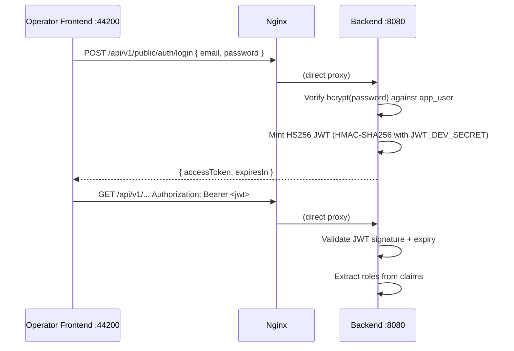
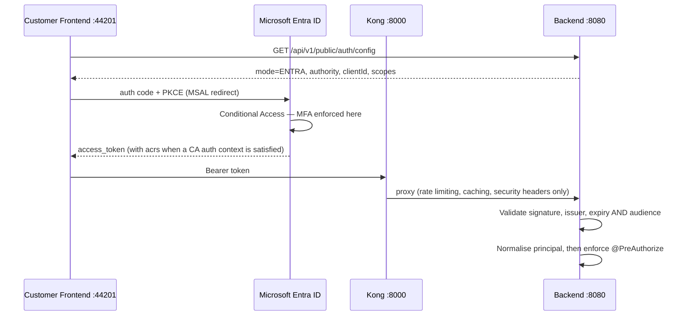

# Security & Authentication

Registerwerk runs a dual authentication model: a built-in HS256 JWT login for the operator frontend, and Microsoft Entra ID (or any OIDC provider) for the customer frontend in production.

**The backend is the sole JWT validator, in both modes.** Kong adds rate limiting, response caching and security headers in front of the customer API path; it does not validate tokens and does not inject identity headers. Nothing in the backend trusts a header for identity.

---

## Authentication modes

The `ENTRA_ENABLED` environment variable (and the more fundamental `JWT_ISSUER_URI`) controls which mode is active:

| `ENTRA_ENABLED` | `JWT_ISSUER_URI` | Auth mode |
|---|---|---|
| `false` | (blank) | Built-in HS256 — username/password login for both portals |
| `true` | Set to OIDC issuer | Entra sign-in for customers; operators keep built-in login |

The two flags are related but distinct: `ENTRA_ENABLED` decides how users **sign in**, `JWT_ISSUER_URI` decides how their tokens are **validated**. The backend is a pure **resource server** — it never issues OIDC tokens itself.

### The delegating decoder

Both portals hit the same URLs (`/api/v1/wallets`, `/api/v1/holder-blocks`, …), so path-scoped filter chains cannot separate them. `DelegatingJwtDecoder` instead routes on the JWS `alg` header:

- **HS256** → the local decoder, for session, impersonation and step-up tokens Registerwerk minted itself.
- **anything else** → the JWKS decoder for the configured OIDC issuer.

Routing on an unauthenticated header is safe because it only selects a decoder; each branch then performs full signature and claim validation. The risk that matters is cross-acceptance, so both branches are pinned:

| Branch | Pinned by |
|---|---|
| Local HS256 | `iss` must equal `registerwerk-local`, so knowing `JWT_DEV_SECRET` is not on its own enough to forge an accepted token |
| OIDC | issuer, expiry, **and `aud`** must match `JWT_AUDIENCE` — without it, a token Entra issued for any other app in the same tenant would be accepted here |

This is what lets one deployment run Entra sign-in for customers while operators keep built-in login and local TOTP step-up.

### Principal normalisation

An Entra token's `sub` and `oid` are Entra's identifiers; the corresponding `app_user` row carries a DB-generated UUID. `EntraPrincipalNormalizationFilter` rewrites the authenticated token so `sub` is the `app_user.id`, and takes roles and entity scope from the account row rather than from the token's claims. Entra app roles are consulted only when an account is first provisioned; afterwards the database is authoritative, so an operator can revoke a role without waiting for a token to expire.

---

## Operator frontend — direct HS256 login


```mermaid
sequenceDiagram
    participant OperatorFE as Operator Frontend :44200
    participant Nginx
    participant Backend as Backend :8080

    OperatorFE->>Nginx: POST /api/v1/public/auth/login { email, password }
    Nginx->>Backend: (direct proxy)
    Backend->>Backend: Verify bcrypt(password) against app_user
    Backend->>Backend: Mint HS256 JWT (HMAC-SHA256 with JWT_DEV_SECRET)
    Backend-->>OperatorFE: { accessToken, expiresIn }
    OperatorFE->>Nginx: GET /api/v1/... Authorization: Bearer <jwt>
    Nginx->>Backend: (direct proxy)
    Backend->>Backend: Validate JWT signature + expiry
    Backend->>Backend: Extract roles from claims
```

The operator frontend connects **directly** to the backend through nginx — it never goes through Kong. This keeps the operator portal functional independent of Kong's availability.

---

## Customer frontend — Entra sign-in


```mermaid
sequenceDiagram
    participant CustomerFE as Customer Frontend :44201
    participant Entra as Microsoft Entra ID
    participant Kong as Kong :8000
    participant Backend as Backend :8080

    CustomerFE->>Backend: GET /api/v1/public/auth/config
    Backend-->>CustomerFE: mode=ENTRA, authority, clientId, scopes
    CustomerFE->>Entra: auth code + PKCE (MSAL redirect)
    Entra->>Entra: Conditional Access — MFA enforced here
    Entra-->>CustomerFE: access_token (with acrs when a CA auth context is satisfied)
    CustomerFE->>Kong: Bearer token
    Kong->>Backend: proxy (rate limiting, caching, security headers only)
    Backend->>Backend: Validate signature, issuer, expiry AND audience
    Backend->>Backend: Normalise principal, then enforce @PreAuthorize
```

The SPA fetches its sign-in configuration at runtime rather than having it baked in at build time, so one frontend image is deployable against any operator tenant — MSAL needs `clientId` and `authority` at construction time.

**Two-factor authentication is enforced by Conditional Access, not by application code.** An unenrolled user is sent to Microsoft's registration flow during sign-in and never reaches the SPA with a valid token. Registerwerk shows a `/security` page with status and guidance, but deliberately does not gate the app on it: reading status from Graph on every navigation would turn a Graph outage into a full portal outage.

### Step-up: claims challenge

When a `@RequiresStepUp` endpoint is called in Entra mode and the token lacks the required Conditional Access authentication context, the backend replies **401** (not 403) with:

```
WWW-Authenticate: Bearer realm="", authorization_uri="…", error="insufficient_claims", claims="<base64>"
```

The SPA decodes `claims`, calls `acquireTokenRedirect({ claims })`, and retries — the user re-authenticates for that one action rather than being signed out. The challenge is repeated in the JSON body as well, because a header only reaches browser JavaScript if every proxy hop exposes it.

---

## Chain operations: destination gate, dual-control evidence, signer lifecycle

**Destination gate.** Whitelist, mint, forced transfer (single, batch, Canton, Solana, confidential) and forced approve only accept a destination that is an **active register holder of the same asset**, whose legal entity is ACTIVE and KYC-approved, has no unresolved sanctions-screening result (entity or beneficial owner) and is not under a §16 eWpG Sperrvermerk. Anything else is refused with `403` and the reason; there is no exception path — onboard the new party as a holder first. Mixed-case EVM addresses must pass the EIP-55 checksum. The whitelist and mint responses echo the resolved holder name (`destinationHolder`). Switch: `registerwerk.chain.destination-gate.enabled` (default `true`; disable only in a demo profile). Forced operations require a `legalBasis` of at least 10 characters; an optional `X-Case-Reference` header is stored with the transaction.

**Dual-control evidence.** `/whitelist`, `/unwhitelist` and the issuer `/mint` need step-up plus a second approver (REGISTRY_ADMIN or COMPLIANCE_OFFICER; the initiator cannot approve). For every 4-eyes request the step-up aspect writes a `DUAL_CONTROL_APPROVED` audit event (initiator, approver, action, path) *before* the action runs; if that write fails, the action does not run. The approver id is also stored on `blockchain_transaction.approver_id` and in the domain audit event.

**Claims.** KYC and AML claims are issued only for an entity that is KYC APPROVED, has no unresolved screening hit and no block. Their expiry is the entity's next periodic review date (a missing date is refused). `registerwerk.claims.allow-unapproved-in-nonprod=true` relaxes this outside production profiles only.

**Signer lifecycle.** Generate, import (raw, keystore) and HSM attach need step-up plus a second approver, and a new wallet is never promoted to chain default automatically (only the very first wallet of a fresh install is); change defaults with the 4-eyes *set default* action. Deleting a wallet is a **soft delete**: the encrypted key stays for `registerwerk.wallet.retention-days` (default 90) and can be restored; a purge job then destroys it. Deletion is refused while the wallet is a chain default or its address ever signed a chain transaction (it may hold deployer, registry or claim-issuer authority).

!!! warning "Signer rotation runbook (manual)"
    There is no automated handover yet. To replace a registry signer: (1) create or attach the new wallet (4-eyes); (2) with the old key, grant the new address the required roles on chain using Foundry `cast send` (`grantRole` / `transferRegistry` / claim-issuer `addKey`), with a second person present; (3) verify with `cast call` that the new address holds every role; (4) switch the chain default to the new wallet (4-eyes); (5) revoke the old key on chain (`revokeRole` / `removeKey`) and verify; (6) only then delete the old wallet — it stays restorable for the retention period.

## Role enforcement

Every controller method that requires authorisation is annotated with `@PreAuthorize`:

```java
@GetMapping("/assets")
@PreAuthorize("hasAnyRole('REGISTRY_ADMIN', 'COMPLIANCE_OFFICER', 'AUDITOR', 'ISSUER')")
public List<AssetResponse> listAssets() { ... }

@PostMapping("/assets/{id}/deploy")
@PreAuthorize("hasRole('REGISTRY_ADMIN')")
public AssetResponse deployAsset(@PathVariable UUID id) { ... }
```

The `SecurityConfig` class (`auth/internal/`) configures Spring Security with:
- `/api/v1/public/**` → no authentication required
- `/api/v1/onboarding/token-info/**` and `/api/v1/onboarding/complete` → no authentication required
- All other `/api/v1/**` → JWT required
- Everything else → deny

Note that the filter chain only enforces **authentication**, not roles or tenancy — every
`/api/v1/**` endpoint is reachable by any authenticated user unless it also carries its own
`@PreAuthorize`. A missing method-level check is a real gap, not a defence-in-depth nicety.

---

## Multi-tenant scoping (not just role checks)

A `@PreAuthorize("hasRole(...)")` check alone is not enough on an endpoint that also accepts
a resource identifier from the caller — a role check confirms *what kind* of actor is calling,
not *which tenant's data* they may touch. Two patterns enforce the second half:

- **Reads/writes on an existing resource** — gate with the resource's own access-checker bean
  (e.g. `@assetAccessChecker.canRead(#assetId, authentication)` /
  `canActAsIssuer(#assetId, authentication)`), which looks up the resource and compares its
  owning entity against `SecurityUtils.extractEntityId(auth)`. `AssetController`,
  `DeploymentController`, and `MintControlController` all follow this pattern for every
  asset-scoped endpoint.
- **List/create endpoints that take a tenant identifier as a request parameter** — never trust
  a client-supplied `issuerId`/`entityId` for a non-admin caller. `AssetController.listAssets`
  forces the query to the caller's own entity unless `SecurityUtils.isAdminOrAudit(auth)`;
  `AssetController.createAsset`'s `resolveIssuerId` only honours an explicit `issuerId` in the
  request body for REGISTRY_ADMIN, otherwise it is silently overridden with the caller's own
  entity. Skipping this step lets any authenticated customer enumerate or attribute records to
  a different company by simply passing a different id — the role check alone would not have
  caught it.

---

## Session guard, revocation and operator impersonation { #session-guard }

A valid signature is not enough for a request to be accepted. Every authenticated request (built-in HS256 and Entra/OIDC alike) is re-checked against the account:

- the account must exist and be **enabled**, and its entity must not be CLOSED or DISSOLVED;
- locally issued tokens must not predate `app_user.tokens_valid_after`, which is advanced whenever an account is disabled or re-enabled, or its roles, entity or password change, and by explicit revocation;
- the token's `jti` must not have been revoked: `POST /api/v1/public/auth/logout` now revokes the token server-side instead of only clearing cookies.

The lookup is cached for 15 seconds and evicted at once in-process, so on a multi-replica deployment a revocation takes effect within 15 seconds. Tokens issued before this release carry no `jti`; they stay valid until they expire (at most 8 hours) unless the user is revoked. Rejections are counted in `registerwerk_session_rejections_total{reason}`.

A step-up token (`acr=stepup`) is accepted only on `@RequiresStepUp` endpoints; used as an ordinary bearer elsewhere it is refused with 403.

**Operator impersonation.** Starting a session needs a step-up token and a mandatory reason (at least 15 characters, optional ticket reference). The default mode is **READ_ONLY**: only GET/HEAD/OPTIONS are allowed, everything else returns 403 `IMPERSONATION_READ_ONLY`. **ACT_ON_BEHALF** (`POST /api/v1/impersonation/act-on-behalf`) additionally needs a second approver and still cannot call customer attestation or account-administration endpoints (`registerwerk.auth.impersonation-deny-patterns`). Sessions last 30 minutes, are recorded in `impersonation_session`, are visible to the customer's company admins (`GET /api/v1/company/impersonation-sessions`) and end with an audit event. The start response contains no token: the handoff URL carries a one-time code valid for 60 seconds that the customer app exchanges for a session cookie; replaying a code ends the session. A trade cannot be acted on for both buyer and seller by the same user.

## User lifecycle, access review and identity binding { #user-lifecycle }

- **Withdrawn invites stay withdrawn.** Disabling or deleting an account burns its unconsumed registration and password-reset tokens, and completing a token is refused (generic "invalid or expired token") while the account is disabled or its entity is not ACTIVE. Completing a registration never re-enables an account.
- **Bootstrap admin.** `DefaultAdminSeeder` creates the administrator only when no `REGISTRY_ADMIN` exists and never touches an existing account. The account is flagged `must_change_password`; production refuses to start 24 hours later while the flag is set or the environment password still works. (Restricting the flagged account at login is a follow-up.)
- **Access review.** A `REVOKED` decision goes through the same guards as user management (not yourself, not the last enabled `REGISTRY_ADMIN`, not the last enabled `COMPANY_ADMIN` of an entity), ends the user's sessions and burns their tokens. Decisions are write-once; a correction is an explicit re-open (`POST /api/v1/access-reviews/{id}/items/{itemId}/reopen`, `REGISTRY_ADMIN`, reason mandatory, account stays disabled). Revoking a privileged account (`REGISTRY_ADMIN`, `COMPLIANCE_OFFICER`, `COMPANY_ADMIN`) is first a `REVOKE_PROPOSED` and takes effect when a second, different reviewer confirms with `REVOKED`. Every decision needs a step-up token. If an account's roles or enabled flag change after the snapshot, the item turns `STALE` and must be re-opened; a campaign cannot be closed while items are `STALE` or accounts created or role-changed since it started are missing from it. The person who last changed an account's roles cannot review it. Role pairs listed in `registerwerk.access-review.sod-conflicts` (default `REGISTRY_ADMIN+COMPLIANCE_OFFICER`) are shown per item as a warning only. Revocation does not cascade to wallets, on-chain roles or pending four-eyes requests; the audit event lists these manual follow-ups.
- **Operator accounts.** Invite, role change, enable, disable and delete need a step-up token and are audited with roles, previous roles, entity and the real actor role. Creating or granting `REGISTRY_ADMIN`/`COMPLIANCE_OFFICER` alerts every `REGISTRY_ADMIN`. Inviting an operator account or a `REGISTRY_ADMIN`/`COMPLIANCE_OFFICER`/`AUDIT` account, changing those roles, disabling, re-enabling or deleting such an account additionally needs a second approver (`X-Dual-Control-Token`, bound to the request, single use). Until two enabled, TOTP-enrolled administrators have existed at once, the single step-up suffices and the event carries `bootstrap=true`; from then on that exception never returns, even if one of them is later disabled (otherwise a fresh install could never create its second administrator). Re-enabling an account revoked by an access review needs a reinstatement reason and always the second approver, even in that bootstrap state. The optional `registerwerk.admin.operator-email-domains` restricts invitee domains. Company administrators can only assign `COMPANY_ADMIN`, `ISSUER`, `INVESTOR` and `TRADER`; onboarding passwords follow the registration policy (8 to 200 characters).
- **Identity binding.** An Entra/OIDC token is linked to an existing account by e-mail only if the account is not yet bound to an identity, the tenant is the configured one (or the entity's federated tenant), and the token asserts a verified address (`xms_edov`/`email_verified`; `registerwerk.auth.link-by-email-without-verification` allows linking without that assertion outside production mode). A bound account is never re-pointed: the token resolves to no account and `IDENTITY_REBIND_REFUSED` is audited. The sanctioned path is `POST /api/v1/admin/users/{id}/reset-identity` (step-up, second approver, reason), after which the next sign-in binds afresh. In Entra mode an operator can disable (deprovision) a local account with a reason.

## Login throttling

The built-in login (`POST /api/v1/public/auth/login`, used by the operator portal, which bypasses Kong) is throttled in the table `login_attempt`, shared by all replicas:

| Counter | Key | Effect |
|---|---|---|
| Pair | e-mail + source address | 5 failures in 15 minutes lock **that account from that address**; the lock doubles for every further episode (15, 30, 60 … up to 240 minutes) and is audited once per episode (`LOGIN_LOCKED`) |
| Address | source address | 30 failures from one address in the window refuse that address (password spray across many accounts) |
| Account | e-mail only | **Never a lock.** After 5 failures from anywhere the next attempt must wait 1, 2, then 4 seconds after the last failure, for existing and unknown e-mails alike |
| Global | whole platform | above 600 failures per minute, addresses that already failed are refused; clean addresses keep working |

!!! note "Throttled logins answer 429"
    A login refused by any counter returns **HTTP 429** with a `Retry-After` header (whole seconds), identical for existing and unknown e-mails. The request thread never sleeps and the login holds no database transaction, so a flood of failing logins cannot exhaust the connection pool.

An attacker can therefore no longer lock a real user out by guessing at their address from elsewhere. Unknown e-mails take the same password-hashing work as known ones and are counted in the same bounded table: `LoginRequest.email` is capped at 254 characters, new account rows stop at `registerwerk.auth.login-max-tracked-keys` (default 200 000), and a job purges expired rows every ten minutes (rows of locked pairs are kept for 24 hours so the backoff is remembered).

The source address is `request.getRemoteAddr()`. Behind a proxy, Tomcat replaces it with the `X-Forwarded-For` client **only when the TCP peer matches `registerwerk.auth.trusted-proxies`** (default: loopback and private ranges, i.e. the bundled nginx, Kong and ingress); a client that reaches the backend directly cannot pick its own bucket. Both bundled nginx configurations now forward `X-Forwarded-For`. Tune with `REGISTERWERK_AUTH_LOGIN_MAX_ATTEMPTS`, `…_LOCKOUT_MINUTES`, `…_MAX_LOCKOUT_MINUTES`, `…_IP_MAX_FAILURES`, `…_GLOBAL_MAX_FAILURES` and `REGISTERWERK_AUTH_TRUSTED_PROXIES`.

## Production fail-fast guard

!!! danger "Default JWT secret in production"
    If the application starts with `JWT_ISSUER_URI` blank AND `JWT_DEV_SECRET` equals the default value shipped in the repository (`registerwerk-dev-jwt-secret-change-in-production!!`) AND the active Spring profile is `prod`, the application **throws `IllegalStateException` on startup** and refuses to start.

This guard is implemented in `SecurityConfig.@PostConstruct`:

```java
@PostConstruct
void validateProductionConfig() {
    boolean isDevProfile = Arrays.asList(environment.getActiveProfiles()).contains("dev")
                        || Arrays.asList(environment.getActiveProfiles()).contains("test");
    if (!StringUtils.hasText(jwtIssuerUri)
            && DEFAULT_DEV_SECRET.equals(devSecret)
            && !isDevProfile) {
        throw new IllegalStateException(
            "SECURITY: JWT_ISSUER_URI is not set and JWT_DEV_SECRET is the default. " +
            "This configuration must not be used in production. " +
            "Either set JWT_ISSUER_URI (OIDC mode) or set a unique JWT_DEV_SECRET.");
    }
}
```

---

## JWT claims structure

| Claim | Source | Description |
|---|---|---|
| `sub` | User's UUID | Subject — the authenticated user |
| `email` | User's email | |
| `roles` | `AppRole[]` | Array of role strings |
| `entityId` | `LegalEntity.id` | Customer's entity (customer FE only) |
| `acr` | Auth context | `"stepup"` when step-up auth is current |
| `iat` / `exp` | JWT minting time | Issued at / expires at |

---

## CORS

Cross-Origin Resource Sharing is configured at two layers:

1. **Kong** (for customer frontend): Kong's CORS plugin adds appropriate headers, configured with `OPERATOR_FRONTEND_URL` and `CUSTOMER_FRONTEND_URL`
2. **Backend** (`WebConfig`): origins from `registerwerk.cors.allowed-origins`; tightened in production to exact frontend origins

Both layers must expose `WWW-Authenticate` (browsers hide response headers from JavaScript otherwise, which would break the claims challenge) and allow `X-Dual-Control-Token` on requests (4-eyes endpoints).

---

## API security headers

The `response-transformer` Kong plugin adds security headers to all responses:

```
X-Content-Type-Options: nosniff
X-Frame-Options: DENY
Strict-Transport-Security: max-age=31536000; includeSubDomains
Content-Security-Policy: default-src 'self'; frame-ancestors 'none'
Permissions-Policy: geolocation=(), camera=(), microphone=()
Referrer-Policy: strict-origin-when-cross-origin
```
