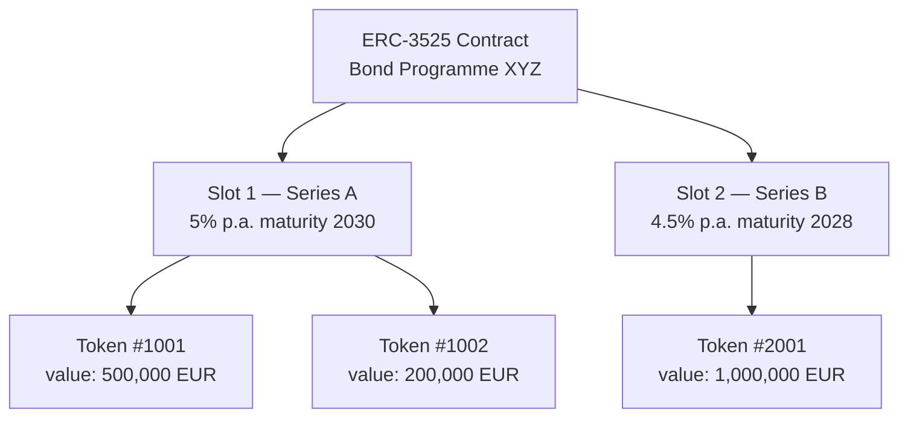
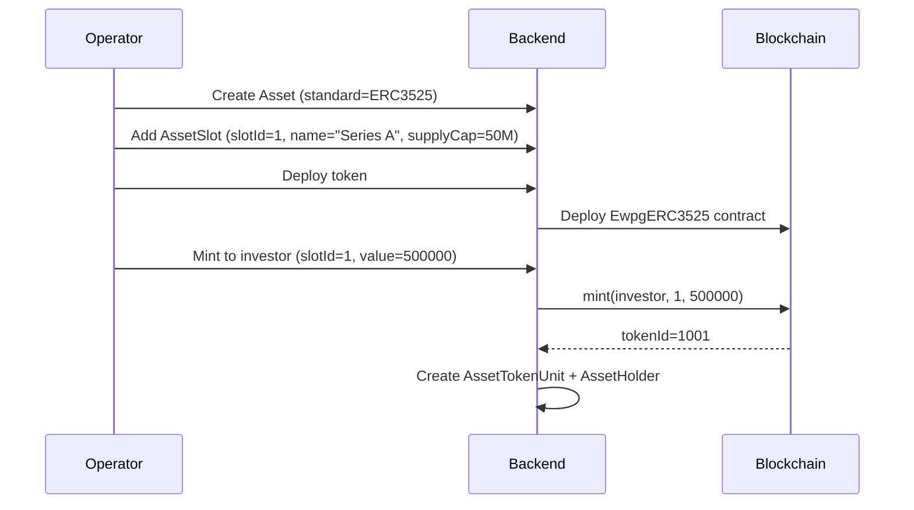

# ERC-3525 – Semi-Fungible Token { #erc-3525-semi-fungible-token }

ERC-3525 (der **Semi-Fungible Token**-Standard) führt ein zweidimensionales Token-Modell ein: Jeder Token hat sowohl einen **Slot** (Kategorie- oder Tranchenkennung) als auch einen **Wert** (Anzahl der Einheiten innerhalb dieses Slots). Token mit demselben Slot können zusammengeführt und geteilt werden; Token in verschiedenen Slots können nicht.

Das macht ERC-3525 zum natürlichen Standard für **Anleihen mit mehreren Tranchen**, **Mehrklassen-Fondsanteile** und jedes Instrument, bei dem verschiedene Serien innerhalb desselben Programms nebeneinander existieren.

---

## Slot- und Wertmodell { #slot-and-value-model }

- **Slot** entspricht einem `AssetSlot`-Eintrag im Registerwerk
- **Wert** ist der Haltebetrag (Nominalbetrag für Anleihen, Anteile für Fondsanteile)
- Token-Inhaber können ihren Token teilen (ein Token → zwei Token, gleicher Slot, Werte summieren sich auf Original) oder Token desselben zusammenführen Slot

---

## Datenmodell { #data-model }

### `AssetSlot` { #assetslot }

Eine pro Tranche / Serie. Felder:

| Feld | Beschreibung |
|---|---|
| `assetId` | FK zu `Asset` |
| `slotId` | On-Chain-Slot-ID (numerisch) |
| `name` | Für Menschen lesbarer Name (z. B. „Serie A – 5 % 2030“) |
| `supplyCap` | Maximaler Nominalbetrag für diesen Slot (0 = unbegrenzt) |
| `mintedAmount` | Aktuelle Gesamtsumme, die in diesem Slot geprägt wurde |

### `AssetTokenUnit` { #assettokenunit }

Verfolgt jeden On-Chain-Token innerhalb eines Slots:

| Feld | Beschreibung |
|---|---|
| `tokenId` | On-Chain ERC-3525 Token-ID |
| `slotId` | Zu welchem Slot dieser Token gehört |
| `holderAddress` | Wallet-Adresse des aktuellen Inhabers |
| `value` | Aktueller Token-Wert (Nominalbetrag) |

---

## Ablauf der Anleihetranchenemission { #bond-tranche-issuance-flow }

---

## Kapitalmaßnahmen bei ERC-3525 { #corporate-actions-on-erc-3525 }

ERC-3525 ist der primäre Standard für die [Kapitalmaßnahmen](../intro/concepts.md)-Engine:

- **Kuponzahlungen** – `Erc3525AdminService.payCoupon(slotId, couponPerUnit)` verteilt an alle
  Token-Inhaber im Slot
- **Einlösung** – `Erc3525AdminService.redeem(tokenId, value)` reduziert den Wert des Tokens um den eingelösten Betrag
- **Aktualisierungen der Slot-Angebotsobergrenze** – `Erc3525AdminService.setSlotSupplyCap(slotId, newCap)` passt das Tranchenlimit an

Alle Ausführungen von Kapitalmaßnahmen sind mit einem `CorporateAction`-Datensatz im Modul
`corporateactions` verknüpft und erfordern eine Step-up-Authentifizierung.

---

## ERC-3525 auf StarkNet { #erc-3525-on-starknet }

`STARKNET_ERC3525` stellt einen äquivalenten Cairo-Vertrag im StarkNet-Netzwerk bereit. Das
Slot/Value-Modell bleibt erhalten; der Bereitstellungsdienst ist `StarknetErc3525DeploymentService`.
Siehe [StarkNet & Stellar](../blockchains/starknet-stellar.md).
