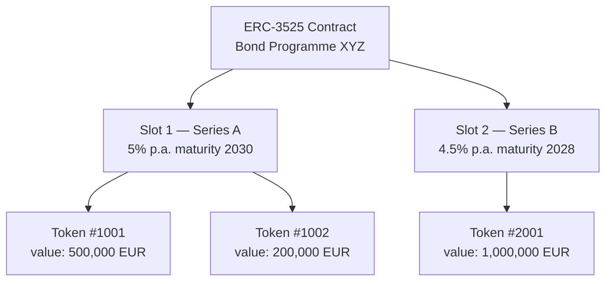
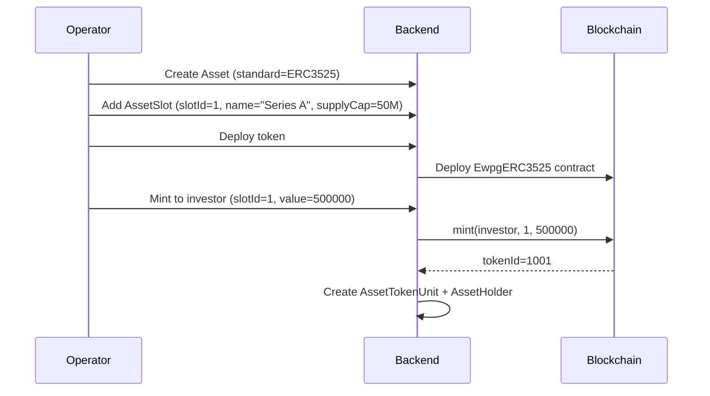

# ERC-3525 — Token semifungible { #erc-3525-semi-fungible-token }

ERC-3525 (el estándar **Token semifungible**) introduce un modelo de token bidimensional: cada token tiene una **ranura** (identificador de categoría o tramo) y un **valor** (cantidad de unidades dentro de esa ranura). Los tokens con la misma ranura se pueden fusionar y dividir; los tokens en diferentes ranuras no pueden.

Esto convierte a ERC-3525 en el estándar natural para **bonos con múltiples tramos**, **acciones de fondos multiclase** y cualquier instrumento donde coexistan diferentes series dentro del mismo programa.

---

## Modelo de ranura y valor { #slot-and-value-model }

- **Slot** corresponde a un registro `AssetSlot` en Registerwerk
- **Valor** es el monto de tenencia (cantidad nominal para bonos, unidades para acciones de fondos)
- Los titulares de tokens pueden dividir su token (un token → dos tokens, misma ranura, los valores se suman al original) o fusionar tokens de la misma ranura

---

## Modelo de datos { #data-model }

### `AssetSlot` { #assetslot }

Uno por tramo/serie. Campos:

| Campo | Descripción |
|---|---|
| `assetId` | FK a `Asset` |
| `slotId` | Identificador de ranura en cadena (numérico) |
| `name` | Nombre legible por humanos (p. ej., "Serie A — 5% 2030") |
| `supplyCap` | Importe nominal máximo para esta ranura (0 = ilimitado) |
| `mintedAmount` | Total actual acuñado en esta ranura |

### `AssetTokenUnit` { #assettokenunit }

Rastrea cada token en cadena dentro de una ranura:

| Campo | Descripción |
|---|---|
| `tokenId` | ID de token ERC-3525 en cadena |
| `slotId` | A qué ranura pertenece este token |
| `holderAddress` | Dirección del monedero del titular actual |
| `value` | Valor actual del token (monto nominal) |

---

## Flujo de emisión del tramo de bonos { #bond-tranche-issuance-flow }

---

## Operaciones societarias en ERC-3525 { #corporate-actions-on-erc-3525 }

ERC-3525 es el estándar principal para el [motor de operaciones societarias](../intro/concepts.md):

- **Pagos de cupones** — `Erc3525AdminService.payCoupon(slotId, couponPerUnit)` distribuye a todos los titulares de tokens de la ranura
- **Amortización** — `Erc3525AdminService.redeem(tokenId, value)` reduce el valor del token en el importe amortizado
- **Actualizaciones del límite de suministro de la ranura** — `Erc3525AdminService.setSlotSupplyCap(slotId, newCap)` ajusta el límite del tramo

Todas las ejecuciones de operaciones societarias están vinculadas a un registro `CorporateAction` del módulo `corporateactions` y requieren autenticación reforzada (step-up).

---

## ERC-3525 en StarkNet { #erc-3525-on-starknet }

`STARKNET_ERC3525` implementa un contrato Cairo equivalente en la red StarkNet. Se conserva el modelo de ranura/valor; el servicio de implementación es `StarknetErc3525DeploymentService`. Consulte [StarkNet y Stellar](../blockchains/starknet-stellar.md).
