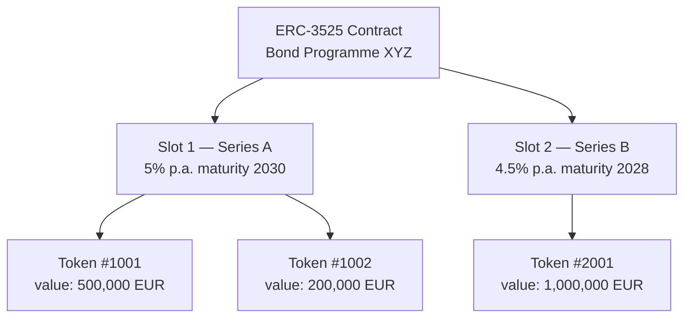
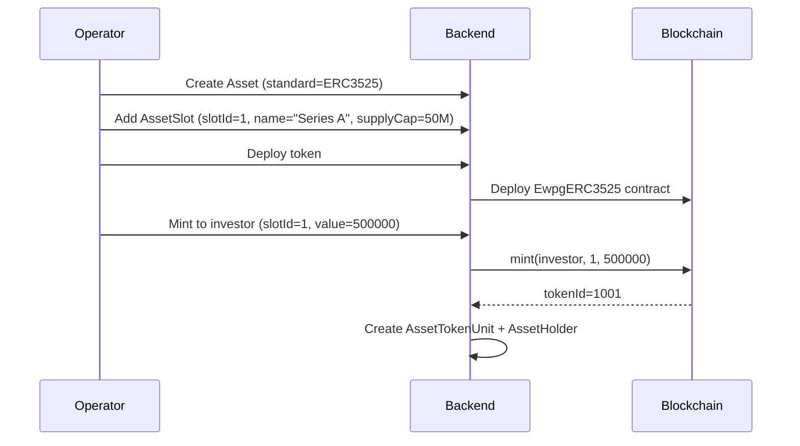

# ERC-3525 — Jeton semi-fongible { #erc-3525-semi-fungible-token }

ERC-3525 (la norme **Jeton semi-fongible**) introduit un modèle de jeton bidimensionnel : chaque jeton a à la fois un **emplacement** (identifiant de catégorie ou de tranche) et une **valeur** (quantité d'unités dans cet emplacement). Les jetons avec le même emplacement peuvent être fusionnés et divisés ; les jetons dans différents emplacements ne le peuvent pas.

Cela fait du ERC-3525 la norme naturelle pour les **obligations à tranches multiples**, les **actions de fonds multi-classes** et tout instrument dans lequel différentes séries coexistent au sein du même programme.

---

## Modèle d'emplacement et de valeur { #slot-and-value-model }

- **Slot** correspond à un enregistrement `AssetSlot` dans Registerwerk
- **La valeur** est le montant de détention (montant nominal pour les obligations, unités pour les parts de fonds)
- Les détenteurs de jetons peuvent diviser leur jeton (un jeton → deux jetons, même emplacement, les valeurs sont égales à l'original) ou fusionner les jetons du même slot

---

## Modèle de données { #data-model }

### `AssetSlot` { #assetslot }

Un par tranche/série. Champs :

| Champ | Description |
|---|---|
| `assetId` | FK à `Asset` |
| `slotId` | Identificateur d'emplacement sur la chaîne (numérique) |
| `name` | Nom lisible par l'homme (par exemple, « Série A – 5 % 2030 ») |
| `supplyCap` | Montant nominal maximum pour cet emplacement (0 = illimité) |
| `mintedAmount` | Total actuel émis dans cet emplacement |

### `AssetTokenUnit` { #assettokenunit }

Suit chaque jeton en chaîne dans un emplacement :

| Champ | Description |
|---|---|
| `tokenId` | ID de jeton ERC-3525 en chaîne |
| `slotId` | À quel emplacement appartient ce jeton |
| `holderAddress` | Adresse du portefeuille actuel du titulaire |
| `value` | Valeur actuelle du jeton (montant nominal) |

---

## Flux d'émission des tranches obligataires { #bond-tranche-issuance-flow }

---

## Opérations sur titres sur ERC-3525 { #corporate-actions-on-erc-3525 }

ERC-3525 est la norme principale pour le moteur [actions sur titres](../intro/concepts.md) :

- **Paiements de coupons** — `Erc3525AdminService.payCoupon(slotId, couponPerUnit)` distribue à tous les détenteurs de jetons dans cet emplacement
- **Remboursement** — `Erc3525AdminService.redeem(tokenId, value)` réduit la valeur du jeton du montant racheté
- **Mises à jour du plafond d'approvisionnement des emplacements** — `Erc3525AdminService.setSlotSupplyCap(slotId, newCap)` ajuste la limite de tranche

Toutes les exécutions d'OST sont liées à un enregistrement `CorporateAction` dans le `corporateactions` module et nécessitent une authentification renforcée.

---

## ERC-3525 sur StarkNet { #erc-3525-on-starknet }

`STARKNET_ERC3525` déploie un contrat Cairo équivalent sur le réseau StarkNet. Le modèle emplacement/valeur est préservé ; le service de déploiement est `StarknetErc3525DeploymentService`. Voir [StarkNet & Stellar](../blockchains/starknet-stellar.md).
