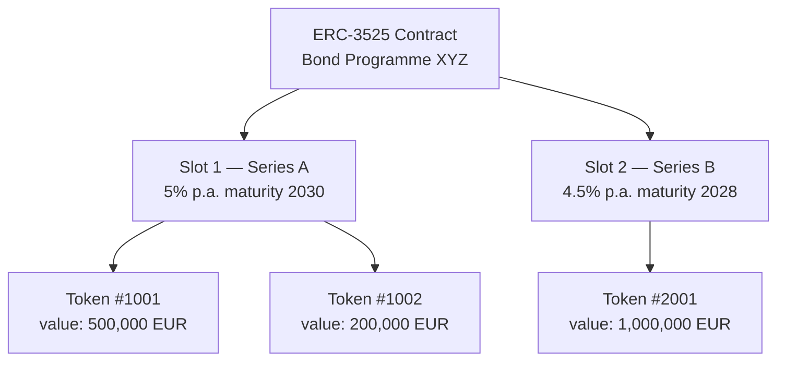
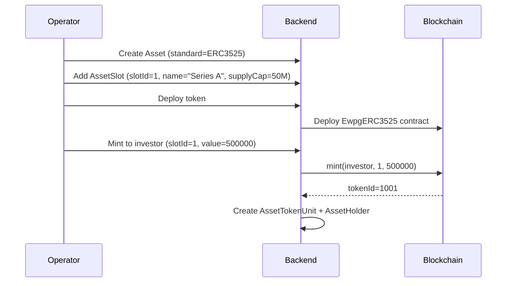

# ERC-3525 — Jeton semi-fongible { #erc-3525-semi-fungible-token }

ERC-3525 (la norme **Jeton semi-fongible**) introduit un modèle de jeton bidimensionnel : chaque jeton a à la fois un **emplacement** (identifiant de catégorie ou de tranche) et une **valeur** (quantité d'unités dans cet emplacement). Les jetons avec le même emplacement peuvent être fusionnés et divisés ; les jetons dans différents emplacements ne le peuvent pas.

Cela fait du ERC-3525 la norme naturelle pour les **obligations à tranches multiples**, les **actions de fonds multi-classes** et tout instrument dans lequel différentes séries coexistent au sein du même programme.

---

## Modèle d'emplacement et de valeur { #slot-and-value-model }

```mermaid
graph TD
    Contract["ERC-3525 Contract<br/>Bond Programme XYZ"] --> SlotA["Slot 1 — Series A<br/>5% p.a. maturity 2030"]
    Contract --> SlotB["Slot 2 — Series B<br/>4.5% p.a. maturity 2028"]
    SlotA --> T1["Token #1001<br/>value: 500,000 EUR"]
    SlotA --> T2["Token #1002<br/>value: 200,000 EUR"]
    SlotB --> T3["Token #2001<br/>value: 1,000,000 EUR"]
```

- **Slot** correspond à un enregistrement `AssetSlot` dans Registerwerk
- **La valeur** est le montant de détention (montant nominal pour les obligations, unités pour les parts de fonds)
- Les détenteurs de jetons peuvent diviser leur jeton (un jeton → deux jetons, même emplacement, les valeurs sont égales à l'original) ou fusionner les jetons du même slot

---

## Modèle de données { #data-model }

### `AssetSlot` { #assetslot }

Un par tranche/série. Champs :

| Champ | Description |
|---|---|
| `assetId` | FK à `Asset` |
| `slotId` | Identificateur d'emplacement sur la chaîne (numérique) |
| `name` | Nom lisible par l'homme (par exemple, « Série A – 5 % 2030 ») |
| `supplyCap` | Montant nominal maximum pour cet emplacement (0 = illimité) |
| `mintedAmount` | Total actuel émis dans cet emplacement |

### `AssetTokenUnit` { #assettokenunit }

Suit chaque jeton en chaîne dans un emplacement :

| Champ | Description |
|---|---|
| `tokenId` | ID de jeton ERC-3525 en chaîne |
| `slotId` | À quel emplacement appartient ce jeton |
| `holderAddress` | Adresse du portefeuille actuel du titulaire |
| `value` | Valeur actuelle du jeton (montant nominal) |

---

## Flux d'émission des tranches obligataires { #bond-tranche-issuance-flow }

```mermaid
sequenceDiagram
    participant Operator
    participant Backend
    participant Blockchain

    Operator->>Backend: Create Asset (standard=ERC3525)
    Operator->>Backend: Add AssetSlot (slotId=1, name="Series A", supplyCap=50M)
    Operator->>Backend: Deploy token
    Backend->>Blockchain: Deploy EwpgERC3525 contract
    Operator->>Backend: Mint to investor (slotId=1, value=500000)
    Backend->>Blockchain: mint(investor, 1, 500000)
    Blockchain-->>Backend: tokenId=1001
    Backend->>Backend: Create AssetTokenUnit + AssetHolder
```

---

## Opérations sur titres sur ERC-3525 { #corporate-actions-on-erc-3525 }

ERC-3525 est la norme principale pour le moteur [actions sur titres](../intro/concepts.md) :

- **Paiements de coupons** — `Erc3525AdminService.payCoupon(slotId, couponPerUnit)` distribue à tous les détenteurs de jetons dans cet emplacement
- **Remboursement** — `Erc3525AdminService.redeem(tokenId, value)` réduit la valeur du jeton du montant racheté
- **Mises à jour du plafond d'approvisionnement des emplacements** — `Erc3525AdminService.setSlotSupplyCap(slotId, newCap)` ajuste la limite de tranche

Toutes les exécutions d'OST sont liées à un enregistrement `CorporateAction` dans le `corporateactions` module et nécessitent une authentification renforcée.

---

## Autorisations de valeur et rectifications §24 { #value-allowances-and-24-corrections }

Les autorisations de valeur (`approve(tokenId, operator, value)`) sont accordées par le propriétaire actuel d'un jeton et sont invalidées dès que le jeton change de propriétaire : un transfert normal, un `forcedTransfer` au niveau NFT ou un burn incrémente l'époque d'autorisation du jeton, de sorte que toutes les autorisations de valeur de ce jeton sont réinitialisées silencieusement. Aucun événement `ApprovalValue` n'est émis pour la réinitialisation (les opérateurs détenant une autorisation ne sont pas énumérables, et un `ApprovalValue(tokenId, 0x0, 0)` synthétique ressemblerait à une vraie autorisation pour un indexeur standard) : le signal est l'événement `Transfer` du changement de propriétaire, et `allowance(tokenId, operator)` fait foi. Un `approve` de valeur non nulle échoue aussi tant que le système, le slot, le jeton, le propriétaire ou l'opérateur est suspendu ou gelé, alors que `approve(tokenId, operator, 0)` (révocation) fonctionne toujours pour le propriétaire ou un opérateur approuvé pour tout, et les transferts de valeur de jeton à jeton vérifient à nouveau que le propriétaire de destination figure toujours sur la liste blanche.

!!! warning "Contrats déployés avant cette modification"
    Les contrats ERC-3525 ne sont pas évolutifs : pour les jetons déployés avant ce correctif, les autorisations survivent à un changement de propriétaire. Pour ces jetons, ne rectifiez jamais une position avec le `forcedTransfer` au niveau NFT. Créez plutôt un nouveau jeton avec `mint(newOwner, slot, 0)` et transférez le solde avec `forcedTransferValue(oldTokenId, newTokenId, fullValue, legalBasis)`. Un nouveau tokenId ne porte aucune autorisation. Gelez ensuite l'ancien jeton.

---

## ERC-3525 sur StarkNet { #erc-3525-on-starknet }

`STARKNET_ERC3525` déploie un contrat Cairo équivalent sur le réseau StarkNet. Le modèle emplacement/valeur est préservé ; le service de déploiement est `StarknetErc3525DeploymentService`. Voir [StarkNet & Stellar](../blockchains/starknet-stellar.md).
