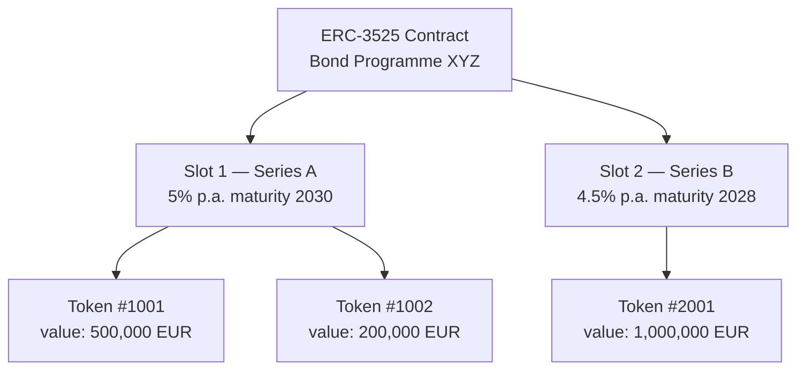
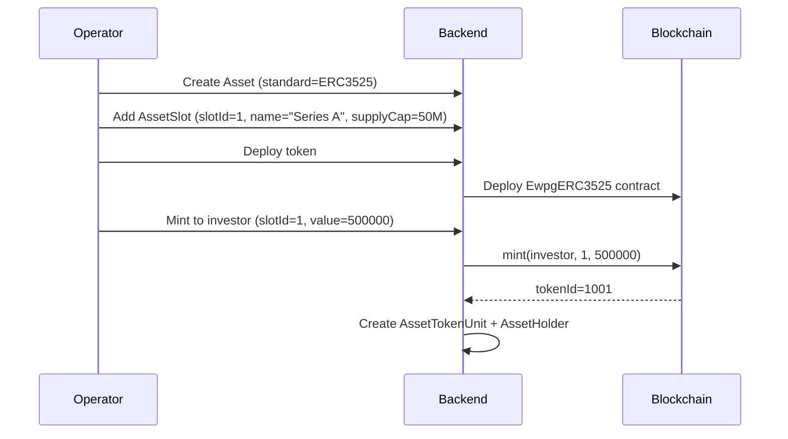

# ERC-3525 — Token semifungibile { #erc-3525-semi-fungible-token }

ERC-3525 (lo standard **Token semifungibile**) introduce un modello di token bidimensionale: ogni token ha sia uno **slot** (identificatore di categoria o tranche) che un **valore** (quantità di unità all'interno di quello slot). I token con lo stesso slot possono essere uniti e divisi; i token in slot diversi non possono farlo.

Ciò rende ERC-3525 lo standard naturale per **obbligazioni con tranche multiple**, **azioni di fondi multiclasse** e qualsiasi strumento in cui diverse serie coesistono all'interno dello stesso programma.

---

## Modello di slot e valore { #slot-and-value-model }

- **Slot** corrisponde a un record `AssetSlot` in Registerwerk
- **Valore** è l'importo di detenzione (importo nominale per obbligazioni, quote per quote di fondi)
- I titolari di token possono dividere il proprio token (un token → due token, stesso slot, valori sommati all'originale) o unire token dello stesso slot

---

## Modello dei dati { #data-model }

### `AssetSlot` { #assetslot }

Uno per tranche / serie. Campi:

| Campo | Descrizione |
|---|---|
| `assetId` | FK a `Asset` |
| `slotId` | Identificatore dello slot sulla catena (numerico) |
| `name` | Nome leggibile (ad esempio, "Serie A — 5% 2030") |
| `supplyCap` | Importo nominale massimo per questo slot (0 = illimitato) |
| `mintedAmount` | Totale attuale coniato in questo slot |

### `AssetTokenUnit` { #assettokenunit }

Traccia ogni token sulla catena all'interno di uno slot:

| Campo | Descrizione |
|---|---|
| `tokenId` | ID token ERC-3525 sulla catena |
| `slotId` | A quale slot appartiene questo token |
| `holderAddress` | Indirizzo del portafoglio del titolare attuale |
| `value` | Valore attuale del token (importo nominale) |

---

## Flusso di emissione di tranche obbligazionarie { #bond-tranche-issuance-flow }

---

## Operazioni societarie su ERC-3525 { #corporate-actions-on-erc-3525 }

ERC-3525 è lo standard principale per il motore delle [operazioni societarie](../intro/concepts.md):

- **Pagamenti di cedola** — `Erc3525AdminService.payCoupon(slotId, couponPerUnit)` distribuisce a tutti i titolari di token nello slot
- **Rimborso** — `Erc3525AdminService.redeem(tokenId, value)` riduce il valore del token in base all'importo rimborsato
- **Aggiornamenti del limite di offerta dello slot** — `Erc3525AdminService.setSlotSupplyCap(slotId, newCap)` modifica il limite della tranche

Tutte le esecuzioni di operazioni societarie sono collegate a un record `CorporateAction` nel modulo `corporateactions` e richiedono l'autenticazione step-up.

---

## ERC-3525 su StarkNet { #erc-3525-on-starknet }

`STARKNET_ERC3525` distribuisce un contratto Cairo equivalente sulla rete StarkNet. Il modello slot/valore viene preservato; il servizio di distribuzione è `StarknetErc3525DeploymentService`. Vedi [StarkNet e Stellar](../blockchains/starknet-stellar.md).
