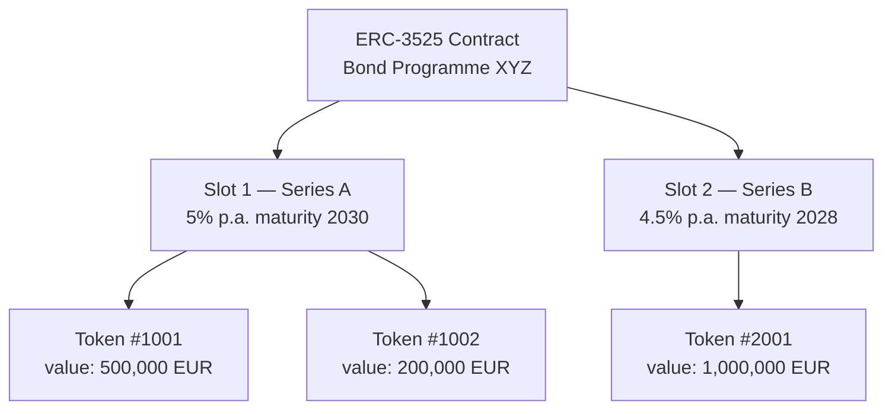
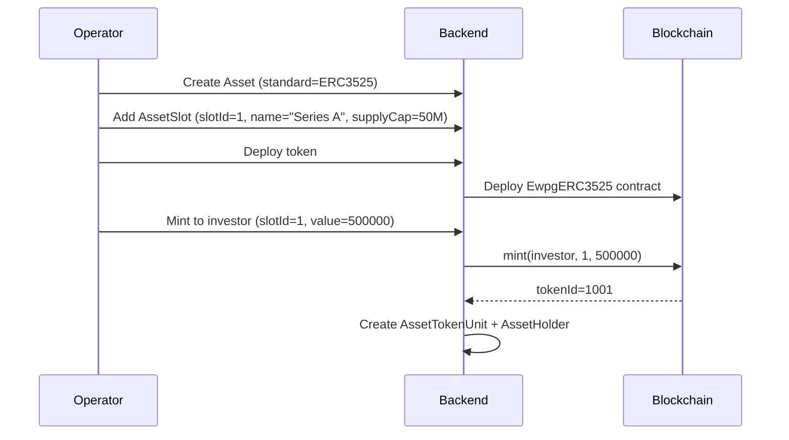

# ERC-3525 — Semi-Fungible Token

ERC-3525 (the **Semi-Fungible Token** standard) introduces a two-dimensional token model: each token has both a **slot** (category or tranche identifier) and a **value** (quantity of units within that slot). Tokens with the same slot can be merged and split; tokens in different slots cannot.

This makes ERC-3525 the natural standard for **bonds with multiple tranches**, **multi-class fund shares**, and any instrument where different series coexist within the same programme.

---

## Slot and value model

- **Slot** corresponds to an `AssetSlot` record in Registerwerk
- **Value** is the holding amount (nominal amount for bonds, units for fund shares)
- Token holders can split their token (one token → two tokens, same slot, values sum to original) or merge tokens of the same slot

---

## Data model

### `AssetSlot`

One per tranche / series. Fields:

| Field | Description |
|---|---|
| `assetId` | FK to `Asset` |
| `slotId` | On-chain slot identifier (numeric) |
| `name` | Human-readable name (e.g., "Series A — 5% 2030") |
| `supplyCap` | Maximum nominal amount for this slot (0 = unlimited) |
| `mintedAmount` | Current total minted in this slot |

### `AssetTokenUnit`

Tracks each on-chain token within a slot:

| Field | Description |
|---|---|
| `tokenId` | On-chain ERC-3525 token ID |
| `slotId` | Which slot this token belongs to |
| `holderAddress` | Current holder's wallet address |
| `value` | Current token value (nominal amount) |

---

## Bond tranche issuance flow

---

## Corporate actions on ERC-3525

ERC-3525 is the primary standard for the [corporate actions](../intro/concepts.md) engine:

- **Coupon payments** — `Erc3525AdminService.payCoupon(slotId, couponPerUnit)` distributes to all token holders in the slot
- **Redemption** — `Erc3525AdminService.redeem(tokenId, value)` reduces the token's value by the redeemed amount
- **Slot supply cap updates** — `Erc3525AdminService.setSlotSupplyCap(slotId, newCap)` adjusts the tranche limit

All corporate action executions are linked to a `CorporateAction` record in the `corporateactions` module and require step-up authentication.

---

## ERC-3525 on StarkNet

`STARKNET_ERC3525` deploys an equivalent Cairo contract on the StarkNet network. The slot/value model is preserved; the deployment service is `StarknetErc3525DeploymentService`. See [StarkNet & Stellar](../blockchains/starknet-stellar.md).
