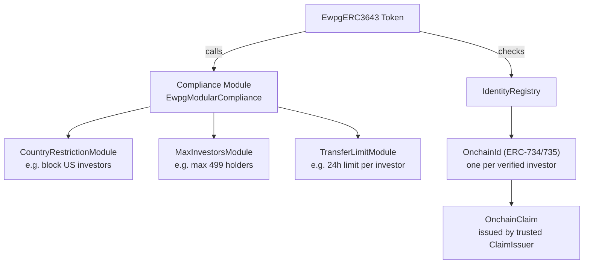
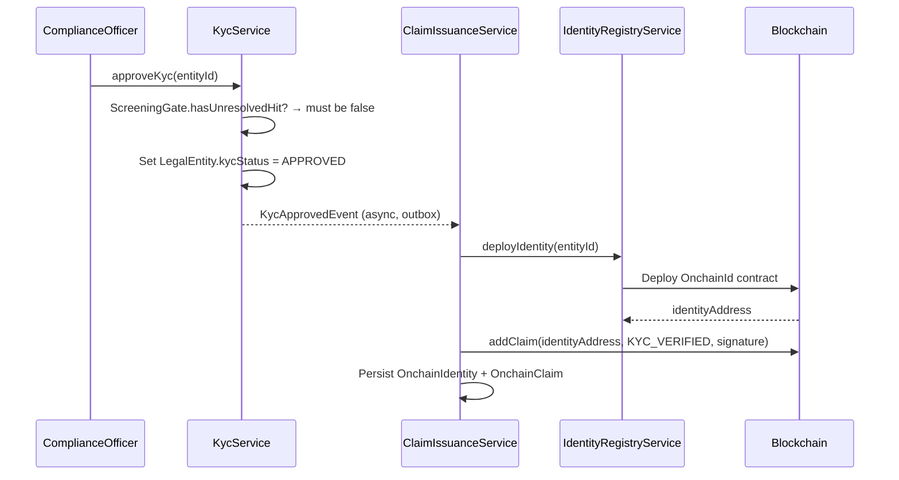

# ERC-3643 – T-REX regulierte Sicherheit { #erc-3643-t-rex-regulated-security }

**ERC-3643** (auch bekannt als **T-REX** – Token für regulierte Börsen) ist der primäre Standard
für regulierte Wertpapiere in Registerwerk. Es erweitert ERC-20 um ein
**On-Chain-Identitätsregister**, ein **Compliance-Modul** und **vertrauenswürdige
Anspruchsaussteller** – wodurch sich der Token selbst durchsetzt: Der Smart Contract lehnt jede
Übertragung ab, die nicht den vom Emittenten definierten Compliance-Regeln entspricht.

Dies ist der empfohlene Standard für alle Instrumente, die:
- Übertragungen auf verifizierte (KYC-geprüfte) Anleger beschränken müssen
- Eigentumsbeschränkungen unterliegen (maximale Anzahl an Anlegern, Beschränkungen nach Gerichtsbarkeit)
- On-Chain-Freeze-Funktionen erfordern, die an behördliche Maßnahmen gebunden sind

---

## Architektur { #architecture }

---

## Identität und Ansprüche { #identity-and-claims }

### `OnchainIdentity` { #onchainidentity }

Ein eindeutiger On-Chain-Identitätsvertrag (gemäß
[ERC-734/735](https://eips.ethereum.org/EIPS/eip-735)), der für jeden KYC-genehmigten Anleger
bereitgestellt wird. In Registerwerk:

- Wird automatisch erstellt, wenn ein `LegalEntity` die KYC-Genehmigung abschließt
- `OnchainIdentity.walletAddress` = die primäre Wallet des Anlegers
- Über `OnchainIdentity.entityId` mit `LegalEntity.id` verknüpft

### `OnchainClaim` { #onchainclaim }

Ein kryptografisch signierter Nachweis, der einer Identität hinzugefügt wird. Ansprüche tragen ein
**Thema** (was attestiert wird) und eine **Daten**-Nutzlast. Registerwerk stellt Ansprüche aus für:

| Anspruchsthema | Bedeutung |
|---|---|
| `KYC_VERIFIED` | Der Anleger hat KYC für die Gerichtsbarkeit des Emittenten bestanden |
| `ACCREDITED_INVESTOR` | Der Anleger qualifiziert sich als akkreditierter/professioneller Anleger |
| `COUNTRY_OF_RESIDENCE` | ISO-3166-1-Alpha-2-Ländercode |
| `JURISDICTION_APPROVED` | Zugelassen für bestimmte Gerichtsbarkeit (DE/LU/FR/LI) |

Ansprüche werden vom **Trusted Claim Issuer** ausgestellt – dem eigenen Signaturschlüssel von
Registerwerk, der als Registerbehörde fungiert. Die Anspruchssignatur kann on-chain durch das
Compliance-Modul überprüft werden.

---

## KYC → Ablauf der Anspruchsausstellung { #kyc-claim-issuance-flow }

Wenn KYC abläuft (`KycExpiredEvent`), widerruft `ClaimIssuanceService` den `KYC_VERIFIED`-Anspruch,
was dazu führt, dass das Compliance-Modul alle nachfolgenden Übertragungen für diesen Anleger
ablehnt.

---

## Compliance-Module { #compliance-modules }

Der Vertrag `EwpgModularCompliance` unterstützt steckbare Einschränkungsmodule. Registerwerk
liefert eingebaute Module mit:

| Modul | Konfiguration | Anwendungsfall |
|---|---|---|
| `CountryRestrictionModule` | Liste der gesperrten Länder | US-Anleger blockieren (Reg S), auf EU beschränken |
| `MaxInvestorsModule` | Anzahl `maxInvestors` | Beschränkung auf 499 Inhaber (EU-Prospektbefreiung) |
| `TransferLimitModule` | `maxTransferPerDay` | Tägliche Transferobergrenze pro Anleger |
| `LockPeriodModule` | Zeitstempel `lockUntil` | Sperrfrist nach der Emission |
| `WhitelistModule` | Explizite Zulassungsliste | Zulässige Verteilung an benannte Anleger |

Module werden **nach der Bereitstellung** über `POST /compliance-modules` (REGISTRY_ADMIN)
konfiguriert — jede neu bereitgestellte Suite startet mit einer leeren `ModularCompliance`, ohne
Durchsetzung von Anlegeranzahl/Gerichtsbarkeit/Cooldown, bis ein Betreiber ausdrücklich Module
anhängt. Das sollte geschehen, bevor das Asset zur Zeichnung geöffnet wird, falls diese Regeln ab
dem ersten Anleger gelten sollen.

---

## On-Chain-Freeze { #on-chain-freeze }

Wenn für ein ERC-3643-Asset ein [Sperrvermerk](../compliance/sperrvermerk.md) (HolderBlock)
angelegt wird, ruft `IdentityRegistryService.freezeAddress()` das Identitätsregister auf, um die
Identität des Anlegers einzufrieren. Das Compliance-Modul lehnt daraufhin alle Übertragungen mit
dieser Identität ab, bis die Sperre aufgehoben wird.

---

## Vertrauliches ERC-3643 { #confidential-erc-3643 }

`CONF_ERC3643` stellt eine Zama-fhEVM-Variante bereit, bei der Token-Guthaben und Transferbeträge
verschlüsselt werden. KYC-Ansprüche und Compliance-Logik arbeiten weiterhin mit den verschlüsselten
Werten – das Compliance-Modul verwendet homomorphe Operationen, um Ansprüche zu überprüfen, ohne
die Beträge preiszugeben. Siehe [Vertrauliche Token](confidential.md).
