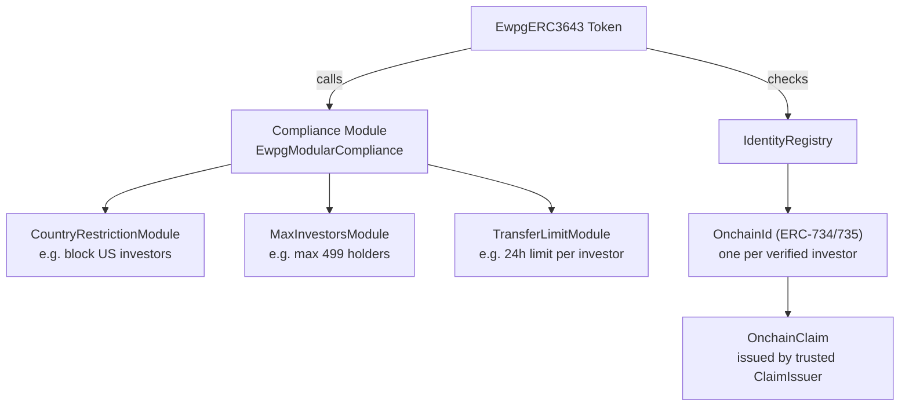
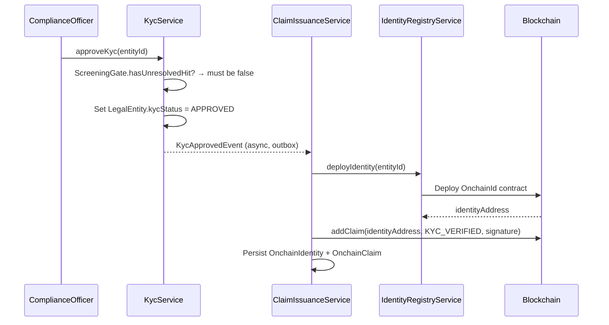

# ERC-3643 — Valor regulado T-REX { #erc-3643-t-rex-regulated-security }

**ERC-3643** (también conocido como **T-REX** — Token for Regulated Exchanges) es el estándar principal para valores regulados en Registerwerk. Amplía ERC-20 con un **registro de identidad en cadena**, un **módulo de cumplimiento** y **emisores de atestaciones (claims) de confianza**, lo que hace que el token sea autoejecutable: el contrato inteligente rechaza cualquier transferencia que no cumpla con las reglas de cumplimiento definidas por el emisor.

Este es el estándar recomendado para todos los instrumentos que:
- Deban restringir las transferencias a inversores verificados (con KYC)
- Estén sujetos a límites de titularidad (número máximo de inversores, restricciones jurisdiccionales)
- Requieran capacidades de congelación en cadena vinculadas a actuaciones regulatorias

---

## Arquitectura { #architecture }

---

## Identidad y atestaciones (claims) { #identity-and-claims }

### `OnchainIdentity` { #onchainidentity }

Un contrato de identidad en cadena único (según [ERC-734/735](https://eips.ethereum.org/EIPS/eip-735)) implementado para cada inversor aprobado por KYC. En Registerwerk:

- Se crea automáticamente cuando un `LegalEntity` completa la aprobación de KYC
- `OnchainIdentity.walletAddress` = el monedero principal del inversor
- Vinculado a `LegalEntity.id` a través de `OnchainIdentity.entityId`

### `OnchainClaim` { #onchainclaim }

Una atestación (claim) firmada criptográficamente y agregada a una identidad. Las atestaciones llevan un **tema** (lo que se está certificando) y una carga útil de **datos**. Registerwerk emite atestaciones para:

| Tema de atestación | Significado |
|---|---|
| `KYC_VERIFIED` | El inversor ha superado el KYC para la jurisdicción del emisor |
| `ACCREDITED_INVESTOR` | El inversor califica como inversor acreditado/profesional |
| `COUNTRY_OF_RESIDENCE` | Código de país ISO 3166-1 alfa-2 |
| `JURISDICTION_APPROVED` | Aprobado para una jurisdicción específica (DE/LU/FR/LI) |

Las atestaciones las emite el **emisor de atestaciones de confianza** (Trusted Claim Issuer) — la propia clave de firma de Registerwerk, que actúa como autoridad del registro. La firma de la atestación puede verificarse en cadena mediante el módulo de cumplimiento.

---

## KYC → flujo de emisión de atestaciones { #kyc-claim-issuance-flow }

Cuando el KYC caduca (`KycExpiredEvent`), `ClaimIssuanceService` revoca la atestación `KYC_VERIFIED`, lo que hace que el módulo de cumplimiento rechace todas las transferencias posteriores de ese inversor.

---

## Módulos de cumplimiento { #compliance-modules }

El contrato `EwpgModularCompliance` admite módulos de restricción conectables. Registerwerk incluye módulos integrados:

| Módulo | Configuración | Caso de uso |
|---|---|---|
| `CountryRestrictionModule` | Lista de países bloqueados | Bloquear a los inversores estadounidenses (Reg S), restringir a la UE |
| `MaxInvestorsModule` | Recuento `maxInvestors` | Límite a 499 titulares (exención del folleto de la UE) |
| `TransferLimitModule` | `maxTransferPerDay` | Límite de transferencia diario por inversor |
| `LockPeriodModule` | Marca de tiempo `lockUntil` | Período de bloqueo después de la emisión |
| `WhitelistModule` | Lista de permitidos explícita | Distribución autorizada a inversores designados |

Los módulos se configuran **después de la implementación** mediante `POST /compliance-modules` (REGISTRY_ADMIN)
— toda suite recién implementada arranca con un `ModularCompliance` vacío, sin aplicación de
recuento de inversores/jurisdicción/período de espera, hasta que el operador adjunta
explícitamente los módulos. Esto debería suceder antes de abrir el activo a la suscripción, si esas
reglas deben aplicarse desde el primer inversor en adelante.

---

## Congelación en cadena { #on-chain-freeze }

Cuando un [Sperrvermerk](../compliance/sperrvermerk.md) (HolderBlock) se crea para un activo ERC-3643, `IdentityRegistryService.freezeAddress()` llama al registro de identidad para congelar la identidad del inversor. Luego, el módulo de cumplimiento rechaza todas las transferencias que involucran esa identidad hasta que se levante la congelación.

---

## Confidencial ERC-3643 { #confidential-erc-3643 }

`CONF_ERC3643` implementa una variante de Zama fhEVM en la que los saldos de tokens y los importes de las transferencias están cifrados. Las atestaciones de KYC y la lógica de cumplimiento siguen operando sobre los valores cifrados: el módulo de cumplimiento utiliza operaciones homomórficas para verificar las atestaciones sin revelar los importes. Consulte [Tokens confidenciales](confidential.md).
