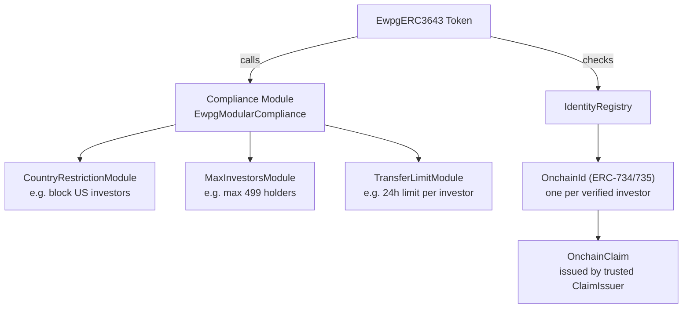
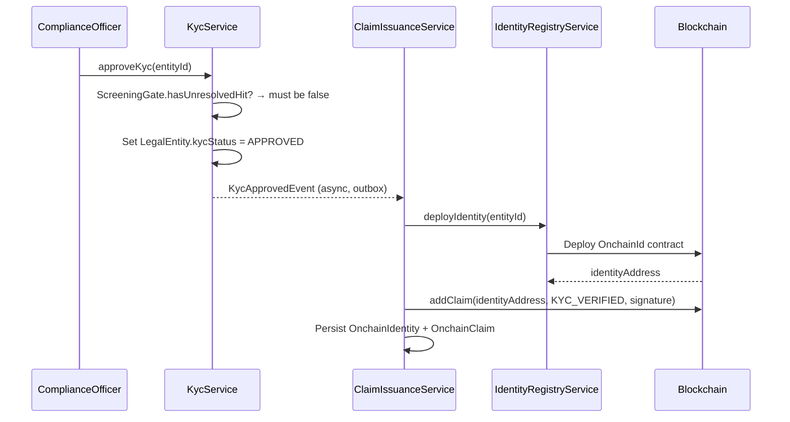

# ERC-3643 — T-REX Sécurité réglementée { #erc-3643-t-rex-regulated-security }

**ERC-3643** (également connu sous le nom de **T-REX** — Token for Regulated Exchanges) est la norme principale pour les titres réglementés dans Registerwerk. Elle étend ERC-20 avec un **registre d'identité on-chain**, un **module de conformité**, et des **émetteurs de claims de confiance** — ce qui rend le jeton auto-applicable : le contrat intelligent rejette tout transfert qui ne satisfait pas les règles de conformité définies par l'émetteur.

C'est la norme recommandée pour tous les instruments qui :
- Doivent restreindre les transferts aux investisseurs vérifiés (KYC)
- Sont soumis à des limites de détention (nombre maximal d'investisseurs, restrictions juridictionnelles)
- Exigent des capacités de gel on-chain liées à des actions réglementaires

---

## Architecture { #architecture }

---

## Identité et claims { #identity-and-claims }

### `OnchainIdentity` { #onchainidentity }

Un contrat d'identité unique on-chain (conforme à [ERC-734/735](https://eips.ethereum.org/EIPS/eip-735)) déployé pour chaque investisseur approuvé en KYC. Dans Registerwerk :

- Créé automatiquement lorsqu'une `LegalEntity` obtient l'approbation KYC
- `OnchainIdentity.walletAddress` = le wallet principal de l'investisseur
- Lié à `LegalEntity.id` via `OnchainIdentity.entityId`

### `OnchainClaim` { #onchainclaim }

Une attestation signée cryptographiquement, ajoutée à une identité. Les claims portent un **sujet** (topic — ce qui est attesté) et une charge utile de **données**. Registerwerk émet des claims pour :

| Sujet de claim | Signification |
|---|---|
| `KYC_VERIFIED` | L'investisseur a passé le KYC pour la juridiction de l'émetteur |
| `ACCREDITED_INVESTOR` | L'investisseur est qualifié d'investisseur accrédité/professionnel |
| `COUNTRY_OF_RESIDENCE` | Code pays ISO 3166-1 alpha-2 |
| `JURISDICTION_APPROVED` | Approuvé pour une juridiction spécifique (DE/LU/FR/LI) |

Les claims sont émis par le **Trusted Claim Issuer** — la propre clé de signature de Registerwerk, agissant en tant qu'autorité du registre. La signature du claim peut être vérifiée on-chain par le module de conformité.

---

## KYC → flux d'émission du claim { #kyc-claim-issuance-flow }

Lorsque le KYC expire (`KycExpiredEvent`), `ClaimIssuanceService` révoque le claim `KYC_VERIFIED`, ce qui amène le module de conformité à rejeter tous les transferts ultérieurs pour cet investisseur.

---

## Modules de conformité { #compliance-modules }

Le contrat `EwpgModularCompliance` prend en charge des modules de restriction enfichables. Registerwerk livre des modules intégrés :

| Module | Configuration | Cas d'usage |
|---|---|---|
| `CountryRestrictionModule` | Liste de pays bloqués | Bloquer les investisseurs américains (Reg S), restreindre à l'UE |
| `MaxInvestorsModule` | Nombre `maxInvestors` | Limiter à 499 titulaires (exemption de prospectus UE) |
| `TransferLimitModule` | `maxTransferPerDay` | Plafond de transfert quotidien par investisseur |
| `LockPeriodModule` | Horodatage `lockUntil` | Période de blocage après émission |
| `WhitelistModule` | Liste blanche explicite | Distribution autorisée à des investisseurs nommés |

Les modules sont configurés **après le déploiement**, via `POST /compliance-modules` (REGISTRY_ADMIN)
— chaque nouvelle suite déployée démarre avec un `ModularCompliance` vide, sans aucune application du nombre d'investisseurs, de la juridiction ou du délai de carence, tant qu'un opérateur n'a pas explicitement attaché de modules. Cela doit intervenir avant l'ouverture de l'actif à la souscription, si ces règles doivent s'appliquer dès le premier investisseur.

---

## Gel on-chain { #on-chain-freeze }

Lorsqu'un [Sperrvermerk](../compliance/sperrvermerk.md) (HolderBlock) est créé pour un actif ERC-3643, `IdentityRegistryService.freezeAddress()` appelle le registre d'identité pour geler l'identité de l'investisseur. Le module de conformité rejette ensuite tous les transferts impliquant cette identité, jusqu'à la levée du gel.

---

## ERC-3643 confidentiel { #confidential-erc-3643 }

`CONF_ERC3643` déploie une variante Zama fhEVM où les soldes de jetons et les montants transférés sont chiffrés. Les claims KYC et la logique de conformité continuent d'opérer sur les valeurs chiffrées — le module de conformité utilise des opérations homomorphes pour vérifier les claims sans révéler les montants. Voir [Jetons confidentiels](confidential.md).
