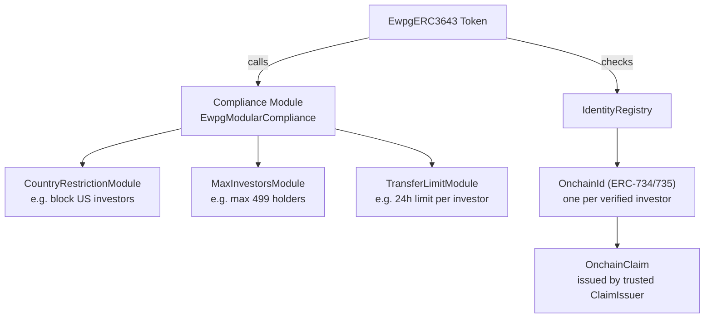
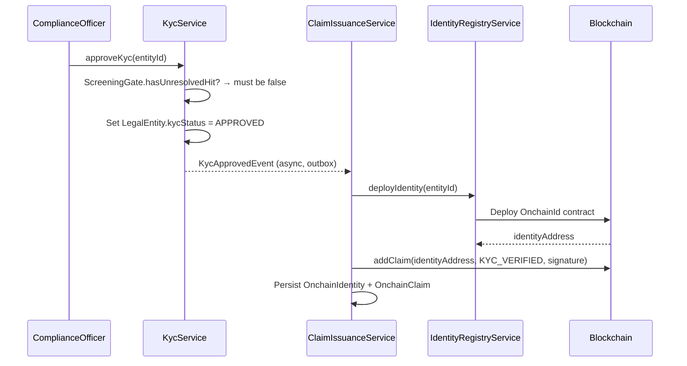

# ERC-3643 — T-REX, titolo regolamentato { #erc-3643-t-rex-regulated-security }

**ERC-3643** (noto anche come **T-REX** — Token per scambi regolamentati) è lo standard principale per i titoli regolamentati in Registerwerk. Estende ERC-20 con un **registro di identità on-chain**, **modulo di conformità** e **emittenti di attestazioni attendibili** — rendendo il token autoapplicativo: il contratto intelligente rifiuta qualsiasi trasferimento che non soddisfa le regole di conformità definite dall'emittente.

Questo è lo standard consigliato per tutti gli strumenti che:
- Devono limitare i trasferimenti a investitori verificati (con KYC)
- Sono soggetti a limiti di proprietà (investitori massimi, restrizioni giurisdizionali)
- Richiedono capacità di congelamento sulla catena legate ad azioni normative

---

## Architettura { #architecture }

---

## Identità e attestazioni { #identity-and-claims }

### `OnchainIdentity` { #onchainidentity }

Un contratto di identità on-chain univoco (secondo [ERC-734/735](https://eips.ethereum.org/EIPS/eip-735)) distribuito per ogni investitore approvato dal KYC. In Registerwerk:

- Creato automaticamente quando uno `LegalEntity` completa l'approvazione KYC
- `OnchainIdentity.walletAddress` = il portafoglio principale dell'investitore
- Collegato a `LegalEntity.id` tramite `OnchainIdentity.entityId`

### `OnchainClaim` { #onchainclaim }

Un'attestazione firmata crittograficamente e aggiunta a un'identità. Le attestazioni contengono un **argomento** (ciò che viene attestato) e un carico utile di **dati**. Registerwerk rilascia attestazioni per:

| Argomento dell'attestazione (claim topic) | Significato |
|---|---|
| `KYC_VERIFIED` | L'investitore ha superato KYC per la giurisdizione dell'emittente |
| `ACCREDITED_INVESTOR` | L'investitore si qualifica come investitore accreditato/professionale |
| `COUNTRY_OF_RESIDENCE` | Codice paese ISO 3166-1 alpha-2 |
| `JURISDICTION_APPROVED` | Approvato per giurisdizioni specifiche (DE/LU/FR/LI) |

Le attestazioni vengono emesse dal **Trusted Claim Issuer** — la chiave di firma di Registerwerk stessa, che funge da autorità di registro. La firma dell'attestazione può essere verificata on-chain dal modulo di conformità.

---

## KYC → flusso di emissione dell'attestazione { #kyc-claim-issuance-flow }

Quando il KYC scade (`KycExpiredEvent`), `ClaimIssuanceService` revoca l'attestazione `KYC_VERIFIED`, il che fa sì che il modulo di conformità rifiuti tutti i trasferimenti successivi per quell'investitore.

---

## Moduli di conformità { #compliance-modules }

Il contratto `EwpgModularCompliance` supporta moduli di restrizione collegabili. Registerwerk fornisce moduli integrati:

| Modulo | Configurazione | Caso d'uso |
|---|---|---|
| `CountryRestrictionModule` | Elenco dei paesi bloccati | Bloccare gli investitori statunitensi (Reg S), limitare all'UE |
| `MaxInvestorsModule` | Conteggio `maxInvestors` | Limite a 499 titolari (esenzione dal prospetto UE) |
| `TransferLimitModule` | `maxTransferPerDay` | Limite di trasferimento giornaliero per investitore |
| `LockPeriodModule` | `lockUntil` timestamp | Periodo di lock-up dopo l'emissione |
| `WhitelistModule` | Elenco consentiti esplicito | Distribuzione autorizzata a investitori nominati |

I moduli vengono configurati **post-distribuzione** tramite `POST /compliance-modules` (REGISTRY_ADMIN)
— ogni suite appena distribuita inizia con un `ModularCompliance` vuoto, nessun conteggio degli investitori/
giurisdizione/tempo di recupero applicazione, finché un operatore non allega esplicitamente i moduli. Ciò dovrebbe
accadere prima che l'asset venga aperto per la sottoscrizione se tali regole devono essere applicate dal
primo investitore in poi.

---

## Congelamento della catena { #on-chain-freeze }

Quando un [Sperrvermerk](../compliance/sperrvermerk.md) (HolderBlock) viene creato per una risorsa ERC-3643, `IdentityRegistryService.freezeAddress()` chiama il registro delle identità per congelare l'identità dell'investitore. Il modulo di conformità rifiuta quindi tutti i trasferimenti che coinvolgono tale identità fino alla rimozione del blocco.

---

## ERC-3643 confidenziale { #confidential-erc-3643 }

`CONF_ERC3643` distribuisce una variante Zama fhEVM in cui i saldi dei token e gli importi dei trasferimenti sono crittografati. Le attestazioni KYC e la logica di conformità operano ancora sui valori crittografati: il modulo di conformità utilizza operazioni omomorfiche per verificare le attestazioni senza rivelare gli importi. Vedi [Token confidenziali](confidential.md).
