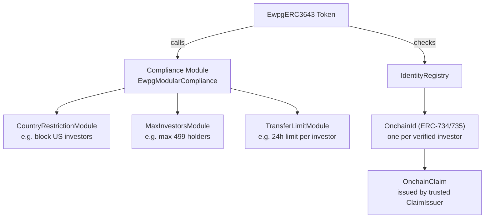
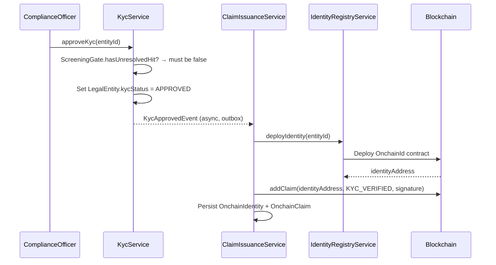

# ERC-3643 — T-REX Regulated Security

**ERC-3643** (also known as **T-REX** — Token for Regulated Exchanges) is the primary standard for regulated securities in Registerwerk. It extends ERC-20 with an **on-chain identity registry**, **compliance module**, and **trusted claim issuers** — making the token self-enforcing: the smart contract rejects any transfer that does not satisfy the compliance rules defined by the issuer.

This is the recommended standard for all instruments that:
- Must restrict transfers to verified (KYC'd) investors
- Are subject to ownership limits (max investors, jurisdictional restrictions)
- Require on-chain freeze capabilities tied to regulatory actions

---

## Architecture

---

## Identity and claims

### `OnchainIdentity`

A unique on-chain identity contract (per [ERC-734/735](https://eips.ethereum.org/EIPS/eip-735)) deployed for each KYC-approved investor. In Registerwerk:

- Created automatically when a `LegalEntity` completes KYC approval
- `OnchainIdentity.walletAddress` = the investor's primary wallet
- Linked to `LegalEntity.id` via `OnchainIdentity.entityId`

### `OnchainClaim`

A cryptographically signed attestation added to an identity. Claims carry a **topic** (what is being attested) and a **data** payload. Registerwerk issues claims for:

| Claim topic | Meaning |
|---|---|
| `KYC_VERIFIED` | Investor has passed KYC for the issuer's jurisdiction |
| `ACCREDITED_INVESTOR` | Investor qualifies as an accredited/professional investor |
| `COUNTRY_OF_RESIDENCE` | ISO 3166-1 alpha-2 country code |
| `JURISDICTION_APPROVED` | Approved for specific jurisdiction (DE/LU/FR/LI) |

Claims are issued by the **Trusted Claim Issuer** — Registerwerk's own signing key acting as the registry authority. The claim signature can be verified on-chain by the compliance module.

---

## KYC → claim issuance flow

When KYC expires (`KycExpiredEvent`), `ClaimIssuanceService` revokes the `KYC_VERIFIED` claim, which causes the compliance module to reject all subsequent transfers for that investor.

---

## Compliance modules

The `EwpgModularCompliance` contract supports pluggable restriction modules. Registerwerk ships built-in modules:

| Module | Configuration | Use case |
|---|---|---|
| `CountryRestrictionModule` | List of blocked countries | Block US investors (Reg S), restrict to EU |
| `MaxInvestorsModule` | `maxInvestors` count | Limit to 499 holders (EU prospectus exemption) |
| `TransferLimitModule` | `maxTransferPerDay` | Daily transfer cap per investor |
| `LockPeriodModule` | `lockUntil` timestamp | Lock-up period after issuance |
| `WhitelistModule` | Explicit allow-list | Permissioned distribution to named investors |

Modules are attached at deployment time and can be updated by the operator (REGISTRY_ADMIN + step-up).

---

## On-chain freeze

When a [Sperrvermerk](../compliance/sperrvermerk.md) (HolderBlock) is created for an ERC-3643 asset, `IdentityRegistryService.freezeAddress()` calls the identity registry to freeze the investor's identity. The compliance module then rejects all transfers involving that identity until the freeze is lifted.

---

## Confidential ERC-3643

`CONF_ERC3643` deploys a Zama fhEVM variant where token balances and transfer amounts are encrypted. KYC claims and compliance logic still operate on the encrypted values — the compliance module uses homomorphic operations to verify claims without revealing the amounts. See [Confidential Tokens](confidential.md).
