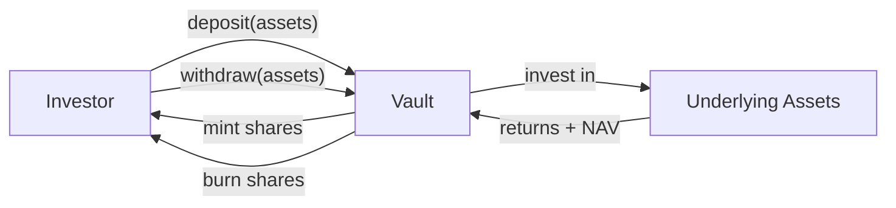

# ERC-4626 – Tokenisierter Tresor (synchron) { #erc-4626-tokenised-vault-synchronous }

ERC-4626 standardisiert die Schnittstelle für **tokenisierte ertragstragende Tresore**. In
Registerwerk wird es für Fonds-Token verwendet, bei denen Anteile gegen einen zugrunde liegenden
Vermögenspool ausgegeben werden, der NAV täglich ermittelt wird und Ein-/Auszahlungen synchron
(sofort) erfolgen.

Dies ist der primäre Standard für **Geldmarktfonds**, **Fonds mit täglicher Liquidität** und
**Anleihenfonds mit kurzer Laufzeit** in Luxemburg und Frankreich.

---

## Tresormechanik { #vault-mechanics }

- **Vermögenswerte**: die zugrunde liegende Währung oder das zugrunde liegende Instrument
  (normalerweise EUR, USDC oder eine bestimmte Anleihe)
- **Aktien**: der an Anleger ausgegebene ERC-4626-Token; stellen proportionales Eigentum dar
- **NAV (Net Asset Value)**: Gesamtvermögenswerte / Gesamtanteile — bestimmt den Anteilspreis

---

## Datenmodell { #data-model }

### `AssetVaultState` { #assetvaultstate }

Aktueller Status des Tresors:

| Feld | Beschreibung |
|---|---|
| `assetId` | FK zu `Asset` |
| `totalAssets` | Aktuelle Gesamtbasiswerte (vom letzten NAV-Strike) |
| `totalShares` | Gesamtzahl der ausstehenden Anteile |
| `navPerShare` | `totalAssets / totalShares` beim letzten Strike |
| `lastNavStrikeAt` | Zeitstempel der letzten NAV-Berechnung |
| `depositCap` | Maximal zulässige Gesamteinzahlungen (0 = unbegrenzt) |

### `VaultNavStrike`

Unveränderlicher historischer Datensatz jeder NAV-Berechnung:

| Feld | Beschreibung |
|---|---|
| `assetId` | FK zu `Asset` |
| `strikeTime` | Wann der NAV festgestellt wurde |
| `navPerShare` | NAV pro Anteil bei diesem Strike |
| `totalAssets` | Zugrunde liegende Vermögenswerte bei diesem Strike |
| `totalShares` | Gesamtzahl der Anteile bei diesem Strike |
| `struckBy` | UUID des Betreibers oder des automatisierten Jobs |

NAV-Strikes sind nur anhängbar (append-only) und bilden eine überprüfbare Preishistorie für
Regulierungsbehörden.

---

## Admin-Operationen { #admin-operations }

| Operation | Endpunkt | Beschreibung |
|---|---|---|
| NAV feststellen | `POST /api/v1/assets/{id}/vault/nav` | Einen neuen NAV erfassen – REGISTRY_ADMIN + Step-up |
| Einzahlungsobergrenze festlegen | `POST /api/v1/assets/{id}/vault/deposit-cap` | Die maximale Gesamteinzahlung aktualisieren |
| Einzahlungen pausieren | `POST /api/v1/assets/{id}/vault/pause-deposits` | Notfallschalter |
| Auszahlungen pausieren | `POST /api/v1/assets/{id}/vault/pause-withdrawals` | Notfallschalter |

Die `Erc4626AdminPort`-Schnittstelle im Modul `blockchain` stellt diese Vorgänge bereit; der
Tresorverwaltungsbildschirm des Operator-Frontends ruft sie über `VaultController` im Modul
`asset` auf.

---

## CSSF-Abgleich { #cssf-alignment }

Das Luxemburger CSSF-Rundschreiben 22/811 für DLT-basierte Fondsinstrumente stimmt eng mit dem
ERC-4626-Tresormodell überein:

- Tägliche NAV-Veröffentlichung → anhängender `VaultNavStrike`-Datensatz
- Zeichnungs- und Rücknahmewarteschlangen → abgebildet auf ERC-4626-Ein-/Auszahlungsabläufe
- Einlegeridentifikation → integriert mit der ERC-3643-Identitätsschicht (Bereitstellung als
  Kombination `ERC4626 + ERC3643`)

Für institutionelle Fonds, die eine T+1- oder T+2-Abwicklung erfordern, verwenden Sie stattdessen
[ERC-7540](erc7540.md).
