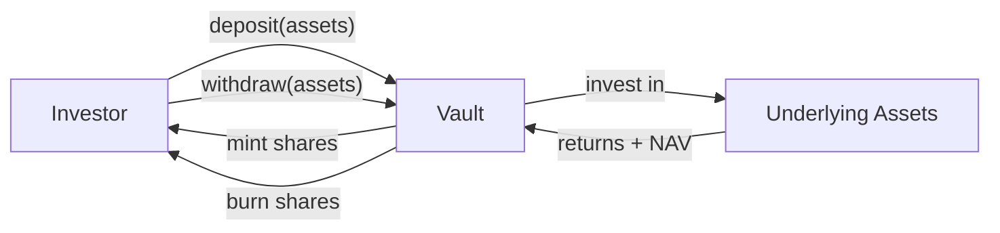

# ERC-4626 — Bóveda tokenizada (síncrona) { #erc-4626-tokenised-vault-synchronous }

ERC-4626 estandariza la interfaz de las **bóvedas tokenizadas con rendimiento**. En Registerwerk se utiliza para tokens de fondos en los que las participaciones se emiten contra un pool de activos subyacente, el NAV se fija diariamente, y los depósitos/reembolsos son sincrónicos (inmediatos).

Este es el estándar principal para **fondos del mercado monetario**, **fondos de liquidez diaria** y **fondos de bonos de corta duración** en las jurisdicciones de Luxemburgo y Francia.

---

## Mecánica de bóveda { #vault-mechanics }

- **Activos (Assets)**: la moneda o instrumento subyacente (normalmente EUR, USDC o un bono concreto)
- **Participaciones (Shares)**: el token ERC-4626 emitido a los inversores; representan la propiedad proporcional
- **NAV (valor liquidativo)**: activos totales / participaciones totales — determina el precio de la participación

---

## Modelo de datos { #data-model }

### `AssetVaultState` { #assetvaultstate }

Estado actual de la bóveda:

| Campo | Descripción |
|---|---|
| `assetId` | FK a `Asset` |
| `totalAssets` | Activos subyacentes totales actuales (de la última fijación de NAV) |
| `totalShares` | Total de participaciones en circulación |
| `navPerShare` | `totalAssets / totalShares` en la última fijación |
| `lastNavStrikeAt` | Marca de tiempo del último cálculo de NAV |
| `depositCap` | Depósitos totales máximos permitidos (0 = ilimitado) |

### `VaultNavStrike` { #vaultnavstrike }

Registro histórico inmutable de cada cálculo de NAV:

| Campo | Descripción |
|---|---|
| `assetId` | FK a `Asset` |
| `strikeTime` | Cuándo se fijó el NAV |
| `navPerShare` | NAV por participación en esta fijación |
| `totalAssets` | Activos subyacentes en esta fijación |
| `totalShares` | Participaciones totales en esta fijación |
| `struckBy` | UUID del operador o del job automatizado |

Las fijaciones de NAV son de solo inserción (append-only) y forman un historial de precios auditable para los reguladores.

---

## Operaciones de administración { #admin-operations }

| Operación | Punto final | Descripción |
|---|---|---|
| Fijar NAV | `POST /api/v1/assets/{id}/vault/nav` | Registra un nuevo NAV — REGISTRY_ADMIN + step-up |
| Establecer límite de depósito | `POST /api/v1/assets/{id}/vault/deposit-cap` | Actualizar los depósitos totales máximos |
| Pausar depósitos | `POST /api/v1/assets/{id}/vault/pause-deposits` | Disyuntor de emergencia |
| Pausar retiros | `POST /api/v1/assets/{id}/vault/pause-withdrawals` | Disyuntor de emergencia |

La interfaz `Erc4626AdminPort` en el módulo `blockchain` expone estas operaciones; la pantalla de administración de bóveda del frontend del operador los llama a través de `VaultController` en el módulo `asset`.

---

## Alineación con la CSSF { #cssf-alignment }

El marco de la Circular 22/811 de la CSSF de Luxemburgo para instrumentos de fondos basados en DLT se alinea estrechamente con el modelo de bóveda de ERC-4626:

- Publicación diaria del NAV → registro de solo inserción (append-only) `VaultNavStrike`
- Colas de suscripción y reembolso → asignadas a los flujos de depósito/retiro de ERC-4626
- Identificación del depositante → integrada con la capa de identidad de ERC-3643 (implementar como combinación `ERC4626 + ERC3643`)

Para fondos institucionales que requieren liquidación T+1 o T+2, utilice [ERC-7540](erc7540.md) en su lugar.
